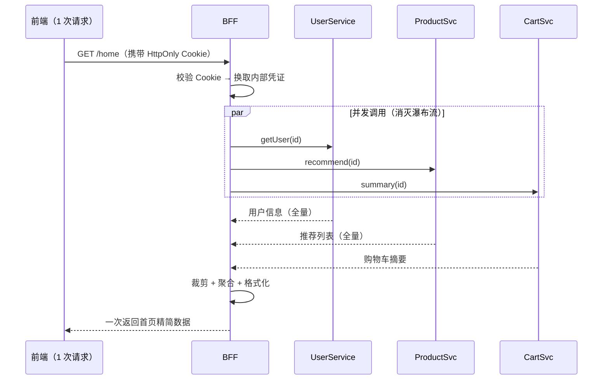

<!--
module:
  parent: front-end
  slug: front-end/bff
  type: article
  category: 主模块子文章
  summary: BFF (Backend For Frontend) 模式
  depth: ⭐⭐⭐⭐⭐
-->

# 架构演进：深入理解 BFF (Backend For Frontend) 模式

> 一句话定位：**BFF——前端与微服务之间的定制聚合层，解决多端适配、请求聚合与 Token 安全三大痛点。**

在微服务架构盛行的今天，前端与后端的协作往往面临着诸多痛点：接口不匹配、数据冗余、多端适配困难，以及我们上一篇讨论的**会话 Token 存储的安全隐患**。

为了解决这些问题，**BFF（Backend For Frontend，服务于前端的后端）** 模式应运而生。它不仅是前后端分离架构的一次重要演进，更是解决多端适配和系统安全的一剂良方。

---
## 一、 什么是 BFF？

BFF 的概念由微服务专家 Sam Newman 提出。它的核心思想非常直白：**不要试图用一个通用的后端 API 去满足所有前端（Web、App、小程序）的需求，而是为每一种前端量身定制一个专属的后端服务层。**

在架构层级上，BFF 位于前端客户端和底层后端微服务（或单体应用）之间。它充当了一个“翻译官”和“大管家”的角色，负责将底层复杂的微服务接口，转换成前端最需要的、最友好的数据格式。

### BFF vs API Gateway：一句话分不清的两个角色

| 维度 | API 网关 | BFF |
|------|---------|-----|
| 职责 | 通用流量治理：路由、限流、熔断、协议终结 | 面向**某一端**的业务聚合与数据裁剪 |
| 粒度 | 每端一套规则，端无关 | 每端一个服务（Web BFF / App BFF / 小程序 BFF） |
| 团队归属 | 基础架构 / 平台团队 | 对应端的业务前端团队（谁消费谁维护） |

> 两者不互斥：生产典型拓扑是 客户端 → 网关（限流/路由）→ 各端 BFF → 领域微服务。

---

## 二、 为什么我们需要 BFF？（没有 BFF 时的痛点）

在没有 BFF 的传统微服务架构中，前端通常直接通过 API 网关调用后端的各个微服务。这种模式在业务复杂后，会暴露出以下致命问题：

### 1. 接口聚合困难与“请求瀑布流”
前端渲染一个页面（如电商首页），可能需要调用用户服务、商品推荐服务、购物车服务、营销服务等。如果前端直接调用，需要发起大量串行或并行的 HTTP 请求。在移动端弱网环境下，这会导致严重的延迟和极差的用户体验。

### 2. 数据格式与协议不匹配
后端微服务通常从领域驱动设计（DDD）出发，提供细粒度、通用的接口。但前端往往只需要这些接口返回数据中的某几个字段。
* **后端视角**：“我把所有相关数据都给你，你自己去挑。”
* **前端视角**：“我只想要个用户名和头像，你却给我返回了整个用户对象，不仅浪费流量，我还得写一堆代码去解析。”

### 3. 多端适配的“大泥球”
Web 端、iOS、Android 和小程序对同一个页面的 UI 和数据需求往往不同。为了兼容多端，后端接口里塞满了 `if (platform == 'iOS')` 的逻辑，导致后端代码极其臃肿，牵一发而动全身。

### 4. 安全与鉴权暴露（核心痛点）
正如前文所述，如果前端直接调用后端微服务，前端就必须在本地（如 LocalStorage）存储敏感的身份 Token，并负责在每次请求中携带它。这不仅增加了 XSS 攻击导致 Token 泄露的风险，还要求每一个底层微服务都必须实现一套完整的 Token 校验逻辑。

---

## 三、 BFF 的核心工作原理与架构

引入 BFF 后，架构发生了根本性的变化。前端不再直接面对底层微服务，而是**只与 BFF 层交互**。

以电商首页聚合为例的完整时序：



### 1. 接口聚合与数据裁剪
BFF 接收前端的请求后，会在服务端内部并发调用多个底层微服务，将获取到的数据进行聚合、过滤和格式化，最后只把前端真正需要的“精简版”数据返回给前端。
* **效果**：前端只需发一次请求，彻底消灭“请求瀑布流”；网络传输的数据量大幅减少。

### 2. 协议转换
底层微服务可能使用的是 gRPC、Dubbo 等高性能 RPC 协议，而前端需要的是 HTTP/REST 或 GraphQL。BFF 负责在内部完成协议转换，让前端和后端都能使用自己最擅长的技术栈。

### 3. 安全网关与身份验证（完美解决 Token 痛点）
这是 BFF 在安全层面最大的贡献：
* **前端**：不再需要存储任何敏感的 Access Token。用户登录后，BFF 会下发一个设置了 `HttpOnly` 和 `Secure` 的 Session Cookie 给浏览器。
* **BFF 层**：负责拦截请求，校验 Cookie。校验通过后，BFF 会生成一个用于内部微服务调用的凭证（例如内部 JWT，或者在 RPC Context 中注入用户信息）。
* **底层微服务**：完全不需要关心外部的 Cookie 或复杂的 OAuth 流程，只信任 BFF 传来的内部凭证。

**通过这种模式，敏感的 Token 生命周期被严格限制在 BFF 层，前端浏览器与 Access Token 解耦。HttpOnly Cookie 可阻止脚本读取 Cookie，但并不能消除 XSS 发起已认证请求、CSRF、会话固定等风险；生产仍需配合 `SameSite`、CSRF token、Origin 校验、Cookie 前缀、会话轮换等机制。**

---

## 四、 BFF 的技术选型

目前业界实现 BFF 的主流技术栈主要有以下几种：

1. **Node.js (最主流)**：如 Express, Koa, NestJS。因为前端开发者对 JS/TS 非常熟悉，且 Node.js 处理 I/O 密集型（并发调用多个微服务）的性能非常出色，是 BFF 的天然选择。
2. **Java**：如 Spring Cloud Gateway。如果团队后端以 Java 为主，且希望复用后端的基建和运维体系，Java BFF 也是常见选择。
3. **Go**：如 Gin。适合对并发性能要求极高、且团队有 Go 技术储备的场景。
4. **GraphQL**：GraphQL 本身是一种查询语言，但它的思想与 BFF 高度契合。很多团队直接使用 Apollo Server (Node.js) 作为 BFF，让前端通过 GraphQL 按需获取数据，实现了极致的”数据裁剪”。

### 技术选型对比

| 技术栈 | 性能特点 | 学习曲线 | 适用团队 | 生态成熟度 |
|--------|---------|---------|---------|-----------|
| Node.js (Express/Koa/NestJS) | I/O 密集出色，适合高并发调用 | 低（前端友好） | 前端团队主导 | ★★★★★ |
| Java (Spring Cloud Gateway) | 稳定可靠，运维体系完善 | 中 | 后端团队主导 | ★★★★★ |
| Go (Gin) | 高并发性能最优，资源占用低 | 中高 | 有 Go 储备的后端团队 | ★★★★ |
| GraphQL (Apollo Server) | 按需获取，减少数据传输 | 中高 | 追求极致数据裁剪的团队 | ★★★★ |

### Node.js/Express BFF 最小实现

聚合 2 个微服务 + Cookie 会话鉴权，核心约 30 行：

```javascript
const express = require('express');
const session = require('express-session');
const app = express();

app.use(session({ cookie: { httpOnly: true, secure: true, sameSite: 'lax' }, /* secret/store 省略 */ }));

// 登录回调：用授权码换 Access Token，Token 只存服务端会话，浏览器只拿 HttpOnly Cookie
app.post('/auth/callback', async (req, res) => {
  const token = await exchangeCodeForToken(req.body.code);   // OAuth 细节省略
  req.session.accessToken = token;                            // ← Token 生命周期止于 BFF
  res.json({ ok: true });
});

// 聚合接口：鉴权 + 并发调用 + 裁剪，一次返回首页数据
app.get('/home', requireAuth, async (req, res) => {
  const token = req.session.accessToken;
  const [user, recommendations] = await Promise.all([       // 并发，非串行瀑布
    fetch(`${USER_SVC}/users/me`, { headers: { Authorization: `Bearer ${token}` } }).then(r => r.json()),
    fetch(`${PRODUCT_SVC}/recommend?limit=10`, { headers: { Authorization: `Bearer ${token}` } }).then(r => r.json()),
  ]);
  res.json({                                                // 只回前端渲染需要的字段
    avatar: user.avatar, nickname: user.nickname, items: recommendations.map(pickListItem),
  });
});
```

---

## 五、 BFF 带来的挑战与“避坑”指南

BFF 并非银弹，引入它也会带来新的工程挑战：

### 1. 运维成本增加
多了一层服务，就意味着多了一个部署节点、多了一个潜在的故障点。需要为 BFF 配置独立的监控、日志、限流和扩容策略。

### 2. 性能损耗风险
BFF 本质上是在服务端做了一次“代理”。如果 BFF 的代码写得不好（例如把本该并行的微服务调用写成了串行），或者 BFF 与底层微服务之间的网络延迟较高，反而会导致整体响应时间变长。
* **对策**：在 BFF 层大量使用并发调用、引入 Redis 缓存、优化内部 RPC 通信。

### 3. 边界模糊，沦为“大泥球”
这是 BFF 最容易犯的错误。开发者很容易把复杂的业务逻辑（如订单计算、库存扣减）写在 BFF 里，导致 BFF 变得越来越臃肿，最终变成了另一个“单体应用”。
* **对策**：严格恪守 BFF 的职责边界。**BFF 只能做“聚合、裁剪、协议转换、鉴权”，绝不能包含核心业务逻辑。** 核心业务逻辑必须下沉到底层领域微服务中。

```javascript
// ❌ 反模式：订单金额计算写进 BFF —— 与订单服务里的计算漂移，两处逻辑必有一错
app.post('/api/order', (req, res) => {
  let amount = items.reduce((s, i) => s + i.price * i.qty, 0);
  if (req.user.vip) amount *= 0.9;        // 业务规则泄漏进 BFF
  db.saveOrder({ amount, ... });
});

// ✅ 正确：BFF 只做请求组装与转发，金额计算下沉到订单领域服务
app.post('/api/order', (req, res) => {
  rpc.call('orderService.createOrder', { userId: req.user.id, itemIds: req.body.items });
});
```

---

## 六、 总结

BFF 模式是微服务架构发展到一定阶段，为了解决前后端协作摩擦而诞生的”润滑剂”。

它通过在前端和后端之间增加一个定制化的中间层，实现了**接口的完美聚合、多端的差异化适配**，更重要的是，它通过**接管身份验证和会话管理**，让前端彻底摆脱了存储敏感 Token 的安全梦魇。

**性能量化**：典型场景下，BFF 聚合后前端请求从串行调用多个微服务（RT 800ms+）降至单次聚合请求（RT ~200ms），移动端弱网场景改善尤为明显；运维成本增加约 1-2 个运维人力的监控与扩容投入，换取前端开发效率的显著提升。

如果你的项目正面临多端适配困难、微服务接口调用混乱，或者正在为前端 Token 存储的安全问题而头疼，那么引入 BFF 模式，将是一个非常值得考虑的架构升级方案。

### 何时不该上 BFF

- **单体应用 / 后端接口本来就为前端定制**：没有聚合与裁剪的痛点，BFF 纯属加一层。
- **DAU < 1w 或团队 < 5 人**：多一个服务的监控、扩容、值班成本超过收益。
- **只有一端**：BFF 的价值在"多端差异化"，单端场景用 GraphQL 按需查询即可。

### 与 SSR 的关系

Next.js 的 `getServerSideProps` / Nuxt 的 `useAsyncData` 在服务端拉数据再渲染，本质就是"渲染内嵌的 BFF"——数据聚合与凭证不出服务端。区别在于：BFF 是独立部署的服务层，SSR 数据获取与页面绑定；聚合逻辑复杂、跨页面复用时，独立 BFF 仍是更清晰的边界。

---

## 反向链

- [bpmn-ai-integration](../../../09.ai-applications/agent/architecture/bpmn-ai-integration.md)
- [20-multiplatform-architecture](../../../13.story/20-multiplatform-architecture.md)

← [返回 前端架构](../README.md)