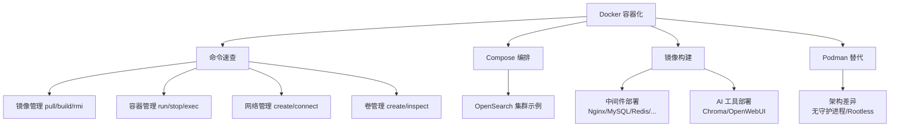

<!--
module:
  parent: tools
  slug: tools/docker
  type: article
  category: 主模块子文章
  summary: Docker
-->

# Docker

> 容器化技术栈速查——命令、编排、镜像构建与 Podman 替代方案。

---
## 引言：反直觉代码

Docker 的关键不是语法——是**看起来对**的代码背后那些'踩坑点'。

本篇用 3 个反直觉片段切入，把面试/生产中常被问起、但一深入就漏馅的点摆出来。

---

## 1. 模块导航

| 序号 | 主题 | 核心内容 | 子 README |
|------|------|---------|-----------|
| 01 | [命令速查](command/) | 镜像/容器/网络/卷/系统操作命令 | [README](command/README.md) |
| 02 | [Docker Compose](docker-compose/) | 多容器编排配置示例（OpenSearch 集群） | [README](docker-compose/README.md) |
| 03 | [镜像构建](images/) | Nginx/MySQL/Redis/RabbitMQ 等常用镜像部署脚本 | [README](images/README.md) |
| 04 | [Podman](podman/) | 无守护进程容器引擎，与 Docker 差异对比 | [README](podman/README.md) |

### 1.1 学习路径
- **入门**：命令速查 → 镜像构建（常用中间件一键部署）
- **进阶**：Docker Compose（多容器编排）→ Podman（安全替代方案）

---

## 2. 知识脉络

---

## 3. 速查表

| 概念 | 解释 | 典型场景 |
|------|------|---------|
| **docker run** | 创建并启动容器 | 快速运行任意镜像 |
| **docker build** | 从 Dockerfile 构建镜像 | 自定义应用打包 |
| **docker compose** | YAML 声明式多容器编排 | 开发/测试环境一键启动 |
| **Volume** | 持久化数据卷，独立于容器生命周期 | 数据库/配置文件持久化 |
| **Network** | 容器间通信的虚拟网络 | 多服务微服务互联 |
| **Rootless** | 普通用户运行容器，无需 root | 高安全需求环境 |
| **OCI 标准** | 开放容器镜像格式 | Podman/Docker 互操作基础 |
| **镜像加速器** | registry-mirrors 配置 | 国内拉取 Docker Hub 加速 |

---

## 4. 核心内容

### 4.1 命令速查

覆盖镜像（pull/build/save/load）、容器（run/exec/logs/cp）、网络（create/connect/disconnect）、卷（create/inspect/mount）、系统（info/prune）五大类操作，是日常使用频率最高的参考。

### 4.2 Docker Compose

通过 YAML 声明式定义多容器应用。当前提供 OpenSearch 双节点 + Dashboards 完整示例，涵盖节点发现、内存锁定、Java Heap 配置等生产级要点。

### 4.3 镜像构建

收录 Nginx、Java、Redis、MySQL、PostgreSQL、RabbitMQ、MinIO、Nacos、Chroma、Open WebUI 等常用中间件和工具的部署命令，包含端口映射、卷挂载、环境变量等完整参数。

### 4.4 Podman

Red Hat 主导的无守护进程容器引擎，支持 Rootless 模式和原生 Pod 管理。与 Docker 的核心差异在于架构（无 dockerd）、权限模型（普通用户可用）、重启机制（需 Systemd 管理）。

---

## 5. 最佳实践

- **数据持久化**：数据库/中间件务必使用 Volume 或 bind mount，避免容器删除后数据丢失
- **资源限制**：生产环境使用 `--memory` 和 `--cpus` 限制容器资源
- **镜像优化**：使用多阶段构建（multi-stage build）减小最终镜像体积
- **安全替代**：对安全性要求高的场景优先考虑 Podman Rootless 模式

---

## 6. 常见面试题

- Docker 和虚拟机的区别是什么？
- Docker Compose v1 和 v2 的命令差异？
- Podman 为什么不需要守护进程？
- 如何优化 Docker 镜像体积？
- 容器间如何通信？

---

## 7. 相关章节

- 上游：[`工具链`](../README.md)
- 关联：[`03-nginx`](../nginx/) — Nginx 反向代理常与 Docker 配合部署
- 关联：[`06-ali-microservices`](../ali-microservices/) — 微服务容器化部署

---
