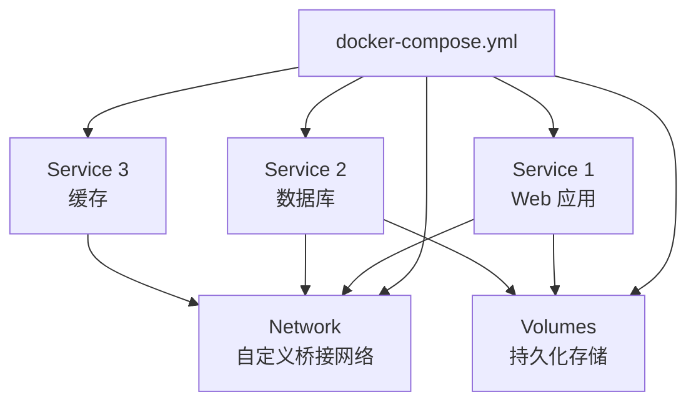
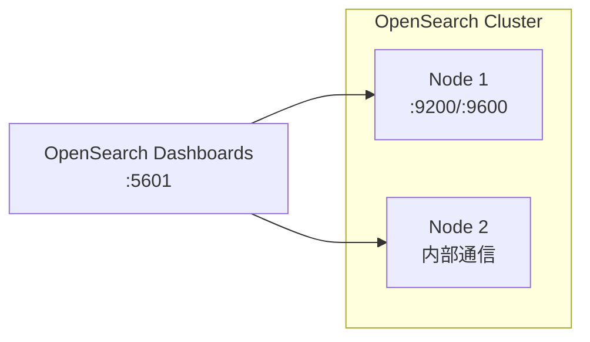

<!--
module:
  parent: tools
  slug: tools/docker-compose
  type: article
  category: 主模块子文章
  summary: Docker Compose 编排实战
-->

# Docker Compose 编排实战

> Docker Compose 是 Docker 官方的多容器编排工具，通过 YAML 文件定义和运行复杂应用。本文提供可直接用于开发/测试环境的配置参考。

---
## 引言：Docker Compose 编排实战 的关键决策

本篇是「Docker Compose 编排实战」的核心章节，聚焦该主题在实际落地时**5 个 trade-off 的取舍与决策轴**。

## 一、核心概念



| 概念 | 说明 |
|------|------|
| **Service** | 一个容器实例，对应一个镜像 |
| **Network** | 容器间通信的网络，Compose 默认创建桥接网络 |
| **Volume** | 数据持久化，容器删除后数据不丢失 |
| **Depends_on** | 服务启动顺序依赖（不保证就绪） |
| **Profiles** | 按需激活服务组（如 debug、monitoring） |

---

## 二、常见编排示例

### 2.1 经典 Web 应用栈（Nginx + Spring Boot + MySQL + Redis）

```yaml
version: '3.8'

services:
  nginx:
    image: nginx:1.25-alpine
    ports:
      - "80:80"
      - "443:443"
    volumes:
      - ./nginx/conf.d:/etc/nginx/conf.d:ro
      - ./nginx/ssl:/etc/nginx/ssl:ro
    depends_on:
      - app
    networks:
      - frontend

  app:
    image: openjdk:21-slim
    build:
      context: .
      dockerfile: Dockerfile
    environment:
      - SPRING_PROFILES_ACTIVE=prod
      - DB_URL=jdbc:mysql://mysql:3306/mydb
      - REDIS_HOST=redis
    depends_on:
      mysql:
        condition: service_healthy
      redis:
        condition: service_started
    networks:
      - frontend
      - backend

  mysql:
    image: mysql:8.0
    environment:
      MYSQL_ROOT_PASSWORD: ${DB_ROOT_PASSWORD}
      MYSQL_DATABASE: mydb
    volumes:
      - mysql_data:/var/lib/mysql
      - ./sql/init.sql:/docker-entrypoint-initdb.d/init.sql:ro
    ports:
      - "3306:3306"
    healthcheck:
      test: ["CMD", "mysqladmin", "ping", "-h", "localhost"]
      interval: 10s
      timeout: 5s
      retries: 5
    networks:
      - backend

  redis:
    image: redis:7-alpine
    command: redis-server --requirepass ${REDIS_PASSWORD}
    volumes:
      - redis_data:/data
    networks:
      - backend

volumes:
  mysql_data:
  redis_data:

networks:
  frontend:
  backend:
```

### 2.2 可观测性栈（Prometheus + Grafana + Alertmanager）

```yaml
version: '3.8'

services:
  prometheus:
    image: prom/prometheus:v2.53.0
    ports:
      - "9090:9090"
    volumes:
      - ./prometheus/prometheus.yml:/etc/prometheus/prometheus.yml:ro
      - prometheus_data:/prometheus
    command:
      - '--config.file=/etc/prometheus/prometheus.yml'
      - '--storage.tsdb.retention.time=30d'

  grafana:
    image: grafana/grafana:11.0.0
    ports:
      - "3000:3000"
    environment:
      - GF_SECURITY_ADMIN_PASSWORD=${GRAFANA_PASSWORD}
    volumes:
      - grafana_data:/var/lib/grafana
      - ./grafana/provisioning:/etc/grafana/provisioning:ro

  alertmanager:
    image: prom/alertmanager:v0.27.0
    ports:
      - "9093:9093"
    volumes:
      - ./alertmanager/alertmanager.yml:/etc/alertmanager/alertmanager.yml:ro

volumes:
  prometheus_data:
  grafana_data:
```

### 2.3 OpenSearch 集群



**关键配置说明：**
- `discovery.seed_hosts` — 节点发现，多节点互相通信
- `cluster.initial_cluster_manager_nodes` — 初始主节点选举列表
- `bootstrap.memory_lock=true` — 锁定内存，防止 swap 影响性能
- `OPENSEARCH_JAVA_OPTS=-Xms512m -Xmx512m` — Java 堆大小，建议设为系统 RAM 的 50%
- `OPENSEARCH_INITIAL_ADMIN_PASSWORD` — 2.12+ 版本必须设置初始管理员密码

**快速启动：**
```bash
export OPENSEARCH_INITIAL_ADMIN_PASSWORD=your_password
docker compose up -d
# 访问 Dashboards: http://localhost:5601
```

---

## 三、常用命令速查

| 命令 | 说明 |
|------|------|
| `docker compose up -d` | 后台启动所有服务 |
| `docker compose down` | 停止并删除容器、网络 |
| `docker compose down -v` | 同时删除数据卷 |
| `docker compose build` | 重新构建镜像 |
| `docker compose logs -f [service]` | 跟踪日志输出 |
| `docker compose ps` | 查看运行状态 |
| `docker compose exec [service] sh` | 进入容器 shell |
| `docker compose pull` | 拉取最新镜像 |
| `docker compose config` | 验证并输出解析后的配置 |
| `docker compose --profile debug up` | 按 Profile 启动 |

---

## 四、最佳实践

| 实践 | 说明 |
|------|------|
| **使用 `.env` 文件** | 敏感信息（密码、API Key）放入 `.env`，加入 `.gitignore` |
| **健康检查** | 数据库等依赖服务配置 `healthcheck`，`depends_on` 使用 `condition: service_healthy` |
| **只读挂载** | 配置文件使用 `:ro` 只读挂载，防止容器内误修改 |
| **固定镜像版本** | 避免 `latest`，使用具体版本号如 `mysql:8.0.36` |
| **资源限制** | 生产环境配置 `deploy.resources.limits` 限制 CPU / 内存 |
| **网络隔离** | 前端、后端服务分不同 Network，最小化暴露面 |
| **数据持久化** | 数据库、消息队列必须挂载 Volume |

---

## 五、常见问题

| 问题 | 原因与解决 |
|------|----------|
| `port is already allocated` | 端口冲突，`docker compose ps` 或 `lsof -i :端口` 查看占用 |
| `depends_on` 不等待就绪 | 使用 `condition: service_healthy` 而非默认 `service_started` |
| 数据卷残留 | `docker compose down -v` 同时清理卷 |
| 容器间无法通信 | 检查是否在同一 Network 中，使用服务名作为主机名 |
| 权限拒绝（Volume） | 检查宿主机目录权限，或使用 `user: "1000:1000"` |

---

## 六、相关章节

- [Docker 命令速查](../command/README.md) · [镜像构建](../images/README.md) · [Podman](../podman/README.md)
- 上游：[`05.tools`](../../README.md) — 工具链总览
- 关联：[`06.spring`](../../../06.spring/README.md) — Spring Boot 应用容器化

← [返回: 工具链 · docker-compose](../README.md)
