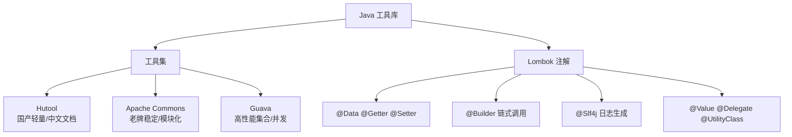

<!--
module:
  parent: tools
  slug: tools/java-tools
  type: article
  category: 主模块子文章
  summary: Java 工具库
-->

# Java 工具库

> Java 开发效率提升——常用工具集与注解提效方案。

---
## 引言：反直觉代码

Java 工具库 的关键不是语法——是**看起来对**的代码背后那些'踩坑点'。

本篇用 3 个反直觉片段切入，把面试/生产中常被问起、但一深入就漏馅的点摆出来。

---

## 1. 模块导航

| 序号 | 主题 | 核心内容 | 子 README |
|------|------|---------|-----------|
| 01 | [工具库](tool-library/) | Hutool / Apache Commons / Guava 三大工具集对比 | [README](tool-library/README.md) |
| 02 | [Lombok](lombok/) | 注解驱动的代码简化：getter/setter/builder/日志 | [README](lombok/README.md) |

### 1.1 学习路径
- **入门**：工具库 → Hutool（国内项目首选）或 Apache Commons（稳定兼容）
- **进阶**：Lombok → 注解减少样板代码，配合工具库进一步提升效率

---

## 2. 知识脉络

---

## 3. 速查表

| 概念 | 解释 | 典型场景 |
|------|------|---------|
| **Hutool** | 国产轻量工具库，静态方法封装 JDK 底层 | 中小型项目快速开发，中文文档友好 |
| **Apache Commons** | 老牌模块化工具库（Lang/IO/Collections） | 企业级系统，高兼容性要求 |
| **Guava** | Google 工具库，不可变集合/缓存/RateLimiter | 高并发系统，高性能集合操作 |
| **@Data** | Lombok 组合注解（getter+setter+toString+equals+构造器） | POJO 类一键生成 |
| **@Builder** | 建造者模式，支持链式调用 | 复杂对象构造 |
| **@Slf4j** | 自动生成日志记录器 | 替代手写 Logger 声明 |
| **@Value** | 生成不可变类（字段 final，无 setter） | 值对象/DTO |
| **编译期生成** | Lombok 通过 JSR 269 注解处理器修改 AST | 不改变运行时行为 |

---

## 4. 核心内容

### 4.1 工具集对比

三大工具库各有侧重：Hutool 以场景全覆盖和中文生态取胜，适合国内快速开发；Apache Commons 模块化设计、接口稳定、兼容老版本 Java，适合传统企业系统；Guava 在集合类革新和并发工具（CacheBuilder/RateLimiter/EventBus）上领先，适合高性能场景。三者非互斥，可按需组合使用。

### 4.2 Lombok 注解提效

Lombok 通过编译期注解处理器（JSR 269）修改抽象语法树生成代码。覆盖基础功能（@Data/@Getter/@Setter/@ToString）、构造器（@NoArgsConstructor/@AllArgsConstructor）、高级模式（@Builder/@Slf4j/@Cleanup/@SneakyThrows）和特殊场景（@Value/@Delegate/@UtilityClass）。需注意 IDE 插件依赖和过度使用对可读性的影响。

---

## 5. 最佳实践

- **国内项目标配**：Hutool + Lombok，开发效率最大化
- **不可变优先**：使用 @Value 替代 @Data 定义值对象，提升线程安全性
- **构造器注入**：配合 @RequiredArgsConstructor + final 字段，推荐 Spring 构造器注入
- **避免滥用**：Lombok 仅用于 POJO 和简单工具类，复杂逻辑保持手写可读性

---

## 6. 常见面试题

- Hutool、Commons、Guava 各自的核心优势？
- Lombok 的工作原理是什么？会影响运行时吗？
- @Data 和 @Value 的区别？
- Guava 的 CacheBuilder 和 JDK HashMap 有什么区别？
- Lombok 的 @Builder 如何实现链式调用？

---

## 7. 相关章节

- 上游：[`工具链`](../README.md)
- 关联：[`01.java`](../../01.java/) — Java 语言基础
- 关联：[`06.spring`](../../06.spring/) — Spring 开发中大量使用这些工具

---
