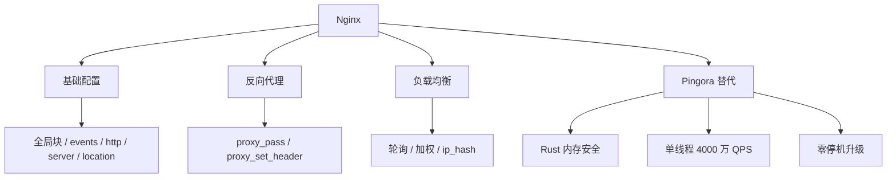

<!--
module:
  parent: tools
  slug: note/tools/nginx
  type: article
  category: 主模块子文章
  summary: Nginx — 反向代理配置与 Pingora 新一代代理
-->

# Nginx

> 反向代理与负载均衡——从 Nginx 配置实战到 Cloudflare Pingora 新一代代理。

---

## 1. 模块导航

| 序号 | 主题 | 核心内容 | 子 README |
|------|------|---------|-----------|
| 01 | Pingora | Cloudflare 开源 Rust 代理框架 | [README](pingora/README.md) |

### 1.1 学习路径

- **入门**：Nginx 基础配置 → 反向代理 + 负载均衡
- **进阶**：Pingora → Rust 高性能代理 + 零停机升级

---

## 2. 知识脉络



---

## 3. 速查表 / Cheat Sheet

| 概念 | 解释 | 典型场景 |
|------|------|---------|
| **worker_processes** | Nginx 工作进程数，建议 CPU 核心数 1-2 倍 | 高并发调优 |
| **worker_connections** | 每个工作进程的最大连接数 | 连接上限 |
| **proxy_pass** | 配置反向代理目标地址 | 反向代理 |
| **proxy_set_header** | 修改/添加发往后端的 HTTP 请求头 | 透传 Host / X-Real-IP |
| **server_name** | 虚拟主机域名匹配 | 多域名同 IP |
| **Pingora** | Cloudflare 开源 Rust 代理框架，单线程 4000 万 QPS | 高并发 & Rust 生态 |
| **优雅重启** | 零停机时间升级 | 生产持续运行 |
| **FIPS 合规** | 支持 OpenSSL & BoringSSL | 政府/金融合规 |

---

## 4. 核心内容

### 4.1 Nginx 配置文件结构

Nginx 配置文件主要由三部分组成：全局块、events 块和 http 块。http 块中可以嵌套多个 server 块，每个 server 块又可包含多个 location 块。

```text
user nobody;
worker_processes 1;

error_log logs/error.log;

events {
    worker_connections 1024;
}

http {
    include mime.types;
    default_type application/octet-stream;
    sendfile on;

    server {
        listen 80;
        server_name localhost;

        location / {
            root html;
            index index.html index.htm;
        }
    }
}
```

### 4.2 重要指令速查

- **worker_processes**：建议 CPU 核心数 1-2 倍，或 `auto` 由 Nginx 自动选择
- **worker_connections**：每个 worker 进程最大连接数（与 worker_processes 相乘得最大并发）
- **listen**：监听端口（默认 80）
- **server_name**：虚拟主机域名
- **location**：URL 路径匹配规则 + 处理方式
- **proxy_pass**：反向代理目标地址
- **rewrite**：URL 重写/重定向
- **proxy_set_header**：透传 Host、X-Real-IP、X-Forwarded-For

### 4.3 Pingora 替代 Nginx

Cloudflare 基于 Rust 开源的下一代代理框架。核心优势：单线程 4000 万 QPS、Rust 内存安全、零停机升级、gRPC/WebSocket/HTTP/1·2 全协议支持。提供可编程 API 与过滤器，支持自定义负载均衡策略。详见 [pingora 子目录](pingora/README.md)。

---

## 5. 最佳实践

- **连接调优**：`worker_processes = CPU 核数`，`worker_connections = 1024 * 核数`
- **反向代理头**：始终透传 `Host` / `X-Real-IP` / `X-Forwarded-For`，否则后端无法获真实信息
- **动静分离**：静态资源走 Nginx，动态请求 proxy_pass 到后端应用
- **健康检查**：使用 `max_fails` 与 `fail_timeout` 配置 upstream 健康判定
- **配置校验**：修改后必须 `nginx -t` 验证再 reload，避免配置错误导致服务不可用
- **零停机升级**：考虑 Pingora 等支持优雅重启的现代代理框架

---

## 6. 常见面试题

- Nginx 和 Apache 的核心差异？
- 什么是 epoll 模型？为什么 Nginx 高并发能力强？
- nginx -s reload 与 restart 的区别？
- upstream 的几种负载均衡策略及适用场景？
- Nginx 反向代理为什么要透传 Host / X-Real-IP？
- Pingora 相比 Nginx 的核心优势？

---

## 📊 本节统计

| 子目录 | leaf README 数 | 备注 |
|:-------|:-----------:|:-----|
| `04-nginx/`（本文） | 1 | 顶层 |
| └─ `pingora/` | 1 | Cloudflare Rust 代理框架 |
| **分类 leaf 合计** | **1 depth-2 + 1 顶层 = 2** | 100% frontmatter |
| **学习路径主题数** | 2 条（入门：Nginx 基础 → 进阶：Pingora 替代） | 见上方学习路径 |

> 数字基线：本节以 leaf README 数 + 学习路径主题数双口径统计

---

## 7. 相关章节

- 上游：[`工具链`](../README.md)
- 关联：[`02-docker`](../02-docker/README.md) — Docker 容器化部署时 Nginx 常作前置网关
- 关联：[`06-ali-microservices`](../06-ali-microservices/README.md) — Higress / Envoy 等云原生网关与 Nginx 同源

## 配置示例补充（新增 B2 可执行性提升）

### 最小可跑通的反向代理 + 负载均衡

```nginx
# /etc/nginx/conf.d/myapp.conf
upstream myapp_backend {
    server 127.0.0.1:8081 max_fails=3 fail_timeout=30s;
    server 127.0.0.1:8082 max_fails=3 fail_timeout=30s;
    keepalive 32;
}

server {
    listen 80;
    server_name myapp.example.com;
    
    location / {
        proxy_pass http://myapp_backend;
        proxy_set_header Host $host;
        proxy_set_header X-Real-IP $remote_addr;
        proxy_set_header X-Forwarded-For $proxy_add_x_forwarded_for;
        proxy_set_header X-Forwarded-Proto $scheme;
    }
}
```

### 启动与验证

```bash
nginx -t                              # 测试配置
systemctl reload nginx              # 重新加载（不中断）
curl -H "Host: myapp.example.com" http://localhost/health  # 验证
```

---

← [返回工具链总览](../README.md)
