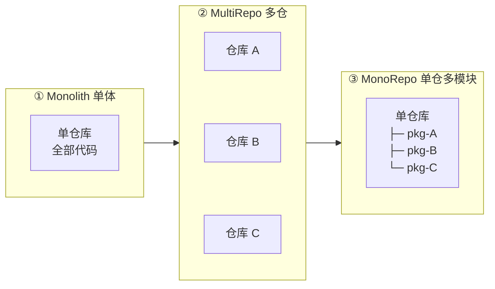
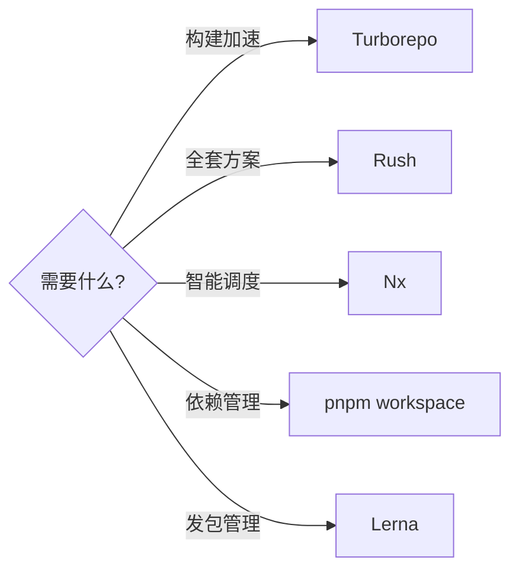

<!--
module:
  parent: tools
  slug: note/tools/monorepo
  type: article
  category: 主模块子文章
  summary: Monorepo — 单仓多项目管理与工具选型
-->

# Monorepo

> 单仓多项目管理——演进路径、工具对比（Turborepo / Nx / Rush / Lerna / pnpm）。

---

## 1. 模块导航

| 序号 | 主题 | 核心内容 | 子 README |
|------|------|---------|-----------|

### 1.1 学习路径

- **入门**：演进路径 → Monolith → MultiRepo → MonoRepo
- **进阶**：工具选型 → Turborepo / Nx / Rush / Lerna / pnpm 适配场景

---

## 2. 知识脉络

---

## 3. 速查表 / Cheat Sheet

| 概念 | 解释 | 典型场景 |
|------|------|---------|
| **Monolith** | 单仓库巨石应用 | 早期项目，简单但耦合 |
| **MultiRepo** | 多仓库多模块应用 | 团队规模适中，需权限隔离 |
| **MonoRepo** | 单仓库多模块应用 | 中大型项目，多团队协作 |
| **幽灵依赖** | 未在 package.json 声明但可使用的依赖 | pnpm workspace 解决 |
| **Turborepo** | Vercel 开源构建系统，并行 + 缓存 | Vercel/Next.js 生态 |
| **Rush** | 微软出品 Monorepo 全套方案 | 大型企业 TypeScript 仓 |
| **Nx** | Nrwl 出品，智能任务调度 + 分布式 | Angular 生态、大仓 |
| **Lerna** | Babel 出品，专注依赖管理 & 发布 | npm 库管理 |
| **pnpm workspace** | 轻量化 Monorepo 方案，按需安装 | 中小型 TS 项目首选 |
| **Locked mode** | Lerna 固定模式：所有包统一版本号 | 简化版本管理 |
| **Independent mode** | Lerna 独立模式：按变更发版 | 精细化版本管理 |

---

## 4. 核心内容

### 4.1 演进路径

**阶段一（Monolith）**：单仓库巨石应用，随业务迭代代码量剧增，构建效率下降，最终演化为单体巨石应用。

**阶段二（MultiRepo）**：拆解为多业务模块，各模块独立仓库，便于独立编码/测试/发版；跨仓共享难，依赖管理复杂。

**阶段三（MonoRepo）**：多个项目集成到一个仓库，共享工程配置 + 快速共享模块代码。当前中大型项目首选。

### 4.2 MultiRepo vs MonoRepo 对比

| 维度 | MultiRepo | MonoRepo |
|------|-----------|----------|
| 代码可见性 | 隔离好但跨仓共享难 | 全貌可见，但易误改 |
| 依赖管理 | 多仓各自 node_modules，重复安装 | 共享依赖，提升到顶层 |
| 权限管理 | 单仓权限清晰 | 缺项目粒度权限管控 |
| 开发迭代 | 切换成本高，npm link 繁琐 | 编码协作便利 |
| 工程配置 | 各仓不一致 | 统一标准 |
| 构建部署 | 需手动管理版本与发布 | 工具自动按依赖顺序构建 |

### 4.3 典型问题与解决方案

- **幽灵依赖**：npm/yarn 依赖提升时，未声明的包也能被引用。→ pnpm 彻底解决
- **依赖安装耗时**：Monorepo 依赖数量大，install 慢。→ 共享依赖提升根目录 + pnpm 按需缓存
- **构建打包耗时**：串行或全量构建慢。→ 增量构建 + 并行构建（Turborepo/Nx/Rush）

### 4.4 工具对比

| 工具 | Turborepo | Rush | Nx | Lerna | Pnpm Workspace |
|------|-----------|------|-----|-------|----------------|
| 依赖管理 | ❌ | ✅ | ❌ | ❌ | ✅ |
| 版本管理 | ❌ | ✅ | ❌ | ✅ | ❌ |
| 增量构建 | ✅ | ✅ | ✅ | ❌ | ❌ |
| 插件扩展 | ✅ | ✅ | ✅ | ❌ | ❌ |
| 云端缓存 | ✅ | ✅ | ✅ | ❌ | ❌ |
| GitHub Stars | 20.4K | 4.9K | 17K | 34.3K | 22.7K |

---

## 5. 最佳实践

- **中大型项目优先 MonoRepo**：代码共享、协作、版本一致性均显著提升
- **小项目保持 MultiRepo**：避免引入构建复杂度与权限管理负担
- **依赖管理首选 pnpm**：解决幽灵依赖 + 节省磁盘 + 安装速度快
- **构建加速工具按场景选**：Vercel/Next.js 选 Turborepo、Angular 选 Nx、企业 TS 选 Rush
- **避免 npm link**：改用 pnpm + workspace，避免跨项目依赖版本冲突

---

## 6. 常见面试题

- Monolith / MultiRepo / MonoRepo 三者演进关系？
- MonoRepo 的核心优势与典型问题？
- 幽灵依赖（phantom dependency）是什么？pnpm 如何解决？
- Turborepo 与 Nx 的核心差异？
- pnpm 的 content-addressable store 是什么？
- Lerna 的 Locked mode 与 Independent mode 区别？

---

## 📊 本节统计

| 子目录 | leaf README 数 | 备注 |
|:-------|:-----------:|:-----|
| `05-monorepo/`（本文） | 1 | 顶层 |
| **分类 leaf 合计** | **0 depth-2 + 1 顶层 = 1** | 100% frontmatter |
| **学习路径主题数** | 2 条（入门：演进路径 → 进阶：工具选型） | 见上方学习路径 |

> 数字基线：本节以 leaf README 数 + 学习路径主题数双口径统计
>
> 注：本分类暂无独立 depth-2 子 README，工具对比表与 Mermaid 图作为正文内容存在；如需新增 `01-tools/` 详情页可后续扩展。

---

## 7. 相关章节

- 上游：[`工具链`](../README.md)
- 关联：[`04.system-design`](../../04.system-design/README.md) — 多仓 vs 单仓架构决策
- 关联：[`06.spring`](../../06.spring/README.md) — Spring Boot 微服务拆分决策同源

---

← [返回工具链总览](../README.md)

## 工具对比表（新增 4 维度）

| 工具 | 适用规模 | 学习曲线 | 构建速度 | monorepo 原生支持 |
|------|----------|----------|----------|------------------|
| **Nx** | 中大型 | 中 | 快（缓存强） | 强（最早原生） |
| **Turborepo** | 中小型 | 低 | 极快（Rust 引擎） | 中（Vercel 友好） |
| **Bazel** | 大型/超大型 | 高 | 极快（远程缓存） | 强（Google 内部成熟） |
| **Lerna** | 中小型 | 低 | 慢（JS 老牌） | 中（社区维护慢） |
| **pnpm workspaces** | 中小型 | 低 | 快 | 弱（仅包管理） |
| **Rush** | 大型 | 中 | 中 | 强（Microsoft） |

**关键洞察**：
- Nx + Turborepo 是当前最主流的 monorepo 工具组合
- Bazel 适合超大型（如 Google 内部 10w+ 文件），但学习曲线陡
- 选 monorepo 不是银弹：服务 ≥ 20 个、跨团队复用代码多、独立部署需求强时才有 ROI
