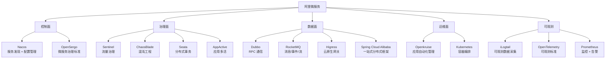

<!--
module:
  parent: tools
  slug: note/tools/ali-microservices
  type: article
  category: 主模块子文章
  summary: 阿里微服务 — Nacos/Sentinel/Seata 等云原生生态
-->

# 阿里微服务

> 阿里云原生微服务全家桶——控制面 / 治理面 / 数据面 / 运维面 / 可观测。

---

## 1. 模块导航

| 序号 | 主题 | 核心内容 | 子 README |
|------|------|---------|-----------|

### 1.1 学习路径

- **入门**：控制面（Nacos）→ 数据面（Dubbo / Spring Cloud Alibaba）
- **进阶**：治理面（Sentinel / Seata / ChaosBlade）→ 运维面（Openkruise / Kubernetes）→ 可观测（iLogtail / Prometheus）

---

## 2. 知识脉络

---

## 3. 速查表 / Cheat Sheet

| 概念 | 解释 | 典型场景 |
|------|------|---------|
| **Nacos** | 动态服务发现 + 配置管理 + DNS/RPC 双模式 | 微服务注册中心 / 配置中心 |
| **OpenSergo** | 开放通用的云原生微服务治理标准 | 跨语言治理规范 |
| **Sentinel** | 面向分布式多语言架构的流量治理组件 | 限流 / 熔断 / 降级 |
| **ChaosBlade** | 云原生混沌工程平台 | 故障注入演练 |
| **Seata** | 分布式事务解决方案（AT/TCC/Saga/XA） | 跨服务事务一致性 |
| **AppActive** | 应用多活架构中间件 | 同城双活 / 异地多活 |
| **Higress** | 遵循 Ingress/Gateway API 的下一代云原生网关 | K8s Ingress / API 网关 |
| **RocketMQ** | 云原生消息 / 事件 / 流实时处理平台 | 异步解耦 / 削峰 |
| **Dubbo** | Apache 微服务框架，Java/Golang 多语言 SDK | 高性能 RPC 通信 |
| **Spring Cloud Alibaba** | 一站式分布式应用开发框架 | Spring 生态微服务全家桶 |
| **Openkruise** | 云原生应用自动化管理套件 | K8s 工作负载扩展 |
| **iLogtail** | 快速、轻量的可观测数据采集器 | 日志 / Trace / Metrics 采集 |

---

## 4. 核心内容

### 4.1 控制面 — Nacos / OpenSergo

**Nacos** 提供服务发现、配置管理、DNS 服务、服务元数据管理四大能力。服务注册支持 DNS 与 RPC 双模式；健康检查支持传输层（PING/TCP）与应用层（HTTP/MySQL）；配置管理支持版本跟踪、金丝雀发布、一键回滚。

**OpenSergo** 是阿里联合社区推出的微服务治理标准，覆盖微服务及上下游关联组件的开放治理规范。

### 4.2 治理面 — Sentinel / ChaosBlade / Seata

**Sentinel** 面向分布式 / 多语言异构化服务架构，提供流量治理（限流 / 熔断 / 降级 / 热点 / 系统自适应）。

**ChaosBlade** 云原生混沌工程平台，支持多种环境 / 集群 / 语言下的故障注入。

**Seata** 分布式事务解决方案，提供 AT / TCC / Saga / XA 四种模式，简化微服务架构下的事务一致性。

**AppActive** 标准、通用且功能强大的应用多活架构中间件，支持同城双活 / 异地多活。

### 4.3 数据面 — Higress / RocketMQ / Dubbo / Spring Cloud Alibaba

**Higress** 遵循开源 Ingress / Gateway API 标准，提供流量调度 + 服务治理 + 安全防护三合一的下一代云原生网关。

**RocketMQ** 云原生"消息、事件、流"实时数据处理平台，覆盖云边端一体化数据处理场景。

**Dubbo** Apache 微服务框架，提供高性能 RPC 通信 + 流量治理 + 可观测性，涵盖 Java / Golang 多语言 SDK。

**Spring Cloud Alibaba** 一站式分布式应用开发框架。

### 4.4 运维面 — Openkruise / Kubernetes

**Openkruise** 云原生应用的自动化管理套件，扩展 K8s 工作负载能力。

**Kubernetes** 开源容器编排引擎，自动化部署 / 扩缩 / 运维容器化应用。

### 4.5 可观测 — iLogtail / OpenTelemetry / Prometheus

**iLogtail** 快速、轻量的可观测数据采集器，支持日志 / 链路 / 指标多种数据。

**OpenTelemetry** 高质量、广泛使用的可移植性可观测技术。

**Prometheus** 开源监控解决方案 + 报警能力。

---

## 5. 最佳实践

- **Spring Cloud Alibaba 一站式**：Spring 生态首选 SCA（含 Nacos / Sentinel / Seata 等）
- **Dubbo 高性能 RPC**：追求低延迟场景选 Dubbo，生态完整
- **Sentinel 限流前置**：所有外部入口必须配 Sentinel 限流 + 熔断
- **Seata 谨慎使用**：分布式事务性能损耗大，能用最终一致就用最终一致
- **可观测统一标准**：跨语言场景用 OpenTelemetry + Prometheus + iLogtail 三件套

---

## 6. 常见面试题

- Nacos 的 AP / CP 模式如何切换？
- Sentinel 限流算法有哪些？各自优缺点？
- Seata AT 模式的工作原理？
- Spring Cloud Alibaba 与 Spring Cloud Netflix 的关系？
- Dubbo 与 OpenFeign 的取舍？
- OpenSergo 与 Service Mesh 的关系？

---

## 📊 本节统计

| 子目录 | leaf README 数 | 备注 |
|:-------|:-----------:|:-----|
| `06-ali-microservices/`（本文） | 1 | 顶层 |
| **分类 leaf 合计** | **0 depth-2 + 1 顶层 = 1** | 100% frontmatter |
| **学习路径主题数** | 2 条（入门：控制面 + 数据面 → 进阶：治理 + 运维 + 可观测） | 见上方学习路径 |

> 数字基线：本节以 leaf README 数 + 学习路径主题数双口径统计
>
> 注：本分类暂无独立 depth-2 子 README，控制面/治理面/数据面/运维面/可观测五大模块以正文章节形式存在。

---

## 7. 相关章节

- 上游：[`工具链`](../README.md)
- 关联：[`06.spring`](../../06.spring/README.md) — Spring Cloud Alibaba 落地集成
- 关联：[`04.system-design`](../../04.system-design/README.md) — 微服务架构设计同源

---

← [返回工具链总览](../README.md)
