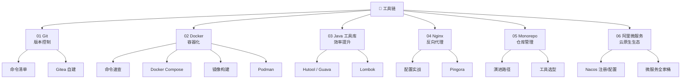

<!--
module:
  parent: note
  slug: note/tools
  type: index
  category: 主模块
  summary: 后端工程师高频工具链速查手册：Git / Docker / Java 工具库 / Nginx / Monorepo / 阿里微服务
-->

# 五、[工具链](05.tools/README.md)

> 工欲善其事，必先利其器。本模块覆盖后端开发日常高频工具：版本控制（Git）、容器化（Docker / Podman）、Java 常用工具库、反向代理（Nginx / Pingora）、仓库管理（Monorepo）、阿里微服务全家桶。

---

## 🗺️ 知识地图

---

## 📚 模块导航

| 序号 | 主题 | 核心内容 | 子 README |
|------|------|---------|-----------|
| 01 | [Git](01-git/README.md) | 命令清单、Gitea 自建代码托管 | [command](01-git/command/README.md) · [gitea](01-git/gitea/README.md) |
| 02 | [Docker](02-docker/README.md) | 命令速查、Compose 编排、镜像构建、Podman 替代方案 | [command](02-docker/command/README.md) · [compose](02-docker/docker-compose/README.md) · [images](02-docker/images/README.md) · [podman](02-docker/podman/README.md) |
| 03 | [Java 工具库](03-java/README.md) | Hutool / Guava / Commons 工具集、Lombok 注解提效 | [tool-library](03-java/tool-library/README.md) · [lombok](03-java/lombok/README.md) |
| 04 | [Nginx](04-nginx/README.md) | 反向代理 / 负载均衡配置、Cloudflare Pingora 新一代代理 | [nginx](04-nginx/README.md) · [pingora](04-nginx/pingora/README.md) |
| 05 | [Monorepo](05-monorepo/README.md) | 单仓多项目管理、演进路径、工具选型（Turborepo / Nx / Bazel） | [monorepo](05-monorepo/README.md) |
| 06 | [阿里微服务](06-ali-microservices/README.md) | Nacos 服务发现与配置管理、阿里云原生微服务生态 | [ali-microservices](06-ali-microservices/README.md) |

---

## 🧭 学习路径

- **新人入门**：01 Git → 02 Docker → 04 Nginx — 三板斧，日常开发必备
- **效率提升**：03 Java 工具库 + Lombok — 减少样板代码
- **微服务方向**：02 Docker → 05 Monorepo → 06 阿里微服务 — 从容器到服务治理
- **进阶运维**：04 Nginx / Pingora → 05 Monorepo — 深入基础设施
- **云原生深入**：02 Docker → 04 Nginx → 06 阿里微服务 — 容器化与云原生落地

---

## 📊 工具选型速查

| 场景 | 推荐工具 | 备注 |
|------|---------|------|
| 版本控制 | Git + Gitea/GitHub | 自建选 Gitea，云端选 GitHub |
| 容器运行时 | Docker / Podman | Podman 无守护进程、rootless |
| 反向代理 | Nginx / Pingora | Pingora 适合 Rust 生态 & 高并发 |
| 多模块管理 | Monorepo (Turborepo/Nx) | 适合共享代码量大、多团队协作 |
| Java 效率 | Hutool + Lombok | 国内项目标配 |
| 微服务注册 | Nacos | 支持 DNS/RPC 双模式，阿里开源 |

---

## 📊 本节统计

| 子目录 | leaf README 数 | 备注 |
|:-------|:-----------:|:-----|
| `01-git/` | 2 | 顶层 + command/gitea |
| `02-docker/` | 4 | 顶层 + command/compose/images/podman |
| `03-java/` | 2 | 顶层 + tool-library/lombok |
| `04-nginx/` | 2 | 顶层 + pingora |
| `05-monorepo/` | 1 | 顶层 |
| `06-ali-microservices/` | 1 | 顶层 |
| **分类 leaf 合计** | **12 depth-2 leaf + 6 顶层 = 18** | 100% frontmatter |
| **学习路径主题数** | 5 条路径（见上方学习路径） | 新人/效率/微服务/进阶/云原生 |

> 数字基线：本节以 leaf README 数 + 学习路径主题数双口径统计；最后更新 2026-07-02。

---

## 7. 相关章节

- 上游：[`01.java`](../01.java/README.md) — Java 语言基础（工具库的宿主语言）
- 下游：[`06.spring`](../06.spring/README.md) — Spring 全家桶（工具链的核心应用场景）
- 关联：[`10.big-data`](../10.big-data/README.md) — 大数据生态（Docker 部署、数据同步工具）
- 关联：[`04.system-design`](../04.system-design/README.md) — 系统设计（Nginx 反向代理、Monorepo 架构）

---

## 8. 开源参考

- [Hutool](https://gitee.com/dromara/hutool) — 国产 Java 工具集
- [Guava](https://github.com/google/guava) — Google Java 核心库
- [Gitea](https://gitea.io) — 轻量级自建 Git 托管
- [Pingora](https://github.com/cloudflare/pingora) — Cloudflare 新一代 Rust 代理框架

---

← [返回笔记目录](../README.md)
