# 五、工具链

> 工欲善其事，必先利其器。本模块覆盖后端开发日常高频工具：版本控制（Git）、容器化（Docker / Podman）、反向代理（Nginx / Pingora）、仓库管理（Monorepo）、Java 常用工具库、以及阿里微服务全家桶。

---

## 🗺️ 知识地图

```mermaid
graph TB
    Root["🔧 工具链"]

    Root --> Git["01 Git<br/>版本控制"]
    Root --> Docker["02 Docker<br/>容器化"]
    Root --> Nginx["03 Nginx<br/>反向代理"]
    Root --> Mono["04 Monorepo<br/>仓库管理"]
    Root --> Java["05 Java 工具库<br/>效率提升"]
    Root --> Ali["06 阿里微服务<br/>云原生生态"]
    Root --> Devops["07 DevOps<br/>CI/CD"]
    Root --> K8s["08 Kubernetes<br/>容器编排"]

    Git --> G1["命令清单"]
    Git --> G2["Gitea 自建"]

    Docker --> D1["命令速查"]
    Docker --> D2["Docker Compose"]
    Docker --> D3["镜像构建"]
    Docker --> D4["Podman"]

    Nginx --> N1["配置实战"]
    Nginx --> N2["Pingora"]

    Mono --> M1["演进路径"]
    Mono --> M2["工具选型"]

    Java --> J1["Hutool / Guava"]
    Java --> J2["Lombok"]

    Ali --> A1["Nacos 注册/配置"]
    Ali --> A2["微服务全家桶"]

    Devops --> DP1["Jenkins / GitLab"]
    Devops --> DP2["GitHub Actions"]
    Devops --> DP3["Pipeline 模式"]

    K8s --> K1["Pod / Service"]
    K8s --> K2["Helm / Operator"]
```

---

## 📚 模块导航

| 序号 | 主题 | 核心内容 | 子 README |
|------|------|---------|-----------|
| 01 | [Git](git/) | 命令清单、Gitea 自建代码托管 | [command](git/command/README.md) · [gitea](git/gitea/README.md) |
| 02 | [Docker](docker/) | 命令速查、Compose 编排、镜像构建、Podman 替代方案 | [command](docker/command/README.md) · [compose](docker/docker-compose/README.md) · [images](docker/images/README.md) · [podman](docker/podman/README.md) |
| 03 | [Nginx](nginx/) | 反向代理 / 负载均衡配置、Cloudflare Pingora 新一代代理 | [nginx](nginx/README.md) · [pingora](nginx/pingora/README.md) |
| 04 | [Monorepo](monorepo/) | 单仓多项目管理、演进路径、工具选型（Turborepo / Nx / Bazel） | [monorepo](monorepo/README.md) |
| 05 | [Java 工具库](java/) | Hutool / Guava / Commons 工具集、Lombok 注解提效 | [tool-library](java/tool-library/README.md) · [lombok](java/lombok/README.md) |
| 06 | [阿里微服务](ali-microservices/) | Nacos 服务发现与配置管理、阿里云原生微服务生态 | [ali-microservices](ali-microservices/README.md) |
| 07 | [DevOps](devops/) | CI/CD 工具链 — Jenkins / GitLab CI / GitHub Actions / Pipeline 模式 / 部署策略 / CI/CD vs GitOps | [devops](devops/README.md) |
| 08 | [Kubernetes](kubernetes/) | K8s 全栈 — 架构 / Pod 与工作负载 / Service 与 Ingress / ConfigMap 与 Secret / 存储与 PV / 网络与服务网格 / Helm / Operator 与 GitOps | [kubernetes](kubernetes/README.md) |

---

## 🧭 学习路径

- **新人入门**：01 Git → 02 Docker → 03 Nginx — 三板斧，日常开发必备
- **效率提升**：05 Java 工具库 + Lombok — 减少样板代码
- **微服务方向**：02 Docker → 04 Monorepo → 06 阿里微服务 — 从容器到服务治理
- **进阶运维**：03 Nginx / Pingora → 04 Monorepo — 深入基础设施
- **云原生深入**：07 DevOps → 08 Kubernetes — 容器编排与服务治理

---

## 📊 工具选型速查

| 场景 | 推荐工具 | 备注 |
|------|---------|------|
| 版本控制 | Git + Gitea/GitHub | 自建选 Gitea，云端选 GitHub |
| 容器运行时 | Docker / Podman | Podman 无守护进程、rootless |
| 反向代理 | Nginx / Pingora | Pingora 适合 Rust 生态 & 高并发 |
| 多模块管理 | Monorepo (Turborepo/Nx) | 适合共享代码量大、多团队协作 |
| Java 效率 | Hutool + Lombok | 国内项目标配 |
| 微服务注册 | Nacos | 支持 DNS/RPC 双模式，阿里开源 |
| CI/CD | Jenkins / GitLab CI / GitHub Actions | 三选一：Jenkins 灵活、GitLab CI 一体化、GitHub Actions 云原生 |
| 容器编排 | Kubernetes (K8s) | 云原生事实标准，配套 Helm/Operator/GitOps |

---

## 7. 相关章节

- 上游：[`01.java`](../01.java/README.md) — Java 语言基础（工具库的宿主语言）
- 下游：[`06.spring`](../06.spring/README.md) — Spring 全家桶（工具链的核心应用场景）
- 关联：[`10.big-data`](../10.big-data/README.md) — 大数据生态（Docker 部署、数据同步工具）
- 关联：[`04.system-design`](../04.system-design/README.md) — 系统设计（Nginx 反向代理、Monorepo 架构）

---

## 8. 开源参考

- [Hutool](https://gitee.com/dromara/hutool) — 国产 Java 工具集
- [Guava](https://github.com/google/guava) — Google Java 核心库
- [Gitea](https://gitea.io) — 轻量级自建 Git 托管
- [Pingora](https://github.com/cloudflare/pingora) — Cloudflare 新一代 Rust 代理框架
