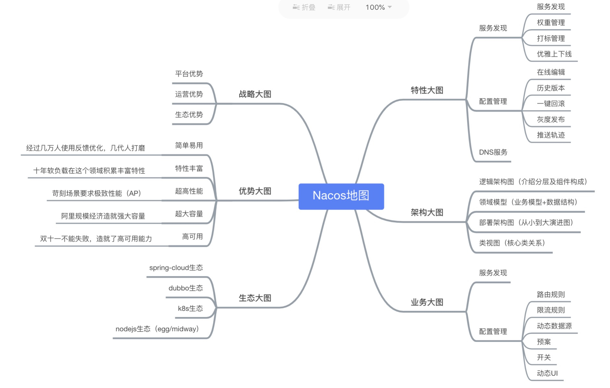

# 阿里微服务

## 控制面
### Nacos
⼀个更易于构建云原生应用的动态服务发现、配置管理和服务管理平台。  

#### 特性
- **服务发现**：Nacos 支持基于 DNS 和基于 RPC 的服务发现。服务提供者使用 原生SDK、OpenAPI、或一个独立的Agent TODO注册 Service 后，服务消费者可以使用DNS TODO 或HTTP&API查找和发现服务。
- **服务健康监测：Nacos 提供对服务的实时的健康检查，阻止向不健康的主机或服务实例发送请求。Nacos 支持传输层 (PING 或 TCP)和应用层 (如 HTTP、MySQL、用户自定义）的健康检查。 对于复杂的云环境和网络拓扑环境中（如 VPC、边缘网络等）服务的健康检查，Nacos 提供了 agent 上报模式和服务端主动检测2种健康检查模式。Nacos 还提供了统一的健康检查仪表盘，帮助您根据健康状态管理服务的可用性及流量。
- **动态配置服务：
  - 动态配置服务可以让您以中心化、外部化和动态化的方式管理所有环境的应用配置和服务配置。
  - Nacos 提供了一个简洁易用的UI 帮助您管理所有的服务和应用的配置。Nacos 还提供包括配置版本跟踪、金丝雀发布、一键回滚配置以及客户端配置更新状态跟踪在内的一系列开箱即用的配置管理特性，帮助您更安全地在生产环境中管理配置变更和降低配置变更带来的风险。
- **动态DNS服务：动态 DNS 服务支持权重路由，让您更容易地实现中间层负载均衡、更灵活的路由策略、流量控制以及数据中心内网的简单DNS解析服务。动态DNS服务还能让您更容易地实现以 DNS 协议为基础的服务发现，以帮助您消除耦合到厂商私有服务发现 API 上的风险。
- **服务及其元数据管理：Nacos 能让您从微服务平台建设的视角管理数据中心的所有服务及元数据，包括管理服务的描述、生命周期、服务的静态依赖分析、服务的健康状态、服务的流量管理、路由及安全策略、服务的 SLA 以及最首要的 metrics 统计数据。
### OpenSergo
OpenSergo是⼀套开放通用的、面向云原生服务、覆盖微服务及上下游关联组件的微服务治理标准。
## 治理面
### Sentinel
Sentinel是⼀款面向分布式、多语言异构化服务架构的流量治理组件。
### ChaosBlade
ChaosBlade是⼀个云原生混沌工程平台，支持多种环境、集群和语言。
### AppActive
一款标准、通用且功能强大的，致力于构建应用多活架构的开源中间件。
## 数据面
### Higress
⼀个遵循开源Ingress/Gateway API标准，提供流量调度、服务治理、安全防护三合⼀的高集成、易使用、易扩展、热更新的下⼀代云原生网关
### RocketMQ
云原生“消息、事件、流”实时数据处理平台，覆盖云边端⼀体化数据处理场景。
### Dubbo
Apache Dubbo是⼀款微服务框架，为⼤规模微服务 实践提供⾼性能RPC通信、流量治理、可观测性等解决⽅案，涵盖Java、Golang等多种语⾔SDK实现。
### Spring Cloud Alibaba
一站式的分布式应用开发框架。
### Seata
Seata是⼀款开源的分布式事务解决方案，致力于在微服务架构下提供高性能和简单易用的分布式事务服务。
## 运维面
### Openkruise
云原生应用的自动化管理套件。
### Kubernetes
Kubernetes是⼀个开源的容器编排引擎，用来对容器化应用进行自动化部署、扩缩和管理
## 可观测
### iLogtail
一款快速、轻量的可观测数据采集器。
### OpenTelemetry
高质量、使用广泛和可移植的可观测技术。
### Prometheus
一款开源的监控解决方案，为您的指标和报警提供支持。