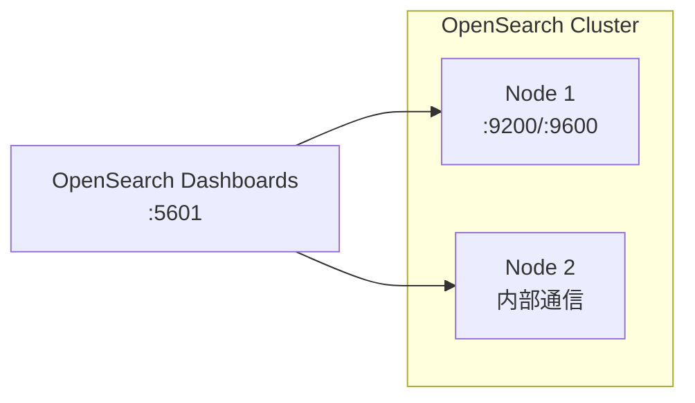

# Docker Compose 示例

> 实际项目中的 Docker Compose 编排配置参考，可直接用于开发/测试环境快速部署。

## 示例清单

| 序号 | 配置 | 说明 | 文件 |
|------|------|------|------|
| 01 | [OpenSearch 集群](opensearch.yml) | 双节点 OpenSearch + Dashboards，含内存锁与 Java Heap 配置 | `opensearch.yml` |

## OpenSearch 集群要点



**关键配置说明：**
- `discovery.seed_hosts` — 节点发现，多节点互相通信
- `cluster.initial_cluster_manager_nodes` — 初始主节点选举列表
- `bootstrap.memory_lock=true` — 锁定内存，防止 swap 影响性能
- `OPENSEARCH_JAVA_OPTS=-Xms512m -Xmx512m` — Java 堆大小，建议设为系统 RAM 的 50%
- `OPENSEARCH_INITIAL_ADMIN_PASSWORD` — 2.12+ 版本必须设置初始管理员密码

**快速启动：**
```bash
export OPENSEARCH_INITIAL_ADMIN_PASSWORD=your_password
docker compose up -d
# 访问 Dashboards: http://localhost:5601
```

## 相关章节

- [Docker 命令速查](../command/README.md) · [镜像构建](../images/README.md) · [Podman](../podman/README.md)
