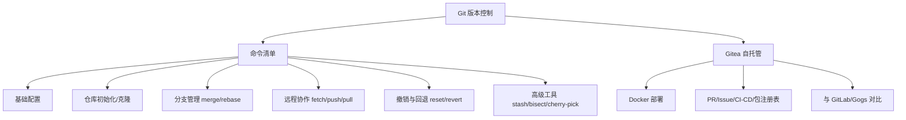

# Git

> 版本控制与代码托管——从日常命令到自建 Gitea 服务。

---

## 1. 模块导航

| 序号 | 主题 | 核心内容 | 子 README |
|------|------|---------|-----------|
| 01 | [命令清单](command/) | 配置/分支/提交/远程/撤销/子模块 | [README](command/README.md) |
| 02 | [Gitea](gitea/) | 轻量级自托管 Git 服务，Docker 一键部署 | [README](gitea/README.md) |

### 1.1 学习路径
- **入门**：命令清单 → 掌握日常开发高频操作
- **进阶**：Gitea 自建 → 团队私有代码托管平台

---

## 2. 知识脉络

---

## 3. 速查表

| 概念 | 解释 | 典型场景 |
|------|------|---------|
| **git switch** | 切换/创建分支（Git 2.23+ 替代 checkout） | 分支操作 |
| **git restore** | 恢复文件（替代 checkout -- / reset HEAD） | 撤销工作区/暂存区修改 |
| **git rebase** | 变基，将提交线性化 | 保持提交历史整洁 |
| **force-with-lease** | 安全强制推送（2025 标准，优于 --force） | 重写历史后推送 |
| **git bisect** | 二分查找定位问题提交 | 调试回归问题 |
| **git submodule** | 子模块，在仓库中嵌套其他仓库 | 共享公共代码库 |
| **Gitea** | 轻量级自托管 Git 服务（Go 编写，512MB 内存可运行） | 中小企业私有代码托管 |
| **Gitea Actions** | 类 GitHub Actions 的 CI/CD 流水线 | 自动化构建/部署 |

---

## 4. 核心内容

### 4.1 命令清单

按功能分为八大类：基础配置、仓库操作、文件管理、提交与历史、分支管理、远程协作、撤销回退、高级工具（stash/bisect/cherry-pick/reflog）。采用现代 Git 语法（switch/restore 替代 checkout）。

### 4.2 Gitea 自托管服务

基于 Go 语言的轻量级 Git 服务，最低 512MB 内存即可运行。功能覆盖代码仓库、PR/Issue、Wiki、Gitea Actions（CI/CD）、包注册表（Container/Maven/npm）。支持 Docker 一键部署，兼容 GitHub API，Apache 2.0 开源协议。与 GitLab 相比资源占用极低，与 Gogs 相比功能更全面且社区更活跃。

---

## 5. 最佳实践

- **分支策略**：主分支保护，功能分支开发，PR 合并，rebase 保持历史线性
- **提交规范**：使用 Conventional Commits（feat/fix/docs/refactor）
- **安全推送**：使用 `--force-with-lease` 替代 `--force`，防止覆盖他人提交
- **自建服务**：小团队优先选 Gitea（资源友好），企业级选 GitLab（功能全面）

---

## 6. 常见面试题

- git merge 和 git rebase 的区别？各自适用场景？
- git reset --soft / --mixed / --hard 的区别？
- force-with-lease 为什么比 force 更安全？
- Gitea 与 GitLab 各自的优势场景？
- 子模块（submodule）与子目录（subtree）的取舍？

---

## 7. 相关章节

- 上游：[`工具链`](../README.md)
- 关联：[`04-monorepo`](../monorepo/) — Monorepo 仓库管理依赖 Git 子模块/worktree

---
