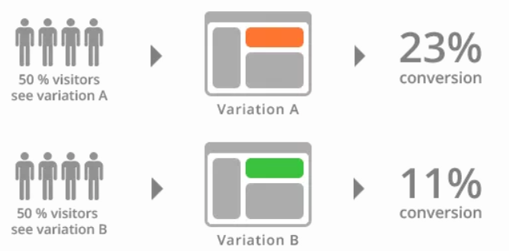

# 版本发布策略

## 蓝绿发布（Blue-Green Deployment）
蓝绿发布是一种旨在减少或消除服务停机时间和风险的软件发布策略。它通过同时运行两个完全相同的生产环境：蓝色环境和绿色环境。蓝色环境是当前活动的生产环境，对外提供服务；而绿色环境则是新设置的环境，用于部署新版本并进行测试。当新版本在绿色环境中稳定运行后，通过路由切换等操作将用户流量平滑迁移到绿色环境，此时绿色环境成为新的活动生产环境，而蓝色环境则作为备份保留。

### 优势
- **减少停机时间**：通过预部署和测试新版本，实现几乎零停机时间的部署。
- **减降低风险**：若新版本出现问题，可以快速切换回旧版本，减少业务风险。
- **减简化回滚**：保留了旧版本的环境，回滚操作简单快捷。

### 挑战
- **资源成本**：需要同时运行两套相同的环境，可能增加硬件和维护成本。
- **数据同步问题**：在切换过程中需确保两个环境的数据一致性，可能引入额外的复杂性和同步挑战。

## 滚动发布（Rolling Update Deployment）
滚动发布是一种逐步替换旧版本应用实例的部署策略，也被称为滚动更新或蓝绿部署的一种变体。其核心思想是在不影响现有服务的情况下，逐步将流量从旧版本切换到新版本，直到所有流量都切换到新版本为止。

### 优势
- **减少停机时间**：由于是逐步进行，大部分用户仍能访问旧版本，减少全量更新造成的停机时间。
- **降低部署风险**：逐步引入新版本，能及时发现并修复潜在问题，避免影响所有用户。
- **提升用户体验**：确保服务的连续性，用户几乎不会察觉到更新的发生。
- **节约资源**：相较于蓝绿部署，滚动发布更加节约资源，只需N+1台服务器即可完成服务升级（N为集群中的实例数）。

### 注意事项
- **监控与分析**：需要强大的监控和分析能力，确保新版本在生产环境中的性能和稳定性。
- **预案制定**：制定应对突发情况的预案，以快速处理可能出现的问题。
- **流量验证**：在批量升级前，先发布一小部分服务实例进行流量验证。

## 灰度发布（Canary Release）
灰度发布是一种逐步推广软件更新的策略，通过逐步放开新版本的用户群体来检测潜在问题并降低风险。它允许企业在不影响大量用户的情况下，对新版本进行测试和优化。

### 优势
- **降低风险**：逐步放开新版本的用户群体，及时发现和修复潜在问题。
- **提高发布效率**：相较于传统的全量发布方式，灰度发布能加快软件更新的速度。
- **提升用户体验**：通过不断优化软件性能和功能，提升用户体验。
- **灵活可控**：根据企业需求，灵活控制新版本的覆盖范围和推广速度。

### 实施步骤
1. 确定灰度发布的范围。
2. 制定详细的发布计划，包括逐步放开用户的节奏、监控和反馈机制等。
3. 搭建灰度发布平台，实现新旧版本的切换、流量分流和数据监控。
4. 逐步放开新版本的用户群体，同时监控系统的运行状态和用户反馈。
5. 评估灰度发布效果，为后续的全量发布提供参考。

## A/B测试（A/B Testing）
A/B测试是一种科学决策方法，广泛应用于产品迭代、营销策略优化、用户体验改进等领域。其核心思想是通过对比实验，定量分析不同方案的效果差异。通常将用户随机分配到两个或多个不同的版本中，收集和分析表现数据，以确定哪个版本更符合业务目标。

