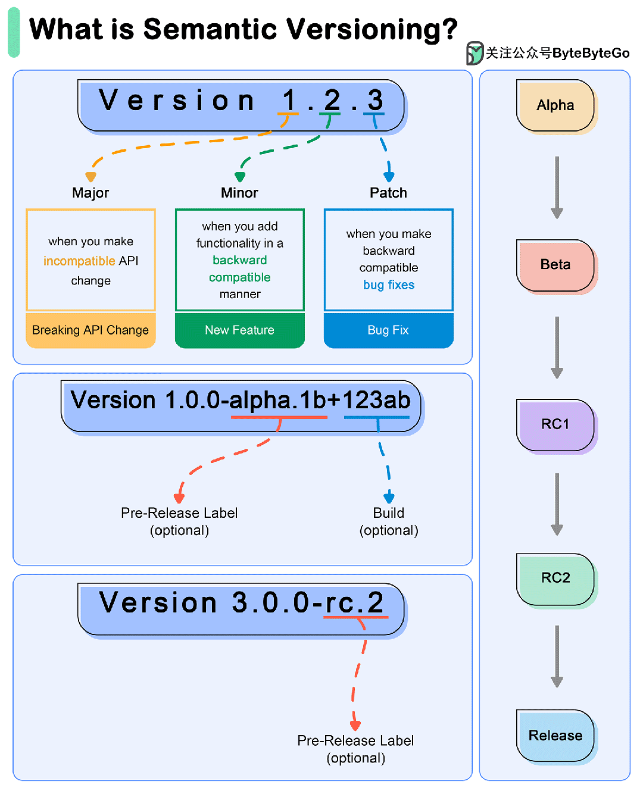

# 软件版本号
语义版本管理（SemVer）是一种软件版本管理方案，旨在传达版本中基本变更的含义。

## SemVer
SemVer 使用由三部分组成的版本号： major.minor.patch.

- **主版本**：当出现不兼容的 API 变动时，版本号会递增。
- **小版本**：在以向后兼容的方式添加功能时递增。
- **PATCH 版本**：在进行向后兼容的错误修复时递增。

## 示例

### 01 初始开发阶段
从版本 0.1.0 开始。
发布一些增量更改和错误修复：0.1.1, 0.2.0, 0.2.1, 0.3.0.
### 02 第一个稳定版本
发布稳定版本：1.0.0.
### 03 后续变更
- 补丁发布  
  需要对 1.0.0 进行错误修复，更新至 1.0.1。  
  更多错误修复：1.0.2, 1.0.3.  
- 次要版本  
  1.0.3 中添加了一个向后兼容的新功能，更新至 1.1.0。  
  新增另一项功能：1.2.0。  
  新小版本中的错误修复：1.2.1, 1.2.2.  
- 重大版本  
  1.2.2 中引入了不向后兼容的重大变更，更新至 2.0.0。  
  以后的小版本和补丁更新遵循相同模式。

### 04 特殊版本和预发布版本
- 预发布版本  
  用连字符和一系列以点分隔的标识符表示。  
  例如 alpha 版、beta 版和候选发布版：1.0.0-alpha、1.0.0-beta、1.0.0-rc.1。  
- 构建元数据  
  用加号和一系列以点分隔的标识符表示。
  示例：1.0.0+20130313144700。

## 其他
经常会看到一些软件发布的时候都会带上 Alpha、Beta、Gamma、RC 等等这些莫名其妙的单词，它们代表什么意思呢？

- **Alpha**：软件或系统的内部测试版本，仅内部人员使用。一般不向外部发布，通常会有很多 Bug，除非你也是测试人员，否则不建议使用，alpha 就是 α，是希腊字母的第一位，表示最初级的版本，beta 就是 β，alpha 版就是比 beta 还早的测试版，一般都是内部测试的版本。
- **Beta**：公开测试版。β 是希腊字母的第二个，顾名思义，这一版本通常是在 Alpha 版本后，该版本相对于 Alpha 版已有了很大的改进，消除了严重的错误，但还是存在着一缺陷，需要经过多次测试来进一步消除。这个阶段的版本会一直加入新的功能。
- **Gamma**：软件或系统接近于成熟的版本，只需要做一些小的改进就能发行。是 beta 版做过一些修改，成为正式发布的候选版本。
- **RC**：Release Candidate，发行候选版本。和 Beta 版最大的差别在于 Beta 阶段会一直加入新的功能，但是到了 RC 版本，几乎就不会加入新的功能了，而主要着重于除错。RC 版本是最终发放给用户的最接近正式版的版本，发行后改正 bug 就是正式版了，就是正式版之前的最后一个测试版。
- **GA**：General Available，正式发布的版本，这个版本就是正式的版本。在国外都是用 GA 来说明 release 版本的。比如：MySQL Community Server 5.7.21 GA 这是 MySQL Community Server 5.7 第 21 个发行稳定的版本，GA 意味着 General Available，也就是官方开始推荐广泛使用了。
- **Release**：这个版本通常就是所谓的“最终版本”，在前面版本的一系列测试版之后，终归会有一个正式版本，是最终交付用户使用的一个版本，该版本有时也称为标准版。一般情况下，Release 不会以单词形式出现在软件封面上，取而代之的是符号(R)。
- **Stable**：稳定版。在开源软件中，都有 stable 版，这个就是开源软件的最终发行版，用户可以放心大胆的用了。这一版本基于 Beta 版，已知 Bug 都被修复，一般情况下，更新比较慢。
- **LTS**：Long Term Support，长期支持版，是指针对软件的某一版本，提供长时间的技术支持、安全更新和错误修复。相对于非 LTS 版本，LTS 版本被认为是更为稳定、可靠和安全的版本。因此，在需要稳定性和安全性较高的场景中，如生产环境、企业级应用等，LTS 版本得到广泛的应用。

