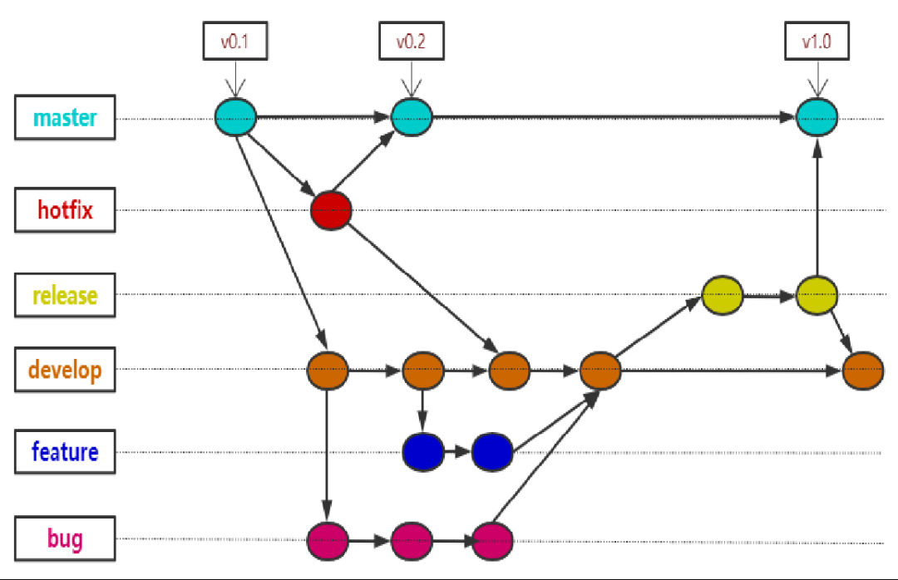
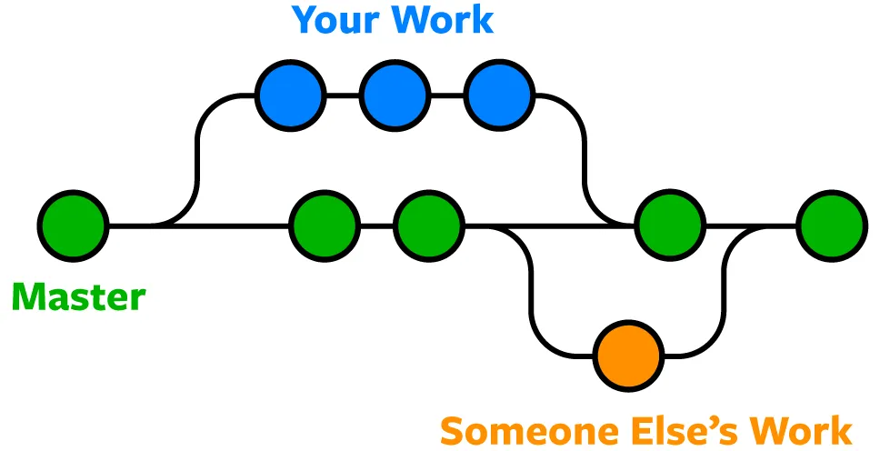
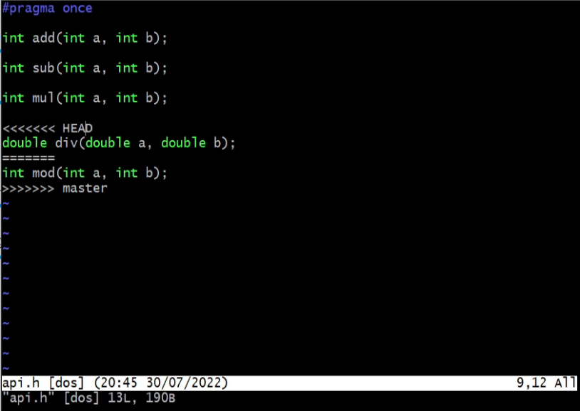
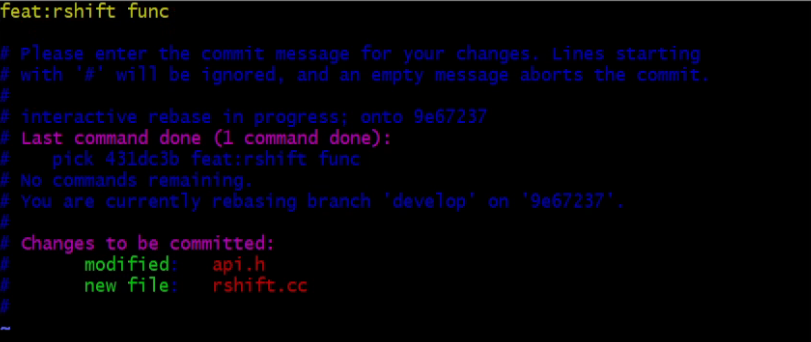
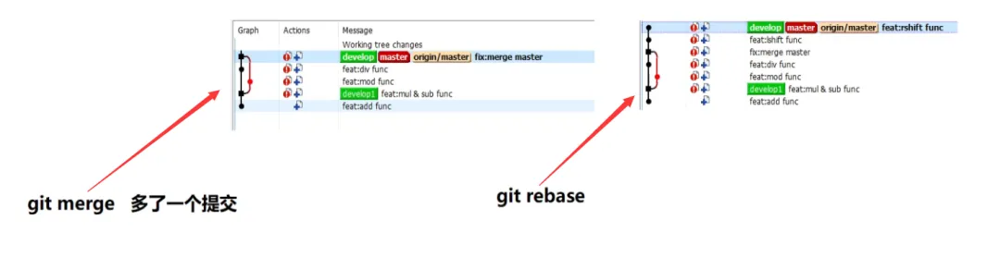
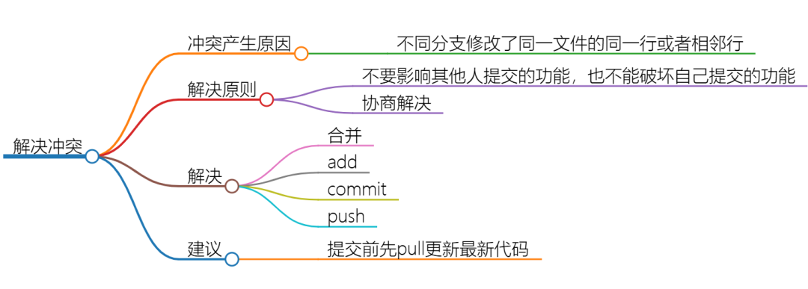
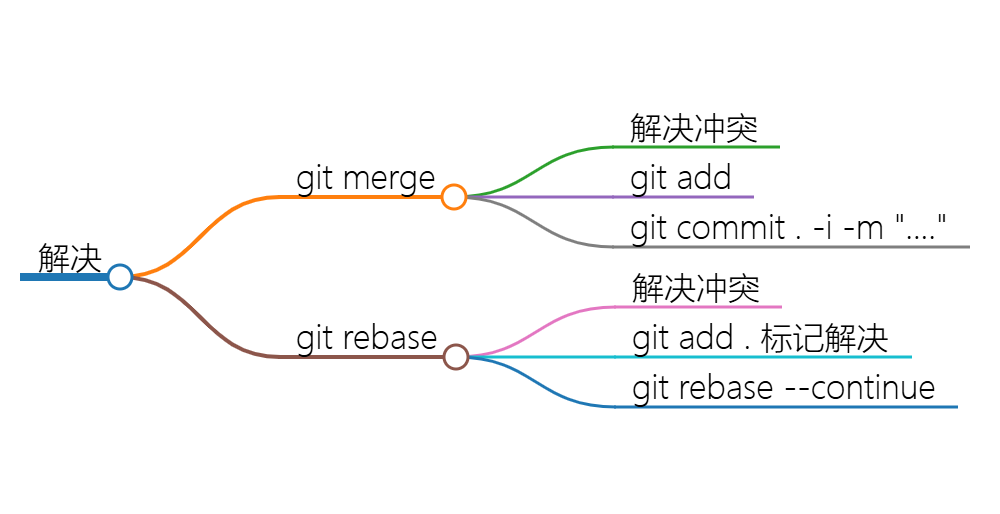

# 分支版本管理

## 分支的概念
分支就是就是一个代码的副本，可以基于分支进行独立开发。比如我们创建 Bug 分支或者 Feature 分支，等开发好了再合并到主干上。  
使用 Git 可以非常方便灵活地管理分支和基于分支工作：
```shell
git branch   # 查看分支
git branch develop  # 创建develop分支
git checkout –b feature/FT-123456  # 创建FT-123456的一个feature分支
git checkout develop   # 切换分支
git merge feature/FT-123456   # 合并分支
git branch –d feature/FT-123456   # 删除FT-123456的feature分支
git push –u origin hotfix/ISSUE-345678    # 推送分支
```

## 版本管理的标准流程

- **Master**：稳定压倒一切，禁止尚 review 和测试过的代码提交到这个分支上，Master上的代码是可以随时部署到线上生产环境的。
- **Develop**：开发分支，我们的持续集成工作在这里，code review过的代码合入到这里，我们以下要讲的BUG fix和feature开发都可以基于develop分支拉取，修改完之后合入到develop分支。
- **Feature**：功能开发和change request的分支，也即我们每一个feature都可以从devlop上拉取一个分支，开发、review和测试完之后合入develop分支。
- **Hotfix**：紧急修改的分支，在master发布到线上出现某个问题的时候，算作一个紧急布丁。从master分支上拉取代码，修改完之后合入develop和master分支。
- **Release**：预发布分支，比如0.1、0.2、1.12版本，我们一般说的系统测试就是基于这些分支做的，如果出现bug，则可以基于该release分支拉取一个临时bug分支。
- **Bug**：bug fix的分支，当我们定位、解决后合入develop和Release分支，然后让测试人员回归测试，回归测试后由close这个bug。

## 查看分支
首先要知道怎么去查看分支，使用git branch命令，这个命令只打印本地仓库的分支；如果想把远端的分支也查看一番，可以使用git branch -a命令。其中其星号*表示当前在哪个分支。示例：  
```shell
git branch
* master
git branch -a
* master
  remotes/origin/HEAD -> origin/master
  remotes/origin/master
```

## 创建、切换分支
创建分支有两种方式：
```shell
git branch 分支名
git checkout -b 分支名
```
它们的不同：
- **`git branch 分支名`**：虽然创建了分支，但不会自动切换到新建的分支；而且是在本地创建的分支，远端没有这个分支。
- **`git checkout -b`**：也会创建分支，而且会自动切换到新的分支上。

git check命令的功能很多，除了切换分支，还可以做版本回退等操作，因此，后来 Git 又增加了一个git switch命令。  
git checkout -b可以理解为两个命令的结合，即 创建分支 + 切换分支两个操作合成一个命令。  


## 合并分支 （重点）
合并分支有两个命令：
- git merge。
- git rebase，不推荐使用。git rebase不仅可以合并提交，还可以合并分支。

合并分支的主要作用：通常，在实际项目开发过程中，会有多个分支，而且都是基于某个主分支进行开发。最终，所有的分支实现的功能都要合并到主分支，所有人都可以看到项目的修改。我们要把自己分支的修改应用到主分支，就需要合并分支。

### git merge合并 Git 分支的步骤
1. 切换到目标分支：这是你希望将更改合并到的分支。例如，如果你想将 feature-branch 合并到 main，需要首先切换到 main 分支，拉取该分支的最新代码。
```shell
git checkout main
git pull
```
2. 合并分支：使用 git merge 命令将另一个分支合并到当前分支。例如，将 feature-branch 合并到 main：
```shell
git merge feature-branch
```
3. 处理冲突（如果有）：如果存在冲突，Git 会提示你解决冲突。你需要手动编辑冲突的文件，然后添加更改并完成合并。
```shell
# 编辑冲突文件
vim 冲突的文件
# 解决冲突后，添加已解决的文件
git add <file-with-conflict>

# 完成合并
git commit . -i -m "merge fix conflicts."
```
冲突文件示例：  


4. 测试代码并推送更改（如果需要）：将合并后的更改推送到远程仓库。
```shell
git push origin main
```

### git rebase合并分支的步骤（不推荐使用）
1. 切换到需要更新的分支：假设要将 feature-branch 的更改应用到 main 分支上，首先需要切换到 feature-branch。
```shell
git checkout feature-branch
```

2. 执行 rebase 操作：将 feature-branch 的更改应用到 main 分支上。
```shell
git rebase main
```
这会将 feature-branch 上的提交“移到” main 分支的顶部。feature-branch 上的更改将会被逐个应用到 main 上的最新提交之后。

3. 解决冲突（如果有）：如果在 rebase 过程中出现冲突，Git 会提示解决冲突。解决冲突后，继续 rebase 操作。注意，git rebase解决完冲突后并不会增加一次提交。
```shell
# 编辑冲突文件
vim 冲突的文件
# 解决冲突后，添加已解决的文件
git add <file-with-conflict>

# 继续 rebase
git rebase --continue
```
rebase示例：  


4. 推送更改（如果需要）：由于 rebase 操作会改变提交历史，如果已经将 feature-branch 推送到远程仓库，需要强制推送更新。
```shell
git push --force origin feature-branch
```
注意：强制推送会覆盖远程仓库中的 feature-branch，在共享仓库中使用时请小心。

### 不推荐使用git rebase的原因
虽然git rebase让提交记录非常整洁，它整体上比git merge上一个提交记录，但是它会让人造成混淆（时间线错乱），无法辨别真正的版本依赖关系。git merge更加符合实际开发的时间线。  


### 什么时候使用git rebase?
依据是：是否有其他人依赖我当前rebase的这个分支。如果有依赖，则应当采用git merge进行合并，否则可以 使用git rebase 命令。因为git rebase会改变提交日志（即 commit id），如果有人依赖我的分支，就可能出现异常。  
git rebase原理：从两个分支的共同祖先开始提取当前分支上的修改，提取的提交应用到目标分支的最新提交的后面，将当前分支指向目标分支的最新提交，可能引发其他人基底发生改变。

## 删除分支

### 删除本地分支
1. 切换到其他分支：在删除分支之前，确保不在要删除的分支上。例如，如果要删除 feature-branch，可以切换到 main 或其他分支。
```shell
git checkout main
```

1. 删除本地分支：使用 -d 选项删除本地分支，如果分支上有未合并的更改，Git 会警告你。
 ```shell
git branch -d feature-branch
```
如果你确定要删除分支，即使它有未合并的更改，可以使用 -D（强制删除）：
```shell
git branch -D feature-branch
```

### 删除远程分支
使用 git push 命令并指定 --delete 选项来删除远程分支。例如，删除远程 feature-branch。
```shell
git push origin --delete feature-branch
# or
git push origin -d feature-branch
```

## 解决冲突
> **冲突产生原因**：不同分支修改了同一文件的同一行或者相邻行。  
> **解决原则**：不要影响其他人提交的功能，也不能破坏自己提交的功能。也可以跟其他人协商解决。  
> **建议**：提交前先pull更新最新代码。
> 
> 
> 
> git merge和git rebase解决冲突的不同:
> - git merge先解决冲突文件，然后使用git add，最后git commit . -i -m "...."，完成。
> - git rebase先解决冲突文件，然后使用git add.标记解决，最后git rebase --continue，完成。
> 
> 

## Git Bash Here
### 统计每个人增删行数
```shell
git log --format='%aN' | sort -u | while read name; do echo -en "$name\t"; git log --author="$name" --pretty=tformat: --numstat | awk '{ add += $1; subs += $2; loc += $1 - $2 } END { printf "added lines: %s, removed lines: %s, total lines: %s\n", add, subs, loc }' -; done
```

### 统计该项目所有的代码数
```shell
git log  --pretty=tformat: --numstat | awk '{ add += $1; subs += $2; loc += $1 - $2 } END { printf "added lines: %s, removed lines: %s, total lines: %s\n", add, subs, loc }'
```

### 统计每个人增删行数
```shell
git log --format='%aN' | sort -u | while read name; do echo -en "$name\t"; git log --author="$name" --pretty=tformat: --numstat | awk '{ add += $1; subs += $2; loc += $1 - $2 } END { printf "added lines: %s, removed lines: %s, total lines: %s\n", add, subs, loc }' -; done
```


## 子模块
### 子模块操作命令
```shell
git submodule add -b [branch] https://gitlab.com/b-project

#所有子模块查看标签
git submodule foreach git tag
#所有子模块按照标签拉取
git submodule foreach git pull origin 0.5.02-release

git submodule init
git submodule sync
git submodule update
git submodule update --init --remote 
```
### 删除子模块
1) $ git rm --cached [path]
   根据路径删除子模块的记录
2) 编辑“.gitmodules”文件，将子模块的相关配置节点删除掉
   清理子模块配置
3) 编辑“ .git/config”文件，将子模块的相关配置节点删除掉
   清理子模块配置
4) 手动删除子模块残留的目录
   清理脏文件
