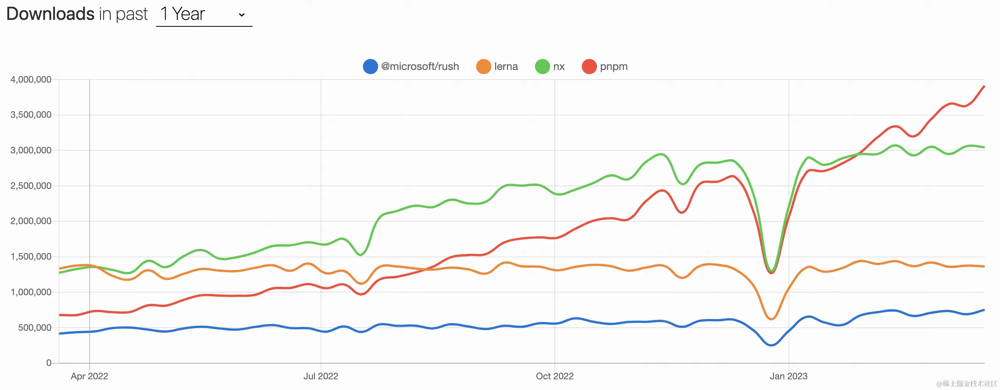

# Monorepo

Monorepo 是一种项目代码管理方式，指单个仓库中管理多个项目，有助于简化代码共享、版本控制、构建和部署等方面的复杂性，并提供更好的可重用性和协作性。Monorepo 提倡了开放、透明、共享的组织文化，这种方法已经被很多大型公司广泛使用，如 Google、Facebook 和 Microsoft 等。

## 演进

1. **阶段一**：单仓库巨石应用， 一个 Git 仓库维护着项目代码，随着迭代业务复杂度的提升，项目代码会变得越来越多，越来越复杂，大量代码构建效率也会降低，最终导致了单体巨石应用，这种代码管理方式称之为 Monolith。
2. **阶段二**：多仓库多模块应用，于是将项目拆解成多个业务模块，并在多个 Git 仓库管理，模块解耦，降低了巨石应用的复杂度，每个模块都可以独立编码、测试、发版，代码管理变得简化，构建效率也得以提升，这种代码管理方式称之为 MultiRepo。
3. **阶段三**：单仓库多模块应用，随着业务复杂度的提升，模块仓库越来越多，MultiRepo这种方式虽然从业务上解耦了，但增加了项目工程管理的难度，随着模块仓库达到一定数量级，会有几个问题：跨仓库代码难共享；分散在单仓库的模块依赖管理复杂（底层模块升级后，其他上层依赖需要及时更新，否则有问题）；增加了构建耗时。于是将多个项目集成到一个仓库下，共享工程配置，同时又快捷地共享模块代码，成为趋势，这种代码管理方式称之为 MonoRepo。

## 优劣

| 维度    | MultiRepo                                                                                                                                         | MonoRepo                                                                                                                                                  |
|-------|---------------------------------------------------------------------------------------------------------------------------------------------------|-----------------------------------------------------------------------------------------------------------------------------------------------------------|
| 代码可见性 | ✅ 代码隔离，研发者只需关注自己负责的仓库 ❌ 包管理按照各自owner划分，当出现问题时，需要到依赖包中进行判断并解决。                                                                                 | ✅ 一个仓库中多个相关项目，很容易看到整个代码库的变化趋势，更好的团队协作。 ❌ 增加了非owner改动代码的风险                                                                                             |
| 依赖管理  | ❌ 多个仓库都有自己的 node_modules，存在依赖重复安装情况，占用磁盘内存大。                                                                                                      | ✅ 多项目代码都在一个仓库中，相同版本依赖提升到顶层只安装一次，节省磁盘内存，                                                                                                                   |
| 代码权限  | ✅ 各项目单独仓库，不会出现代码被误改的情况，单个项目出现问题不会影响其他项目。                                                                                                          | ❌ 多个项目代码都在一个仓库中，没有项目粒度的权限管控，一个项目出问题，可能影响所有项目。                                                                                                             |
| 开发迭代  | ✅ 仓库体积小，模块划分清晰，可维护性强。 ❌ 多仓库来回切换（编辑器及命令行），项目多的话效率很低。多仓库见存在依赖时，需要手动 npm link，操作繁琐。 ❌ 依赖管理不便，多个依赖可能在多个仓库中存在不同版本，重复安装，npm link 时不同项目的依赖会存在冲突。 | ✅ 多个项目都在一个仓库中，可看到相关项目全貌，编码非常方便。 ✅ 代码复用高，方便进行代码重构。 ❌ 多项目在一个仓库中，代码体积多大几个 G，git clone时间较长。 ✅ 依赖调试方便，依赖包迭代场景下，借助工具自动 npm link，直接使用最新版本依赖，简化了操作流程。 |
| 工程配置  | ❌ 各项目构建、打包、代码校验都各自维护，不一致时会导致代码差异或构建差异。                                                                                                            | ✅ 多项目在一个仓库，工程配置一致，代码质量标准及风格也很容易一致。                                                                                                                        |
| 构建部署  | ❌ 多个项目间存在依赖，部署时需要手动到不同的仓库根据先后顺序去修改版本及进行部署，操作繁琐效率低。                                                                                                | ✅ 构建性 Monorepo 工具可以配置依赖项目的构建优先级，可以实现一次命令完成所有的部署。                                                                                                          |

## 应用场景
综合如上 Monorepo VS MultiRepo，中大型项目，多模块项目，更适合用 MonoRepo 方式管理代码，在开发、协作效率、代码一致性方面都能受益。

## 典型问题
1. **幽灵依赖**
   - **问题**：npm/yarn 安装依赖时，存在依赖提升，某个项目使用的依赖，并没有在其 package.json 中声明，也可以直接使用，这种现象称之为 “幽灵依赖”；随着项目迭代，这个依赖不再被其他项目使用，不再被安装，使用幽灵依赖的项目，会因为无法找到依赖而报错。
   - **方案**：基于 npm/yarn 的 Monorepo 方案，依然存在 “幽灵依赖” 问题，我们可以通过 pnpm 彻底解决这个问题
2. **依赖安装耗时长**
   - **问题**：MonoRepo 中每个项目都有自己的 package.json 依赖列表，随着 MonoRepo 中依赖总数的增长，每次 install 时，耗时会较长。
   - **方案**：相同版本依赖提升到 Monorepo 根目录下，减少冗余依赖安装；使用 pnpm 按需安装及依赖缓存。
3. **构建打包耗时长**
   - **问题**：多个项目构建任务存在依赖时，往往是串行构建 或 全量构建，导致构建时间较长
   - **方案**：增量构建，而非全量构建；也可以将串行构建，优化成并行构建。

## 方案选型

### 构建型 Monorepo 方案

此类工具，主要解决大仓库 Monorepo 构建效率低的问题。项目代码仓库越来越庞大，工作流（int、构建、单元测试、集成测试）也会越来越慢；这类工具，是专门针对这样的场景进行极致的性能优化。适用于包非常多、代码体积非常大的 Monorepo 项目。

#### Turborepo
Turborepo 是 Vercel 团队开源的高性能构建代码仓库系统，允许开发者使用不同的构建系统。

构建加速思路：
- **Multiple Running Task**：构建任务并行进行，构建顺序交给开发者配置
- **Cache、Remote Cache**：通过缓存 及 远程缓存，减少构建时间

传统的 yarn workspace 问题：串行构建，性能差

Turborepo Multiple Running Task：允许用户在 turbo.json 中声明 task 之间依赖关系，优化后构建如下

#### Rush
Rush 是微软开发的可扩展的 Monorepo 工具及解决方案。早期，只提供了 Rush 作为构建调取器，其余事项交给用户灵活的选择任意构建工具链，由于过于灵活带来了很大的选型及维护成本，后来成立了 Rush Stack 来提供了一套可复用的解决方案，涵盖多项目的构建、测试、打包和发布，实现了更强大的工作流。有如下工具：

- **Rush**: 可扩展的 monorepo 构建编排工具
- **Heft**: 可以与 Rush 交互的可扩展构建系统
- **API Extractor**: 为工具库审阅 API 并生成 .d.ts 文件
- **API Documenter**: 生成你的 API 文档站
- **@rushstack/eslint-config**: 专门为大型 TypeScript monorepo 仓库设计的 ESLint 规则集
- **@rushstack/eslint-plugin-packlets**: 可用于在单个项目内来组织代码，NPM 发包的一个轻量级解决方案
- **Rundown**: 用于优化 Node.js 启动时间的工具

**Rush 功能列举**
- **解决了幽灵依赖**：将项目所有依赖都安装到 Repo根目录的common/temp下，通过软链接到各项目，保证了 node_modules 下依赖与 package.json 一致
- **并行构建**：Rush 支持并行构建多个项目，提高了构建效率
- **插件系统**：Rush 提供了丰富的插件系统，可以扩展其功能，满足不同的需求
- **项目发布，ChangeLog 支持友好**：自动修改项目版本号，自动生成 ChangeLog

#### Nx
Nx 是 Nrwl 团队开发的，同时在维护 Lerna，目前 Nx 可以与 Learn 5.1及以上集成使用

比 Turborepo 更丰富的构建加速思路
- **缓存**： 通过缓存 及 远程缓存，减少构建时间（远程缓存：Nx 公开了一个公共 API，它允许您提供自己的远程缓存实现，Turborepo 必须使用内置的远程缓存）
- **增量构建**： 最小范围构建，非全量构建
- **并行构建**： Nx 自动分析项目的关联关系，对这些任务进行排序以最大化并行性
- **分布式构建**： 结合 Nx Cloud，您的任务将自动分布在 CI 代理中（多台远程构建机器），同时考虑构建顺序、最大化并行化和代理利用率  
  
- **用 Nx 强大的任务调度器加速 Lerna**：Lerna 擅长管理依赖关系和发布，但扩展基于 Lerna 的 Monorepos 很快就会变得很痛苦，因为 Lerna 很慢。这就是 Nx 的闪光点，也是它可以真正加速你的 monorepo 的地方。

### 轻量化 Monorepo 方案

#### Lerna

Lerna 是 Babel 为实现 Monorepo 开发的工具；最擅长管理依赖关系和发布  
Lerna 优化了多包工作流，解决了多包依赖、发版手动维护版本等问题  
Lerna 不提供构建、测试等任务，工程能力较弱，项目中往往需要基于它进行顶层能力的封装  

**Lerna 主要做三件事**
- 为单个包或多个包运行命令 (lerna run)
- 管理依赖项 (lerna bootstrap)
- 发布依赖包，处理版本管理，并生成变更日志 (lerna publish)

**Lerna 能解决了什么问题？**
- **代码共享，调试便捷**： 一个依赖包更新，其他依赖此包的包/项目无需安装最新版本，因为 Lerna 自动 Link
- **安装依赖，减少冗余**：多个包都使用相同版本的依赖包时，Lerna 优先将依赖包安装在根目录
- **规范版本管理**： Lerna 通过 Git 检测代码变动，自动发版、更新版本号；两种模式管理多个依赖包的版本号
- **自动生成发版日志**：使用插件，根据 Git Commit 记录，自动生成 ChangeLog

**Lerna 自动检测发布，判断逻辑**
- 校验本地是否有没有被 commit 内容？
- 判断当前的分支是否正常？
- 判断当前分支是否在 remote 存在？
- 判断当前分支是否在 lerna.json 允许的 allowBranch 设置之中？
- 判断当前分支提交是否落后于 remote

**Lerna 工作模式**

Lerna 允许您使用两种模式来管理您的项目：固定模式(Fixed)、独立模式(Independent)
1. 固定模式（Locked mode）
   Lerna 把多个软件包当做一个整体工程，每次发布所有软件包版本号统一升级（版本一致），无论是否修改
项目初始化时，lerna init 默认是 Locked mode
2. 独立模式（Independent mode）  
   Lerna 单独管理每个软件包的版本号，每次执行发布指令，Git 检查文件变动，只发版升级有调整的软件包
项目初始化时，lerna init --independent

#### Lerna + npm/yarn/pnpm + workspace

Lerna 将依赖管理交给 npm/yarn/pnpm + workspace；Lerna 承担依赖发布能力。

**优势**：
- **装包速度极快**： 缓存中有的依赖，直接硬链接到项目的 node_module 中；减少了 copy 的大量 IO 操作
- **磁盘利用率极高**： 软/硬链接方式，同一版本的依赖共用一个磁盘空间；不同版本依赖，只额外存储 diff 内容
- **解决了幽灵依赖**： node_modules 目录结构 与 package.json 依赖列表一致

##### pnpm 原理

1. **存储中心 Store 集中管理依赖**：不同项目，相同版本依赖安装只进行硬链接；不同版本依赖，只增加Diff文件
2. 项目 package.json 依赖列表，和node_modules/.pnpm目录结构一致
3. 相同依赖安装时，将 Store 中的依赖硬链接到项目的 node_modules/.pnpm 下，而不是复制，速度快
4. 项目node_modules中已有依赖重复安装时，会被软链接到指定目录下

### 工具对比

| 工具    | Turborepo | Rush | Nx  | Lerna | Pnpm Workspace |
|-------|-----------|------|-----|-------|----------------|
| 依赖管理  | ❌         | ✅    | ❌   | ❌     | ✅              |
| 版本管理  | ❌         | ✅    | ❌   | ✅     | ❌              |
| 增量构建  | ✅         | ✅    | ✅   | ❌     | ❌              |
| 插件扩展  | ✅         | ✅    | ✅   | ❌     | ❌              |
| 云端缓存  | ✅         | ✅    | ✅   | ❌     | ❌              |
| Stars | 20.4K     | 4.9K | 17K | 34.3K | 22.7K          |

