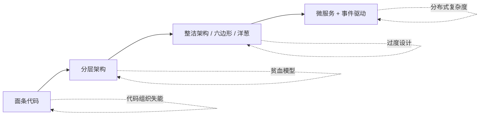

<!--
module:
  parent: system-design
  slug: system-design/from-spaghetti-to-clean
  type: article
  category: 主模块子文章
  summary: 从面条代码到分层架构再到整洁架构的演进史，含 Uncle Bob 同心圆模型、六边形架构、洋葱架构的依赖规则与 Spring Boot 实战
-->

# 从面条代码到整洁架构——架构演进史

> **一句话定位**：代码组织演进史——从面条代码到整洁架构，含同心圆/六边形/洋葱架构。

## 引言

如果说 `architecture-evolution/README.md` 回答的是"工程师该用什么**思维方式**去认知架构（OOD → DDD → TOGAF）"，那么本文回答的是另一个独立但互补的问题：**"代码本身该怎么组织"**——从面条代码（Spaghetti Code）出发，经历经典分层架构（Layered Architecture），最终抵达整洁架构（Clean Architecture）及其变体（六边形 / 洋葱）。两条线索是"知行合一"的关系：认知视角决定模式选择的判断力，模式视角决定代码落地时的可读性、可测试性与可演进性。本文聚焦后者。

## 一、阶段 0：面条代码（Spaghetti Code）

### 1.1 形态特征

面条代码是**代码组织失能**的起点。Goto 跳转、全局变量、业务逻辑与 UI 混杂在一起，控制流像一盘意大利面条一样缠绕——你永远不知道下一行会跳到哪里。

### 1.2 反模式清单

1. **过程式堆砌**：所有逻辑塞进一个 5000 行的 `Main.java`，函数之间相互调用像蛛网。
2. **全局可变状态**：`public static` 满天飞，任何函数都可能修改任何状态。
3. **业务逻辑与 UI 混杂**：在 Servlet / Controller 里直接拼 SQL、做校验、渲染 HTML。
4. **复制粘贴式复用**：改一处逻辑需要在 10 个文件里同步修改。
5. **隐式依赖**：调用顺序依赖全局变量初始化顺序，新人无法独立阅读。
6. **没有边界**：数据库表结构字段直接穿透到前端，DTO 与表模型混用。

### 1.3 Java 示例（坏代码）

```java
// 经典面条代码：Controller 直连 DB，业务/数据/视图全部搅在一起
public class OrderController extends HttpServlet {
    public static Connection conn;  // 全局变量

    protected void doPost(HttpServletRequest req, HttpServletResponse resp) {
        String userId = req.getParameter("userId");
        String productId = req.getParameter("productId");
        try {
            Statement stmt = conn.createStatement();
            // 1. 查询用户
            ResultSet rs1 = stmt.executeQuery("SELECT balance FROM users WHERE id=" + userId);
            rs1.next();
            double balance = rs1.getDouble("balance");

            // 2. 查询库存
            ResultSet rs2 = stmt.executeQuery("SELECT stock FROM products WHERE id=" + productId);
            rs2.next();
            int stock = rs2.getInt("stock");

            // 3. 业务校验（UI 拼接 SQL 注入）
            if (balance < 100 || stock < 1) {
                resp.getWriter().write("<html><body>余额不足</body></html>");
                return;
            }

            // 4. 更新数据库
            stmt.executeUpdate("UPDATE users SET balance=balance-100 WHERE id=" + userId);
            stmt.executeUpdate("UPDATE products SET stock=stock-1 WHERE id=" + productId);

            // 5. 渲染成功页
            resp.getWriter().write("<html><body>下单成功</body></html>");
        } catch (Exception e) {
            e.printStackTrace();
        }
    }
}
```

### 1.4 痛点

- **可读性**：新人需要顺着控制流追踪全部 5 个步骤。
- **可测试性**：无法单元测试，必须启动 Servlet + 真数据库。
- **可维护性**：修改业务规则需要重新部署整个 Servlet。
- **安全性**：SQL 注入明摆着。

### 1.5 一句话总结

> 面条代码是"代码组织失能"的起点——当业务逻辑与基础设施开始耦合，所有"架构"都无从谈起。

## 二、阶段 1：分层架构（Layered Architecture）

### 2.1 经典三层

为了解决面条代码的混乱，业界形成了被广泛采用的**经典三层架构**：

```text
┌─────────────────────────────┐
│   Presentation（表示层）      │   ← Controller / Servlet / REST API
├─────────────────────────────┤
│   Business（业务层）           │   ← Service / 业务规则
├─────────────────────────────┤
│   Persistence（持久层）        │   ← DAO / Repository
├─────────────────────────────┤
│   Database（隐含的基础设施）    │   ← MySQL / PostgreSQL
└─────────────────────────────┘
       ↓ 依赖方向（自上而下）
```

每一层只依赖下一层，业务规则终于有了"栖身之所"。这是**绝大多数企业应用**的默认结构。

### 2.2 优点

- **清晰的分层**：每个文件"应该放哪里"一目了然。
- **可测试**：业务层可以 mock 掉 Repository 后单测。
- **可分工**：前端/后端/数据访问分属不同人。

### 2.3 致命缺陷：依赖方向"反了"

教科书说"业务层不依赖持久层"，但现实往往相反：

- 业务规则需要持久层不知道的概念（例如"已确认订单"是个**状态**而非数据库表的镜像）。
- 业务逻辑被迫"穿过" ORM 注解（`@Entity` 实体类同时被业务层和持久层共享）。
- 一旦数据库表结构变更，业务层的代码也跟着变。

**这违反了 Uncle Bob 称之为"稳定依赖原则"的核心思想**：高层策略（业务规则）应该不依赖低层细节（数据库），低层细节反而应该依赖高层策略。

### 2.4 经典反模式

#### 反模式 A：贫血模型（Anemic Domain Model）

```java
// 反模式：业务对象只是个数据载体，逻辑全在 Service 里
public class Order {
    private Long id;
    private OrderStatus status;
    private BigDecimal amount;
    // 只有 getter/setter，没有业务方法
}

@Service
public class OrderService {
    public void confirm(Order order) {
        if (order.getStatus() != OrderStatus.PAID) {
            throw new IllegalStateException("订单未支付");
        }
        order.setStatus(OrderStatus.CONFIRMED);
        orderRepository.save(order);
        // 业务规则散落在 Service,缺乏内聚
    }
}
```

问题：业务规则（"未支付不能确认"）属于订单本身，却被外部 Service 强行"注入"，导致**领域模型变成死的数据结构**。

#### 反模式 B：事务脚本（Transaction Script）

```java
// 反模式：业务流程写成步骤序列，每个 Service 重复类似模板
public void placeOrder(Long userId, Long productId) {
    User u = userRepo.findById(userId).orElseThrow();
    Product p = productRepo.findById(productId).orElseThrow();
    if (u.getBalance().compareTo(p.getPrice()) < 0) throw ...;
    if (p.getStock() < 1) throw ...;
    Order o = new Order(u, p, OrderStatus.PAID);
    orderRepo.save(o);
    u.setBalance(u.getBalance().subtract(p.getPrice()));
    productRepo.decrementStock(productId);
}
```

这种"按过程编写业务"在简单场景够用，但复杂业务下变成**复制粘贴**。

### 2.5 好代码对比

```java
// 好代码：业务规则封装到领域对象
public class Order {
    private OrderStatus status;
    private BigDecimal amount;

    public void confirm() {
        if (status != OrderStatus.PAID) {
            throw new IllegalStateException("订单未支付");
        }
        this.status = OrderStatus.CONFIRMED;
        // 业务规则与状态内聚
    }
}

@Service
public class OrderService {
    public void confirm(Long orderId) {
        Order order = orderRepo.findById(orderId).orElseThrow();
        order.confirm();           // 委托给领域对象
        orderRepo.save(order);
    }
}
```

### 2.6 进阶四层：加 Service 层抽象

为应对更复杂业务，又衍生出**四层架构**：

```text
┌─────────────────────────────┐
│   Presentation（表示层）      │
├─────────────────────────────┤
│   Application Service（应用服务层）  ← 编排用例、事务边界
├─────────────────────────────┤
│   Domain Model（领域模型层）    ← 核心业务规则
├─────────────────────────────┤
│   Infrastructure（基础设施层）  ← DB / 消息 / 第三方
└─────────────────────────────┘
```

这是从"分层"过渡到"整洁架构"的桥梁——但分层架构的**单向依赖**问题依然存在。

## 三、阶段 2：整洁架构（Clean Architecture）

### 3.1 Uncle Bob 同心圆

2012 年，Robert C. Martin（Uncle Bob）发表了著名博客 *The Clean Architecture*，提出同心圆模型：

```text
                ┌─────────────────────────────────────┐
                │  Frameworks & Drivers（框架与驱动）   │  ← 外部工具
                │  ┌───────────────────────────────┐  │
                │  │ Interface Adapters（接口适配器）│  │  ← 控制器、Presenter、Gateway
                │  │  ┌─────────────────────────┐  │  │
                │  │  │ Use Cases（用例）         │  │  │  ← 应用业务规则
                │  │  │  ┌───────────────────┐  │  │  │
                │  │  │  │ Entities（实体）   │  │  │  │  ← 企业级业务规则
                │  │  │  │   ● 最核心        │  │  │  │
                │  │  │  └───────────────────┘  │  │  │
                │  │  └─────────────────────────┘  │  │
                │  └───────────────────────────────┘  │
                └─────────────────────────────────────┘
       ← 依赖方向：源码只能由外向内指向 →
```

### 3.2 依赖规则（最核心）

Uncle Bob 把"依赖规则"列为整洁架构**最重要的约束**：

> **源码依赖只能指向内层，朝向高层策略。**

具体含义：

1. 内层代码**不能引用外层的任何东西**（类名、变量、函数、数据格式都不能出现）。
2. 外层代码可以引用内层。
3. 这种约束在**编译器层面强制**——内层文件 `import` 了 Spring 注解就编译不过。
4. 通过**依赖倒置原则（DIP）** 实现：内层定义接口（端口），外层实现接口（适配器）。

### 3.3 4 层职责详解

| 层级 | 职责 | 示例 | 变化频率 |
|------|------|------|----------|
| **Entities** | 企业级业务规则（跨系统复用） | `User`、`Order`、`Account` 实体，含核心业务方法 | 几年 |
| **Use Cases** | 应用特定业务规则（编排） | `PlaceOrderUseCase`、`TransferFundsUseCase` | 几个月 |
| **Interface Adapters** | 数据转换（控制器、Presenter、Gateway） | `OrderController`、`OrderRepositoryImpl` | 几周 |
| **Frameworks & Drivers** | 外部工具（DB、Web、UI） | Spring、Hibernate、PostgreSQL、Redis | 几天 |

**关键洞察**：越靠近圆心，变化越慢；越靠近边缘，变化越快。把易变的东西（框架版本）放到外层，业务规则放内层，业务规则就**与框架解耦**。

### 3.4 跨边界机制

跨越同心圆边界的关键是**接口归属**：

```text
Use Cases 层 ──→ 定义接口（OutputPort）  ◀── 这是内层代码
                                    ▲
                                    │
Interface Adapters 层 ──→ 实现接口（Adapter）  ◀── 这是外层代码
```

具体三步：

1. **定义内层接口**（`OrderRepository` 接口在 use case 包）。
2. **外层实现接口**（`OrderRepositoryImpl` 在 infrastructure 包）。
3. **在 composition root 注入**（Spring `@Configuration` 把实现注入接口）。

### 3.5 跨边界数据传输（DTO）

边界上**禁止直接传递实体对象**，必须用 DTO 转换：

```java
// 内层：Use Case 只接受/返回自己的数据结构
public class PlaceOrderUseCase {
    public OrderId execute(PlaceOrderCommand cmd) {  // ← Command DTO
        // ... 业务逻辑
        return OrderId.of("...");
    }
}

// 外层：Controller 把外部请求转成 Command
@RestController
public class OrderController {
    @PostMapping("/orders")
    public PlaceOrderResponse create(@RequestBody CreateOrderRequest req) {
        PlaceOrderCommand cmd = PlaceOrderCommand.from(req);  // ← 转换
        return new PlaceOrderResponse(useCase.execute(cmd));
    }
}
```

**为什么必须转换？** 内层实体可能因业务演化而改字段名/类型；如果外层直接持有内层实体，每次演化都牵连所有调用方。DTO 隔离了这种耦合。

### 3.6 实战：Spring Boot 实现整洁架构

典型包结构：

```text
com.example.order
├── domain/                  ← Entities（最内层）
│   ├── Order.java
│   ├── OrderStatus.java
│   └── Money.java
├── application/             ← Use Cases
│   ├── port/
│   │   ├── in/
│   │   │   └── PlaceOrderUseCase.java        ← 输入端口
│   │   └── out/
│   │       └── OrderRepository.java          ← 输出端口（接口）
│   ├── PlaceOrderCommand.java
│   └── PlaceOrderUseCaseImpl.java
├── infrastructure/          ← Interface Adapters + Frameworks
│   ├── persistence/
│   │   ├── OrderJpaEntity.java               ← JPA 实体（外层）
│   │   ├── OrderRepositoryImpl.java          ← 实现输出端口
│   │   └── SpringDataOrderRepository.java
│   └── web/
│       ├── OrderController.java
│       └── dto/
│           └── CreateOrderRequest.java
└── config/                  ← composition root
    └── BeanConfig.java
```

Use Case 实现示例（10-30 行）：

```java
// application/PlaceOrderUseCaseImpl.java
@Service
public class PlaceOrderUseCaseImpl implements PlaceOrderUseCase {
    private final OrderRepository orderRepo;        // ← 注入的是内层定义的接口
    private final ProductCatalog productCatalog;

    @Override
    @Transactional
    public OrderId execute(PlaceOrderCommand cmd) {
        Product p = productCatalog.findById(cmd.productId())
            .orElseThrow(() -> new ProductNotFoundException(cmd.productId()));

        if (!p.hasStock()) {
            throw new OutOfStockException(p.getId());
        }

        Order order = Order.place(cmd.userId(), p, cmd.quantity());
        orderRepo.save(order);                      // ← 通过接口
        return order.getId();
    }
}
```

### 3.7 常见误区

#### ⚠️ 目录结构 ≠ 整洁架构

> **关键：依赖方向，编译器层面验证。** 仅仅把代码放进 `domain/` 包不等于整洁架构；如果 `domain/Order.java` 里出现 `@Entity`（JPA 注解），就已经把外层依赖渗透进了内层。

**误区 1：把 Entity 暴露给 Controller**

```java
// 反模式：直接返回 JPA Entity
@RestController
public class UserController {
    @GetMapping("/users/{id}")
    public User get(@PathVariable Long id) {       // ← User 是 @Entity
        return userRepo.findById(id).orElseThrow();
    }
}
// 问题：User 实体结构变更会破坏 API 契约，且暴露懒加载字段
```

正解：用专门的 Response DTO 包装。

**误区 2：Use Case 直接注入 Repository 具体类**

```java
// 反模式
@Service
public class PlaceOrderUseCaseImpl {
    private final OrderRepositoryImpl orderRepo;   // ← 注入实现类
}

// 正解
@Service
public class PlaceOrderUseCaseImpl {
    private final OrderRepository orderRepo;       // ← 注入接口
}
```

**误区 3：DTO 与 Entity 混用**

```java
// 反模式
public class OrderService {
    public OrderDto findOrder(Long id) {
        Order entity = orderRepo.findById(id).orElseThrow();
        return OrderDto.from(entity);             // 处处手动转 DTO
    }
}
```

正解：DTO 与 Entity 分属不同包，由专门的 mapper（MapStruct）转换，避免到处散落。

## 四、阶段 3：六边形架构（Hexagonal / Ports and Adapters）

### 4.1 来源

Alistair Cockburn 在 2005 年提出，原名 **"Ports and Adapters"**。后因其示意图为六边形，又称"六边形架构"。

### 4.2 核心思想

把应用想象成一个**六边形**（或任意形状），外部世界通过**端口（Port）**与内部通信，**适配器（Adapter）**负责具体实现：

```text
                  ┌───────────────────────┐
   ┌──────┐      │                       │      ┌──────┐
   │  Web │─Port─┤                       ├─Port─│  DB  │
   └──────┘      │                       │      └──────┘
                  │     应用核心           │
   ┌──────┐      │     （六边形）         │      ┌──────┐
   │  CLI │─Port─┤                       ├─Port─│ MQ   │
   └──────┘      │                       │      └──────┘
                  └───────────────────────┘
```

### 4.3 端口与适配器

- **端口（Port）**：接口定义，描述"应用需要什么"或"应用对外提供什么"。
  - **入站端口（Inbound / Driving）**：外部调用应用（如 REST API、CLI、消息消费者）。
  - **出站端口（Outbound / Driven）**：应用调用外部（如数据库、邮件、第三方 API）。
- **适配器（Adapter）**：接口实现，连接具体技术。
  - 入站适配器：`OrderRestController`（Spring MVC）。
  - 出站适配器：`OrderRepositoryJdbcImpl`（JDBC 实现）。

### 4.4 与整洁架构的关系

整洁架构 ≈ **六边形 + 进一步分层**。Uncle Bob 在 Clean Architecture 博客里明确说，六边形是 Clean Architecture 的灵感来源之一。区别：

| 维度 | 六边形 | 整洁架构 |
|------|--------|---------|
| 形状 | 六边形（强调"任意方向接入"） | 同心圆（强调"由内向外的依赖"） |
| 端口命名 | 显式命名 port | 没有专门术语（用接口替代） |
| 分层粒度 | 较粗（核心 + 端口） | 更细（4 层同心圆） |

## 五、阶段 4：洋葱架构（Onion Architecture）

### 5.1 来源

Jeffrey Palermo 在 2008 年提出。

### 5.2 同心圆结构

```text
        ┌──────────────────────────────────┐
        │   Infrastructure（基础设施）       │  ← DB、Web、UI
        │  ┌────────────────────────────┐  │
        │  │   Application Services      │  │  ← 用例编排
        │  │  ┌──────────────────────┐  │  │
        │  │  │   Domain Services     │  │  │  ← 跨实体的业务规则
        │  │  │  ┌────────────────┐  │  │  │
        │  │  │  │  Domain Model   │  │  │  │  ← 实体（最核心）
        │  │  │  │     ● 核心      │  │  │  │
        │  │  │  └────────────────┘  │  │  │
        │  │  └──────────────────────┘  │  │
        │  └────────────────────────────┘  │
        └──────────────────────────────────┘
```

### 5.3 区别

洋葱架构与整洁架构**几乎同构**，核心差别：

- **洋葱强调 Domain Model 在最核心**：实体不仅是数据载体，更包含**所有业务规则**。
- **Domain Services 层**：用于跨多个实体的业务规则（例如"转账"涉及账户 A 和账户 B，单靠 Account 实体不够）。
- **Application Services**：负责**用例编排**（如事务边界、权限校验）。

### 5.4 与整洁架构对比

| 维度 | 整洁架构 | 洋葱架构 |
|------|---------|---------|
| 提出者 | Uncle Bob (2012) | Palermo (2008) |
| 核心结构 | 4 层同心圆 | 多层同心圆 |
| Domain Services | 不显式分层 | 显式独立一层 |
| 适用规模 | 中大型 | 中大型 |
| 学习曲线 | 中等 | 中等 |
| Spring 社区采纳度 | 高 | 中 |

## 六、4 大架构模式对比表

| 维度 | 分层架构 | 整洁架构 | 六边形 | 洋葱 |
|------|---------|---------|--------|------|
| 提出者 | 业界共识 | Uncle Bob (2012) | Cockburn (2005) | Palermo (2008) |
| 核心结构 | 横向 3-4 层 | 同心圆 4 层 | 六边形 + 端口 | 同心圆多层 |
| 依赖规则 | 严格单向 | 指向内层 | 指向端口 | 指向核心 |
| 依赖倒置 | 可选 | **强制** | 强制 | 强制 |
| 业务规则归宿 | Service 散落 | Entity + Use Case | Domain Core | Domain Model |
| 适用规模 | 中小项目 | 中大型 | 中大型 | 中大型 |
| 学习曲线 | 平缓 | 中等 | 中等 | 中等 |
| Spring 落地难度 | 低 | 中（需严格包管理） | 中 | 中 |
| 主要陷阱 | 贫血模型 | 过度设计 | 端口定义混乱 | Domain Service 滥用 |

## 七、演进路径图（重要）



每个阶段都有"副产物风险"（红色虚线箭头）：

- **面条代码**：代码组织失能，无法维护。
- **分层架构**：贫血模型（业务规则散落在 Service）。
- **整洁架构**：**过度设计**（为简单 CRUD 套 4 层架构，反而增加复杂度）。
- **微服务**：分布式复杂度（网络、事务、观测）爆炸。

**关键判断**：**不要为了架构而架构**——架构是手段，业务可演进性才是目的。

## 八、实战建议（团队选型）

### 8.1 小团队 / 简单 CRUD

**分层架构足够**。一个 3 人团队维护 5 个内部工具，套整洁架构是过度工程。

```text
推荐结构：Controller → Service → Repository
工具栈：Spring Boot + MyBatis/JPA
```

### 8.2 中团队 / 复杂业务

**整洁架构或六边形**（投入产出比最高）。业务规则多、变更频繁，需要清晰的依赖边界。

```text
推荐结构：domain / application / infrastructure / interface 四包
工具栈：Spring Boot + DIP（接口在 domain）
```

### 8.3 大团队 / 企业级

**整洁架构 + DDD + 微服务 + 事件驱动**。需要支撑长期演进、多团队协作。

```text
推荐结构：Bounded Context 为单位，每个 Context 内用整洁架构
工具栈：Spring Cloud / Dubbo + 消息中间件
```

### 8.4 不要盲目追新

整洁架构也有学习成本。**过度设计反而是反模式**——为一个 5 张表的内部管理系统套 4 层架构，结果是：

- 文件数量翻 3 倍。
- 新人上手周期从 1 周变成 1 个月。
- 改一个简单需求需要穿越 5 个包。

> **架构的本质是约束**——分层架构的约束是"单向依赖"，整洁架构的约束是"内层不感知外层"。约束越严格，灵活度越低，但秩序度越高。**你的业务复杂度匹配哪个约束，就选哪个架构。**

## 九、与现有架构认知演进的关系

| 维度 | `architecture-evolution/README.md` | 本文 |
|------|-----------------------------------|------|
| 视角 | **认知视角** | **模式视角** |
| 主线 | OOD → DDD → TOGAF | 面条代码 → 分层 → 整洁 / 六边形 / 洋葱 |
| 关键问题 | "工程师该用什么**思维方式**思考架构" | "代码本身该**怎么组织**" |
| 输出物 | 认知框架 + 成熟度模型 | 代码结构 + 依赖规则 |

**两者是"知行合一"的关系**：

- **认知 → 模式**：DDD 的"限界上下文"决定了代码层面的"包边界"；TOGAF 的"企业架构治理"决定了微服务的拆分粒度。
- **模式 → 认知**：整洁架构的依赖规则把"业务与技术解耦"的认知**落到编译器约束**；分层架构的失败案例反哺"业务规则必须归宿到领域"的认知。

## 相关章节

- [架构认知的演进](./README.md) — OOD → DDD → TOGAF 的认知升级
- [领域驱动设计 DDD](../ddd/README.md) — 业务边界建模方法
- [微服务架构](../microservices/README.md) — 服务拆分与演进
- [面向对象设计](../ood/README.md) — SOLID 原则基础

## 📚 参考来源

1. [Uncle Bob - The Clean Architecture (2012)](https://blog.cleancoder.com/uncle-bob/2012/08/13/the-clean-architecture.html)
2. [Alistair Cockburn - Hexagonal Architecture (2005)](https://alistaircockburn.com/Hexagonal+architecture)
3. [Baeldung - Hexagonal Architecture with Spring Boot](https://www.baeldung.com/spring-boot-hexagonal-architecture)
4. [Medium @wkrzywiec - Spring Boot Hexagonal Architecture Best Practices](https://medium.com/@wkrzywiec/spring-boot-hexagonal-architecture-best-practices-d0e29a05a906)

← [返回 system-design-basics](../README.md)