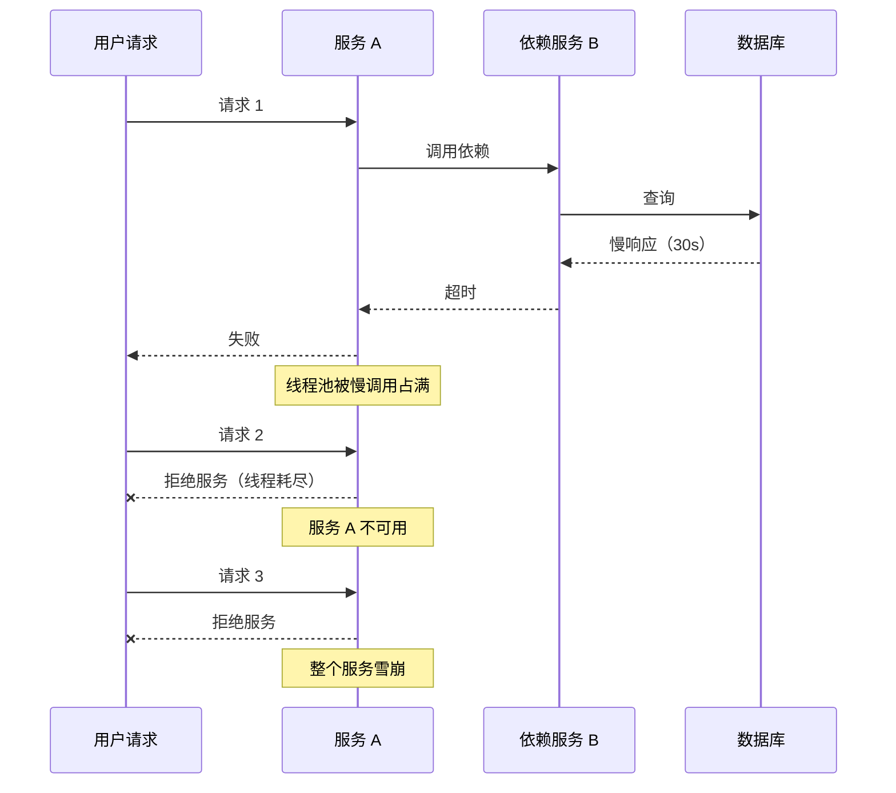
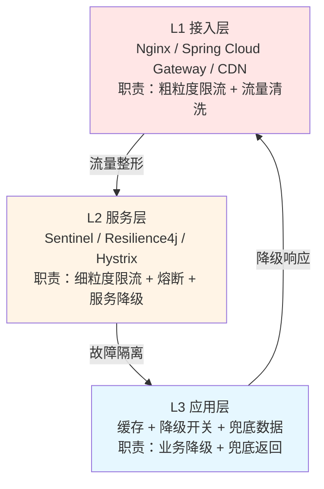
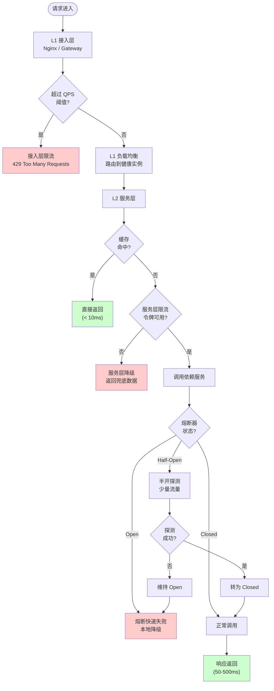

<!--
module:
  parent: system-design
  slug: system-design/high-concurrency-and-high-availability-defenses
  type: article
  category: 主模块子文章
  summary: 高并发与高可用架构 5 大防线综述——缓存、限流、熔断、降级、负载均衡的协同配合，含三层防护模型、决策树、实战落地路线
-->

# 高并发与高可用架构——5 大防线综述

> **一句话定位**：高并发高可用 5 大防线综述——缓存/限流/熔断/降级/负载均衡的协同配合。

## 引言

当我们把一个系统从"能跑"做到"扛得住"时，**运行时的韧性**比代码组织更重要。
一篇兄弟文章 [从面条代码到整洁架构](./architecture-evolution/from-spaghetti-to-clean.md) 已经从**编译期视角**讲过代码组织的演进——本文则从**请求期视角**讲系统如何"扛流量、保稳定"。

业界共识是用**多层防线**协同配合，而不是寄希望于任何单一组件。
一个完整的运行时防护体系，应当包含以下 5 大防线：

| # | 防线 | 职责 | 本文小节 |
|---|------|------|----------|
| 1 | 缓存 | 减少后端压力 | [§ 3.1](#31-缓存) |
| 2 | 限流 | 控制入口流量 | [§ 3.2](#32-限流) |
| 3 | 熔断 | 快速失败避免雪崩 | [§ 3.3](#33-熔断) |
| 4 | 降级 | 放弃非核心功能 | [§ 3.4](#34-降级) |
| 5 | 负载均衡 | 流量合理分发 | [§ 3.5](#35-负载均衡) |

下文先讲为何需要多层防线（[§ 一](#一为什么需要多层防线)），再一图速览（[§ 二](#二5-大防线一图速览)），再深入链接（[§ 三](#三5-大防线深入链接)），随后给出协同决策树（[§ 四](#四5-大防线协同决策树)）与落地路线（[§ 五](#五5-步落地路线实战推荐)），最后列出误区（[§ 六](#六常见误区5-大踩坑)）、决策矩阵（[§ 七](#七决策矩阵按团队规模)）以及与现有架构演进的对照（[§ 八](#八与现有架构演进的关系)）。

---

## 一、为什么需要多层防线？

### 1.1 单点失效的连锁反应（雪崩效应）

高可用领域的头号灾难叫 **"雪崩"**（Cascading Failure）——一个不相关的故障，通过调用链扩散到上下游，最终拖垮整个系统。

经典雪崩链路：



雪崩的根因往往是**单一防线缺失**：

- ❌ 没有**限流**：突发流量打满线程池
- ❌ 没有**熔断**：慢调用持续堆积，重试放大故障
- ❌ 没有**降级**：所有功能一起挂，用户什么都不能用
- ❌ 没有**缓存**：热点读穿透到数据库，把 DB 打挂
- ❌ 没有**负载均衡**：单点故障 + 流量不均

### 1.2 三层防护架构（业界共识）

业界（阿里 Sentinel、Netflix Hystrix、Resilience4j）通用的分层模型：



| 层级 | 位置 | 工具 | 失败影响 |
|------|------|------|---------|
| L1 接入层 | 边界（最外层） | Nginx `limit_req`、Gateway、`Sentinel GatewayFlowRule` | 全站不可用 |
| L2 服务层 | 服务内部（中间层） | Sentinel、Resilience4j、Hystrix | 单服务不可用 |
| L3 应用层 | 业务代码（最内层） | 缓存、开关、兜底数据 | 单接口体验降级 |

**核心思想**：**越靠外层，影响面越大；越靠内层，影响面越小**。所以应当让**外层处理粗粒度、内层处理细粒度**——分工明确才能层层兜底。

---

## 二、5 大防线一图速览

| 防线 | 核心职责 | 触发时机 | 关键指标 | 实现位置 |
|------|---------|---------|---------|---------|
| **缓存** | 减少后端压力 | 读多写少、热点数据 | 命中率 / 一致性 / 击穿率 | L3 应用层 + 独立缓存集群 |
| **限流** | 控制入口流量 | 流量高峰、突发请求 | QPS / 拒绝数 / 排队延迟 | L1 接入层 + L2 服务层 |
| **熔断** | 快速失败避免雪崩 | 依赖故障、慢调用 | 错误率 / 恢复时间 / 半开探测 | L2 服务层 |
| **降级** | 放弃非核心功能 | 系统过载、依赖不可用 | 降级比例 / 核心功能可用性 | L2 服务层 + L3 应用层 |
| **负载均衡** | 流量合理分发 | 持续运行 | 分发均匀度 / 实例健康度 | L1 接入层（外部 LB）+ 服务发现（内部 LB） |

> **速记口诀**：**"先缓存（少打后端）、再限流（控制总量）、后熔断（隔离故障）、伴降级（兜底体验）、全程负载均衡（合理分发）"**。

---

## 三、5 大防线深入链接

### 3.1 缓存

- [缓存设计模式](../../04-high-performance/cache-patterns/README.md)（900 行深度专题）
- **核心问题**：穿透 / 击穿 / 雪崩 / 一致性
- **选型**：Redis vs Caffeine 多级缓存
- **触发时机**：读多写少、热点数据
- **关键指标**：命中率 ≥ 95%（推荐）/ 一致性等级（最终一致 / 强一致）

详细实战请看专题页 [缓存设计模式](../../04-high-performance/cache-patterns/README.md)。

### 3.2 限流

- [限流](../../03-high-availability/rate-limiting/README.md)（172 行 + 秒杀实战）
- **核心问题**：突发流量削峰 + 阈值动态计算
- **选型**：令牌桶（工程最常用）vs 漏桶 vs 滑动窗口
- **触发时机**：流量高峰、突发请求
- **关键指标**：QPS 阈值 / 拒绝数 / 平均排队延迟

详细实战请看专题页 [限流](../../03-high-availability/rate-limiting/README.md) + [秒杀无 Redis 实战](../../03-high-availability/rate-limiting/seckill-without-redis.md)。

### 3.3 熔断

- [熔断](../../03-high-availability/circuit-break/README.md)（743 行——深度专题，含三态状态机/三框架对比/Spring Boot 3 配置/雪崩实战）
- **核心问题**：依赖服务故障如何快速失败避免雪崩
- **选型**：Resilience4j vs Sentinel vs Hystrix（已停维，不推荐）
- **触发时机**：依赖故障、慢调用、错误率超阈值
- **关键指标**：错误率阈值（通常 50%）/ 恢复时间 / 半开探测成功率

详细实战请看专题页 [熔断](../../03-high-availability/circuit-break/README.md)。

### 3.4 降级

- [服务降级](../../03-high-availability/service-degradation/README.md)（175 行）
- **核心问题**：系统过载时如何放弃非核心功能
- **核心原则**：核心功能不可降级（如下单/支付），非核心可降级（推荐/评论）
- **触发时机**：系统过载、依赖不可用、流量超阈值
- **关键指标**：降级比例 / 核心功能可用率 ≥ 99.99%

详细实战请看专题页 [服务降级](../../03-high-availability/service-degradation/README.md)。

### 3.5 负载均衡

- [负载均衡](../../04-high-performance/load-balance/README.md)（222 行）
- **核心问题**：流量如何在多节点间合理分发
- **选型**：L4（四层，性能高）vs L7（七层，功能强）；轮询 / 最少连接 / 一致性哈希
- **触发时机**：持续运行
- **关键指标**：分发均匀度（标准差）/ 实例健康度（健康实例比例）

详细实战请看专题页 [负载均衡](../../04-high-performance/load-balance/README.md)。

---

## 四、5 大防线协同决策树

5 大防线不是孤立存在，而是**按顺序协同**形成请求生命周期：



### 决策树伪代码

```java
// L1 接入层：粗粒度限流（QPS < 1000 放行）
if (gatewayLimiter.tryAcquire()) {
    // L1 负载均衡：路由到健康实例
    Instance instance = loadBalancer.choose(healthyInstances);

    // L2 服务层：先查缓存
    Data data = cache.get(key);
    if (data == null) {
        // L2 服务层：细粒度限流（QPS < 100 放行）
        if (serviceLimiter.tryAcquire()) {
            try {
                // L2 服务层：熔断器包裹
                data = circuitBreaker.execute(() -> {
                    return dependentService.call();
                });
                cache.set(key, data, ttl + randomOffset); // 随机 TTL 防雪崩
            } catch (CircuitBreakerOpenException e) {
                // L3 应用层：降级返回兜底数据
                data = fallbackRepository.getStaleData(key);
            }
        } else {
            // L3 应用层：降级返回
            data = fallbackRepository.getStaleData(key);
        }
    }
    return data;
} else {
    // L1 接入层：限流直接拒绝
    throw new RateLimitException("Too Many Requests");
}
```

---

## 五、5 步落地路线（实战推荐）

### Step 1: 网关层限流

- **工具**：Nginx `limit_req` + Spring Cloud Gateway
- **阈值**：粗粒度，按总 QPS × 1.5 倍设计
- **配置示例**：
  ```nginx
  limit_req_zone $binary_remote_addr zone=api:10m rate=1000r/s;
  limit_req zone=api burst=2000 nodelay;
  ```
- 详细：[Nginx 限流](../../03-high-availability/README.md) + Spring Cloud Gateway

### Step 2: 服务层熔断 + 限流

- **工具**：Sentinel（阿里，开源）+ Resilience4j（轻量）
- **阈值**：细粒度，按接口 P99 延迟 × 2 倍设计
- **策略**：
  - QPS 限流：防止突发流量
  - 熔断：错误率 > 50% 持续 10s 触发
  - 降级：返回兜底数据或默认值

### Step 3: 缓存层（多级缓存）

- **L1 本地缓存**：Caffeine（TTL + LRU + 容量限制）
- **L2 分布式缓存**：Redis Cluster（主从 + 哨兵）
- **关键细节**：
  - **随机 TTL 偏移**：防止雪崩（同一时间大量 key 过期）
  - **缓存预热**：冷启动时主动加载热点
  - **穿透保护**：Bloom Filter 拦截不存在的 key

### Step 4: 降级开关分级

- **核心功能**（下单 / 支付 / 登录）：**永远不可降级**
- **非核心功能**（推荐 / 评论 / 排行榜）：可降级
- **开关管理**：配置中心（Nacos / Apollo）动态调整

### Step 5: 可观测 + 混沌工程

- **监控**：Prometheus + Grafana（QPS / 错误率 / RT / 线程池）
- **告警**：PagerDuty / 钉钉机器人（错误率 > 阈值自动告警）
- **混沌演练**：Chaos Mesh（定期注入故障，验证防护有效性）

---

## 六、常见误区（5 大踩坑）

### ❌ 误区 1：只做限流不做降级

**现象**：流量洪峰时，用户全被拦在门外，返回 429。
**问题**：限流只是"拒绝部分请求"，但**已经进入的请求**依然会压垮服务。
**正解**：**限流 + 降级** 配套使用——限流把多余请求拦在门外，降级把已进入的请求做兜底。

### ❌ 误区 2：缓存没设好 → 热点失效打爆数据库

**现象**：秒杀开始时，缓存 key 集体过期，请求穿透到 DB。
**问题**：**雪崩效应**——DB 被瞬间高并发打挂。
**正解**：
- 随机 TTL 偏移（不同 key 过期时间不同）
- 缓存预热（启动时主动加载）
- 热点数据永不过期（异步刷新）

### ❌ 误区 3：没有熔断 → 单服务故障拖垮整个系统

**现象**：一个慢调用拖慢整个线程池。
**问题**：雪崩链路（参见 [§ 1.1](#11-单点失效的连锁反应雪崩效应)）。
**正解**：**熔断器**（Resilience4j / Sentinel）——错误率超阈值立即"跳闸"，快速失败。

### ❌ 误区 4：同步链路太多 → 响应慢、RT 抖动

**现象**：一个接口 RT 抖动 10 倍以上。
**问题**：同步链路多 → 任何一个慢调用都阻塞整个链路。
**正解**：
- **异步化**：MQ 解耦（Kafka / RocketMQ）
- **并行化**：CompletableFuture 并行调用多个依赖
- **超时控制**：每个调用都设置 timeout（防止慢调用堆积）

### ❌ 误区 5：重试风暴 → 故障期间流量翻倍加重下游负担

**现象**：下游故障时，上游不断重试，流量翻倍。
**问题**：**重试风暴**——不仅没解决问题，反而加重故障。
**正解**：
- **指数退避**（Exponential Backoff）+ **抖动**（Jitter）
- **熔断器配合**：熔断期间禁止重试
- **最大重试次数**：通常 2-3 次

---

## 七、决策矩阵（按团队规模）

| 规模 | 推荐方案 | 不推荐方案 | 理由 |
|------|---------|-----------|------|
| **小团队（<10 人）** | 单机 Caffeine + Redis + Spring Cloud Gateway 限流 | Sentinel 集群（重） | 简单够用，维护成本低 |
| **中团队（10-50）** | Sentinel + Redis Cluster + Resilience4j | Hystrix（已停维） | 阿里生态成熟，社区活跃 |
| **大团队（>50）** | Sentinel 集群 + 多级缓存 + 全链路压测 | 单点防护（无效） | 流量大，需要全链路防护 |
| **超大规模（>1000 实例）** | 自研防护平台 + 全链路灰度 + 混沌工程 | 单一开源组件 | 需要定制化能力 |

> **核心原则**：**防护方案的复杂度应与系统规模匹配**。小团队不要过度设计，大团队不要单点防护。

---

## 八、与现有架构演进的关系

本文与同目录的 [从面条代码到整洁架构](./architecture-evolution/from-spaghetti-to-clean.md) 互补：

| 维度 | [从面条代码到整洁架构](./architecture-evolution/from-spaghetti-to-clean.md) | 本文 |
|------|---------------------------------------------|------|
| **视角** | 代码组织 | 运行时防护 |
| **时机** | 编译期 / 开发期 | 请求期 / 运行期 |
| **手段** | 分层、六边形、洋葱、整洁架构 | 缓存、限流、熔断、降级、负载均衡 |
| **关注点** | 类与模块的可维护性 | 系统的可用性与韧性 |
| **失败影响** | 代码腐烂、bug 难定位 | 雪崩、服务不可用 |

**两者关系**：整洁架构保障**开发期质量**，5 大防线保障**运行期韧性**。两者是**"代码可读性"** 与 **"系统可用性"** 的双重保障，缺一不可。

如果把系统比作一栋大楼：

- 整洁架构 = **建筑结构设计**（钢筋混凝土，决定楼能盖多高）
- 5 大防线 = **消防 / 安防系统**（火灾报警、灭火器、逃生通道，决定楼能否在紧急情况下保命）

---

## 相关章节

### 兄弟文章（同目录）

- [从面条代码到整洁架构](./architecture-evolution/from-spaghetti-to-clean.md) — 代码组织模式演进（分层 → 整洁 → 六边形 → 洋葱）
- [架构认知的演进](./architecture-evolution/README.md) — OOD → DDD → TOGAF

### 父级章节

- [系统设计基础](./README.md) — 本页所属分类
- [基础篇](../README.md) — 本页所属主模块

### 平行章节

- [高可用篇](../../03-high-availability/README.md) — 限流 / 熔断 / 降级 / 重试 / 冗余 / 混沌
- [高性能篇](../../04-high-performance/README.md) — 缓存 / 负载均衡 / CDN / JVM

---

## 📚 参考来源

1. [高并发保护实战：限流、熔断、降级如何配合落地](https://juejin.cn/post/7611966480842375220) — 掘金，5 大防线协同的工程实践
2. [高并发系统设计：限流、熔断、降级实战总结](https://blog.csdn.net/fuleigang/article/details/160685463) — CSDN，限流熔断降级的代码示例
3. [亿级流量洪峰下的防线：限流降级与多级缓存协同架构实战](https://blog.csdn.net/dicky_zhang3/article/details/162348535) — CSDN，缓存与限流协同
4. [Resilience4j Spring Boot 3 Circuit Breaker 配置](https://resilience4j.readme.io/docs/getting-started-3) — Resilience4j 官方文档
5. [Redis Cache Breakdown/Avalanche/Penetration 2025 Best Practices](https://blog.csdn.net/dicky_zhang3/article/details/162348535) — CSDN，缓存三大问题
6. [Sentinel 官方文档 - 流量控制](https://sentinelguard.io/zh-cn/docs/flow-control.html) — 阿里 Sentinel 限流指南
7. [Netflix Hystrix 已停维公告](https://github.com/Netflix/Hystrix) — 熔断器历史与现状

---

← [返回 system-design-basics](../README.md)