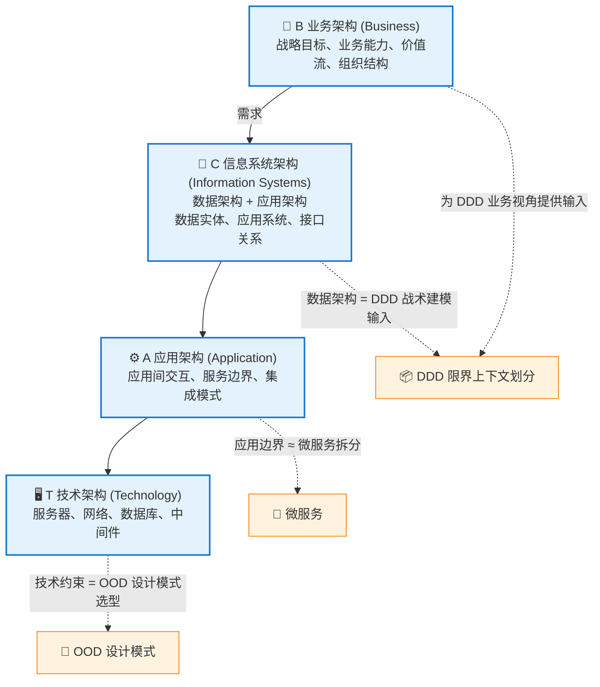
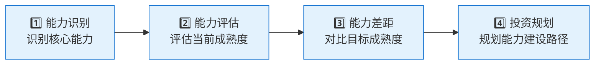
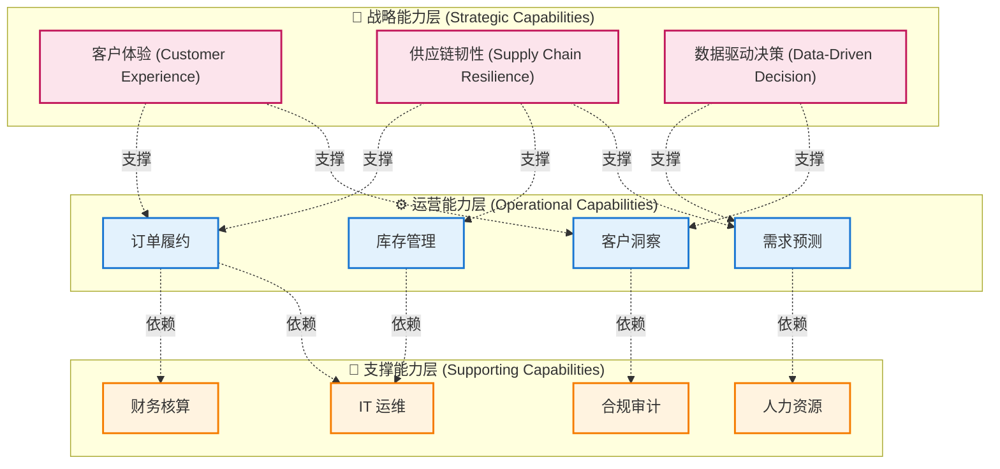
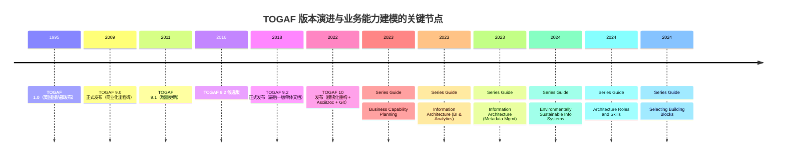
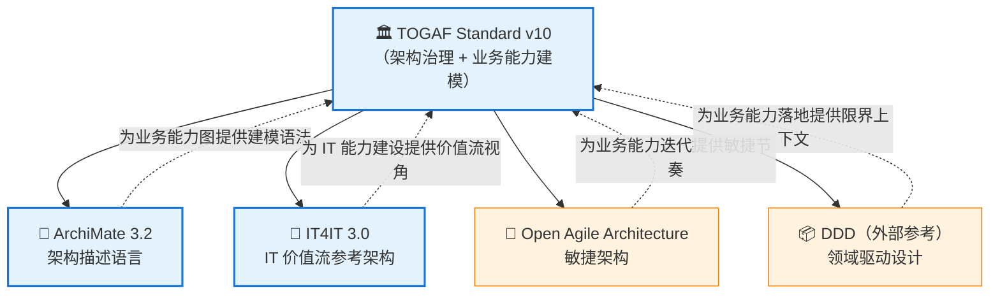

<!--
module:
  parent: system-design
  slug: system-design/togaf/business-capability
  type: article
  category: 主模块子文章
  summary: BCAT 四层架构 + 业务能力地图 + 价值流建模，业务能力→DDD 限界上下文→微服务的翻译层；附 TOGAF 9 vs 10 演进时间线、ArchiMate 建模示例、能力差距分析矩阵。
  depth: ⭐⭐⭐⭐
-->

# 第二章：BCAT + 业务能力 + 价值流

> ⬅️ [返回目录](README.md) | 上一篇：[核心思想 + ADM 详解](adm.md) | 下一篇：[康威定律 + 团队拓扑](conway-and-team-topology.md)

---

## 🎯 一句话定位

**业务能力 + 价值流是 TOGAF 10 的核心建模工具**——它们把"业务战略"翻译成"IT 可以支撑的事"。**BCAT 四层**则把这些事按层次落地。本章是 TOGAF 与 DDD、OOP 之间的**翻译层**。

---

## 一、BCAT：四个架构层次

### 1.1 BCAT 全景



> 📌 **注**：BCAT 的字母排序是历史遗留（来自 TOGAF 9 早期），实际理解顺序应是 **B → C → A → T**（业务先行）。

### 1.2 四层与 DDD/OOD 的关系

| 层次 | 关注点 | 核心产出物 | 与 DDD/OOD 的关系 |
|------|-------|-----------|------------------|
| **B 业务架构** | 战略目标、业务能力、价值流、组织结构 | 业务能力地图、价值流图 | 为 DDD 的领域划分提供**业务视角** |
| **C 信息系统架构** | 数据实体、应用系统、接口关系 | 数据模型、应用目录、接口规范 | **DDD 限界上下文**在此层落地 |
| **A 应用架构** | 应用间交互、服务边界、集成模式 | 服务依赖图、集成架构 | **微服务拆分**、**事件驱动设计** |
| **T 技术架构** | 服务器、网络、数据库、中间件选型 | 技术栈清单、部署拓扑 | **OOD 设计模式**在此层编码实现 |

---

## 二、业务能力：组织的"做什么"

### 2.1 业务能力定义

> **业务能力（Business Capability）**——一个组织**做什么**的能力单元，**与组织结构、流程、人员无关**。  
> 它回答的是"组织为了实现战略目标，需要具备什么能力"，而不是"现在由谁、怎么实现"。

| 特征 | 说明 |
|------|------|
| ✅ **稳定性** | 业务能力比组织结构稳定——能力持续 5-10 年，组织变动 1-2 年 |
| ✅ **完整性** | 业务能力图覆盖组织所有能力，构成完整的"能力地图" |
| ✅ **可衡量** | 能力有"成熟度等级"（L1-L5），可评估、可投资 |
| ✅ **可映射** | 业务能力 → 应用 → 技术，构成完整追溯链 |

### 2.2 业务能力 vs 业务流程 vs 组织结构

| 概念 | 关注点 | 稳定性 | 例子 |
|------|-------|:------:|------|
| **业务能力** | 做什么 | 高（5-10 年） | 订单管理、库存管理 |
| **业务流程** | 怎么做 | 中（2-5 年） | 订单处理流程、库存盘点流程 |
| **组织结构** | 由谁做 | 低（1-2 年） | 订单团队、库存团队 |

> 🎯 **关键洞察**：业务流程和组织结构会变，但业务能力相对稳定。**架构应该围绕稳定的"能力"设计，而不是不稳定的"流程"或"组织"**。

---

## 三、价值流：端到端为客户创造价值

### 3.1 价值流定义

> **价值流（Value Stream）**——从客户视角出发，端到端为客户创造价值的一系列活动的序列。  
> TOGAF 10 将价值流作为独立的 Series Guide 推出，**与业务能力并列**为核心建模工具。

### 3.2 业务能力 vs 价值流

| 维度 | 业务能力（Capability） | 价值流（Value Stream） |
|------|---------------------|---------------------|
| **视角** | 资产视角——组织**有什么** | 流程视角——组织**怎么交付** |
| **关注点** | 稳定的能力单元 | 动态的端到端活动 |
| **时间维度** | 横切（同一时间存在） | 时序（一段时间内完成） |
| **映射关系** | 价值流**穿越**业务能力 | 业务能力**支撑**价值流 |
| **典型用途** | 投资决策、能力差距分析 | 流程优化、瓶颈识别 |

### 3.3 价值流示例（电商下单）


每一步**穿越**多个业务能力（商品管理、订单管理、支付管理、物流管理、客服管理）。

---

## 四、业务能力地图绘制

### 4.1 电商企业业务能力地图

```text
战略层：     ┌─ 商品管理 ─┐  ┌─ 订单履约 ─┐  ┌─ 客户服务 ─┐
            │  商品目录   │  │  订单处理   │  │  售后支持   │
核心能力：   │  价格管理   │  │  库存管理   │  │  投诉处理   │
            │  类目管理   │  │  物流调度   │  │  用户反馈   │
            └─────────────┘  └─────────────┘  └─────────────┘
                                    ↓
支撑层：     ┌─ 财务管理 ─┐  ┌─ 人力资源 ─┐  ┌─ IT 基础 ─┐
            │  预算控制   │  │  人员管理   │  │  运维管理   │
            │  成本核算   │  │  绩效考核   │  │  安全合规   │
            └─────────────┘  └─────────────┘  └─────────────┘
```

### 4.2 能力地图的"三层结构"

| 层级 | 性质 | 数量级 | 例子 |
|------|------|:------:|------|
| **战略层（L1）** | 业务域 | 5-10 | 营销、销售、供应链、财务 |
| **核心能力层（L2）** | 业务能力 | 20-50 | 商品管理、价格管理、订单管理 |
| **子能力层（L3）** | 细粒度能力 | 50-200 | 商品目录维护、商品上下架、商品分类 |

> **实操建议**：L1 + L2 已足够支撑架构决策。L3 可在需要时展开。

### 4.3 能力地图 + 价值流的叠加视图

```text
            业务能力地图（资产视角）
            ┌──────────┐  ┌──────────┐  ┌──────────┐
            │ 商品管理 │  │ 订单管理 │  │ 物流管理 │
            └──────────┘  └──────────┘  └──────────┘
                    ↘           ↓           ↙
价值流（流程视角）       价值流: 下单履约
                    ↗           ↓           ↖
            ┌──────────┐  ┌──────────┐  ┌──────────┐
            │ 支付管理  │  │ 客户管理 │  │ 评价管理 │
            └──────────┘  └──────────┘  └──────────┘
```

**价值流穿越业务能力**——任何环节的能力缺失都会阻塞价值流。

---

## 五、业务能力 → DDD 限界上下文

### 5.1 映射关系

```text
业务能力地图（TOGAF 业务架构层）
    ↓ 每个能力 = 一个限界上下文
限界上下文划分（DDD 战略设计）
    ↓ 每个上下文 = 一组聚合
聚合与实体设计（DDD 战术设计 / OOD）
    ↓ 每个聚合 = 一组协作的类
类与方法设计（OOD + 设计模式）
```

### 5.2 映射示例（电商）

| TOGAF 业务能力 | DDD 限界上下文 | 关键聚合 |
|--------------|---------------|---------|
| 商品管理 | `Product` Context | `Product` 聚合 |
| 订单管理 | `Order` Context | `Order` 聚合（含 `OrderItem`） |
| 支付管理 | `Payment` Context | `Payment` 聚合 |
| 物流管理 | `Logistics` Context | `Shipment` 聚合 |
| 客户管理 | `Customer` Context | `Customer` 聚合 |

> 🎯 **关键洞察**：**业务能力是微服务/限界上下文的"金标准来源"**。  
> 按业务能力拆分 → 自然形成清晰边界 → 团队规模与能力匹配 → 符合康威定律（[第三章](conway-and-team-topology.md)）。

### 5.3 业务能力规划的常见错误

| 错误 | 说明 | 解法 |
|------|------|------|
| ❌ 按组织结构划分 | 跟着组织变，组织变架构就得变 | 按能力划分，能力稳定 |
| ❌ 按技术分层划分 | 出现"数据服务/业务服务"等横向服务 | 按业务纵向切分 |
| ❌ 一个能力 = 一个服务 | 过度拆分，产生纳米服务 | 一个能力可能对应 1-3 个服务 |
| ❌ 能力地图一成不变 | 战略调整后能力地图不更新 | 每年重新审视能力地图 |

---

## 六、TOGAF 10 Series Guide：Business Capability Planning

> **来源**：TOGAF Series Guide: Business Capability Planning（2023 年发布）

### 6.1 业务能力规划的 4 步法



### 6.2 能力成熟度等级（参考 CMMI）

| 等级 | 名称 | 特征 |
|:----:|------|------|
| **L1** | 初始级（Initial） | 能力存在但不可控、依赖个人 |
| **L2** | 可重复级（Repeatable） | 基本流程已建立 |
| **L3** | 已定义级（Defined） | 流程标准化、文档化 |
| **L4** | 量化管理级（Managed） | 数据驱动、可度量 |
| **L5** | 优化级（Optimizing） | 持续改进、自动化 |

### 6.3 能力差距分析矩阵

| 业务能力 | 当前成熟度 | 目标成熟度 | 差距 | 投资优先级 |
|---------|:---------:|:---------:|:----:|:---------:|
| 商品管理 | L3 | L4 | L4-L3 = 1 | 高 |
| 订单管理 | L4 | L5 | L5-L4 = 1 | 中 |
| 物流管理 | L2 | L4 | L4-L2 = 2 | 高 |
| 客服管理 | L2 | L3 | L3-L2 = 1 | 中 |
| 数据治理 | L1 | L3 | L3-L1 = 2 | 极高 |

> **投资优先级 = 战略价值 × 差距**——高价值 + 大差距 = 优先投资。

---

## 七、源码片段：业务能力建模实战

> 🔧 **A1 源码片段**——本章给出业务能力 → 应用系统 → 限界上下文的**真实建模示例**，包括 ArchiMate 3.2 模型伪代码、JSON 能力元数据 schema，以及 Go/Java 风格的能力差距分析代码。

### 7.1 战略能力 → 运营能力 → 支撑能力的层级关系

业务能力地图遵循**三层层级**（Strategic → Operational → Supporting），这是 TOGAF Series Guide Business Capability Planning（2023）的官方推荐结构：



**层级关系的核心规则**：

| 关系 | 方向 | 含义 |
|------|------|------|
| 战略 → 运营 | dashed（虚线） | 战略能力**分解**为运营能力（"客户体验"需要"订单履约"） |
| 运营 → 支撑 | dashed（虚线） | 运营能力**依赖**支撑能力（"订单履约"需要"IT 运维"） |
| 同层能力 | 不连线 | 同层能力之间是**协作关系**，通过价值流串联 |

### 7.2 ArchiMate 3.2 建模示例

ArchiMate 是 The Open Group 的**架构描述语言**（与 TOGAF 同源），用于把业务能力图变成可机读模型。下面用 ArchiMate 3.2 的伪 XML 描述"订单履约"这个能力的建模：

```xml
<!-- ArchiMate 3.2 建模：订单履约能力的完整示例 -->
<archi:model xmlns:archi="http://www.opengroup.org/xsd/archimate/3.2/">

  <!-- 1. 业务能力 (Business Capability) -->
  <archi:element xsi:type="Capability" name="订单履约" id="cap-order-fulfillment">
    <archi:properties>
      <archi:property key="layer" value="Operational"/>
      <archi:property key="maturity.current" value="L3"/>
      <archi:property key="maturity.target" value="L5"/>
      <archi:property key="owner" value="order@company.com"/>
    </archi:properties>
  </archi:element>

  <!-- 2. 上游战略能力（realization 关系） -->
  <archi:realization source="cap-customer-experience" target="cap-order-fulfillment"/>

  <!-- 3. 服务的应用组件 (Application Component) -->
  <archi:element xsi:type="ApplicationComponent" name="订单中心 OMS" id="app-oms">
    <archi:properties>
      <archi:property key="tech-stack" value="Spring Boot 3.x + PostgreSQL"/>
    </archi:properties>
  </archi:element>

  <!-- 4. 应用服务 (Application Service) -->
  <archi:element xsi:type="ApplicationService" name="订单服务" id="svc-order-api"/>

  <!-- 5. 能力 → 应用服务 → 应用组件 的三层映射 -->
  <archi:composition source="cap-order-fulfillment" target="svc-order-api"/>
  <archi:realization source="svc-order-api" target="app-oms"/>

  <!-- 6. 数据对象 (Data Object) -->
  <archi:element xsi:type="DataObject" name="订单 Order" id="data-order">
    <archi:properties>
      <archi:property key="aggregate.root" value="true"/>
      <archi:property key="bounded-context" value="Order"/>
    </archi:properties>
  </archi:element>

  <!-- 7. 应用组件操作数据对象 -->
  <archi:access source="app-oms" target="data-order" kind="write"/>

</archi:model>
```

> 📌 **关键洞察**：在 ArchiMate 中，**业务能力是稳定的"为什么"**，**应用服务是"做什么"**，**应用组件是"用什么做"**。三层解耦让组织重构、业务调整时，能力地图不变，仅调整应用层即可。

### 7.3 JSON 能力元数据 Schema

如果团队没有 ArchiMate 工具链，可以用 JSON 元数据驱动能力地图（工具友好、易于导入 BI / Grafana）：

```json
{
  "capabilities": [
    {
      "id": "cap-order-fulfillment",
      "name": "订单履约",
      "layer": "Operational",
      "parent": "cap-customer-experience",
      "maturity": { "current": 3, "target": 5, "gap": 2 },
      "owner": "order@company.com",
      "realizesApplicationServices": ["svc-order-api", "svc-inventory-api"],
      "supportsValueStreams": ["vs-order-to-cash"],
      "metrics": {
        "leadTimeHours": 24,
        "stockoutRate": 0.03,
        "fulfillmentAccuracy": 0.985
      }
    },
    {
      "id": "cap-inventory-management",
      "name": "库存管理",
      "layer": "Operational",
      "parent": "cap-supply-chain-resilience",
      "maturity": { "current": 2, "target": 4, "gap": 2 },
      "owner": "supply-chain@company.com",
      "realizesApplicationServices": ["svc-wms-api"],
      "supportsValueStreams": ["vs-order-to-cash"],
      "metrics": {
        "inventoryTurnover": 8.5,
        "stockoutRate": 0.07
      }
    }
  ]
}
```

> 🎯 **使用建议**：把这份 JSON 导入 Archi 工具（如 Archi 5）即可一键生成可视化能力地图，导入 BI 工具可生成能力成熟度热力图。

### 7.4 能力差距分析代码示例（Go）

把"能力差距分析矩阵"自动化——读 JSON 元数据，自动计算差距并按投资优先级排序：

```go
// capability_gap.go —— TOGAF 10 能力差距分析
package main

import (
    "encoding/json"
    "fmt"
    "sort"
)

type Capability struct {
    ID       string  `json:"id"`
    Name     string  `json:"name"`
    Layer    string  `json:"layer"`
    Maturity struct {
        Current int `json:"current"`
        Target  int `json:"target"`
        Gap     int `json:"gap"`
    } `json:"maturity"`
    StrategicValue int `json:"strategicValue"` // 1-5，由战略委员会打分
    Owner         string `json:"owner"`
}

// InvestmentPriority 投资优先级 = 战略价值 × 差距
func (c *Capability) InvestmentPriority() int {
    return c.StrategicValue * c.Maturity.Gap
}

func AnalyzeGap(data []byte) {
    var caps []Capability
    json.Unmarshal(data, &caps)

    // 按投资优先级降序排序
    sort.Slice(caps, func(i, j int) bool {
        return caps[i].InvestmentPriority() > caps[j].InvestmentPriority()
    })

    fmt.Printf("%-30s %-8s %-8s %-6s %-8s\n",
        "Capability", "Current", "Target", "Gap", "Priority")
    fmt.Println("---------------------------------------------------------------------")
    for _, c := range caps {
        fmt.Printf("%-30s L%-7d L%-7d %-6d %-8d  (owner: %s)\n",
            c.Name, c.Maturity.Current, c.Maturity.Target,
            c.Maturity.Gap, c.InvestmentPriority(), c.Owner)
    }
}

// 业务洞察：能力投资决策的 4 个原则
// 1. 优先级 = 战略价值 × 差距（不仅是差距）
// 2. L1→L3 的成本远低于 L4→L5（数字化的成本是指数增长）
// 3. 能力地图每年至少复盘一次，与战略对齐
// 4. 能力差距分析要进入投资委员会评审流程
```

### 7.5 能力 → 微服务的映射代码（Java 风格伪代码）

业务能力落地为微服务时，常用的"1 个能力 = 1-3 个服务"模式：

```java
// CapabilityToMicroserviceMapping.java —— 业务能力 → 微服务的映射示例
// 原则：按能力纵向切分，避免横向"数据服务/业务服务"

public class OrderFulfillmentCapability implements BusinessCapability {

    @Override
    public String getName() { return "订单履约"; }

    @Override
    public List<Microservice> mapToMicroservices() {
        return List.of(
            // ❌ 错误做法：按技术分层划分（数据服务、业务服务）
            // new Microservice("OrderDataService"),
            // new Microservice("OrderBusinessService"),

            // ✅ 正确做法：按业务能力纵向切分
            new Microservice("OrderCommandService",   // 写操作
                new Responsibility("下单、改单、取消")),
            new Microservice("OrderQueryService",      // 读操作（CQRS）
                new Responsibility("订单查询、状态追踪")),
            new Microservice("OrderSagaService",       // 跨能力编排
                new Responsibility("订单-支付-物流协同"))
        );
    }
}

// 康威定律校验：每个能力 → 1 个独立团队（Stream-aligned Team）
// 团队规模 = 团队拓扑的 4 种类型之一（详见 [第三章：康威定律](conway-and-team-topology.md)）
```

> 🎯 **关键洞察**：业务能力稳定（5-10 年），但微服务可重构（1-2 年）。**让稳定的"能力"决定边界，让可变的"服务"快速迭代**——这是 TOGAF + DDD 联动给架构师的最大价值。

---

## 八、TOGAF 9 vs TOGAF 10 演进时间线

> 🛠️ **A2 版本演进**——BCAT 字母排序的历史由来、Series Guide 的引入、数字化能力扩展，TOGAF 9 到 10 不是"版本号变化"，是**建模思维的根本转变**。

### 8.1 TOGAF 演进大事记



> 📌 **来源**：The Open Group 官方发布记录（[pubs.opengroup.org/togaf-standard](https://pubs.opengroup.org/togaf-standard/)）

### 8.2 BCAT 字母排序的历史由来

**问题**：BCAT 的字母顺序是 **B → C → A → T**，不符合"业务先行"的逻辑顺序，为什么这么排？

**答案**：这是 **TOGAF 9.0（2009）之前的历史遗留**，源自 Zachman Framework 的分类惯性：

| 时代 | 排序来源 | 含义 |
|------|---------|------|
| **Zachman Framework（1987）** | 数据 → 功能 → 网络 → 人员 → 时间 → 动机 | 偏 IT 实现视角，**C 在 A 之前** |
| **TOGAF 早期版本** | 直接借用了 Zachman 的"先数据后应用"思路 | "Data（信息系统）→ Application（应用）" |
| **TOGAF 9.2（2018）** | 仍保留 BCAT 字母序，但强调 **B→C→A→T** 理解顺序 | 字母是历史，理解要反向 |
| **TOGAF 10（2022）** | Series Guide 引入 **Business Capability Planning**，业务先行成为**显式方法论** | 业务能力图作为一切架构活动的起点 |

> 🎯 **历史教训**：很多团队照搬 "B→C→A→T" 字母顺序建模，结果先做技术架构再补业务，**架构成了"先造后想"的产物**。TOGAF 10 用 Series Guide 把业务能力提到与 ADM 同等地位，正是为了修正这个偏差。

### 8.3 Series Guide 引入时间线

TOGAF 10 的最大创新是**模块化**——核心内容（Fundamental Content）稳定不变，扩展内容（Series Guide）持续增加：

| Series Guide | 发布时间 | 解决的问题 |
|-------------|:-------:|----------|
| **Business Capability Planning** | 2023-12 | 业务能力识别的标准化 4 步法（识别→评估→差距→投资） |
| **Value Stream** | 2023 | 价值流建模与业务能力的"穿越-支撑"关系 |
| **Information Architecture: BI & Analytics** | 2023 | 把 BI/分析纳入架构治理 |
| **Information Architecture: Metadata Management** | 2023 | 元数据治理标准化 |
| **Environmentally Sustainable Information Systems** | 2024 | 可持续 IT（绿色数据中心、碳足迹） |
| **Architecture Roles and Skills** | 2024 | 架构师能力模型与岗位定义 |
| **Selecting Building Blocks** | 2024 | 构建块选型方法论 |

> 📌 **关键洞察**：TOGAF 10 = 核心方法论（稳定）+ Series Guide（持续扩展）。**这与 DDD 的"核心域 + 支撑域"思想异曲同工**——核心不变，外延可扩展。

### 8.4 TOGAF 9 vs TOGAF 10 关键差异对比

| 维度 | TOGAF 9.x（2009-2018） | **TOGAF 10（2022）** | 演进意义 |
|------|---------------------|---------------------|---------|
| **发布** | 2009（9.0）/ 2018（9.2） | 2022-04 | 9 → 10 跨越 13 年，是方法论的**重大重构** |
| **结构** | 单体 PDF（700+ 页） | **模块化**：Fundamental Content + Series Guides | 从"一本书"到"生态"，扩展性指数级提升 |
| **业务能力定位** | 业务能力是 ADM 的一个 Phase E 产物 | **独立 Series Guide + 贯穿 ADM** | 业务能力从"可选项"升为"核心建模工具" |
| **价值流** | 几乎不涉及 | **独立 Series Guide** | 与业务能力并列的核心建模工具 |
| **BCAT 字母序** | 严格 B→C→A→T 字母顺序 | 字母顺序保留但强调**业务先行** | 显式纠正"先技术后业务"的反模式 |
| **文档源** | Word + DocBook（编译慢、协作差） | **AsciiDoc + Git**（版本可控、社区协作） | 适配现代研发协作模式 |
| **敏捷支持** | 偏瀑布，敏捷是"补丁" | **内置敏捷/数字化转型支持** + Open Agile Architecture Series | 拥抱 DevOps / Agile 主流 |
| **数字化能力** | 几乎不涉及 | **新增数字开放标准组合**（IT4IT、ArchiMate 3.2、Open Agile Architecture） | 从"传统 EA"到"数字化 EA" |
| **认证** | TOGAF 9 Certified | **TOGAF Enterprise Architecture Foundation / Practitioner** | 认证分层，适配不同角色 |
| **总认证数** | 150,000+（171 个国家） | 持续增长（2025 已超 16,000+ 10.x 认证） | 用户群扩张 |

### 8.5 数字化能力扩展：TOGAF 10 的"标准组合"

TOGAF 10 把 The Open Group 的**数字开放标准组合**纳入整体方法论：



| 标准 | 关注点 | 与 TOGAF 的关系 |
|------|--------|---------------|
| **ArchiMate 3.2** | 架构图可视化、模型交换 | 业务能力图的"标准语法"（详见 §7.2 建模示例） |
| **IT4IT 3.0** | IT 部门自身的价值流（Request to Fulfill 等 4 流） | 业务能力图 + IT 能力图 = 完整能力地图（参考 [IT4IT 功能组件](../it4it/functional-components.md)） |
| **Open Agile Architecture** | 敏捷环境下的架构实践 | 业务能力的**迭代节奏**与 Sprint 对齐 |
| **DDD（外部参考）** | 领域驱动设计（Eric Evans 2003） | 业务能力 → 限界上下文 → 微服务的翻译（详见 [DDD](../ddd/README.md)） |

> 🎯 **关键洞察**：TOGAF 10 不再是孤立的"EA 框架"，而是 **Open Group 标准生态的"治理入口"**。业务能力图与 ArchiMate 建模、IT4IT 价值流、DDD 限界上下文形成完整闭环。

---

## 九、章节思考

1. **你的业务能力图能画出来吗**：先尝试列出 L1（5-10 个业务域）。如果列不出，组织的战略对齐有问题。
2. **能力 vs 组织**：你的能力图是否被组织结构"污染"了？例如出现"产品部-研发部"这种"非能力"。
3. **能力差距分析**：你对每个能力的成熟度有数吗？还是只能凭感觉说"这块不行"？
4. **价值流 vs 流程图**：你的流程图是从客户价值出发，还是从部门职责出发？
5. **TOGAF 9 → 10 的升级**：你的组织是否还在用"先技术后业务"的旧思路？业务能力图是否进入 ADM 的 Phase A（架构愿景）？

---

## 相关章节

- ⬅️ [返回目录](README.md)
- ⬅️ [上一篇：核心思想 + ADM 详解](adm.md)
- ➡️ [下一篇：康威定律 + 团队拓扑](conway-and-team-topology.md)
- [领域驱动设计 DDD](../ddd/README.md) — 业务能力 → 限界上下文的落地
- [微服务架构](../microservices/README.md) — 能力拆分的服务化映射
- [IT4IT 功能组件](../it4it/functional-components.md) — IT 能力的 9 大组件建模（与业务能力并列）
- [ArchiMate 架构描述](../archimate/README.md) — 业务能力图的标准建模语言（见 §7.2 实战示例）
- [架构认知的演进](../architecture-evolution/README.md) — OOD → DDD → TOGAF 的认知升级之路
- [面向对象设计 OOD](../ood/README.md) — 业务能力最终落到类与方法的设计模式

---


- [architecture-governance](architecture-governance.md)
← [返回: togaf](../README.md) | [返回: system-design-basics](../README.md) | [返回: 04.system-design](../../README.md)
