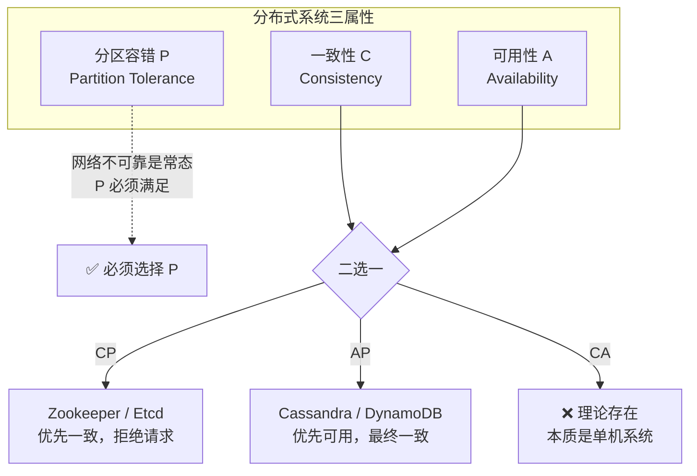

<!--
module:
  parent: system-design
  slug: system-design/cap
  type: article
  category: 主模块子文章
  summary: CAP 本应该很简单，CAP定理是分布式系统设计中的一个核心理论，由计算机科学家埃里克·布鲁尔（Eric Brewer）在2000年提出，后由麻省理工学院的赛斯...
-->

# CAP

> 一句话定位：**CAP 定理 = 分布式系统一致性、可用性、分区容错三者不可兼得**——P 必须选，C 和 A 二选一，决定了系统的架构基因。

---

CAP定理是分布式系统设计中的一个核心理论，由计算机科学家埃里克·布鲁尔（Eric Brewer）在2000年提出，后由麻省理工学院的赛斯·吉尔伯特（Seth Gilbert）和南希·林奇（Nancy Lynch）在2002年给出严格证明。它揭示了分布式系统在**一致性（Consistency）**、**可用性（Availability）**和**分区容错性（Partition Tolerance）**三者之间的根本性矛盾，指出任何分布式系统最多只能同时满足其中两个目标。

## CAP定理的三个核心属性
1. **一致性（Consistency）**
    - 定义：所有节点在同一时间看到相同的数据，即数据更新后，所有后续访问都能返回最新值。
    - 示例：在银行转账场景中，若A向B转账100元，系统需确保所有节点同时看到A余额减少和B余额增加的结果，避免出现中间状态。

2. **可用性（Availability）**
    - 定义：系统在合理时间内对请求作出响应，即使部分节点故障，仍能保证服务可用。
    - 示例：电商网站在部分服务器宕机时，仍能处理用户下单请求，不中断服务。

3. **分区容错性（Partition Tolerance）**
    - 定义：系统在网络分区（节点间通信中断）时，仍能继续运行并处理请求。
    - 示例：跨地域的云服务在某个数据中心网络故障时，其他数据中心仍能独立提供服务。

## CAP定理的核心结论



在分布式系统中，**分区容错性（P）是必须满足的**（因为网络不可靠是常态），因此系统只能在**一致性（C）和可用性（A）**之间二选一：
- **CP系统**：优先保证一致性，牺牲可用性。
    - 示例：Zookeeper、Etcd（分布式锁服务）。
    - 行为：在网络分区时，系统会拒绝请求，确保数据一致性，直到分区恢复。

- **AP系统**：优先保证可用性，牺牲强一致性。
    - 示例：Cassandra、DynamoDB（NoSQL数据库）。
    - 行为：在网络分区时，系统仍接受请求，但可能返回旧数据或临时不一致结果，后续通过异步复制修复。

- **CA系统**：理论上存在，但实际无意义。
    - 原因：若系统无需分区容错（P），则本质是单机系统，无需讨论分布式设计。

## CAP定理的延伸与澄清
1. **CAP是权衡而非绝对**：
    - 定理指出“三选二”，但实际系统中常通过妥协实现部分特性。例如：
        - **最终一致性（Eventual Consistency）**：AP系统通过异步复制，在一段时间后达到一致（如DNS、Cassandra）。
        - **BASE模型**（Basically Available, Soft state, Eventually consistent）：放宽一致性要求，以换取高可用性。

2. **网络分区是假设条件**：
    - CAP定理的前提是存在网络分区。若网络稳定（无分区），系统可同时满足C、A、P（如单机数据库）。

3. **一致性模型的多样性**：
    - 强一致性（如线性一致性）与弱一致性（如会话一致性、因果一致性）是不同层级的需求，AP系统可能选择更弱的一致性模型。

## 实际应用中的选择
- **金融交易系统**：通常选择CP（如银行核心系统），确保数据绝对准确。
- **社交媒体、电商**：倾向于AP（如Twitter、淘宝），允许短暂不一致以提升用户体验。
- **中间方案**：通过分片（Sharding）、读写分离、缓存策略等，在C和A之间动态平衡。

## 总结
CAP定理为分布式系统设计提供了理论框架，帮助开发者明确优先级。实际系统中，需根据业务场景（如对数据一致性的敏感度、用户对延迟的容忍度）在C和A之间做出合理取舍，并通过技术手段（如复制、缓存、冲突解决）优化系统表现。

## 相关章节

- [BASE 模型](../base/README.md) — CAP 之外的另一条路径：放宽一致性换取可用性
- [共识算法](../../consensus-algorithms/README.md) — 在 CP 系统中如何达成一致

---

## 源码级深度：CP 与 AP 系统的实现分歧

### 1. ZooKeeper（CP）：ZAB 协议核心——一致性优先

```java
// org.apache.zookeeper.server.FinalRequestProcessor
// ZooKeeper 处理写请求的核心路径——必须经 Leader 广播 + Follower ACK

// 写请求处理流程（简化）：
// 1. Follower 收到写请求 → 转发给 Leader
// 2. Leader 将写操作封装为 Proposal，广播给所有 Follower
// 3. Follower 写入本地事务日志（WAL），回复 ACK
// 4. Leader 收到 **多数派（Quorum）** ACK 后，提交事务
//    → 只有这时，写操作才对客户端可见

// 关键源码逻辑：Leader.lead() 中的提案处理
// org.apache.zookeeper.server.Leader
public void lead() throws IOException, InterruptedException {
    // ...
    while (true) {
        // 等待 Follower ACK
        QuorumPacket qp = new QuorumPacket();
        followerInfo.getQueue().take();  // 阻塞等待

        // 统计 ACK 数
        if (ackedCount >= (self.getVotingView().size() / 2 + 1)) {
            // ✅ 多数派确认 → 提交事务，保证 C（一致性）
            zk.commitProcessor.commit(p.request);
        }
        // ❌ 若分区导致多数派不可达 → 请求挂起（牺牲 A，保 C）
    }
}
```

> **WHY**：ZooKeeper 的 Quorum 机制（N/2+1 ACK）是 CP 选择的典型实现——网络分区时，少数派分区因凑不够 Quorum 而**拒绝服务**，只有多数派分区可继续工作。这就是"牺牲可用性保一致性"的代码级体现。

### 2. Cassandra（AP）：Gossip + 最终一致性——可用性优先

```java
// org.apache.cassandra.service.StorageProxy
// Cassandra 写请求：写入本地 + 异步复制给其他节点

public static void mutate(Mutation mutation, ConsistencyLevel consistencyLevel) {
    // 1. 写入本地 CommitLog（WAL）+ MemTable（内存）
    // 2. 异步发送给所有 Replica（Gossip 协议发现节点）

    // 关键：一致性级别可调
    switch (consistencyLevel) {
        case ONE:        // 只要 1 个节点 ACK → 最快，最弱一致（默认 AP 选择）
        case QUORUM:     // 多数派 ACK → 可临时切换到强一致
        case ALL:        // 所有 Replica ACK → 最强一致，最慢
        case LOCAL_ONE:  // 本数据中心 1 个节点 → 跨 DC 场景优化
    }
}

// 读请求：Read Repair 保证最终一致
public void readRepairIfNeeded(DecoratedKey key, ...) {
    // 从多个 Replica 读取，对比 Digest（摘要）
    // 若不一致 → 触发后台 Read Repair，异步修复数据差异
    // 这就是"最终一致性"的实现：允许临时不一致，后台修复
}
```

> **WHY**：Cassandra 的 `ConsistencyLevel.ONE` 是 AP 选择的代码级体现——写 1 个节点就返回成功，其他节点异步复制。网络分区时，每个分区独立接受写入（保 A），事后通过 **Hinted Handoff**（暂存 + 补发）和 **Read Repair**（读时修复）达到最终一致。

### 3. 分区场景下的行为对比

```text
网络分区发生：节点 A（多数派）| 节点 B（少数派）

ZooKeeper (CP)：
  A 侧（多数派）：✅ 正常读写
  B 侧（少数派）：❌ 拒绝所有写操作，读可能返回旧数据
  → 客户端连 B 会收到 ConnectionLossException

Cassandra (AP)：
  A 侧：✅ 正常读写
  B 侧：✅ 正常读写（接受所有请求）
  → 分区恢复后，通过 Hinted Handoff + Anti-Entropy 修复不一致
  → 期间客户端可能读到旧数据（最终一致性代价）
```

---

## 版本演进：CAP 理解的 20 年进化

| 阶段 | 时间 | 关键事件 | 认知变化 |
|:-----|:-----|:---------|:---------|
| **猜想提出** | 2000 | Eric Brewer PODC Keynote | "三选二"的直觉表述，引发广泛讨论 |
| **严格证明** | 2002 | Gilbert & Lynch 论文 | 在异步网络模型下严格证明 CAP 不可能三角 |
| **12 年回顾** | 2012 | Brewer "CAP Twelve Years Later" | 澄清：C/A 不是二值开关，是连续谱；分区很少发生时可同时优化 |
| **PACELC 扩展** | 2010 | Daniel Abadi | 补充 "if Partition → C vs A; Else → Latency vs Consistency"，更贴近工程实际 |
| **NewSQL 时代** | 2012+ | Spanner / CockroachDB | "Calvin 定理" + TrueTime → 全球分布式强一致（用物理时钟绕开 CAP 限制） |
| **云原生时代** | 2020+ | DynamoDB / TiDB / CockroachDB v2 | "按需调一致性"——同一系统不同表/行可配不同 C 级别 |

> **PACELC** 比 CAP 更实用：即使没有网络分区（Else），系统仍要在 **延迟（L）** 和 **一致性（C）** 之间权衡。例如 Cassandra 默认 `LOCAL_ONE`（低延迟）vs `QUORUM`（强一致）。

---

## ❌/✅ 反例对比

### 反例 1：忽略 CAP 选型导致的脑裂

```text
❌ 反例：双主架构 + 无仲裁（假 CP）

  ┌──────────┐         ┌──────────┐
  │ Node A   │ ←────→  │ Node B   │
  │ (Master) │  复制    │ (Master) │
  └──────────┘         └──────────┘
       ↑                    ↑
       │ 写入               │ 写入
       ↓                    ↓
  Client 1              Client 2

  网络分区后：
  - Client 1 写 A：x = 1
  - Client 2 写 B：x = 2
  - 分区恢复：x = ? → 数据冲突，无法自动合并

  后果：金融系统出现双花（double spending），库存系统超卖
```

```text
✅ 正例：CP 系统用 Quorum 机制避免脑裂

  ┌──────────┐    ┌──────────┐    ┌──────────┐
  │  Leader  │ →  │Follower B│    │Follower C│
  │   (A)    │ →  │          │    │          │
  └──────────┘    └──────────┘    └──────────┘

  写入条件：Leader 收到 ≥ 2/3 节点 ACK 才提交
  网络分区：少数派侧无 Leader（或 Leader 无法凑 Quorum）
           → 自动拒绝写入，不会脑裂
  代表系统：ZooKeeper (ZAB)、Etcd (Raft)、Consul (Raft)
```

### 反例 2：AP 系统不处理冲突

```java
// ❌ 反例：AP 系统（如 Cassandra）不处理写冲突
// 两个客户端同时写同一个 Key，分区期间各自成功
// 分区恢复后：
//   Client A 写了 price = 100
//   Client B 写了 price = 200
// Cassandra 用 Last-Write-Wins（LWW）→ 随机保留一个，另一个静默丢失
// 电商场景：价格被"随机"改错，无人察觉
```

```java
// ✅ 正例：AP 系统用 CRDT 或应用层冲突解决
// 方案 1：CRDT（Conflict-free Replicated Data Type）
//   适合计数器、集合等可自动合并的数据结构
//   例：Redis CRDT（Roshi）、Riak DT
//
// 方案 2：应用层向量时钟 + 人工合并
//   DynamoDB 用 Vector Clock 标记因果序
//   冲突时返回多个版本，由应用层决定取舍
//
// 方案 3：业务层幂等设计
//   写操作携带版本号（Optimistic Lock）
//   UPDATE products SET price=200, version=version+1
//   WHERE id=1 AND version=old_version
//   → 冲突时 version 不匹配，UPDATE 返回 0 行受影响，应用重试
```

### 反例 3："我们系统同时满足 C 和 A"

```text
❌ 反例：架构评审时声称"我们的分布式数据库既强一致又高可用"
  → 追问：网络分区时怎么办？
  → 答：我们用了专线，不会分区
  → 真相：不是"不会分区"，是"分区时你没观察到"
         交换机故障、光纤被挖断、AZ 级故障 → 分区必然发生
         没有 P 的系统本质是单机或局域网系统，不是分布式系统
```

```text
✅ 正例：明确 CAP 选型 + 分区时的降级策略
  "我们选 CP（Etcd 做服务注册），分区时少数派节点返回 503"
  "我们选 AP（Cassandra 做用户画像），分区时允许读到旧数据，
   通过 SLA 承诺最终一致性延迟 < 30s"
  → 关键：承认 CAP 权衡，明确分区时的行为，制定降级预案
```

---

## 参考链接

- [Brewer's Conjecture and the Feasibility of Consistent, Available, Partition-Tolerant Web Services（Brewer 2000）](https://www.cs.berkeley.edu/~brewer/cs262b-2004/PODC-keynote.pdf)
- [Brewer's PODC 2000 Keynote（视频与讲稿）](https://www.cs.berkeley.edu/~brewer/cs262b-2004/PODC-keynote.pdf)
- [Gilbert & Lynch: Brewer's Conjecture and the Feasibility of Consistent, Available, Partition-Tolerant Web Services（2002 严格证明）](https://www.comp.nus.edu.sg/~gilbert/pubs/BrewersConjecture-SigAct.pdf)
- [CAP 十二年回顾："CAP 定理十二年"——Brewer 2012](https://www.infoq.com/articles/cap-twelve-years-later-how-the-rules-have-changed/)

← [返回 CAP & BASE](../README.md)
