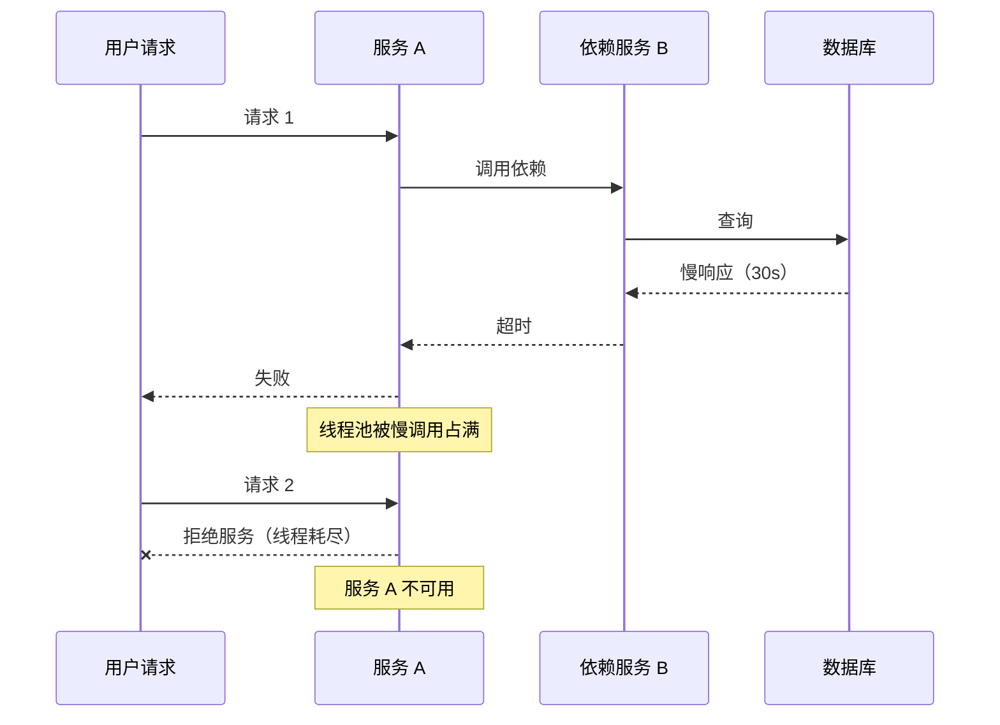
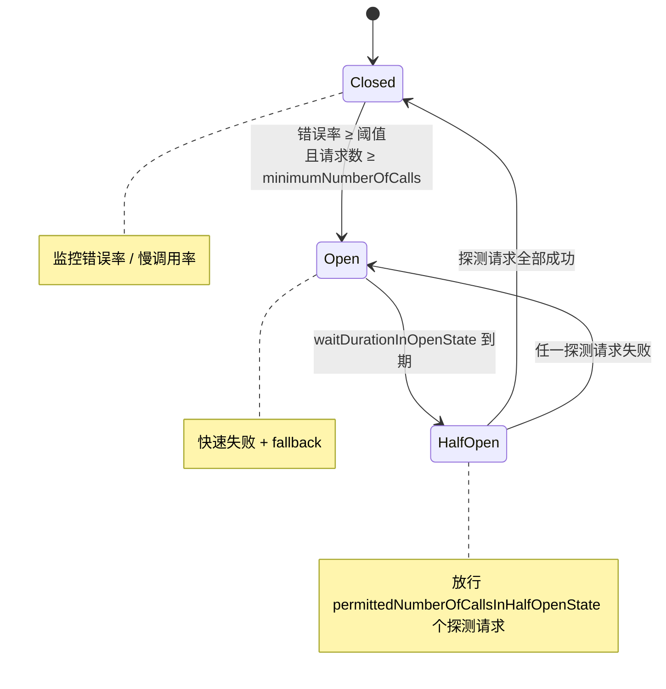
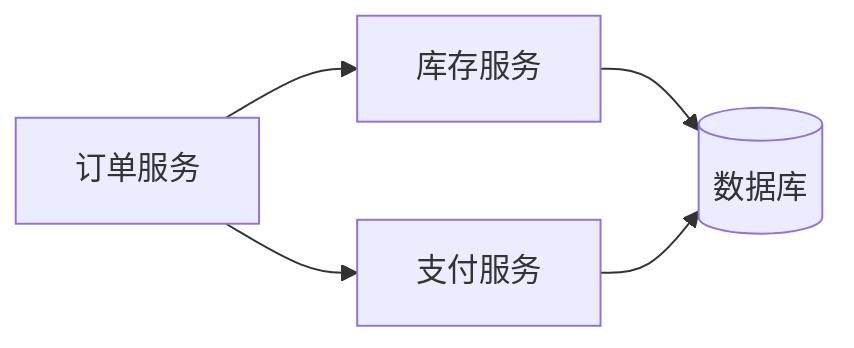

<!--
module:
  parent: 03-high-availability
  slug: high-availability/circuit-break
  type: article
  category: 主模块子文章
  summary: 熔断（Circuit Breaker）深度专题——三态状态机详解、Hystrix/Resilience4j/Sentinel 对比、Resilience4j Spring Boot 3 生产配置、雪崩防护与微服务实战
  depth: ⭐⭐⭐⭐⭐
-->

# 熔断（Circuit Breaker）

> **一句话定位**：熔断（Circuit Breaker）是高可用的雪崩防线——详解三态状态机与 Resilience4j/Sentinel 实战配置。

## 引言

在分布式微服务架构中，**雪崩（Avalanche / Cascading Failure）** 是头号灾难——一个非核心依赖的慢响应或故障，会沿着调用链反向传染，最终拖垮整个系统。**熔断（Circuit Breaker）** 就是这道关键防线：当依赖服务不可用时，不是傻傻地等超时或重试放大故障，而是像电路保险丝一样**主动断开调用链**，快速失败并走降级路径，把故障隔离在边界内。

熔断的灵感来自电路保险丝：当电流过载时保险丝熔断以切断电路，保护后端设备；在分布式系统中，当某个服务因故障或过载导致响应时间过长或频繁失败时，熔断器会主动"切断"对该服务的调用链路，避免请求堆积和资源耗尽，同时提供快速失败响应（如返回预设降级数据）。

熔断与**限流**、**降级**经常被并称为"高可用三剑客"，但三者的关注点和触发时机截然不同：

- **限流**（Rate Limiting）—— 在**入口处**按阈值拒绝超额流量，从源头控制并发
- **熔断**（Circuit Breaker）—— 在**依赖调用处**检测到故障后快速失败，避免雪崩
- **降级**（Service Degradation）—— 系统过载时**主动放弃非核心功能**，保证核心链路可用

熔断是这三种机制中**最具自动化**能力的一环：无需人工干预，熔断器即可通过状态机自动完成"检测 → 断开 → 探测 → 恢复"全流程。本文将从原理、状态机、策略选型、实战配置、监控告警五大维度深入展开。

## 目录

- [一、为什么需要熔断？](#一为什么需要熔断)
- [二、熔断器三态状态机详解](#二熔断器三态状态机详解)
- [三、熔断触发策略](#三熔断触发策略)
- [四、主流熔断框架对比](#四主流熔断框架对比)
- [五、Resilience4j Spring Boot 3 生产配置](#五resilience4j-spring-boot-3-生产配置)
- [六、熔断粒度设计](#六熔断粒度设计)
- [七、熔断与重试的配合](#七熔断与重试的配合)
- [八、熔断的可观测性](#八熔断的可观测性)
- [九、实战：微服务雪崩防护](#九实战微服务雪崩防护)
- [十、常见误区](#十常见误区)
- [十一、面试高频题](#十一面试高频题30s90s话术)
- [相关章节](#相关章节)
- [参考来源](#-参考来源)

---

## 一、为什么需要熔断？

### 1.1 雪崩效应的连锁反应

雪崩的经典链路：用户 → 服务 A → 依赖服务 B → 数据库。当数据库响应变慢（30s）时，服务 B 的线程池被慢调用占满；新请求进入后排队等待，最终服务 B 也耗尽线程不可用；此时服务 A 调用服务 B 也全部超时/失败，线程被同步阻塞；最终服务 A 自身也被拖垮，整个链路雪崩。



熔断正是切断这条链路的**反向开关**：一旦检测到依赖服务 B 的错误率/慢调用率超过阈值，立即"熔断"——所有对 B 的请求直接返回降级结果（缓存/默认值），不再真实打到 B，给 B 恢复的时间窗口。

### 1.2 熔断 vs 限流 vs 降级

| 维度 | 熔断 | 限流 | 降级 |
|------|------|------|------|
| 触发时机 | 依赖故障（事后被动） | 流量超阈值（事前主动） | 系统过载 / 故障（事中混合） |
| 核心动作 | 快速失败 + 自动恢复 | 拒绝超额请求 | 放弃非核心功能 |
| 状态持续 | 自动 Closed → Open → Half-Open | 持续生效（滑动窗口） | 手动开关 + 自动 |
| 保护对象 | 调用方（防止被下游拖垮） | 服务方（防止被打满） | 用户（保证核心体验） |
| 决策依据 | 错误率 / 慢调用率 | QPS / 并发数 | 系统负载 / 业务规则 |
| 典型实现 | Resilience4j / Sentinel / Hystrix | Sentinel / Guava RateLimiter / Nginx | Sentinel / 开关平台 / 配置中心 |

**协同关系**：限流在入口挡掉过多流量 → 熔断在依赖调用处兜底故障 → 降级在系统过载时保核心功能。三者协同形成完整的高可用防护体系。

### 1.3 熔断的代价与价值

启用熔断会带来两类代价：
1. **首字节延迟增加**：每次调用需先查熔断器状态（典型 0.1-1ms）
2. **fallback 路径开发成本**：每个熔断点都需提供降级逻辑

但相对雪崩带来的**整个服务不可用**而言，这些代价几乎可以忽略。生产实践的共识是：**任何跨服务调用都应启用熔断**，即使是非常稳定的内部依赖。

---

## 二、熔断器三态状态机详解

### 2.1 状态转换图

熔断器的核心是**三态状态机**（有些实现扩展为五态，但本质仍是这三个核心状态）：



### 2.2 Closed 态（正常）

**行为**：所有请求正常通过，熔断器在后台**持续监控调用结果**。

**关键监控指标**：
- **错误率（failure rate）**：失败请求数 / 总请求数（百分比）
- **慢调用率（slow call rate）**：慢调用数 / 总请求数（百分比）
- **最小调用数阈值（minimum-number-of-calls）**：避免低流量场景误触发

**配置要点**：
- 生产建议设置 `minimum-number-of-calls: 20` 以上，防止 5 次请求里失败 3 次（60%）就误熔断
- 错误率统计窗口常用 60 秒（`sliding-window-size: 60`）

### 2.3 Open 态（熔断）

**行为**：所有请求**直接失败**，不再真正打到依赖服务，立即走 fallback 路径。

**持续时间**：`wait-duration-in-open-state`（Resilience4j 默认 60s，可配 5s-10min）

**触发条件**：
- Closed 态下错误率 ≥ `failure-rate-threshold`（默认 50%）
- 且总请求数 ≥ `minimum-number-of-calls`
- （或慢调用率 ≥ `slow-call-rate-threshold`）

**熔断态期间的价值**：
1. **保护下游**：让故障服务有时间恢复（不被打爆）
2. **保护调用方**：避免线程池被慢调用耗尽
3. **快速失败**：用户立即看到降级结果，体验优于长时间等待

### 2.4 Half-Open 态（半开探测）

**行为**：从 Open 态到期后进入，允许**少量请求**真实打到依赖服务，验证是否恢复。

**关键参数**：
- `permitted-number-of-calls-in-half-open-state`：探测请求数（Resilience4j 默认 10，Sentinel 默认 1）
- `automatic-transition-from-open-to-half-open-enabled`：是否自动从 Open 转 Half-Open（默认 true）

**状态切换规则**：
- **全部探测请求成功** → 切换回 Closed 态，重置计数器
- **任一探测请求失败** → 重新切回 Open 态，再次启动冷却计时器

**实战经验**：探测请求数不能太小（1-2 个无法准确反映恢复情况），也不能太大（10+ 个会让仍在抖动的服务再次承压）。生产推荐 **5-10 个**。

---

## 三、熔断触发策略

### 3.1 错误率阈值（failure-rate-threshold）

**含义**：在统计窗口内，失败请求数 / 总请求数 ≥ 阈值时触发熔断。

**默认值**：Resilience4j 默认 50%（生产需根据 SLA 调整）。

**配置建议**：
- **核心依赖（如支付）**：30%（更敏感）
- **非核心依赖（如评论）**：70%（更宽容）
- **内部稳定 RPC**：50%（折中）

### 3.2 慢调用率（slow-call-rate-threshold）

**含义**：响应时间超过 `slow-call-duration-threshold` 的请求视为慢调用，慢调用数 / 总请求数 ≥ 阈值时触发熔断。

**默认值**：Resilience4j 默认 100%（即所有调用都超时才算），生产**强烈建议调整**。

**生产配置**：
- `slow-call-duration-threshold`：根据 P95/P99 压测结果定（推荐 P99 的 1.5 倍）
- `slow-call-rate-threshold`：推荐 50%（一半慢就触发）

**为什么需要慢调用熔断**：错误率熔断只能识别"明确失败"的请求，但**慢调用**（如数据库慢查询）会占满线程池却不返回错误，是更隐蔽的杀手。

### 3.3 滑动窗口类型

熔断器需要在"窗口"内统计错误率，Resilience4j 支持两种窗口：

**COUNT_BASED（计数窗口）**
- 固定请求数窗口（如最近 100 次请求）
- **适用场景**：高 QPS 服务（QPS > 100）
- **优点**：统计精确
- **缺点**：低 QPS 时窗口可能跨很长时长

**TIME_BASED（时间窗口）**
- 固定时间窗口（如最近 60 秒）
- **适用场景**：所有场景通用，**生产推荐**
- **优点**：响应及时，统计粒度与时间挂钩
- **缺点**：高 QPS 时窗口内请求数可能很大（需配 minimumNumberOfCalls）

**配置示例**：
```yaml
sliding-window-type: TIME_BASED  # 生产推荐
sliding-window-size: 60          # 60 秒窗口
minimum-number-of-calls: 20      # 至少 20 个请求才计算错误率
```

### 3.4 异常分类策略

熔断器需要区分**哪些异常计入熔断**，哪些不计入：

- **record-exceptions**：计入熔断统计的异常（如 IOException、TimeoutException）
- **ignore-exceptions**：不计入熔断的异常（如 BusinessException 业务异常）

**原则**：
- **网络/超时异常**：必须计入（这是真实的依赖故障信号）
- **业务异常**：通常不计入（如"用户余额不足"是正常业务流，不应触发熔断）

---

## 四、主流熔断框架对比

### 4.1 Hystrix（已停维）

- **来源**：Netflix 2012 年开源，2018 年宣布停维
- **状态**：❌ **不推荐新项目使用**
- **历史地位**：熔断器模式的开创者，几乎所有现代熔断框架都借鉴了 Hystrix 的设计
- **遗留**：大量存量项目仍在使用，但官方已停止维护

**Hystrix 的历史贡献**：
- 首次将熔断器模式工程化
- 定义了 ThreadPool / Semaphore 隔离模型
- 提供了 Dashboard 可视化监控

### 4.2 Resilience4j（推荐）

- **来源**：Hystrix 停维后由 Adrian Cole 等人 fork 演进而来
- **状态**：✅ **新项目首选**，Spring Cloud 官方推荐
- **优势**：
  - **模块化设计**：CircuitBreaker / Retry / Bulkhead / RateLimiter / TimeLimiter / Cache 独立可组合
  - **轻量**：无线程池开销，基于函数式装饰器
  - **Java 17 / Spring Boot 3 友好**：spring-cloud-starter-circuitbreaker-resilience4j 原生支持
  - **函数式 + 注解式双 API**

**核心模块**：
| 模块 | 职责 |
|------|------|
| CircuitBreaker | 熔断器 |
| Retry | 自动重试（带退避策略） |
| Bulkhead | 舱壁隔离（线程池/信号量） |
| RateLimiter | 限流 |
| TimeLimiter | 超时控制 |
| Cache | 结果缓存 |

### 4.3 Sentinel（阿里）

- **来源**：阿里 2018 年开源
- **状态**：✅ **国内大厂主流选择**
- **优势**：
  - **流量控制 + 熔断降级 + 系统保护**三位一体
  - **规则动态配置**：控制台实时推送，无需重启
  - **丰富的限流维度**：QPS / 线程数 / 调用关系 / 热点参数
  - **国产化生态完善**：Nacos / Dubbo / Spring Cloud Alibaba 深度集成

**与 Resilience4j 的核心差异**：
- Sentinel 更偏**流量控制**（限流为主，熔断为辅）
- Resilience4j 更偏**弹性设计**（熔断/重试/隔离为主）

### 4.4 三者对比表

| 框架 | 状态 | 模块化 | 动态规则 | 国内应用 | 学习曲线 |
|------|------|--------|---------|---------|----------|
| Hystrix | ❌ 已停维 | 中 | 否 | 存量多 | 中 |
| Resilience4j | ✅ 活跃 | 高 | 中 | 增长中 | 低 |
| Sentinel | ✅ 活跃 | 中 | 高（控制台） | 主流 | 中 |

**选型建议**：
- **Spring Cloud 微服务 + 海外生态** → Resilience4j
- **阿里云生态 + 流量控制优先** → Sentinel
- **存量 Hystrix 项目** → 渐进式迁移到 Resilience4j
- **新项目** → Resilience4j 或 Sentinel 都可，按生态选

---

## 五、Resilience4j Spring Boot 3 生产配置

### 5.1 Maven 依赖

```xml
<dependency>
    <groupId>io.github.resilience4j</groupId>
    <artifactId>resilience4j-spring-boot3</artifactId>
    <version>2.2.0</version>
</dependency>
<dependency>
    <groupId>io.github.resilience4j</groupId>
    <artifactId>resilience4j-micrometer</artifactId>
    <version>2.2.0</version>
</dependency>
<dependency>
    <groupId>org.springframework.boot</groupId>
    <artifactId>spring-boot-starter-actuator</artifactId>
</dependency>
```

### 5.2 推荐 application.yml 配置

```yaml
resilience4j:
  circuitbreaker:
    configs:
      default:
        sliding-window-type: TIME_BASED  # 生产推荐时间窗口
        sliding-window-size: 60          # 60 秒窗口
        minimum-number-of-calls: 20      # 至少 20 个请求才计算错误率
        failure-rate-threshold: 50       # 错误率 50% 触发熔断
        slow-call-rate-threshold: 50     # 慢调用率 50% 触发熔断
        slow-call-duration-threshold: 2s # 超过 2s 视为慢调用
        wait-duration-in-open-state: 30s # Open 态持续 30s
        permitted-number-of-calls-in-half-open-state: 10  # 半开探测 10 个请求
        automatic-transition-from-open-to-half-open-enabled: true
        record-exceptions:
          - java.io.IOException
          - java.util.concurrent.TimeoutException
          - org.springframework.web.client.ResourceAccessException
        ignore-exceptions:
          - com.example.BusinessException  # 业务异常不计入熔断
    instances:
      paymentService:
        base-config: default
        failure-rate-threshold: 30         # 支付服务更敏感
        wait-duration-in-open-state: 10s
      inventoryService:
        base-config: default
        failure-rate-threshold: 60         # 库存服务更宽容
        slow-call-duration-threshold: 3s
      commentService:
        base-config: default
        failure-rate-threshold: 70         # 评论服务最宽容
        wait-duration-in-open-state: 60s
```

### 5.3 代码示例（注解式）

```java
@Service
@RequiredArgsConstructor
public class OrderService {
    private final PaymentServiceClient paymentClient;

    @CircuitBreaker(name = "paymentService", fallbackMethod = "paymentFallback")
    public PaymentResult processPayment(Order order) {
        return paymentClient.transfer(order.getUserId(), order.getAmount());
    }

    // fallback 方法签名必须与原方法一致（或多一个 Throwable 参数）
    private PaymentResult paymentFallback(Order order, Throwable t) {
        log.warn("支付服务熔断，订单 {} 走降级路径: {}", order.getId(), t.getMessage());
        // 1. 返回缓存兜底
        // 2. 返回默认值
        // 3. 异步排队重试
        return PaymentResult.deferred(order.getId());
    }
}
```

### 5.4 代码示例（函数式装饰器）

```java
@Service
public class InventoryService {
    private final InventoryClient client;
    private final CircuitBreaker circuitBreaker;

    public InventoryService(InventoryClient client,
                            CircuitBreakerRegistry registry) {
        this.client = client;
        this.circuitBreaker = registry.circuitBreaker("inventoryService");
    }

    public Stock queryStock(String sku) {
        Supplier<Stock> decorated = CircuitBreaker
            .decorateSupplier(circuitBreaker, () -> client.getStock(sku));
        return decorated.get();  // 熔断时直接抛 CallNotPermittedException
    }
}
```

### 5.5 装饰器组合（熔断 + 重试 + 超时）

```java
Supplier<Stock> supplier = () -> client.getStock(sku);
Supplier<Stock> withTimeLimiter = TimeLimiter
    .decorateSupplier(timeLimiter, scheduler, supplier);
Supplier<Stock> withRetry = Retry
    .decorateSupplier(retry, withTimeLimiter);
Supplier<Stock> withCircuitBreaker = CircuitBreaker
    .decorateSupplier(circuitBreaker, withRetry);
Stock result = withCircuitBreaker.get();
```

**执行顺序**：最外层 CircuitBreaker → Retry → TimeLimiter → 真实调用。**注意熔断态下不应重试**（详见 §七）。

---

## 六、熔断粒度设计

### 6.1 按"依赖服务 + 接口"划分

**原则**：每个独立的远程依赖（甚至每个接口）都应有独立的熔断器实例。

**反例**（❌ 全局共用）：
```java
// 全局一个熔断器，支付挂了导致评论查询也被熔断
@CircuitBreaker(name = "globalCircuitBreaker")
```

**正例**（✅ 依赖隔离）：
```java
@CircuitBreaker(name = "paymentService")    // 支付专用
@CircuitBreaker(name = "inventoryService")  // 库存专用
@CircuitBreaker(name = "commentService")    // 评论专用
```

### 6.2 按业务重要性分级

| 业务等级 | 服务示例 | 错误率阈值 | Open 冷却 | 慢调用阈值 |
|---------|---------|-----------|-----------|-----------|
| **P0 核心** | 支付、下单 | 30% | 10s | 1s |
| **P1 重要** | 库存、订单查询 | 50% | 30s | 2s |
| **P2 一般** | 推荐、评论 | 70% | 60s | 5s |
| **P3 边缘** | 数据统计、日志 | 90% | 120s | 10s |

**核心原则**：**业务越重要，熔断越敏感**。宁可偶尔误熔断走降级，也比故障扩散拖垮核心链路好。

### 6.3 熔断粒度的常见错误

- ❌ **一个微服务共用一个熔断器**：粒度太粗，支付挂了导致评论查询也被熔断
- ❌ **每个方法都一个熔断器**：粒度太细，配置爆炸难以维护
- ✅ **推荐**：按"远程依赖 + 业务重要性"划分，主流服务 5-10 个熔断器实例

---

## 七、熔断与重试的配合

### 7.1 原则：熔断态下禁止重试

**核心原则**：熔断器处于 **Open 态**时，所有请求直接失败，**不应再发起重试**。

**原因**：
1. 熔断已经判断下游故障，此时重试只会加重下游负担（**重试风暴**）
2. 熔断的目的就是快速失败，重试会破坏这个目标
3. 熔断会按计划自动转 Half-Open 探测，无需重试来"加速"恢复

### 7.2 Retry 装饰器模式

正确的 Retry + CircuitBreaker 组合方式：

```java
Retry retry = Retry.ofDefaults("paymentService");
CircuitBreaker cb = CircuitBreaker.ofDefaults("paymentService");

// 关键：CircuitBreaker 在 Retry 外层
Supplier<PaymentResult> supplier = () -> paymentClient.transfer(order);
Supplier<PaymentResult> withRetry = Retry.decorateSupplier(retry, supplier);
Supplier<PaymentResult> withCb = CircuitBreaker.decorateSupplier(cb, withRetry);

// 当 CircuitBreaker 处于 Open 态时，根本不会进入 Retry 层
PaymentResult result = withCb.get();
```

### 7.3 退避策略

重试应配合**指数退避**（Exponential Backoff）+ **抖动**（Jitter）：

```yaml
resilience4j:
  retry:
    instances:
      paymentService:
        max-attempts: 3
        wait-duration: 500ms
        enable-exponential-backoff: true
        exponential-backoff-multiplier: 2
        enable-randomized-wait: true  # 抖动，避免雪崩重试
        retry-exceptions:
          - java.io.IOException
```

**指数退避**：第 1 次重试等 500ms，第 2 次等 1s，第 3 次等 2s
**抖动**：在退避时间上加 ±20% 随机偏移，避免多个客户端同时重试造成"重试风暴"

---

## 八、熔断的可观测性

### 8.1 关键监控指标

通过 Micrometer 暴露的 Prometheus 指标：

| 指标名 | 含义 | 告警阈值 |
|--------|------|---------|
| `resilience4j_circuitbreaker_state` | 熔断器状态（0=Closed, 1=Open, 2=Half-Open） | Open 持续 > 5min 告警 |
| `resilience4j_circuitbreaker_failure_rate` | 错误率（百分比） | > 阈值时告警 |
| `resilience4j_circuitbreaker_slow_call_rate` | 慢调用率 | > 阈值时告警 |
| `resilience4j_circuitbreaker_calls_total` | 总调用数（按 kind 分 success/failed/slow/ignored） | 突降/突增告警 |
| `resilience4j_circuitbreaker_buffered_calls` | 滑动窗口内调用数 | - |

### 8.2 Spring Boot Actuator 集成

启用 Actuator 端点：

```yaml
management:
  endpoints:
    web:
      exposure:
        include: health,prometheus,circuitbreakers,circuitbreakerevents
  endpoint:
    health:
      show-details: always
  health:
    circuitbreakers:
      enabled: true
  metrics:
    tags:
      application: ${spring.application.name}
```

**常用端点**：
- `GET /actuator/health` — 健康检查（含熔断器状态）
- `GET /actuator/circuitbreakers` — 列出所有熔断器
- `GET /actuator/prometheus` — Prometheus 抓取指标

### 8.3 Grafana 仪表盘

**推荐监控面板**：
1. **熔断器状态热力图**（所有服务熔断器一览）
2. **错误率/慢调用率趋势图**（最近 24h）
3. **熔断触发次数柱状图**（按服务）
4. **熔断恢复时间分布**（直方图）

**告警规则**（Prometheus AlertManager 示例）：
```yaml
- alert: CircuitBreakerOpen
  expr: resilience4j_circuitbreaker_state{state="open"} == 1
  for: 5m
  annotations:
    summary: "熔断器 {{ $labels.name }} 已 Open 超过 5 分钟"
```

---

## 九、实战：微服务雪崩防护

### 9.1 典型场景：订单 → 库存 → 支付



**雪崩路径**：
- 数据库抖动 → 库存服务慢调用 → 订单服务线程池被占满 → 整个订单链路不可用

### 9.2 多级熔断设计

**第一级：服务间熔断**（粗粒度）
- 订单服务调用库存服务时启用 `inventoryService` 熔断器
- 库存挂了 → 订单降级（返回"库存查询中，请稍后"）

**第二级：方法级熔断**（细粒度）
- 支付服务内部 `paymentService.transfer()` 和 `paymentService.refund()` 分别配置
- 退款方法失败不影响支付方法

```java
@Service
public class OrderService {
    // 第一级：调用库存服务的熔断
    @CircuitBreaker(name = "inventoryService", fallbackMethod = "inventoryFallback")
    public InventoryResult checkInventory(String sku) {
        return inventoryClient.getStock(sku);
    }

    // 第二级：调用支付服务的熔断（更敏感）
    @CircuitBreaker(name = "paymentService", fallbackMethod = "paymentFallback")
    public PaymentResult processPayment(Order order) {
        return paymentClient.transfer(order.getUserId(), order.getAmount());
    }
}
```

### 9.3 Fallback 策略

**常见 fallback 模式**：

1. **缓存兜底**：返回本地缓存或 Redis 的旧数据
   ```java
   private Stock inventoryFallback(String sku, Throwable t) {
       return redisTemplate.opsForValue().get("stock:" + sku);
   }
   ```

2. **默认值**：返回业务可接受的默认值
   ```java
   private PaymentResult paymentFallback(Order order, Throwable t) {
       return PaymentResult.deferred(order.getId());  // 延后处理
   }
   ```

3. **友好提示**：返回用户可见的友好消息
   ```java
   private CommentResult commentFallback(String postId, Throwable t) {
       return CommentResult.empty("评论功能维护中");
   }
   ```

4. **异步重试**：进入 MQ 排队稍后重试
   ```java
   private OrderResult orderFallback(Order order, Throwable t) {
       mqTemplate.send("order.retry.queue", order);  // 异步重试
       return OrderResult.accepted(order.getId());
   }
   ```

**fallback 设计原则**：
- ✅ 必须有 fallback（熔断后不能让用户看到 500）
- ✅ fallback 应快速返回（< 100ms）
- ❌ fallback 中不要再调用同一个熔断器（会无限递归）

---

## 十、常见误区

### ❌ 误区 1：全局共用一个熔断器

**问题**：所有远程依赖共用一个熔断器，支付服务故障导致评论查询也被熔断。

**正确做法**：按"远程依赖 + 业务重要性"划分独立熔断器实例（详见 §六）。

### ❌ 误区 2：熔断态下继续重试

**问题**：重试加重下游负担，形成"重试风暴"。

**正确做法**：熔断态下直接失败，重试只发生在 Closed 态（详见 §七）。

### ❌ 误区 3：阈值拍脑袋定

**问题**：错误率阈值随便设个 50%，但下游实际错误率长期是 5%（导致频繁误熔断）或 80%（根本来不及熔断）。

**正确做法**：基于 P95/P99 压测结果，结合 SLA 要求定阈值。

### ❌ 误区 4：没有 fallback

**问题**：熔断后用户看到 500 错误，体验反而更差。

**正确做法**：每个熔断点必须有 fallback 方法（详见 §九.3）。

### ❌ 误区 5：熔断后不监控恢复

**问题**：服务一直处于 Open 态无人发现，长期降级。

**正确做法**：监控熔断器状态（`circuitbreaker_state`），Open 持续 > 5min 告警。

### ❌ 误区 6：忽略业务异常

**问题**：把 `BusinessException`（如"用户余额不足"）也算作熔断触发条件，导致正常业务流程被错误熔断。

**正确做法**：通过 `ignore-exceptions` 显式排除业务异常。

### ❌ 误区 7：minimumNumberOfCalls 太小

**问题**：设成 5，意味着 5 次请求里失败 3 次（60%）就触发熔断，过于敏感。

**正确做法**：生产推荐至少 20，QPS 高的服务推荐 50-100。

---

## 十一、面试高频题（30s/90s 话术）

### Q1：什么是熔断？和限流、降级有什么区别？

**30s**：熔断是检测到下游故障后**主动断开调用链**，快速失败避免雪崩。区别：限流在入口按阈值**拒绝超额流量**；降级是系统过载时**主动放弃非核心功能**；熔断在依赖调用处**保护调用方不被拖垮**。

**90s**：熔断借鉴电路保险丝思想，通过三态状态机（Closed → Open → Half-Open）实现自动故障隔离。限流是事前主动，按 QPS/并发数阈值在入口拦截；熔断是事后被动，按错误率/慢调用率在依赖调用处兜底；降级是事中混合，在系统过载时按业务规则取舍功能。三者协同形成完整高可用防护体系。

### Q2：熔断器三态状态机如何转换？

**30s**：三态是 Closed（正常）/ Open（熔断）/ Half-Open（半开探测）。Closed 错误率超阈值转 Open；Open 冷却期到转 Half-Open；Half-Open 探测成功转 Closed，失败回 Open。

**90s**：Closed 态持续监控错误率，超过 `failure-rate-threshold`（如 50%）且总请求数 ≥ `minimum-number-of-calls`（如 20）时转 Open。Open 态直接失败所有请求，持续 `wait-duration-in-open-state`（如 30s）。到期转 Half-Open，放行 `permitted-number-of-calls-in-half-open-state`（如 10）个探测请求。探测全部成功转 Closed，任一失败回 Open。

### Q3：Hystrix 和 Resilience4j 怎么选？

**30s**：Hystrix 已停维，**新项目选 Resilience4j**。存量 Hystrix 项目可渐进式迁移。

**90s**：Hystrix 是熔断器模式的开创者（Netflix 2012），但 2018 年停维，新项目不建议用。Resilience4j 是 Hystrix 停维后的主流继任者，基于函数式装饰器实现，轻量且模块化（熔断/重试/隔离/限流/超时独立可组合），Spring Boot 3 友好。如果业务偏流量控制+国内生态，Sentinel（阿里）也是好选择，支持规则动态配置。

### Q4：熔断阈值怎么定？

**30s**：基于**压测结果 + SLA 要求**。核心依赖 30%，非核心 70%。慢调用阈值按 P99 的 1.5 倍。

**90s**：错误率阈值没有标准答案，需综合三因素：
1. **业务重要性**：核心链路（支付）阈值低（30%），非核心（评论）阈值高（70%）
2. **下游稳定性**：稳定依赖阈值可低，抖动依赖阈值要高
3. **用户体验容忍度**：误熔断比漏熔断代价小（可走降级）

慢调用阈值需先压测得到 P95/P99，慢调用阈值 = P99 × 1.5。`minimum-number-of-calls` 生产推荐 20-100，避免低流量误触发。

### Q5：熔断态下还能重试吗？

**30s**：**不能**。熔断态下重试会加重下游负担，形成重试风暴。Retry 应放在 CircuitBreaker 内层。

**90s**：熔断已经判断下游故障，此时重试只会：
1. 增加下游压力（延缓恢复）
2. 增加调用方线程占用时间
3. 破坏快速失败原则

正确做法是 CircuitBreaker 在 Retry 外层（先熔断判断，再判断是否重试），熔断 Open 态时根本不进入 Retry 层。重试需配合指数退避（500ms → 1s → 2s）+ 抖动（±20% 随机偏移），避免多客户端同时重试。

---

## 相关章节

熔断不是孤立的容错手段，需要与本篇其他四大模式协同：

- [限流](../rate-limiting/README.md) — 流量入口拦截，从源头减少后端压力
- [服务降级](../service-degradation/README.md) — 熔断后通过降级返回兜底数据，保证核心链路可用
- [重试](../retry/README.md) — 熔断 Open 状态期间应直接失败，避免无效重试风暴
- [超时](../timeout/README.md) — 每次调用的单次超时是熔断器统计错误率的样本
- [高并发高可用 5 大防线综述](../../01-foundation/system-design-basics/high-concurrency-and-high-availability-defenses.md) — 5 大防线协同决策树
- [高可用篇](../README.md) — 限流/熔断/降级/重试/冗余/混沌

## 📚 参考来源

1. [Resilience4j Official Documentation](https://resilience4j.readme.io/docs/getting-started-3)
2. [Baeldung - Guide to Resilience4j with Spring Boot 3](https://www.baeldung.com/resilience4j-with-spring-boot-3)
3. [阿里 Sentinel 官方文档](https://sentinelguard.io/zh-cn/docs/introduction.html)
4. [Netflix Hystrix (Deprecated)](https://github.com/Netflix/Hystrix)
5. [Martin Fowler - CircuitBreaker Pattern](https://martinfowler.com/bliki/CircuitBreaker.html)
6. [Spring Cloud Circuit Breaker Docs](https://docs.spring.io/spring-cloud-circuitbreaker/reference/)

← [返回 高可用篇](../README.md)