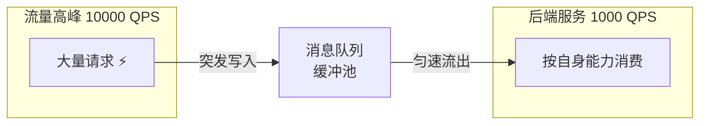
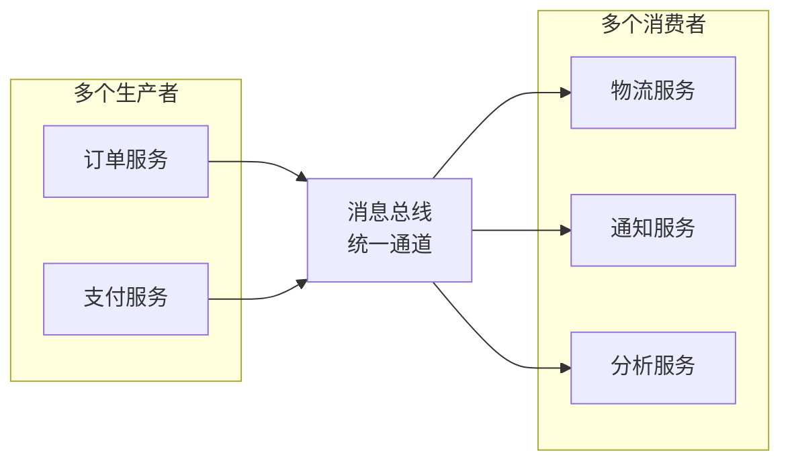
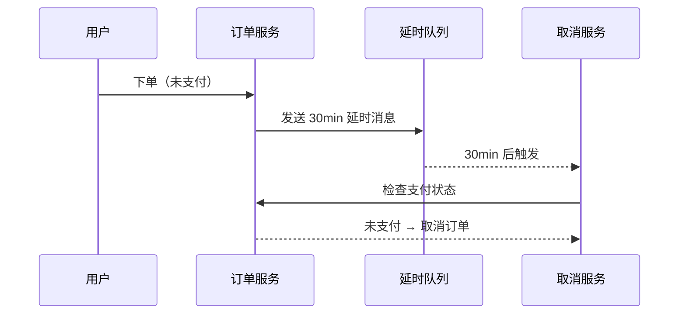
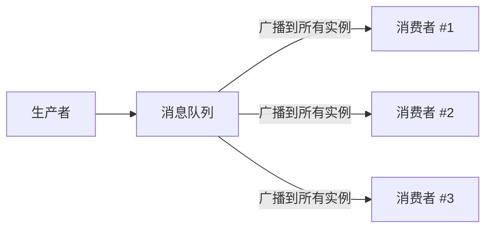
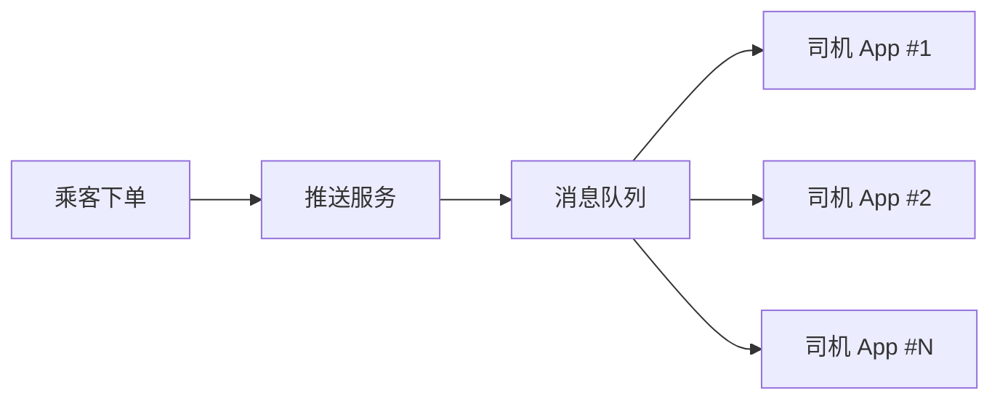
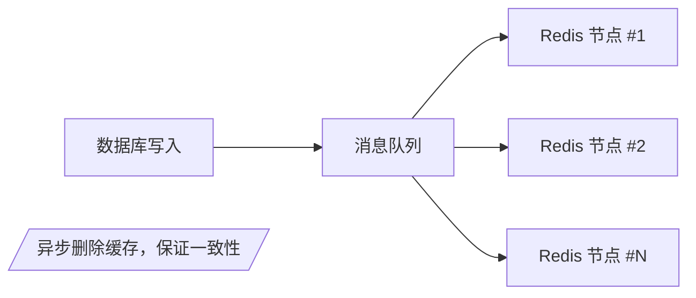
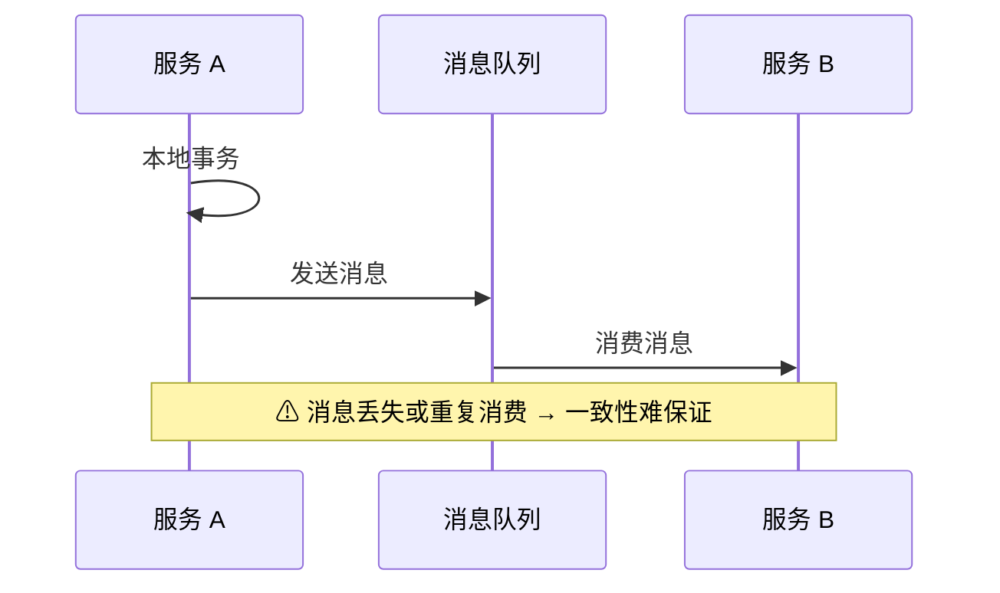
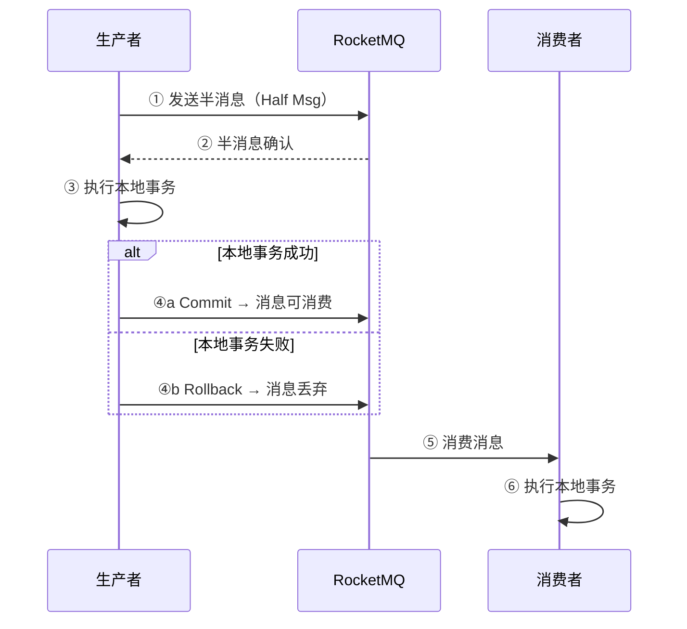
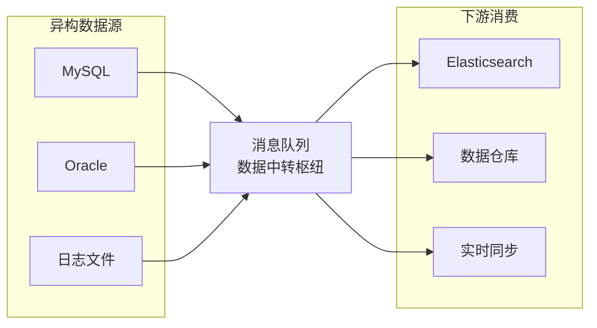

<!--
module:
  parent: system-design
  slug: system-design/mq
  type: article
  category: 主模块子文章
  summary: 消息队列看作是一个存放消息的容器，当需要使用消息的时候，直接从容器中取出消息使用。由于队列 Queue 是一种先进先出的数据结构，所以消费消息时也是按照顺序来消...
  depth: ⭐⭐⭐⭐⭐
-->

# 消息队列

> 一句话定位：**MQ = 异步解耦 + 削峰填谷 + 消息总线**——生产者的"写缓冲区"，消费者的"任务队列"，分布式系统的"神经系统"。

消息队列看作是一个存放消息的容器，当需要使用消息的时候，直接从容器中取出消息使用。由于队列 Queue 是一种先进先出的数据结构，所以消费消息时也是按照顺序来消费的。

## 消息队列的组成
- **Broker**：消息服务器，作为server提供消息核心服务。
- **Producer**：消息生产者，业务的发起方，负责生产消息传输给broker。
- **Consumer**：消息消费者，业务的处理方，负责从broker获取消息并进行业务逻辑处理。
- **Topic**：主题，发布订阅模式下的消息统一汇集地，不同生产者向topic发送消息，由MQ服务器分发到不同的订阅者，实现消息的广播。
- **Queue**：队列，PTP模式下，特定生产者向特定queue发送消息，消费者订阅特定的queue完成指定消息的接收。
- **Message**：消息体，根据不同通信协议定义的固定格式进行编码的数据包，来封装业务数据，实现消息的传输。

---
---

## 常见消息队列对比

### 1. 核心定位与协议支持
| **消息队列**     | **核心定位**                              | **协议支持**                          |
|--------------|---------------------------------------|-----------------------------------|
| **ActiveMQ** | 传统企业级消息中间件，支持 JMS 规范，适合 Java EE 生态。   | JMS、AMQP、MQTT、STOMP、OpenWire。     |
| **RabbitMQ** | 高可靠性、低延迟的消息中间件，支持多种消息模式，适合金融、订单等场景。   | AMQP（核心）、MQTT、STOMP、HTTP。         |
| **RocketMQ** | 阿里巴巴开源的高吞吐、低延迟消息中间件，支持事务消息，适合电商、金融场景。 | 自定义协议（基于 TCP）、MQTT（部分支持）。         |
| **Kafka**    | 高吞吐、分布式日志存储，适合流式计算和大规模数据管道。           | 自定义协议（基于 TCP）、支持与 Flink/Spark 集成。 |
| **Pulsar**   | 云原生架构的高吞吐、低延迟消息中间件，支持多租户和流式计算。        | MQTT、AMQP（实验性）、自定义协议（基于 TCP）。     |

### 2. 性能对比
| **维度**    | **ActiveMQ** | **RabbitMQ**  | **RocketMQ**  | **Kafka**        | **Pulsar**        |
|-----------|--------------|---------------|---------------|------------------|-------------------|
| **吞吐量**   | 低（<1万 QPS）   | 中（5-10万 QPS）  | 高（10-50万 QPS） | 极高（百万级 QPS）      | 高（接近 Kafka，但延迟更低） |
| **延迟**    | 中（毫秒级）       | 低（毫秒级）        | 低（毫秒级）        | 高（不可预测延迟）        | 极低（比 Kafka 更优）    |
| **扩展性**   | 弱（集群扩展能力差）   | 一般（水平扩展需额外维护） | 强（天然分布式架构）    | 极强（天然分布式，自动负载均衡） | 强（存储计算分离，运维友好）    |
| **消息持久化** | 支持（磁盘存储）     | 支持（磁盘/内存可选）   | 支持（磁盘存储）      | 支持（日志结构，高性能）     | 支持（BookKeeper 存储） |

### 3. 关键特性对比
| **特性**   | **ActiveMQ**   | **RabbitMQ** | **RocketMQ** | **Kafka**              | **Pulsar**              |
|----------|----------------|--------------|--------------|------------------------|-------------------------|
| **事务支持** | 支持（JMS 事务）     | 支持（AMQP 事务）  | 支持（事务消息）     | 不支持（仅幂等生产/消费）          | 支持（Pulsar Transactions） |
| **消息顺序** | 支持（点对点模式）      | 支持（单队列内）     | 支持（顺序消息）     | 支持（单分区内）               | 支持（单分区内）                |
| **延迟消息** | 支持（Broker 端调度） | 支持（插件实现）     | 支持（内置延迟消息）   | 不支持（需外部实现）             | 支持（Pulsar Schedulers）   |
| **多租户**  | 不支持            | 不支持          | 不支持          | 不支持                    | 支持（原生多租户）               |
| **流式计算** | 不支持            | 不支持          | 支持（有限）       | 支持（与 Flink/Spark 深度集成） | 支持（Pulsar Functions）    |

### 4. 适用场景推荐
| **场景**                | **推荐消息队列**                  | **理由**                                   |
|-----------------------|-----------------------------|------------------------------------------|
| **传统企业级 Java EE 项目**  | **ActiveMQ**                | 兼容 JMS 规范，适合老项目升级或轻量级 MQ 需求。             |
| **金融支付、订单系统**         | **RabbitMQ** 或 **RocketMQ** | RabbitMQ 支持事务和低延迟；RocketMQ 支持事务消息且吞吐量更高。 |
| **大规模日志收集、流处理**       | **Kafka**                   | 超高吞吐量，与 Flink/Spark 深度集成，适合实时数据管道。       |
| **电商、金融高并发场景**        | **RocketMQ**                | 高吞吐+事务支持，经受住双十一考验。                       |
| **云原生、Serverless 架构** | **Pulsar**                  | 多租户、低延迟+高吞吐，存储计算分离，运维比 Kafka 更友好。        |
| **不确定业务需求**           | **Kafka** 或 **RocketMQ**    | Kafka 生态成熟；RocketMQ 通用性更强，支持事务和延迟消息。     |

### 5. 总结与建议
- **选型逻辑**：
    - **高吞吐+低延迟**：Pulsar > RocketMQ > Kafka > RabbitMQ > ActiveMQ。
    - **事务支持**：RabbitMQ/RocketMQ > ActiveMQ > Pulsar > Kafka。
    - **云原生架构**：Pulsar 是唯一原生支持多租户的消息队列。
    - **生态成熟度**：Kafka > RabbitMQ > RocketMQ > Pulsar > ActiveMQ。

- **最终推荐**：
    - **新项目云原生架构**：优先选 **Pulsar**（低延迟+高吞吐+易管理）。
    - **高可靠性事务场景**：选 **RocketMQ**（电商、金融）或 **RabbitMQ**（支付、订单）。
    - **大规模日志/流处理**：选 **Kafka**（监控、用户行为日志）。
    - **传统企业级项目**：选 **ActiveMQ**（JMS 兼容）。
    - 
---

## 使用消息队列会面临的问题
- **系统可用性降低**：系统可用性在某种程度上降低，在加入 MQ 之前，不用考虑消息丢失或者说 MQ 挂掉等等的情况
- **系统复杂性提高**：加入 MQ 之后需要保证消息没有被重复消费、处理消息丢失的情况、保证消息传递的顺序性等问题
- **一致性问题**：消息队列可以实现异步，消息队列带来的异步确实可以提高系统响应速度，但是如果消息的真正消费者并没有正确消费消息

---

## 应用场景

### 异步&解耦

```mermaid
sequenceDiagram
    participant A as 服务 A
    participant MQ as 消息队列
    participant B as 服务 B
    participant C as 服务 C
    A->>MQ: 发送消息（异步）
    MQ-->>A: 确认（立即返回）
    MQ->>B: 消费
    MQ->>C: 消费
    Note over A,B,C: A 与 B/C 解耦，A 无需等待
```

### 消峰



### 消息总线



### 延时任务

用户在美团 APP 下单，假如没有立即支付，进入订单详情会显示倒计时，如果超过支付时间，订单就会被自动取消



### 广播消费



#### 消息推送

专车的司机端推送机制



#### 缓存同步

高并发场景



### 分布式事务

1. 传统XA事务方案：性能不足

2. 基于普通消息方案：一致性保障困难



3. 基于 RocketMQ 分布式事务消息：支持最终一致性



### 数据中转枢纽



---

## 源码级深度：Kafka 与 RocketMQ 核心机制

### 1. Kafka：零拷贝与顺序写——高吞吐的秘密

```java
// org.apache.kafka.common.network.KafkaChannel
// Kafka 高吞吐的两大基石：顺序写磁盘 + 零拷贝传输

// ① 顺序写：Producer 写入 → 追加到 LogSegment 文件末尾
// org.apache.kafka.storage.internals.log.LogSegment
public void append(long largestOffset, long largestTimestamp, 
                   ByteBuffer records) {
    // 直接 FileChannel.write() → 顺序追加，无随机 IO
    // 磁盘顺序写速度 ≈ 内存随机写（600MB/s vs 100MB/s）
    this.log.write(records);
    this.index.append(largestTimestamp, largestOffset, 
                      this.log.channel().position());
}

// ② 零拷贝：Consumer 拉取 → sendfile() 直接内核态传输
// org.apache.kafka.common.network.PlaintextTransportLayer
public long transferTo(WritableByteChannel target, long position) 
        throws IOException {
    // FileChannel.transferTo() → Linux sendfile() 系统调用
    // 数据从 PageCache 直接到 Socket Buffer，不经过用户态
    // 减少 2 次数据拷贝 + 2 次上下文切换
    return fileChannel.transferTo(position + this.startingOffset, 
                                  this.size - (position - this.startingOffset), 
                                  target);
}
```

> **WHY**：传统 IO 需要 4 次拷贝（Disk → Kernel Buffer → User Buffer → Socket Buffer → NIC），零拷贝只需 2 次（Disk → Kernel Buffer → NIC），CPU 开销降低 50%+。

### 2. RocketMQ：事务消息半提交机制

```java
// org.apache.rocketmq.broker.transaction.queue.TransactionalMessageBridge
// RocketMQ 事务消息的"半消息"机制——解决分布式事务的最终一致性

// ① 半消息写入：Producer 发送半消息，对 Consumer 不可见
public boolean putHalfMessage(MessageExtBrokerInner messageInner) {
    // 将消息写入 RMQ_SYS_TRANS_HALF_TOPIC（半消息 Topic）
    // Consumer 订阅的是业务 Topic，所以看不到半消息
    messageInner.setTopic(TransactionalMessageUtil.buildHalfTopic());
    return putMessage(messageInner);
}

// ② 本地事务执行后：根据结果 Commit 或 Rollback
public void endTransaction(EndTransactionRequestHeader requestHeader) {
    if (requestHeader.getCommitOrRollback() 
            == MessageSysFlag.TRANSACTION_COMMIT_TYPE) {
        // Commit：将半消息从 HALF_TOPIC 移到真实 Topic，Consumer 可见
        deletePrepareMessage(halfMsg);
        putMessage(realMsg);
    } else {
        // Rollback：删除半消息，Consumer 永远看不到
        deletePrepareMessage(halfMsg);
    }
}

// ③ 补偿机制：Broker 定期扫描未确认的半消息，回查 Producer
// TransactionalMessageCheckService（默认 60s 一次）
protected void onWaitEnd() {
    // 遍历所有半消息，找到超过 60s 未 Commit/Rollback 的
    // 回调 Producer 的 checkLocalTransaction() 方法
    // Producer 查询本地事务状态，重新发送 Commit/Rollback
}
```

> **WHY**：半消息机制本质是"两阶段提交"的消息版——第一阶段写半消息（Prepare），第二阶段根据本地事务结果 Commit/Rollback。补偿回查机制解决了第二阶段失败（网络/宕机）时的可靠性问题。

---

## 版本演进

| 消息队列 | 关键版本 | 核心变更 | 影响 |
|:---------|:---------|:---------|:-----|
| **Kafka 0.8** | 2013 | 引入 Consumer Group + 重平衡机制 | 从日志系统进化为消息队列 |
| **Kafka 0.10** | 2016 | Exactly-Once 语义（幂等 Producer + 事务 API） | 金融级可靠性 |
| **Kafka 3.0+** | 2021 | KRaft 模式（去 ZooKeeper），Raft 共识替代 | 运维复杂度大幅降低 |
| **Kafka 3.6+** | 2023 | KRaft 生产就绪，Tiered Storage（冷数据卸载到 S3） | 存储成本下降 80% |
| **RocketMQ 4.x** | 2016 | 事务消息、延迟消息、死信队列 | 电商级消息可靠性 |
| **RocketMQ 5.0** | 2022 | 云原生架构（存算分离）、gRPC 协议、Serverless 弹性 | 运维友好 + 按需扩缩 |
| **RocketMQ 5.1+** | 2023 | 事件网格（EventBridge）、定时消息精度提升 | 事件驱动架构支持 |
| **RabbitMQ 3.x** | 持续 | Quorum Queue（Raft 共识替代 Classic Mirror） | 高可用队列更可靠 |
| **Pulsar 2.x** | 2018+ | 存算分离（BookKeeper）、多租户、Schema Registry | 云原生消息平台 |

---

## ❌/✅ 反例对比

### 反例 1：消费者重复消费未做幂等

```java
// ❌ 反例：消费者直接执行业务逻辑，无幂等保护
@RocketMQMessageListener(topic = "ORDER_TOPIC", consumerGroup = "order-group")
public class OrderConsumer implements RocketMQListener<OrderMessage> {
    @Override
    public void onMessage(OrderMessage msg) {
        // 网络抖动 → Broker 未收到 ACK → 重发 → 重复扣款！
        orderService.deductStock(msg.getOrderId(), msg.getQuantity());
        paymentService.charge(msg.getOrderId(), msg.getAmount());
    }
}
// 后果：同一订单扣了两次库存、扣了两次钱
```

```java
// ✅ 正例：消费者实现幂等（数据库唯一键 + 状态机）
@RocketMQMessageListener(topic = "ORDER_TOPIC", consumerGroup = "order-group")
public class OrderConsumer implements RocketMQListener<OrderMessage> {
    @Override
    @Transactional
    public void onMessage(OrderMessage msg) {
        // ① 幂等键：用消息 ID 作为去重依据
        String idempotentKey = msg.getMsgId();
        
        // ② 数据库唯一索引：INSERT IGNORE 或 ON DUPLICATE KEY UPDATE
        int inserted = idempotentRepo.insertIgnore(idempotentKey);
        if (inserted == 0) {
            log.warn("重复消息，跳过: {}", idempotentKey);
            return;  // 已处理过，直接返回
        }
        
        // ③ 状态机校验：订单状态必须为"待处理"
        Order order = orderRepo.findById(msg.getOrderId());
        if (order.getStatus() != OrderStatus.PENDING) {
            log.warn("订单已处理，跳过: {}", msg.getOrderId());
            return;
        }
        
        orderService.deductStock(msg.getOrderId(), msg.getQuantity());
        paymentService.charge(msg.getOrderId(), msg.getAmount());
        orderRepo.updateStatus(msg.getOrderId(), OrderStatus.PROCESSED);
    }
}
// WHY：MQ 的 At-Least-Once 语义保证消息至少投递一次，
//      消费者必须实现幂等才能避免重复处理
```

### 反例 2：消息丢失——Producer 发了就忘

```java
// ❌ 反例：Producer 异步发送，不关心结果
public void sendOrderMessage(OrderMessage msg) {
    // 异步发送后直接返回，消息可能丢失：
    // - Broker 未持久化就宕机
    // - 网络抖动导致发送失败
    // - 反压时 Broker 拒绝写入
    kafkaTemplate.send("ORDER_TOPIC", msg);
    // 不检查 SendResult → 静默丢失
}
```

```java
// ✅ 正例：Producer 确认 + 重试 + 本地消息表
public void sendOrderMessage(OrderMessage msg) {
    // ① 同步发送 + 确认（Kafka acks=all，RocketMQ 同步发送）
    SendResult result = rocketMQTemplate.syncSend("ORDER_TOPIC", msg);
    
    if (result.getSendStatus() == SendStatus.SEND_OK) {
        // ② 发送成功：标记本地消息表为"已发送"
        localMessageRepo.updateStatus(msg.getId(), MessageStatus.SENT);
    } else {
        // ③ 发送失败：标记为"待重试"，定时任务补偿
        localMessageRepo.updateStatus(msg.getId(), MessageStatus.RETRY);
    }
}

// 本地消息表 + 定时补偿（最终一致性兜底）
@Scheduled(fixedDelay = 60000)  // 每分钟扫描
public void retryFailedMessages() {
    List<LocalMessage> failed = localMessageRepo
        .findByStatus(MessageStatus.RETRY);
    for (LocalMessage msg : failed) {
        if (msg.getRetryCount() < MAX_RETRY) {
            sendOrderMessage(msg.toMessage());
            msg.incrementRetry();
            localMessageRepo.save(msg);
        } else {
            // 超过最大重试 → 转人工处理
            localMessageRepo.updateStatus(msg.getId(), MessageStatus.DEAD_LETTER);
        }
    }
}
// WHY：本地消息表 + 定时补偿是"最终一致性"的经典模式，
//      确保业务操作和消息发送要么都成功，要么都重试
```

### 反例 3：雪崩效应——MQ 故障拖垮全链路

```text
❌ 反例：消费者无降级策略，MQ 故障 → 全链路阻塞

  Producer → MQ（故障）→ Consumer
       ↓
  发送超时 → Producer 线程池打满 → 上游服务级联故障

  现象：MQ 单点故障 → 整个微服务集群雪崩
```

```text
✅ 正例：多级降级策略

  1. Producer 侧：
     - 发送超时 3s（fail-fast，不要无限等待）
     - 异步发送 + 本地消息表（MQ 不可用时降级为定时补偿）
     - 熔断器：MQ 连续 5 次超时 → 熔断 30s → 半开探测

  2. Consumer 侧：
     - 消费超时 10s（避免单条消息阻塞整个 Consumer Group）
     - 死信队列：重试 3 次仍失败 → 转入 DLQ（Dead Letter Queue）
     - 监控告警：消费积压 > 10000 条 → 触发告警 + 自动扩容

  3. 运维侧：
     - MQ 集群 ≥ 3 节点（避免单点）
     - 监控 Broker 磁盘使用率 > 75% → 提前扩容
     - 定期清理过期消息（避免磁盘写满）
```

---

← [返回 高性能](../README.md)