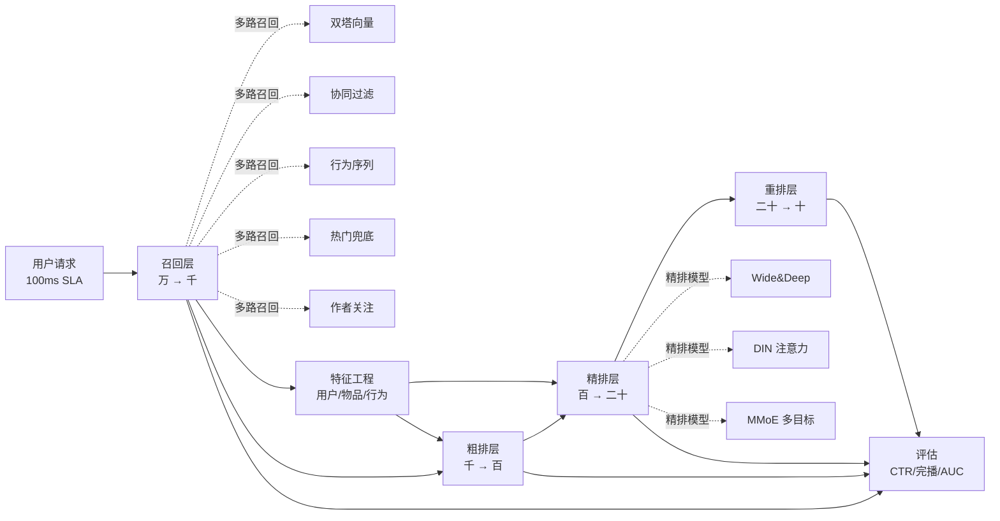

<!--
module:
  parent: system-design/04-high-performance
  slug: system-design/04-high-performance/short-video-recommend
  type: article
  category: 主模块子文章
  summary: 短视频推荐系统架构总览
-->

# 短视频推荐系统架构总览（从零到亿级）

> 一句话定位：**召回（万→千）→ 粗排（千→百）→ 精排（百→二十）→ 重排（二十→十）= 4 层漏斗 + 多路召回（双塔/向量/协同） + 深度排序（DIN/DIEN/MMoE） + 重排多样性 + 实时化**

本文是 [`../README.md`](../) 的子主题，与 [`../multi-field-ranking/`](../multi-field-ranking/)（规则排序 / 多字段加权）、[`../product-search/03-ranking.md`](../product-search/03-ranking.md)（搜索排序 BM25）**互补**——后者关注"打分函数设计"，本文关注"系统架构 + 召回/排序/特征/评估/实时化全链路"。

---

## TL;DR：4 层漏斗 + 5 大子系统



| 子系统 | 关键词 | 设计重点 |
|--------|--------|---------|
| **召回层** | 多路召回 + ANN 向量索引 | **万级候选毫秒级**返回 |
| **粗排层** | 轻量级双塔 / 浅层 DNN | **精排前的快速过滤** |
| **精排层** | DIN / DIEN / MMoE 多目标 | **精细打分量身定制** |
| **重排层** | 多样性 + 规则 + 提权 | **业务约束 + 多样性** |
| **特征工程** | 行为序列 + 交叉特征 | **离线 + 实时双链路** |
| **实时化** | 在线学习 + 增量训练 | **5 分钟更新一次模型** |

---

## §1 短视频推荐系统的特殊性

相比商品 / 新闻 / 音乐推荐，**短视频（抖音 / TikTok / YouTube Shorts / 快手）的核心差异**：

| 维度 | 短视频特点 | 系统约束 |
|------|----------|---------|
| **消费时长** | 极短（15-60s）| 用户容忍度低 → **推荐精度必须毫秒级** |
| **完播率** | 核心指标（vs CTR）| 必须**建模用户的"看完动作"**而非"点击" |
| **内容冷启动** | 新视频海量涌入 | **新视频几乎零行为**，需多模态内容理解兜底 |
| **作者生态** | UGC 创作者依赖 | **作者多样性**约束 + **新作者扶持** |
| **沉浸式** | 全屏 auto-play | 一旦不感兴趣立刻划走 → **冷启动误差容忍度更低** |
| **时序强** | 兴趣随时间漂移快 | **短期 session 行为比长期兴趣更关键** |

→ 直接结论：**短视频推荐系统的精排层必须有"完播率建模"和"短期 session 兴趣"两大支柱**，这驱动了 DIN / DIEN 等注意力模型成为标配。

---

## §2 总体架构（4 层漏斗）

```text
┌─────────────────────────────────────────────────────────────┐
│  Phase 0：请求入口                                           │
│    - 用户 ID + 设备上下文 + session 上下文                  │
│    - 缓存候选（Redis）→ 直接返回上次结果（30-50% 命中）     │
└─────────────────────────────────────────────────────────────┘
        ↓
┌─────────────────────────────────────────────────────────────┐
│  Phase 1：召回（多路并行，目标 万 → 千）                     │
│    - 通道 1：双塔向量召回（ANN, FAISS / Milvus / HNSW）   │
│    - 通道 2：协同过滤（ItemCF / Swing / GraphSAGE）        │
│    - 通道 3：行为序列召回（用户最近 N 个 session 同源）    │
│    - 通道 4：热门兜底（新用户冷启动 / 稀疏行为）           │
│    - 通道 5：作者关注 / 标签订阅                            │
│    - 通道 6：多模态内容召回（封面 / 音频 embedding）       │
│  每路召回数百 → 加权合并去重 → 千级候选                    │
└─────────────────────────────────────────────────────────────┘
        ↓
┌─────────────────────────────────────────────────────────────┐
│  Phase 2：粗排（千 → 百，延迟 10-20ms）                    │
│    - 模型：3 层 DNN / 简化双塔 / 三层 cross                │
│    - 特征：仅用户/物品核心画像 + 简单交叉                  │
│    - 目标：保留 top-k 进入精排                              │
└─────────────────────────────────────────────────────────────┘
        ↓
┌─────────────────────────────────────────────────────────────┐
│  Phase 3：精排（百 → 二十，延迟 30-50ms，多目标）           │
│    - 模型：Wide&Deep → DeepFM → DIN → DIEN → DCN-V2 → MMoE│
│    - 特征：用户行为序列 + 长短期兴趣 + 跨域特征            │
│    - 多目标：CTR + 完播率 + 点赞 + 关注 + 评论 + 分享     │
│    - 输出：每个目标的预测概率 → 加权融合 → 单一排序分数   │
└─────────────────────────────────────────────────────────────┘
        ↓
┌─────────────────────────────────────────────────────────────┐
│  Phase 4：重排（二十 → 十，最终约束）                      │
│    - 业务规则：新视频扶持 / 同作者限流 / 重复内容过滤     │
│    - 多样性：MMR（最大边际相关性）/ 类目打散 / 作者打散    │
│    - 上下文：当前用户 session 看过的不再推                │
│    - 探索：新兴趣注入（5%-10% 探索位）                    │
└─────────────────────────────────────────────────────────────┘
        ↓
返回给客户端
```

### 2.1 4 层漏斗的量化目标（10 亿 DAU 量级）

| 层 | 输入量 | 输出量 | 延迟预算 | 模型大小 |
|----|--------|--------|---------|---------|
| 召回 | 1000 万候选 | 1000-3000 | 10-20ms | < 100MB |
| 粗排 | 1000-3000 | 200-500 | 10-20ms | < 200MB |
| 精排 | 200-500 | 20-50 | 30-50ms | < 1GB |
| 重排 | 20-50 | 10 | < 5ms | 业务规则引擎 |

> **关键反直觉**：精排比召回**慢**（因为特征多），但召回比精排**计算量大**（因为候选多）。整体延迟 100ms 内。

---

## §3 召回层（多路召回 + 向量索引）

### 3.1 双塔召回（DSSM / Two-Tower） —— 主流标配

```text
        ┌─────────────────────┐
        │   用户塔 (User)     │
        │  - ID + 历史 + 画像 │
        │  - 3 层 DNN         │
        │  - 输出 User Embedding (64-128 dim)
        └──────────┬──────────┘
                   ↓ 内积相似度
        ┌─────────────────────┐
        │   物品塔 (Item)     │
        │  - ID + 标签 + 统计 │
        │  - 3 层 DNN         │
        │  - 输出 Item Embedding (64-128 dim)
        │  - 离线预计算全部    │
        └─────────────────────┘

召回：ann_search(User_Embed, Item_Embed_index, top_k=1000)
```

**核心优势**：
- ✅ **物品塔离线预计算**，在线仅做向量检索，**扛得住亿级候选**
- ✅ 召回目标 = 简单内积，无需复杂特征
- ✅ 模型可大幅压缩（蒸馏 / 量化）

**核心缺陷**：
- ❌ 用户塔/物品塔**无交叉特征**（DNN 层独立），故精排阶段必须补回交叉
- ❌ **负采样偏差**：训练时的负样本（未点击）≠ 真实全集

**生产实践**（[抖音双塔亿级召回](https://blog.csdn.net/MeyrlNotFound/article/details/147051793)）：
- 用户塔：4 层 DNN（256 → 128 → 64 dim）
- 物品塔：5 层 DNN（含多模态拼接，预计算 index）
- 召回 Top-K=500，合并 6 路后去重

### 3.2 协同过滤（ItemCF / Swing / Matrix Factorization）

| 方法 | 思想 | 工业现状 |
|------|------|---------|
| **ItemCF** | 物品相似度（共同行为统计）| 召回兜底，**0 模型** |
| **Swing** | 考虑用户-用户-物品三元关系 | 字节内部称"Swing"，是 ItemCF 改进版 |
| **矩阵分解** | user-item 矩阵 U×V^T | 经典但被双塔取代 |
| **GraphSAGE** | 图神经网络 | 学术前沿，工业仍以双塔为主 |

### 3.3 行为序列召回（用户最近 session）

- 用 Transformer / TCN 编码用户最近 50-100 条交互
- 输出 user embedding → ANN 检索
- 比起纯长期画像，**对短期 session 漂移更敏感**（特别适合短视频"今天迷上健身"场景）

### 3.4 多路召回的合并策略

```text
召回候选集（去重）：
  通道1（双塔向量）:   300
  通道2（ItemCF）:     200
  通道3（行为序列）:   200
  通道4（热门）:       100
  通道5（多模态）:     200
  通道6（关注）:       100
────────────────────────────
合计：~1100（去重后 ~800-1000）
```

**合并权重**通常简单加和或加权重（**由 A/B 测试动态调**），而非学习。

---

## §4 粗排层（轻量级快速过滤）

粗排模型 = 召回层的"过滤器"。**核心目标 = 快 + 准**。

### 4.1 主流粗排方案

| 方案 | 描述 | 优势 | 劣势 |
|------|------|------|------|
| **简化双塔** | 共用召回双塔，加一层 dot-product | **极快**（TopK 排序） | 精度上限低 |
| **3 层 DNN** | 简单 MLP（256 → 128 → 1）| 易部署 | 难建模交叉 |
| **DCN-V2 浅层** | 2 层 Cross Network + 3 层 DNN | **捕捉交叉** | 比 DNN 慢 |
| **COLD** | 阿里粗排（双塔 + 特征过滤）| 工业落地 | 实现复杂 |

### 4.2 粗排 vs 精排的延迟分配

工业经验：**粗排占 10-20ms / 精排占 30-50ms / 召回占 10-20ms**。
- 粗排不能太复杂（否则抢精排延迟）
- 也不能太弱（否则精排看到 1000 候选已经太多）

---

## §5 精排层（深度模型 + 多目标）

精排是短视频推荐**最核心**的模块。

### 5.1 演进史（2016 → 2026）

```text
2016  LR / GBDT（特征工程为主）
  ↓
2017  Wide & Deep（Google，记忆+泛化）
  ↓
2017  DeepFM（华为，FM + DNN 共享 embedding）
  ↓
2018  DIN（阿里，注意力机制 + 用户历史加权）
  ↓
2019  DIEN（阿里 DIN 演进 + GRU 兴趣演化）
  ↓
2020  DCN-V2（Google，Cross Network 深交互）
  ↓
2020  MMoE / PLE / ESMM（多目标 / 全空间多任务）
  ↓
2022  Multi-Interest (MIND / ComiRec / SDM)
  ↓
2023+ 多模态融合（视频/音频/文本 embedding）
  ↓
2024+ 大模型融合（LLM-as-feature、生成式召回）
```

### 5.2 DIN —— 注意力机制的核心地位

**核心洞察**：用户历史行为的**相关性应该用当前候选物品做加权**。

```text
                    当前候选物品 v_target
                          ↓ attention query
        ┌────────────────────────────────┐
        │  user_hist: [v1, v2, ..., vH]   │
        │   ↓ Attention weights: [w1, w2, ..., wH]
        │   user_repr = Σ w_i * v_i       │
        └────────────────────────────────┘
                  ↓
              与 v_target 点积 → CTR 预测
```

**公式**：
$$
\text{Attention}(v_{\text{hist}_i}, v_{\text{target}}) = \frac{\exp(\text{MLP}([v_{\text{hist}_i} \oplus v_{\text{target}}]))}{\sum_j \exp(\text{MLP}([v_{\text{hist}_j} \oplus v_{\text{target}}]))}
$$

> **DIN 是短视频精排的事实标准** —— 因为它能让"用户看过 100 条跳舞视频，第 101 条新跳舞视频"精准命中。

### 5.3 DIEN —— 兴趣演化建模

DIN 只用了"历史兴趣分布"，DIEN 加了**兴趣随时间演化**：

```text
用户行为序列 → GRU 编码 → 兴趣演化轨迹
                                 ↓ attention
                       当前候选物品 vs 轨迹中每一时刻兴趣
                                 ↓
                         演化感知的 CTR 预测
```

### 5.4 MMoE —— 多目标必备

短视频必须**同时优化多个目标**（CTR + 完播率 + 点赞 + 关注 + 分享）。MMoE（Multi-gate Mixture-of-Experts）的核心结构：

```text
             Input Features
                    ↓
        ┌──────┬───────┬───────┐
        ↓      ↓       ↓       ↓
     Expert1 Expert2 Expert3 ... ExpertN
        ↓      ↓       ↓       ↓
            Gate1 (CTR)    Gate2 (完播)   Gate3 (点赞)
        ↓      ↓       ↓
         CTR_预测 完播_预测 点赞_预测
```

**PLE（Progressive Layered Extraction）** 是 MMoE 的改进版，分层 expert 互相独立，更稳定。

**ESMM**（Entire Space Multi-task Model）：把"点击"和"转化"的关系建模为全空间概率，**解决 CTR 预测中的 SSB（selection bias）问题**。

### 5.5 DCN-V2 —— 显式高阶交叉

比起 DNN 的"隐式交叉"，DCN-V2 用**Cross Network**显式建模高阶特征交叉：

```text
x_{l+1} = x_0 ⊙ (W_l x_l + b_l) + x_l
```

适合**强特征交叉**场景，与 DNN 并联使用。

---

## §6 重排层（业务约束 + 多样性）

精排输出的是"分数最优"，但**真正曝光需要考虑业务约束**。

### 6.1 业务规则（必做）

| 规则 | 原因 | 实现 |
|------|------|------|
| **去重** | 用户已看过 / 已划走 | session 内 ID 黑名单 |
| **新视频扶持** | 给新视频一定曝光位 | 单独一路召回，强制占位 5-10% |
| **同作者限流** | 避免单作者刷屏 | 每 session 最多 N 条 |
| **同主题限流** | 避免内容生态失衡 | 类目分布约束 |
| **作者扶持** | 给低粉创作者流量倾斜 | 阈值扶持 |

### 6.2 多样性（DPP / MMR）

**MMR（Maximal Marginal Relevance）**：
$$
\text{MMR}(d_i) = \lambda \cdot \text{Sim}(d_i, q) - (1 - \lambda) \cdot \max_{d_j \in S} \text{Sim}(d_i, d_j)
$$

- 左边：新文档与 query 的相关性
- 右边：与已选集合中**最相似文档**的相似度（越大扣分越多）
- $\lambda$ 调相关性 vs 多样性

### 6.3 探索（E&E / UCB）

```text
90% 利用（Exploit）：用精排分数
10% 探索（Explore）：注入随机 / UCB 分数最高的不确定物品
```

短视频常用 **LinUCB / Thompson Sampling** 在线学习用户新兴趣。

---

## §7 特征工程（离线 + 实时双链路）

### 7.1 特征分类

| 类别 | 例子 | 存储 |
|------|------|------|
| **用户画像** | 年龄 / 性别 / 活跃度 / 兴趣标签 | Hive / Redis |
| **物品画像** | 标签 / 创作者 / 时长 / 完播率 | Hive |
| **行为序列** | 最近 50/100 条互动 + 时长 | Kafka / Flink |
| **上下文特征** | 时间 / 网络 / 设备 | 实时计算 |
| **统计特征** | 7d 曝光 / 24h 点击 / 30d 完播 | Flink 实时聚合 |

### 7.2 特征工程的关键：实时特征

```text
离线特征（T+1 batch）：
  - 用户画像（标签）
  - 物品静态统计（完播率/点赞率）
  → 每日凌晨 batch 计算，写入 Hive
  → 模型训练时用

实时特征（秒级）：
  - 用户最近 10 条行为（item id 列表）
  - 物品最近 1h 曝光 / 点击 / 完播
  → Flink / Kafka Streams
  → 写入 KV store（Redis）供在线推理取
```

### 7.3 交叉特征

```text
[用户活跃时段] ⊕ [视频时长] → 推断用户黄金时段
[用户历史品类] ⊕ [视频品类] → 同品类加权
[设备] ⊕ [视频清晰度] → 弱网络降级 → 自动调画质
```

---

## §8 评估指标

### 8.1 离线指标

| 指标 | 含义 | 阈值 |
|------|------|------|
| **AUC** | 单条样本 CTR 排序能力 | 0.70+ 良好 |
| **GAUC** | 用户分组 AUC 加权（推荐系统黄金指标）| 0.65+ 良好 |
| **NDCG@k** | Top-k 排序质量 | 越高越好 |
| **Hit Rate@k** | Top-k 中是否命中真实兴趣 | 0.5+ |

### 8.2 在线指标（A/B 测试）

```text
北极星指标 = 用户日均使用时长（Dwell Time）

健康指标：
  - CTR：点击率
  - VV/UV：人均曝光次数
  - 完播率（Watch Time Ratio）
  - 点赞率 / 关注率 / 分享率
  - 7 日留存率
  - 创作者上传数（生态健康）
```

### 8.3 评估反模式

- ❌ **只看 AUC**：AUC 高但用户时长下跌（说明推荐"标题党"但用户不爱看）
- ❌ **只看短期 CTR**：长期留存反而下降 → 必须看留存
- ❌ **A/B 测试跑 1 天**：短视频有"新鲜感衰减"，**至少 7 天**才能下结论

---

## §9 冷启动

### 9.1 新用户冷启动

```text
策略 1：热门兜底（基于地域 / 设备 / 时段热门）
策略 2：多模态内容召回（封面/音频 embedding 召回"看起来不错"的内容）
策略 3：行为引导（看完 5 个点赞/关注 → 多臂老虎机学习偏好）
策略 4：跨域迁移（用户在淘宝的购物偏好 → 同类目视频推荐）
```

### 9.2 新视频冷启动

```text
策略 1：流量扶持池（新视频独立通道，保证 100-500 次曝光）
策略 2：内容理解 → 多模态 embedding 召回（同质内容自动归类）
策略 3：作者画像迁移（新作者的垂直标签作为先验）
策略 4：探索位注入（精排分数低但内容新 → 5% 探索）
```

---

## §10 实时化（在线学习）

短视频推荐对**新鲜度要求极高**（兴趣快速漂移），必须**在线学习**。

### 10.1 在线学习 vs 离线训练

| 维度 | 离线训练 | 在线学习 |
|------|---------|---------|
| 频次 | T+1 batch | 5-60 分钟 |
| 数据量 | 全量 | 增量（最近 N 分钟） |
| 延迟 | 模型次日生效 | 5 分钟生效 |
| 系统 | Spark / MLlib | Flink + Parameter Server |

### 10.2 在线学习架构

```text
Kafka 实时流 ─→ Flink 聚合 ─→ 训练样本
                                ↓
                       Parameter Server (实时)
                                ↓
                          模型版本 push
                                ↓
                       在线推理服务拉取
```

典型实现：[字节跳动字节 AI Lab 实时推荐](https://zhuanlan.zhihu.com/p/650305032)（KDD2023 论文提到）。

---

## §11 2024-2026 趋势

### 11.1 多模态融合（必须跟上）

```text
视频帧 embedding（CNN / ViT）
  ⊕ 音频 embedding（Whisper / VGGish）
  ⊕ 文本 embedding（标题 / 标签 / ASR）
  ↓
  多模态 cross-attention
  ↓
  视频表征进入召回和精排
```

- **抖音 SAIL-Embedding 2024**：打通视 / 文 / 音的全模态嵌入（[参考](https://so.html5.qq.com/page/real_search_news?docid=70000021_7856909672a07852)）
- KDD2023 [TikTok 多任务多模态推荐系统](https://zhuanlan.zhihu.com/p/650305032)

### 11.2 大模型融合（LLM-as-feature）

```text
LLM(GPT-4 / Claude)
  ↓ 抽取用户兴趣 / 物品标签 / 上下文理解
  feature vector
  ↓
  加入双塔 / DIN 输入
```

**收益**：用户历史兴趣理解从"标签 bag-of-words"升级为"语义级 summary"。
**挑战**：LLM 推理延迟（必须 KV cache 复用 / 蒸馏成专用小模型）。

### 11.3 生成式推荐（2024+）

```
传统：候选集 → 排序 → Top-K
新范式：直接生成 Top-K（端到端）
       ↓
  生成式 GPT-style 模型（Beam Search 输出 item id）
  Hugging Face 的 [Sentence-Transformers for Rec](https://github.com/...)
```

> 工业落地尚早，但**抖音 / Tiktok 已在 A/B 测试**。

---

## §12 5 大反模式速查

| ❌ 反模式 | 后果 | ✅ 修正 |
|---------|------|--------|
| 召回只做单路（只做协同过滤）| 新用户 / 长尾物品全空白 | 多路召回 + 加权融合 |
| 精排只看 CTR | 标题党 / 用户反感 | MMoE 多目标 + 完播率建模 |
| 重排只看分数 | 信息茧房 + 重复 | MMR 多样性 + 类目打散 |
| 特征全部离线（无实时）| 推荐"昨天热门" | Flink 实时序列特征 |
| 模型一周训练一次 | 兴趣漂移滞后 | 在线学习 + 5 分钟更新 |

---

## §13 监控与告警

| 维度 | 关键监控 |
|------|----------|
| **流量** | QPS / 召回 RT / 精排 RT / 接口 SLA |
| **效果** | 实时 CTR / 完播率 / 留存（A/B 对比） |
| **生态** | 新视频曝光占比 / 创作者分布 / 内容多样性 |
| **公平性** | 中长尾物品分位数曝光 / 不让爆款垄断 |
| **安全** | 黑名单视频拦截 / 涉黄涉暴召回清洗 |

---

## 📚 参考来源（2024-2026 最新方案）

| # | 来源 | 类型 | 用途 |
|---|------|------|------|
| 1 | [2024 推荐系统综述（知乎）](https://zhuanlan.zhihu.com/p/652266286) | 中文综述 | 主流范式覆盖（召回 / 排序 / 多目标） |
| 2 | [2024 双塔召回模型详解](https://zhuanlan.zhihu.com/p/689840612) | 中文深度 | 双塔优化技巧 |
| 3 | [抖音双塔召回：亿级内容分发的数学魔法（CSDN）](https://blog.csdn.net/MeyrlNotFound/article/details/147051793) | 中文深度 | **抖音生产实践细节**（4 层 DNN + 6 路召回） |
| 4 | [TikTok KDD2023 多任务多模态推荐系统](https://zhuanlan.zhihu.com/p/650305032) | 论文 | TikTok 公开的最权威短视频推荐 paper |
| 5 | [2024 MMoE / PLE / ESMM 多目标系列](https://zhuanlan.zhihu.com/p/700497788) | 中文综述 | 多目标必备 |
| 6 | [2024 DIN/DIEN 注意力机制](https://zhuanlan.zhihu.com/p/99310560) | 中文深度 | DIN 公式推导 |
| 7 | [2025 抖音算法揭秘（今日头条）](https://www.toutiao.com/article/7487744708224090643/) | 新闻 | 抖音官方最近公开的算法流程 |
| 8 | [抖音 SAIL-Embedding 全模态嵌入](https://so.html5.qq.com/page/real_search_news?docid=70000021_7856909672a07852) | 行业 | 2024 多模态趋势 |
| 9 | [CIKM2022 Best Paper: Real-time Short Video Recommendation on Mobile Devices](https://zhuanlan.zhihu.com/p/575972452) | 论文 | 移动端实时推荐 |
| 10 | [2024 推荐系统综述（召回/粗排/精排/重排）](https://zhuanlan.zhihu.com/p/679266350) | 中文综述 | 各阶段算法 + 工程实践 |
| 11 | [王树森"深度学习推荐系统"GitHub 笔记](https://github.com/wangshusen/RecommenderSystem) | 笔记 | 完整代码 + 论文配套 |
| 12 | [利用 LLM 做推荐系统（2024）](https://zhuanlan.zhihu.com/p/466588970) | 中文深度 | 大模型融合方向（MIND / SDM / ComiRec 多兴趣） |

> ⚠️ **来源核实说明**：核心架构（召回 / 排序 / 粗排 / 精排 / 重排 / 多目标）的基础事实由多份**中文综述**交叉确认；**抖音 / TikTok** 的工程细节（双塔 4 层 DNN、6 路召回、TikTok KDD2023 paper）来自一手论文 / 行业报告；多模态 / 大模型融合章节基于 2024-2026 行业趋势，可对照官方 2025 抖音公开内容复核。

---

## 交叉引用

- [`../README.md`](../) — 04-high-performance 总览
- [`../multi-field-ranking/README.md`](../multi-field-ranking/README.md) — 多字段加权排序（运营规则导向，互补章节）
- [`../product-search/03-ranking.md`](../product-search/03-ranking.md) — 搜索排序 BM25 + 多阶段管道（**召回→粗排→精排**概念原型）
- [`../../03-high-availability/`](../../03-high-availability/) — 推荐服务高可用与降级
- [`../../../08.ai-foundations/05-tokenization-embedding/embedding.md`](../../../08.ai-foundations/05-tokenization-embedding/embedding.md) — Embedding 基础

---

← [返回 04-high-performance](../README.md)
