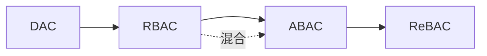

<!--
module:
  parent: system-design
  slug: system-design/02-role-and-attribute
  type: article
  category: 主模块子文章
  summary: 角色与属性族：以 RBAC（5 表静态模型）和 ABAC（策略引擎动态决策）为中介，解决 DAC/MAC 的可维护性难题，覆盖选型判定与各模型能力对比
  depth: ⭐⭐
-->

# 角色与属性族：把权限从人身上抽到中介

---

> 一句话定位：以"角色"或"属性"为中介，解决 DAC/MAC 的可维护性难题。

## 共同问题域

传统族的痛点：用户-资源关系直接绑定，权限管理复杂度随用户数 × 资源数线性增长。

角色与属性族通过引入**间接层**解决这个问题：

- **RBAC**：引入"角色"作为用户与权限的中介（用户 → 角色 → 权限）
- **ABAC**：引入"属性"作为决策依据（属性 + 策略表达式 → 决策）

## 设计哲学

- **RBAC** 假设"权限可以按角色分类"，追求简单稳定
- **ABAC** 假设"权限需要按上下文动态计算"，追求灵活表达

**80% 的企业业务系统，RBAC 就够**；剩下 20% 需要在 RBAC 基础上加 ABAC（混合模型）。

**选型判定参考**：
- 用户数 × 资源数较小（< 万级）且权限维度稳定 → **RBAC**
- 权限维度动态（时间、地点、部门、IP 等上下文参与判定）或策略频繁变更 → **ABAC**
- 两者皆有 → **混合模型**（RBAC 管角色基线，ABAC 管策略例外）

## 族内模型

- [RBAC](rbac.md) — **RBAC = 5 表静态模型**（用户→角色→权限），适合权限维度稳定的业务系统
- [ABAC](abac.md) — **ABAC = 策略引擎动态**（属性 + 表达式 → 决策），适合上下文敏感的灵活场景

## 与其他族的关系

- RBAC 是 DAC 的"中介化"
- ABAC 是 RBAC 的"动态化"
- 混合模型是 RBAC + ABAC 的"工程组合"

### 各模型能力对比（速查表）

| **维度** | **DAC** | **RBAC** | **ABAC** | **ReBAC** |
|---|---|---|---|---|
| **决策依据** | 资源所有者 | 角色 | 属性 + 策略 | 主体-客体关系 |
| **权限分配粒度** | 资源级 | 角色级 | 条件表达式级 | 关系级 |
| **动态上下文** | ❌ | ❌ | ✅ | ✅ |
| **管理复杂度** | 低（小规模） | 中 | 高（策略爆炸） | 高（关系图维护） |
| **典型系统** | Unix 文件权限 | Spring Security / Shiro | AWS IAM、OPA | Google Zanzibar / SpiceDB |

## 相关章节

- [传统族](../01-traditional/README.md) — RBAC/ABAC 的"前传"
- [关系与混合族](../03-relationship-and-hybrid/README.md) — 进一步演进
- [选型总章](../README.md#3-选型决策树) — 何时该选 RBAC/ABAC
- 05-security：[OAuth2.0 与 OIDC](../../oauth2-oidc/README.md) — OAuth2 scope 是简化版 RBAC
- 05-security：[JWT 存储安全](../../jwt-security/README.md) — Token 中的 role / claim

← [返回 访问控制](../README.md)
