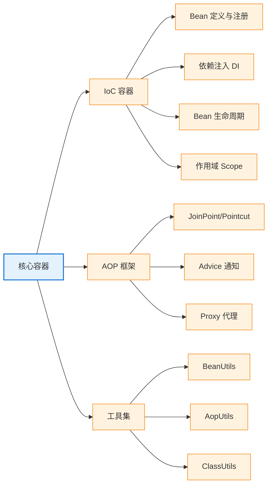

<!--
module:
  parent: spring
  slug: spring/core
  type: index
  category: 后端框架 / Spring 全家桶
  topic: Spring 核心容器
  audience: Java 后端工程师
  summary: Spring 核心容器 = IoC 容器 + AOP 框架 + 工具集（13 篇：IoC/AOP/依赖注入/配置/事件/异常/工具类/手写 mini Spring）
-->

# 01 核心容器

> 一句话定位：**Spring 核心容器 = IoC 容器 + AOP 框架 + 工具集**——掌握这三者，你就理解了 Spring 其他所有模块（Boot/Cloud/Data）的底层机制。

> ⬅️ [返回 Spring 顶层](../README.md)

---
## 引言：反直觉代码

01 核心容器 的关键不是语法——是**看起来对**的代码背后那些'踩坑点'。

本篇用 3 个反直觉片段切入，把面试/生产中常被问起、但一深入就漏馅的点摆出来。

---

## 🎯 一句话定位

**Spring 核心容器 = IoC 容器 + AOP 框架 + 工具集**——掌握了这三者，你就理解了 Spring 其他所有模块（Boot/Cloud/Data）的底层机制。

---

## 📚 章节导航

| 章节 | 文件 | 核心问题 | 建议时长 |
|:----:|:----|:---------|:--------:|
| **模块依赖** | [module.md](module.md) | Spring Framework 有哪些模块？怎么按需引入？ | 10 min |
| **IoC 容器** | [ioc/README.md](ioc/README.md) | 什么是控制反转？Bean 如何被创建和管理？ | 30 min |
| **依赖注入** | [ioc/dependency-injection.md](ioc/dependency-injection.md) | 构造器/Setter/字段注入有什么区别？ | 15 min |
| **@Configuration 进阶** | [configuration-lite-vs-full.md](configuration-lite-vs-full.md) | Lite vs Full Mode？@Import 三机制？ | 15 min |
| **外部化配置** | [externalized-configuration.md](externalized-configuration.md) | @Value vs @ConfigurationProperties？ | 15 min |
| **AOP 总览** | [aop/README.md](aop/README.md) | 什么是面向切面编程？Spring AOP 的核心概念 | 25 min |
| **Event 机制** | [event.md](event.md) | Spring Event 发布订阅？@TransactionalEventListener？ | 10 min |
| **异常处理** | [exception-handling.md](exception-handling.md) | 4 大异常处理层级？@ControllerAdvice？ | 12 min |
| **工具类** | [tools-reference.md](tools-reference.md) | Spring 自带 24 个工具类速查 | 速查 |
| **手写 mini Spring** | [minispring/microrest/README.md](minispring/microrest/README.md) | 200 行实现 IoC + MVC 的教学 demo | 教学 |

---

## 🧭 知识地图

---

## ⚡ 核心概念速查

| 概念 | 一句话定义 | 章节 |
|------|----------|:----:|
| **IoC** | 控制反转：把对象的创建权交给容器 | [IoC](ioc/README.md) |
| **DI** | 依赖注入：通过构造器/Setter/字段注入依赖 | [DI](ioc/dependency-injection.md) |
| **Bean** | 被 IoC 容器管理的对象 | [IoC](ioc/README.md) |
| **AOP** | 面向切面编程：在不修改业务代码的前提下添加横切关注点 | [AOP](aop/README.md) |
| **JoinPoint** | 程序执行的某个点（方法调用/异常抛出） | [AOP](aop/README.md) |
| **Pointcut** | 一组 JoinPoint 的集合（切入点表达式） | [AOP](aop/README.md) |
| **Advice** | 在 Pointcut 执行的逻辑（Before/After/Around） | [AOP](aop/README.md) |
| **Proxy** | AOP 的实现机制（JDK 动态代理/CGLIB） | [AOP](aop/README.md) |

---

## 🤔 思考

1. **IoC vs DI 是什么关系？** IoC 是一种设计思想（控制反转），DI 是 IoC 的具体实现方式之一。
2. **构造器注入 vs 字段注入？** 构造器注入允许 `final` 字段，利于测试；字段注入更简洁但不推荐。
3. **AOP 是怎么实现的？** 运行时通过 JDK 动态代理（接口）或 CGLIB 字节码增强（类）。
4. **Spring 自带的工具类有什么用？** 减少样板代码，统一处理反射、IO、字符串等通用操作。

---

## 相关章节

- ⬅️ [返回 Spring 顶层](../README.md)
- ➡️ [02 Web 层](../02-web/README.md) — Spring MVC 大量依赖 IoC 容器
- ➡️ [04 Spring Boot](../04-spring-boot/README.md) — 基于核心容器的"约定优于配置"
- [08 注解速查](../08-annotations/README.md) — IoC/AOP 相关注解

---

> 🚀 从 [IoC 容器](ioc/README.md) 开始

---

## 📊 本节统计（leaf MD 数）

| 子目录 | 篇数 |
|:------|:----:|
| `01-core/`（本目录直接） | 6 |
| ├─ `ioc/` | 5 |
| ├─ `aop/` | 2 |
| └─ `minispring/` | 0 |
| **合计** | **13** |

> 数字基线：以 leaf MD 数（含子目录与子子目录的 .md，不含任何 README 索引页）为统计口径。统计时间 2026-07-01。

← [返回 Spring 顶层](../README.md)
