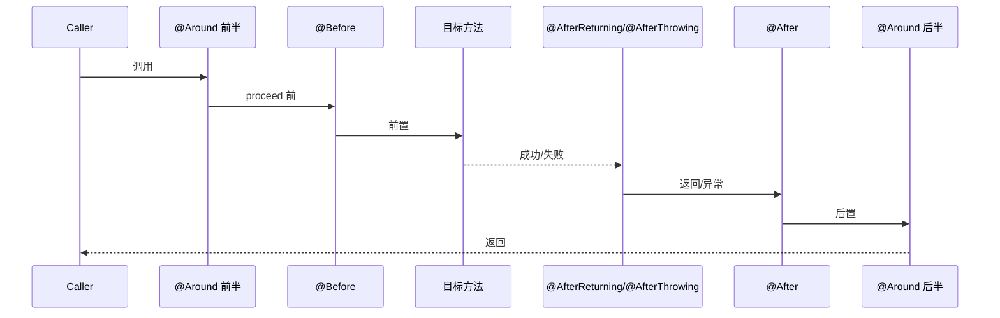
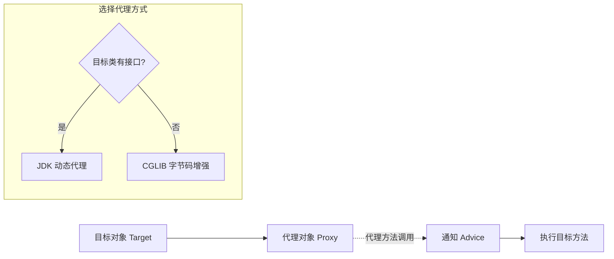

<!--
module:
  parent: spring
  slug: spring/aop
  type: article
  category: 主模块子文章
  summary: Spring AOP 深度解析
-->

# Spring AOP 深度解析

> ⬅️ [返回 01 核心容器](../README.md)

---
---

## 🎯 一句话定位

**Spring AOP = 面向切面编程**——把分散在多个模块中的共同功能（日志、事务、安全、缓存）抽取为**切面**，让业务代码只关注业务本身，**横切关注点由切面统一处理**。

---

## 📚 章节导航

| 章节 | 核心问题 | 阅读时长 |
|:-----|:---------|:--------:|
| [切点表达式语法](pointcut-expression.md) | execution/within/bean/@annotation 怎么写？ | 15 min |
| [通知顺序与最佳实践](advice-order-and-best-practices.md) | 多切面顺序如何控制？AOP 怎么避坑？ | 12 min |

---

## 一、为什么需要 AOP

> Spring AOP（面向切面编程）作为一种强大的编程范式，为模块化应用程序中的**横切关注点**提供了有效解决方案。

横切关注点常见示例：
- 📝 日志记录（每个方法都要记）
- 🔒 安全检查（每个接口都要验）
- 💰 事务管理（每个写操作都要有）
- ⚡ 缓存（每个读操作都要有）
- 📊 性能监控（每个方法都要量）

**没有 AOP 时的痛点**：
- 业务代码中混杂大量重复的横切逻辑（日志、事务、安全）
- 修改横切逻辑要改 N 个文件（违反"开闭原则"）
- 横切逻辑和业务逻辑高度耦合

**使用 AOP 后**：
- 业务代码干净（只有业务逻辑）
- 横切逻辑集中在切面（修改切面 = 修改所有目标）
- 横切和业务完全解耦

---

## 二、4 大核心概念

| 概念 | 英文 | 含义 | 实际对应 |
|------|------|------|---------|
| **连接点** | Join Point | 程序执行过程中的一个特定点 | 方法执行、对象实例化、字段访问、异常抛出 |
| **切入点** | Pointcut | 一组连接点的集合 | `execution(* com.pack.service.*.*(..))` |
| **通知** | Advice | 在连接点执行的操作 | `@Before`、`@After`、`@Around` |
| **切面** | Aspect | 切入点和通知的组合 | `@Aspect` 注解的类 |

### 概念关系图

```mermaid
graph TB
    Aspect[切面 @Aspect] --> PC[切入点 Pointcut<br/>在哪里切]
    Aspect --> Adv[通知 Advice<br/>切了做什么]

    PC --> JP1[连接点 1<br/>方法 A]
    PC --> JP2[连接点 2<br/>方法 B]
    PC --> JP3[连接点 3<br/>方法 C]

    Adv --> Before[@Before]
    Adv --> After[@After]
    Adv --> AfterR[@AfterReturning]
    Adv --> AfterT[@AfterThrowing]
    Adv --> Around[@Around]
```

---

## 三、5 种通知类型

| 通知 | 注解 | 执行时机 | 能否改变返回值 | 典型用途 |
|------|------|---------|:------------:|---------|
| **前置通知** | `@Before` | 方法执行**前** | ❌ | 参数校验、权限检查 |
| **后置通知** | `@After` | 方法执行**后**（无论成败） | ❌ | 资源清理 |
| **返回通知** | `@AfterReturning` | 方法**成功返回**后 | ❌ | 审计日志 |
| **异常通知** | `@AfterThrowing` | 方法**抛异常**时 | ❌ | 异常告警 |
| **环绕通知** | `@Around` | 包围方法**前后** | ✅ | 性能监控、事务、缓存 |

> 详见 [08 注解/AOP 注解](../../08-annotations/aop.md#5-种通知)

### 5 种通知的执行顺序



---

## 四、Spring AOP vs AspectJ

| 维度 | Spring AOP | AspectJ |
|------|-----------|---------|
| **实现方式** | 动态代理（JDK/CGLIB） | 编译期/类加载期织入（静态） |
| **性能** | 运行时生成代理，有性能损耗 | 编译期织入，性能好 |
| **支持范围** | 仅方法级别 | 字段、构造方法、final 方法等 |
| **复杂度** | 简单，集成 Spring | 复杂，需要编译期配置 |
| **典型场景** | 99% 的 Spring 项目 | 性能敏感的复杂切面 |

> 📌 **Spring 项目 99% 用 Spring AOP 即可**。仅在需要拦截字段/构造方法/final 方法时考虑 AspectJ。

---

## 五、Spring AOP 的底层实现



- **JDK 动态代理**：基于接口，生成 `$Proxy0` 类（Java 自带）
- **CGLIB**：基于继承，生成目标类的子类（`Enhancer`）

> Spring Boot 默认 `proxyTargetClass = true`，**总是使用 CGLIB**。

---

## 六、整体知识图谱

```mermaid
graph TB
    AOP[Spring AOP] --> Con[核心概念]
    AOP --> PC[切点表达式]
    AOP --> Adv[通知类型]
    AOP --> Order[切面顺序]
    AOP --> Best[最佳实践]

    Con --> JoinPoint[连接点]
    Con --> Pointcut[切入点]
    Con --> Advice[通知]
    Con --> Aspect[切面]

    PC --> Exec[execution]
    PC --> Within[within]
    PC --> Bean[bean]
    PC --> Ann[@annotation]

    Adv --> Before[@Before]
    Adv --> After[@After]
    Adv --> AfterR[@AfterReturning]
    Adv --> AfterT[@AfterThrowing]
    Adv --> Around[@Around]

    Order --> OrderAnno[@Order]
    Order --> OrderInt[Ordered 接口]
```

---

## 七、4 大最佳实践（速览）

1. **合理设计切入点表达式**：避免过于宽泛；优先用 `@annotation` 按自定义注解切
2. **切面顺序管理**：简单用 `@Order`，复杂用 `Ordered` 接口
3. **性能优化**：避免在切面中执行耗时操作；切点表达式越精确越好
4. **异常处理**：业务异常直接抛出；用 `@AfterThrowing` 统一处理

> 详见 [通知顺序与最佳实践](advice-order-and-best-practices.md)

---

## 🤔 思考

1. **AOP 和 OOP 是什么关系？** AOP 是 OOP 的补充——OOP 用继承/多态处理**纵向**复用（父子类），AOP 用切面处理**横向**复用（多个模块的共同逻辑）。
2. **AOP 有什么缺点？** 调试困难（运行时才生成代理）；切面顺序问题（多个切面拦截同一方法时）；性能损耗（虽然很小）。
3. **为什么 Spring 选用动态代理而不是字节码织入？** 与 Spring 容器集成更简单；运行时决定代理生成；不需要额外编译期配置。
4. **AOP 拦截 Bean 的构造方法吗？** Spring AOP 不能；AspectJ 可以。

---

## 相关章节

- ⬅️ [返回 01 核心容器](../README.md)
- [切点表达式语法](pointcut-expression.md)
- [通知顺序与最佳实践](advice-order-and-best-practices.md)
- [08 注解/AOP 注解](../../08-annotations/aop.md)
- [03 数据层/事务](../../03-data/transaction/README.md) — 事务是 AOP 的经典应用

← [返回: Spring 全家桶 · aop](README.md)
