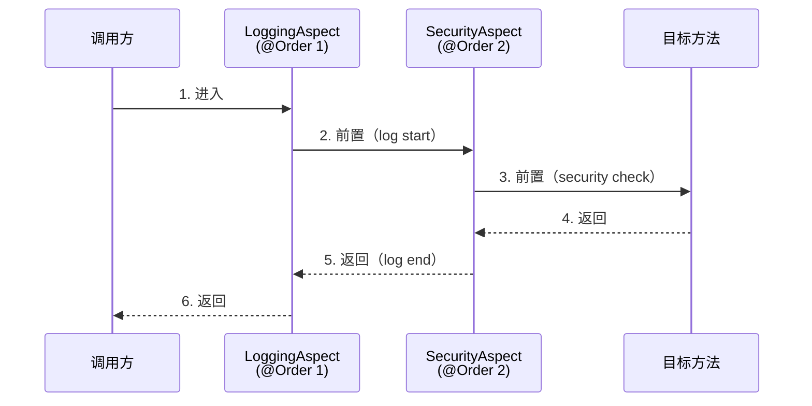

# 通知顺序与最佳实践

> 最后更新: 2026-06-09
> ⬅️ [返回 AOP 总览](README.md) | [切点表达式语法](pointcut-expression.md)

多个 AOP 切面拦截同一方法时，**执行顺序至关重要**——日志要在安全检查之前还是之后？事务要在缓存之前还是之后？本文介绍如何控制切面执行顺序，以及 AOP 开发的最佳实践。

---

## 🎯 一句话定位

**切面顺序控制 = "@Order 数字"**——数字越小优先级越高（外层 → 内层）。事务/安全/缓存 三大切面的推荐顺序：**安全 → 日志 → 事务 → 缓存 → 业务**。

---

## 一、为什么需要控制顺序

### 场景示例

假设有以下两个切面：
- **LoggingAspect**：负责记录日志
- **SecurityAspect**：负责安全检查

**需求**：在进行安全检查**之前**生成全面的日志。

如果**没有顺序控制**，两个切面的执行顺序是**未定义的**（取决于 JVM 类加载顺序），可能导致：
- 日志记录了不该记录的信息（安全检查未通过）
- 错误堆栈中切面顺序混乱

---

## 二、3 种顺序控制方法

### 方法 1：@Order 注解（**推荐**）

> `@Order` 注解用于定义切面的执行顺序，**顺序值较低的切面优先执行**。

```java
@Aspect
@Order(1)        // 数字越小，优先级越高
@Component
public class LoggingAspect {
    // 第一个执行
}

@Aspect
@Order(2)        // 数字越大，优先级越低
@Component
public class SecurityAspect {
    // 最后执行
}
```

**特点**：
- 具有相同顺序值的切面将以**任意顺序**执行
- 未提供排序值的切面会被隐式地分配一个 `Ordered.LOWEST_PRECEDENCE` 值

### 方法 2：实现 Ordered 接口

> 通过实现 `Ordered` 接口，可以对切面的顺序值进行更灵活的控制（可以用配置文件注入顺序值）。

```java
@Aspect
@Component
public class LoggingAspect implements Ordered {
    @Override
    public int getOrder() {
        return 1;
    }
    // 第一个执行
}

@Aspect
@Component
public class SecurityAspect implements Ordered {
    @Override
    public int getOrder() {
        return 2;
    }
    // 最后执行
}
```

### 方法 3：自定义 OrderRegistry（高级）

> 在某些复杂场景下，可以自定义 `BeanPostProcessor` 来动态控制切面顺序。

```java
@Component
public class AspectOrderRegistry implements BeanPostProcessor {
    @Override
    public Object postProcessAfterInitialization(Object bean, String beanName) {
        if (bean instanceof Ordered) {
            int order = ((Ordered) bean).getOrder();
            // 记录到 registry，运行时查询
        }
        return bean;
    }
}
```

---

## 三、@Order 的"内外层"语义

> `@Order` 数字越小，**优先级越高**。在多层切面嵌套中，越外层越先进入。



**关键点**：
- `@Order(1)` 的 `LoggingAspect` 是**最外层**——先进入、后退出
- `@Order(2)` 的 `SecurityAspect` 是**内层**
- @Before 执行顺序：Logging → Security → Target
- @After 执行顺序：Target → Security → Logging（**与 Before 相反**）

---

## 四、完整示例：日志 + 安全

### 1. LoggingAspect

```java
@Aspect
@Order(1)
@Component
public class LoggingAspect {
    private static final Logger logger = LoggerFactory.getLogger(LoggingAspect.class);

    @Before("execution(* com.pack.service.*.*(..))")
    public void logBefore() {
        logger.info("LoggingAspect: Logging before method execution");
    }

    @After("execution(* com.pack.service.*.*(..))")
    public void logAfter() {
        logger.info("LoggingAspect: Logging after method execution");
    }
}
```

### 2. SecurityAspect

```java
@Aspect
@Order(2)
@Component
public class SecurityAspect {
    private static final Logger logger = LoggerFactory.getLogger(SecurityAspect.class);

    @Before("execution(* com.pack.service.*.*(..))")
    public void checkSecurity() {
        logger.info("SecurityAspect: Performing security check before method execution");
    }
}
```

### 3. 执行结果

```
INFO  LoggingAspect: Logging before method execution
INFO  SecurityAspect: Performing security check before method execution
INFO  LoggingAspect: Logging after method execution
```

---

## 五、推荐顺序：5 大常见切面

| 优先级 | 切面 | @Order | 原因 |
|:-----:|:-----|:------:|:-----|
| 1 | **SecurityAspect** | 1 | 拒绝未授权访问 |
| 2 | **LoggingAspect** | 2 | 记录入口/出口（覆盖安全结果） |
| 3 | **TransactionalAspect** | 3 | 包裹业务，开启事务 |
| 4 | **CacheAspect** | 4 | 缓存读写（事务之后） |
| 5 | **BusinessAspect** | 5 | 自定义业务逻辑 |
| 6 | **MonitorAspect** | 6 | 性能监控（最外层） |

> 📌 经验法则：**越"基础设施"的切面，优先级越低**（越外层）；越"业务"的切面，优先级越高（越内层）。

---

## 六、@EnableAspectJAutoProxy 详解

> **用于开启对 AspectJ 代理的支持**，通常在配置类上使用。

```java
@Configuration
@EnableAspectJAutoProxy
public class AspectConfiguration {
    // 其他 Spring 配置
}
```

### proxyTargetClass 属性

> 控制 AOP 代理的方式（JDK 动态代理 vs CGLIB）。

| 属性值 | 代理方式 | 适用场景 |
|--------|---------|----------|
| `proxyTargetClass = false`（默认） | JDK 动态代理 | 目标类有接口 |
| `proxyTargetClass = true` | CGLIB | 目标类无接口 |

```java
@Configuration
@EnableAspectJAutoProxy(proxyTargetClass = true)  // 强制 CGLIB
public class AspectConfiguration { }
```

> 📌 **Spring Boot 默认 `proxyTargetClass = true`**（AopAutoConfiguration 中设置），所以 Spring Boot 项目**无需手动添加 @EnableAspectJAutoProxy**。

### exposeProxy 属性

> 是否将代理对象暴露给 `AopContext.currentProxy()`，用于解决**自调用问题**。

```java
@Configuration
@EnableAspectJAutoProxy(exposeProxy = true)
public class AspectConfiguration { }
```

```java
@Service
public class OrderService {
    public void createOrder() {
        // 自调用，绕过代理 → 事务失效
        // saveOrder();

        // 通过 AopContext 拿到代理对象 → 事务生效
        ((OrderService) AopContext.currentProxy()).saveOrder();
    }

    @Transactional
    public void saveOrder() {
        // ...
    }
}
```

---

## 七、最佳实践

### 1. 合理设计切入点表达式

- **避免过于宽泛**的切入点表达式（如 `execution(* *..*(..))`），**影响性能**
- 使用**有意义的命名**和注释，提高代码可读性
- 优先用 `@annotation` 按自定义注解切（最清晰）

### 2. 切面顺序管理

- 对于**有依赖关系的切面**，明确指定执行顺序
- **简单排序用 `@Order`**，复杂场景可实现 `Ordered` 接口
- 在 `@Order` 旁加注释说明顺序原因

### 3. 性能优化

- **避免在切面中执行耗时操作**（如网络调用）
- 考虑使用**缓存机制**优化频繁调用的切面逻辑
- 切点表达式**越精确越好**（避免扫描所有方法）

### 4. 异常处理

- 在切面中**妥善处理异常**，避免影响主业务流程
- 考虑使用 `@AfterThrowing` 通知进行**统一的异常处理**
- 业务异常**直接抛出**，不要在切面中吞掉

### 5. 避免自调用

- 自调用绕过 AOP 代理，会导致 `@Transactional`/`@Cacheable` 等失效
- 解决方案：
  1. 注入自身代理（`@Autowired private OrderService self;`）
  2. `AopContext.currentProxy()`（需要 `exposeProxy = true`）
  3. 拆分到不同的 Bean

### 6. 调试与监控

- 用 **AOP 调试日志** 确认切面是否生效
- 用 **Spring AOP 的工具**（如 `ProceedingJoinPoint.getTarget()`）查看真实目标对象

---

## 🤔 思考

1. **为什么 @Order 数字越小越外层？** Spring 内部的 `DefaultAdvisorChainFactory` 按 `@Order` 升序排序，越小的越先进入拦截链。
2. **同一通知类型的多个切面顺序？** 按 @Order 升序执行（Before）；@After 阶段按降序执行。
3. **JDK 代理和 CGLIB 性能差异？** 现代 JVM 上 CGLIB 性能更好（Java 17+ 内联优化）。
4. **AOP 能拦截 final 方法吗？** 不能。CGLIB 不能 override final 方法。

---

## 相关章节

- ⬅️ [返回 AOP 总览](README.md)
- [切点表达式语法](pointcut-expression.md)
- [08 注解/AOP 注解](../../08-annotations/aop.md)
- [01 核心容器/事务/事务失效](../../03-data/transaction/failure-cases.md) — 自调用导致事务失效
