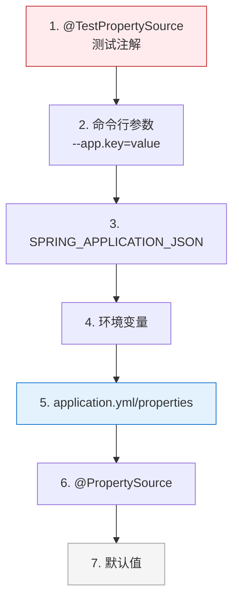

# 外部化配置：@Value / @ConfigurationProperties / Environment

> ⬅️ [返回 01 核心容器](README.md) | [@Configuration 进阶](configuration-lite-vs-full.md) | [IoC 总览](ioc/README.md)

Spring 提供多层次的外部化配置能力：从简单的 `@Value` 单值注入，到类型安全的 `@ConfigurationProperties` 批量绑定，再到 `Environment` 抽象与 `PropertySource` 加载链。理解它们的分工，是写出"配置可移植、应用可维护"代码的前提。

---

## 🎯 一句话定位

**`@Value` = 单值、SpEL、占位符三合一**  
**`@ConfigurationProperties` = 批量绑定、类型安全、支持校验**  
**`Environment` + `PropertySource` = 配置的统一入口与加载链**

---

## 一、@Value vs @ConfigurationProperties 选型

| 维度 | `@Value` | `@ConfigurationProperties` |
|------|----------|---------------------------|
| **绑定数量** | 单字段 | 一组相关字段（一个 JavaBean） |
| **类型安全** | 弱（基本类型需手动转） | 强（自动按类型转换） |
| **松散绑定** | ❌ | ✅（`app.user-name` ↔ `userName`） |
| **SpEL** | ✅（`#{...}`） | ❌ |
| **占位符** | ✅（`${...}`） | ✅（`${...}`） |
| **JSR-303 校验** | ❌ | ✅（`@Valid` + `@NotNull` 等） |
| **元数据 / IDE 提示** | ❌ | ✅（`spring-boot-configuration-processor`） |
| **典型场景** | 单值、动态表达式 | 一组相关配置（database、redis...） |

### 选型决策

```
需要绑定一组相关字段？ ─ 是 ─→ @ConfigurationProperties
              │
              否
              ↓
      需要 SpEL？ ─ 是 ─→ @Value
              │
              否
              ↓
      简单 ${...} 即可 ──→ @Value
```

---

## 二、@Value 详解

### 2.1 三种语法

```java
@Value("literal")                        // ① 字面量
private String mode;                     // → "literal"

@Value("${app.name}")                    // ② 占位符
private String appName;                  // → 配置文件中 app.name 的值

@Value("#{T(System).currentTimeMillis()}") // ③ SpEL
private long startTime;                  // → 表达式计算结果
```

### 2.2 占位符与默认值

```java
@Value("${app.name:defaultName}")        // 缺失时使用 defaultName
private String name;

@Value("${app.timeout:3000}")
private int timeout;                      // 自动转 int
```

### 2.3 注入 List / Map

```properties
# application.properties
app.endpoints=http://a.com,http://b.com,http://c.com
app.labels={env: prod, region: cn-east}
```

```java
@Value("${app.endpoints}")
private List<String> endpoints;           // → ["http://a.com", ...]

@Value("#{${app.labels}}")
private Map<String, String> labels;       // → {env=prod, region=cn-east}
```

### 2.4 局限

- 字段多时**重复样板代码**多；
- 无法集中校验、IDE 提示差；
- 不支持元数据（写错 key 不会编译期报错）。

---

## 三、@ConfigurationProperties 详解

### 3.1 基本用法

```java
@Component
@ConfigurationProperties(prefix = "app.datasource")
@Validated
public class DataSourceProperties {

    @NotBlank
    private String url;

    private String username;
    private String password;
    private int maxPoolSize = 10;

    private Map<String, String> options;

    // getter / setter ...
}
```

```properties
# application.properties
app.datasource.url=jdbc:mysql://localhost:3306/test
app.datasource.username=root
app.datasource.password=secret
app.datasource.max-pool-size=20
app.datasource.options.timeout=3000
```

效果：`url` 自动绑定 `app.datasource.url`；`maxPoolSize` 自动绑定 `app.datasource.max-pool-size`（松散匹配）。

### 3.2 三种启用方式

| 方式 | 示例 | 适用场景 |
|------|------|----------|
| `@Component` + `@ConfigurationProperties` | 标注在普通类上 | 业务自定义配置 |
| `@EnableConfigurationProperties(XxxProperties.class)` | 在 `@Configuration` 上启用 | 第三方库暴露配置 |
| `@ConfigurationPropertiesScan` | 扫描包路径下所有 `@ConfigurationProperties` | Spring Boot 项目批量启用 |

```java
// 方式 2：第三方库风格
@Configuration
@EnableConfigurationProperties(DataSourceProperties.class)
public class DataSourceAutoConfig {
    @Bean
    public DataSource dataSource(DataSourceProperties props) {
        return new HikariDataSource(props.toHikariConfig());
    }
}
```

### 3.3 不可变配置（推荐）

```java
@ConfigurationProperties(prefix = "app.datasource")
public record DataSourceProperties(
    @NotBlank String url,
    String username,
    String password,
    @DefaultValue("10") int maxPoolSize
) {}
```

- 字段 `final`、线程安全；
- `record` 自带构造器、getter；
- `@DefaultValue` 提供缺失时的默认值。

### 3.4 嵌套对象 / 集合

```properties
app.redis.host=localhost
app.redis.port=6379
app.redis.timeout=2000
app.shards[0].name=a
app.shards[0].weight=1
app.shards[1].name=b
app.shards[1].weight=2
```

```java
@Data
@ConfigurationProperties(prefix = "app")
public class AppProperties {
    private Redis redis;
    private List<Shard> shards = new ArrayList<>();

    @Data
    public static class Redis {
        private String host;
        private int port;
        private long timeout;
    }

    @Data
    public static class Shard {
        private String name;
        private int weight;
    }
}
```

---

## 四、@PropertySource 加载外部 properties

> `@PropertySource` 用于加载**额外的 properties / yml 文件**（Spring Boot 默认 `application.yml` 已自动加载，无需标注）。

```java
@Configuration
@PropertySource("classpath:db.properties")
@PropertySource("classpath:redis.properties")
public class ExtraConfig { ... }
```

特性：

- 支持 `classpath:` / `file:` / `http:` 等资源前缀；
- 默认忽略找不到的文件，可加 `ignoreResourceNotFound = true`；
- 不支持 yml（yml 由 Spring Boot 处理）；
- 与 `@Value("${...}")` 配合使用。

---

## 五、Environment 抽象

`Environment` 是 Spring 提供的**统一配置访问入口**，封装了：

1. **profiles** —— 多环境切换；
2. **propertySources** —— 多个 `PropertySource` 组成的**查找链**。

```java
@Autowired
private Environment env;

String url = env.getProperty("app.datasource.url");
String[] activeProfiles = env.getActiveProfiles();
```

### 5.1 PropertySource 加载链（优先级从高到低）



> 高优先级覆盖低优先级。Spring Boot 启动时会按此顺序解析。

### 5.2 自定义 PropertySource

```java
public class MyPropertySource extends PropertySource<String> {

    public MyPropertySource() {
        super("myCustomSource");
    }

    @Override
    protected String getProperty(String name) {
        // 从 DB / 配置中心 / Nacos 取值
        if ("app.feature.flag".equals(name)) {
            return configService.getFeatureFlag(name);
        }
        return null;
    }
}

// 注入到 Environment
@Configuration
public class CustomConfig {
    @Bean
    public PropertySource<?> myPropertySource() {
        return new MyPropertySource();
    }
}
```

---

## 六、Placeholder 与 SpEL

### 6.1 ${...} 占位符

- 由 `PropertySourcesPlaceholderConfigurer`（一个 `BeanFactoryPostProcessor`）解析；
- 查找顺序遵循 Environment 的 PropertySource 链；
- 支持默认值：`${app.name:defaultValue}`。

### 6.2 #{...} SpEL

```java
@Value("#{T(Math).random() * 100.0}")
private double randomScore;

@Value("#{userService.findActive()?.name}")
private String activeName;   // 安全导航：findActive() 返回 null 时不抛 NPE

@Value("#{systemProperties['user.dir']}")
private String userDir;
```

> 📌 SpEL 在 `@Value` 中可用，在 `@ConfigurationProperties` 中**不可用**——后者只支持 `${...}`。

---

## 七、实战模板（推荐）

```java
// 1. 定义不可变配置类
@ConfigurationProperties(prefix = "app.payment")
public record PaymentProperties(
    @NotBlank String apiKey,
    @DefaultValue("https://api.example.com") String endpoint,
    @DefaultValue("30") @Min(1) @Max(120) int timeoutSeconds,
    Retry retry
) {
    public record Retry(
        @DefaultValue("3") int maxAttempts,
        @DefaultValue("1000") long backoffMs
    ) {}
}

// 2. 启用
@SpringBootApplication
@EnableConfigurationProperties(PaymentProperties.class)
public class App { ... }

// 3. 注入使用
@Service
public class PaymentService {
    private final PaymentProperties props;

    public PaymentService(PaymentProperties props) {
        this.props = props;
    }

    public void pay() {
        // props.apiKey(), props.endpoint(), props.retry().maxAttempts()
    }
}
```

---

## 八、最佳实践

1. **业务配置优先 `@ConfigurationProperties` + record** —— 类型安全、不可变、易测试。
2. **运行时动态值 / 简单场景用 `@Value`** —— 配合 `${}` 与 `#{}` 灵活组合。
3. **集中管理 key 前缀**（如 `app.payment.*`、`app.redis.*`），避免散落。
4. **关键配置加 `@Validated` + JSR-303 注解** —— 启动时即失败。
5. **不要在配置里放业务逻辑** —— 配置只提供数据，逻辑写在代码里。

---

## 🤔 思考

1. **同一字段，`@Value` 和 `@ConfigurationProperties` 都能注入，优先级？** 注入路径不同（前者基于字段名查找、后者基于 prefix + setter），一般不会冲突。
2. **`@ConfigurationProperties` 支持 `record` 吗？** 支持（Spring Boot 2.6+）。
3. **运行时改配置文件，Bean 会更新吗？** 默认不会。需配合 Spring Cloud Config / Nacos 配置中心 + `@RefreshScope`。

---

## 相关章节

- ⬅️ [返回 01 核心容器](README.md)
- [@Configuration 进阶](configuration-lite-vs-full.md) — `@EnableConfigurationProperties` 的来源
- [IoC 总览](ioc/README.md)
- [Bean 生命周期](ioc/bean-lifecycle.md) — `PropertySourcesPlaceholderConfigurer` 是 `BeanFactoryPostProcessor`
- [Spring Boot 外部化配置](../04-spring-boot/boot-externalized-configuration.md) — application.yml 加载顺序、spring.config.import
