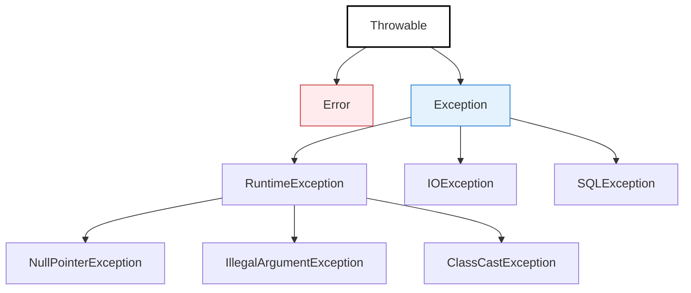

# Spring 异常处理机制

> ⬅️ [返回 01 核心容器](README.md)

Spring 提供了**多层级**的异常处理机制，从最底层的 `@ControllerAdvice` 全局处理到 AOP 切面处理，再到业务代码的 `try-catch`，让异常处理既灵活又规范。

---

## 🎯 一句话定位

**Spring 异常处理 = "分而治之"**——Web 层用 `@ControllerAdvice` + `@ExceptionHandler`，业务层抛业务异常，AOP 切面统一处理横切异常。**异常在恰当的层级被恰当的方式处理**。

---

## 一、异常处理层级

```mermaid
graph TB
    Top[Controller 局部<br/>@ExceptionHandler] -->|未匹配| Mid[全局<br/>@ControllerAdvice]
    Mid -->|未匹配| AOP[AOP 切面<br/>@AfterThrowing]
    AOP -->|未匹配| Default[Spring 默认<br/>500 错误]

    style Top fill:#e8f5e9,stroke:#388e3c
    style Mid fill:#fff3e0,stroke:#f57c00
    style AOP fill:#e3f2fd,stroke:#1976d2
    style Default fill:#ffebee,stroke:#c62828
```

| 层级 | 机制 | 范围 |
|------|------|------|
| **Controller 局部** | `@ExceptionHandler` | 单个 Controller |
| **全局** | `@ControllerAdvice` + `@ExceptionHandler` | 所有 Controller |
| **AOP 切面** | `@AfterThrowing` | 任何 Bean 方法 |
| **Spring 默认** | BasicErrorController | 所有未捕获异常 |

---

## 二、Controller 局部处理（@ExceptionHandler）

> 在单个 Controller 内部处理异常，**只对该 Controller 生效**。

```java
@RestController
@RequestMapping("/users")
public class UserController {

    @GetMapping("/{id}")
    public User getUser(@PathVariable Long id) {
        return userService.getById(id);  // 可能抛 UserNotFoundException
    }

    // 局部异常处理（仅本 Controller 生效）
    @ExceptionHandler(UserNotFoundException.class)
    public ResponseEntity<String> handleNotFound(UserNotFoundException e) {
        return ResponseEntity.status(404).body("用户不存在：" + e.getMessage());
    }
}
```

**特点**：
- 优先级**最高**（先于 @ControllerAdvice）
- 适合处理**特定 Controller 的特定异常**

---

## 三、全局处理（@ControllerAdvice + @ExceptionHandler）

> 集中处理所有 Controller 抛出的异常，避免每个 Controller 重复写异常处理。

```java
@RestControllerAdvice
@Slf4j
public class GlobalExceptionHandler {

    // 业务异常 → 返回业务码
    @ExceptionHandler(BusinessException.class)
    public Result<Object> handleBusiness(BusinessException e) {
        log.warn("业务异常：{}", e.getMessage());
        return Result.fail(e.getCode(), e.getMessage());
    }

    // 参数校验异常 → 提取字段错误
    @ExceptionHandler(MethodArgumentNotValidException.class)
    public Result<Object> handleValidation(MethodArgumentNotValidException e) {
        Map<String, String> errors = new HashMap<>();
        e.getBindingResult().getFieldErrors().forEach(err ->
            errors.put(err.getField(), err.getDefaultMessage()));
        return Result.fail(400, "参数校验失败").with("errors", errors);
    }

    // 兜底异常 → 500 错误
    @ExceptionHandler(Exception.class)
    public Result<Object> handleAny(Exception e) {
        log.error("系统异常", e);
        return Result.fail(500, "系统繁忙，请稍后再试");
    }
}
```

> 📌 **@RestControllerAdvice = @ControllerAdvice + @ResponseBody**，所有方法返回值默认序列化为 JSON。

详见 [08 注解/异常注解](../08-annotations/exception.md)

### 限制范围

```java
// 只处理特定包
@ControllerAdvice(basePackages = "com.example.api")

// 只处理特定注解
@ControllerAdvice(annotations = RestController.class)

// 只处理特定类
@ControllerAdvice(assignableTypes = {UserController.class, OrderController.class})
```

---

## 四、AOP 切面处理（@AfterThrowing）

> 用 AOP 在**任何 Bean 方法**抛出异常时统一处理，**不仅限 Web 层**。

```java
@Aspect
@Component
@Slf4j
public class ServiceExceptionAspect {

    @AfterThrowing(pointcut = "execution(* com.example.service..*.*(..))", throwing = "ex")
    public void handleServiceException(JoinPoint joinPoint, Exception ex) {
        String methodName = joinPoint.getSignature().getName();
        log.error("Service method {} threw exception: {}", methodName, ex.getMessage());
        // 可选：上报监控系统
        monitorService.report(joinPoint.getSignature().toShortString(), ex);
    }
}
```

**适用场景**：
- 业务层异常统一打日志
- 异常上报监控系统（Sentry、Prometheus）
- 异常重试、告警

详见 [AOP 切面处理](aop/README.md)

---

## 五、Spring 内置异常体系



| 类型 | 说明 | Spring 行为 |
|------|------|------------|
| **Error** | 系统级错误（OOM、StackOverflow） | 不应捕获 |
| **RuntimeException** | 非检查型异常 | 事务**默认回滚** |
| **Exception（检查型）** | 检查型异常（IOException、SQLException） | 事务**默认不回滚** |

---

## 六、@ResponseStatus 自定义 HTTP 状态码

```java
@ResponseStatus(HttpStatus.NOT_FOUND)
public class ResourceNotFoundException extends RuntimeException {
    public ResourceNotFoundException(String message) {
        super(message);
    }
}

// 使用
throw new ResourceNotFoundException("用户不存在");
// → HTTP 404
```

---

## 七、4 个实战模式

### 模式 1：统一业务异常

```java
// 1. 业务异常基类
@Getter
public class BusinessException extends RuntimeException {
    private final int code;
    private final String message;

    public BusinessException(int code, String message) {
        super(message);
        this.code = code;
        this.message = message;
    }
}

// 2. 具体业务异常
public class OrderNotFoundException extends BusinessException {
    public OrderNotFoundException(Long orderId) {
        super(40401, "订单不存在：" + orderId);
    }
}

// 3. 全局处理
@RestControllerAdvice
public class GlobalExceptionHandler {
    @ExceptionHandler(BusinessException.class)
    public Result<Object> handleBusiness(BusinessException e) {
        return Result.fail(e.getCode(), e.getMessage());
    }
}
```

### 模式 2：参数校验异常

```java
@PostMapping
public User createUser(@Valid @RequestBody CreateUserDTO dto) {
    return userService.create(dto);
}

@ExceptionHandler(MethodArgumentNotValidException.class)
public Result<Object> handleValidation(MethodArgumentNotValidException e) {
    String message = e.getBindingResult().getFieldErrors().stream()
        .map(fe -> fe.getField() + ": " + fe.getDefaultMessage())
        .collect(Collectors.joining("; "));
    return Result.fail(400, message);
}
```

### 模式 3：404/500 通用错误页面

```java
@Controller
public class ErrorController implements ErrorController {

    @RequestMapping("/error")
    public String handleError(HttpServletRequest request) {
        Object status = request.getAttribute(RequestDispatcher.ERROR_STATUS_CODE);
        if (status != null) {
            int code = Integer.parseInt(status.toString());
            if (code == 404) return "error/404";
            if (code == 500) return "error/500";
        }
        return "error/general";
    }
}
```

### 模式 4：Filter 异常处理

> Filter 异常**不经过 DispatcherServlet**，所以 @ControllerAdvice 抓不到。

```java
@Component
public class MyFilter extends OncePerRequestFilter {

    @Override
    protected void doFilterInternal(HttpServletRequest req, HttpServletResponse resp, FilterChain chain) {
        try {
            chain.doFilter(req, resp);
        } catch (Exception e) {
            // 手动处理异常
            resp.setStatus(500);
            resp.getWriter().write("Filter error: " + e.getMessage());
        }
    }
}
```

---

## 八、完整实战：分层异常处理

```mermaid
graph TB
    Service[Service 层] -->|抛 BusinessException| Controller[Controller]
    Controller -->|抛 RuntimeException| Advice[@ControllerAdvice]
    Advice -->|未匹配| Default[Spring 默认]

    Service -.AOP.-> AOP[ServiceExceptionAspect<br/>统一日志]
    AOP -.上报.-> Monitor[监控系统]

    style Service fill:#e8f5e9,stroke:#388e3c
    style Controller fill:#e3f2fd,stroke:#1976d2
    style Advice fill:#fff3e0,stroke:#f57c00
```

```java
// 1. Service 层：抛业务异常
@Service
public class OrderService {
    public Order getById(Long id) {
        return orderRepository.findById(id)
            .orElseThrow(() -> new OrderNotFoundException(id));
    }
}

// 2. AOP 层：统一日志
@Aspect
@Component
public class ServiceExceptionAspect {
    @AfterThrowing(pointcut = "execution(* com.example.service..*.*(..))", throwing = "ex")
    public void log(JoinPoint jp, Exception ex) {
        log.error("Service.{} exception: {}", jp.getSignature().getName(), ex.getMessage());
    }
}

// 3. Controller 层：业务异常自动处理（@ControllerAdvice 已配置）
@RestController
public class OrderController {
    @GetMapping("/orders/{id}")
    public Order get(@PathVariable Long id) {
        return orderService.getById(id);
    }
}

// 4. 全局异常处理
@RestControllerAdvice
public class GlobalExceptionHandler {
    @ExceptionHandler(BusinessException.class)
    public Result<Object> handleBusiness(BusinessException e) {
        return Result.fail(e.getCode(), e.getMessage());
    }
}
```

---

## 九、5 条最佳实践

1. **业务异常继承统一基类**：便于统一处理（如 `BusinessException`）
2. **用错误码而不是异常消息做判断**：错误码稳定，消息可能国际化变化
3. **不要在 Controller 写 try-catch**：交给 @ControllerAdvice 统一处理
4. **异常一定要打日志**：尤其是兜底异常（`@ExceptionHandler(Exception.class)`）
5. **区分异常类型处理**：业务异常（明确信息） vs 系统异常（隐藏细节） vs 校验异常（详细字段错误）

---

## 🤔 思考

1. **@ExceptionHandler 和 @ControllerAdvice 关系？** @ExceptionHandler 可单独用（局部）或配合 @ControllerAdvice（全局）。
2. **@AfterThrowing 异常处理和 @ControllerAdvice 区别？** @ControllerAdvice 只处理 Web 层；@AfterThrowing 可处理任何 Bean。
3. **异常要不要事务回滚？** RuntimeException 默认回滚，Exception（检查型）默认不回滚，需要 `rollbackFor` 配置。
4. **怎么返回统一的错误响应？** 用 Result<T> 包装类（code + message + data）。

---

## 相关章节

- ⬅️ [返回 01 核心容器](README.md)
- [08 注解/异常注解](../08-annotations/exception.md) — @ControllerAdvice 详解
- [AOP 总览](aop/README.md) — @AfterThrowing 切面处理
- [02 Web/MVC 组件执行顺序](../02-web/mvc/components-order.md) — Filter 异常不经过 DispatcherServlet，所以 @ControllerAdvice 抓不到，详见该文
- [事务失效场景](../03-data/transaction/failure-cases.md) — 异常被吞导致事务失效
- [06 集成组件/Validation](../06-integration/validation/annotations-and-usage.md) — 校验异常处理
