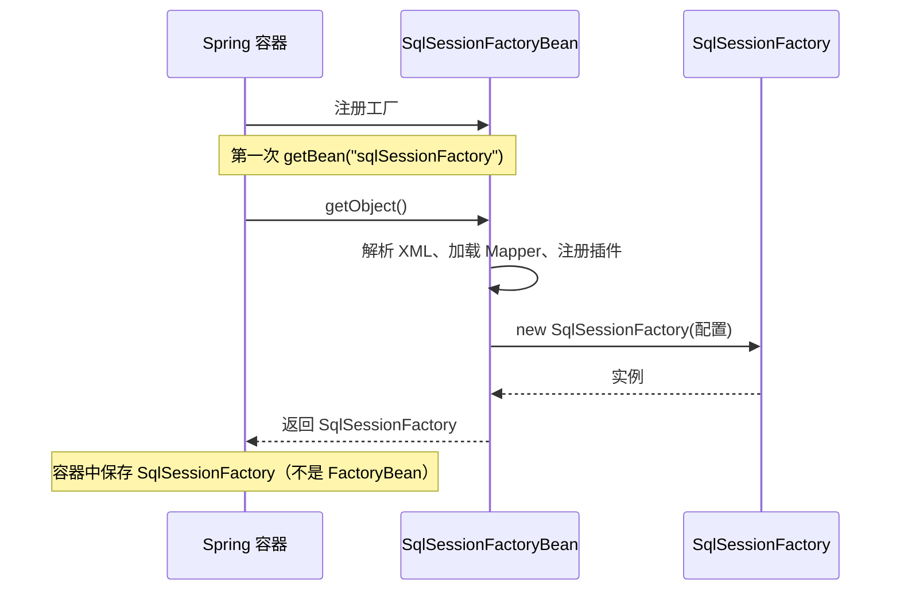

# FactoryBean 与复杂对象创建

> ⬅️ [返回 IoC 总览](README.md) | [依赖注入](dependency-injection.md) | [循环依赖](circular-dependency.md)

`FactoryBean<T>` 是 Spring 容器提供的一种**工厂化 Bean** 接口——它是 Bean，但又能产生 Bean。当某个对象的创建过程非常复杂（无法直接 `new`、需要多步配置、依赖外部资源），就可以用 `FactoryBean` 包装，**对外暴露统一类型**、**对内隐藏复杂构造**。MyBatis 的 `SqlSessionFactoryBean`、Feign 的 `FeignClientFactoryBean`、Dubbo 的 `ReferenceBean` 都是典型案例。

---

## 🎯 一句话定位

**FactoryBean = "能生产 Bean 的 Bean"**——实现 `getObject()` 返回真正的目标对象，对外通过 `&beanName` 拿到工厂本身。

---

## 一、FactoryBean 接口定义

```java
public interface FactoryBean<T> {
    T getObject() throws Exception;            // 返回由 FactoryBean 创建的对象
    Class<?> getObjectType();                  // 返回类型（用于提前判断）
    default boolean isSingleton() { return true; } // 是否单例
}
```

实现该接口的类，**注册到容器后默认暴露的是 `getObject()` 的返回值**，而不是 FactoryBean 本身。

---

## 二、FactoryBean vs 普通 Bean

| 维度 | 普通 Bean | FactoryBean |
|------|----------|-------------|
| **本质** | 直接被容器管理的对象 | 工厂对象，**生产**另一个对象 |
| **获取方式** | `getBean("userService")` → UserService | `getBean("myFactoryBean")` → `getObject()` 的返回值 |
| **拿到工厂本身** | N/A | `getBean("&myFactoryBean")` |
| **典型场景** | 普通业务类 | MyBatis SqlSessionFactoryBean、Feign Client |
| **创建时机** | 容器启动时实例化 | 调用 `getObject()` 时（lazy） |

### 关键差异

```java
@Configuration
public class AppConfig {

    @Bean
    public MyFactoryBean myFactoryBean() {
        return new MyFactoryBean();
    }
}

ApplicationContext ctx = ...;
Object bean = ctx.getBean("myFactoryBean");      // → 调用 myFactoryBean.getObject() 的结果
Object factory = ctx.getBean("&myFactoryBean");   // → MyFactoryBean 本身
```

> 容器看到 FactoryBean 时，会自动调用 `getObject()`，**注入到其他 Bean 中的也是 `getObject()` 的返回值**。

---

## 三、自定义 FactoryBean 案例

假设我们要暴露一个**远程 RPC 客户端**——构造过程需要服务发现、连接池、超时配置等，无法直接 `new`：

```java
public class RpcClientFactoryBean implements FactoryBean<RpcClient> {

    private String serviceUrl;
    private int timeout;

    public void setServiceUrl(String serviceUrl) { this.serviceUrl = serviceUrl; }
    public void setTimeout(int timeout) { this.timeout = timeout; }

    @Override
    public RpcClient getObject() {
        // 复杂创建过程：连接池、服务发现、负载均衡...
        RpcClient client = new RpcClient.Builder()
                .url(serviceUrl)
                .timeout(timeout)
                .build();
        client.connect();
        return client;
    }

    @Override
    public Class<?> getObjectType() {
        return RpcClient.class;
    }

    @Override
    public boolean isSingleton() {
        return true;
    }
}
```

注册方式 1：XML

```xml
<bean id="orderRpcClient" class="com.example.RpcClientFactoryBean">
    <property name="serviceUrl" value="http://order-service"/>
    <property name="timeout" value="3000"/>
</bean>
```

注册方式 2：@Bean

```java
@Configuration
public class RpcConfig {
    @Bean
    public RpcClientFactoryBean orderRpcClient() {
        RpcClientFactoryBean factory = new RpcClientFactoryBean();
        factory.setServiceUrl("http://order-service");
        factory.setTimeout(3000);
        return factory;
    }
}
```

注入使用：

```java
@Service
public class OrderService {
    @Autowired
    private RpcClient orderRpcClient;  // 注入的是 RpcClient，不是 RpcClientFactoryBean
}
```

---

## 四、@Bean 配合 FactoryBean

`@Bean` 方法返回 `FactoryBean` 时，Spring 容器**默认行为**就是：调用 `getObject()` 并把结果注册为 Bean。

```java
@Configuration
public class MyBatisConfig {

    @Bean
    public SqlSessionFactoryBean sqlSessionFactory(DataSource dataSource) throws Exception {
        SqlSessionFactoryBean factoryBean = new SqlSessionFactoryBean();
        factoryBean.setDataSource(dataSource);
        factoryBean.setMapperLocations(...);
        return factoryBean;
    }
}
```

- Bean 名称：`sqlSessionFactory`
- 容器中实际注册的对象：`SqlSessionFactory`（由 `getObject()` 返回）
- 工厂本身：`&sqlSessionFactory`

---

## 五、真实案例：MyBatis SqlSessionFactoryBean

> MyBatis 的核心对象 `SqlSessionFactory` 需要读取全局 XML、Mapper 路径、插件等，创建过程非常复杂。

```java
@Bean
public SqlSessionFactoryBean sqlSessionFactory(DataSource dataSource) throws Exception {
    SqlSessionFactoryBean factoryBean = new SqlSessionFactoryBean();
    factoryBean.setDataSource(dataSource);
    factoryBean.setConfigLocation(new ClassPathResource("mybatis-config.xml"));
    factoryBean.setMapperLocations(
        new PathMatchingResourcePatternResolver()
            .getResources("classpath:mapper/*.xml"));
    factoryBean.setPlugins(new PageInterceptor()); // 分页插件

    return factoryBean;
}
```

工作流程：



---

## 六、FactoryBean 在 Spring 生态中的典型应用

| 框架 | FactoryBean | 作用 |
|------|------------|------|
| **MyBatis-Spring** | `SqlSessionFactoryBean` | 构造 SqlSessionFactory |
| **Feign** | `FeignClientFactoryBean` | 构造动态代理的 HTTP 客户端 |
| **Dubbo** | `ReferenceBean` | 构造远程服务引用 |
| **Spring Batch** | `JobLauncherFactoryBean` | 构造 JobLauncher |
| **Spring Integration** | `IntegrationFlowFactoryBean` | 构造 IntegrationFlow |

---

## 七、使用注意

1. **Bean 名称冲突**：FactoryBean 注册的 Bean 名是工厂方法名，工厂本身要加 `&` 前缀。
2. **`@Autowired` 注入的是 `getObject()` 的返回值**，不是 FactoryBean 本身。
3. **提前类型推断**：`getObjectType()` 应尽量返回**非空**的具体类型，便于 `@Autowired` 在早期就能匹配。
4. **循环依赖**：`FactoryBean` 在循环依赖场景下会触发 `getEarlyBeanReference()`，要确保 `getObject()` 幂等且无副作用。

---

## 八、何时该用 FactoryBean？

✅ **适合**：

- 创建过程需要复杂配置（多文件、连接池、第三方资源）
- 需要对外**暴露统一类型**（如 `RpcClient`），隐藏构造细节
- 需要在 Bean 初始化前做**懒构建**（直到 `getObject()` 才真正创建）

❌ **不适合**：

- 普通 POJO 业务类——直接 `@Component` / `@Service`
- 单一对象、构造过程简单——直接 `@Bean` 即可

---

## 🤔 思考

1. **FactoryBean 和 @Bean 的区别？** `@Bean` 是**注册 Bean 的方法**；FactoryBean 是**生产 Bean 的工厂**。两者经常配合使用：`@Bean` 方法返回一个 FactoryBean。
2. **FactoryBean 是否会破坏单例？** 不会，`isSingleton()` 返回 `true` 时，容器会缓存 `getObject()` 的结果。
3. **能不能注入 FactoryBean 本身？** 能，用 `&beanName` 或 `@Autowired` + `@Qualifier("&myFactoryBean")`。

---

## 相关章节

- ⬅️ [返回 IoC 总览](README.md)
- [依赖注入](dependency-injection.md) — FactoryBean 产生的对象如何被注入
- [循环依赖](circular-dependency.md) — FactoryBean 的早期引用处理
- [作用域与线程安全](scopes-and-thread-safety.md) — FactoryBean 与单例
