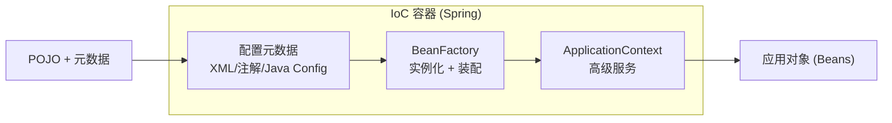
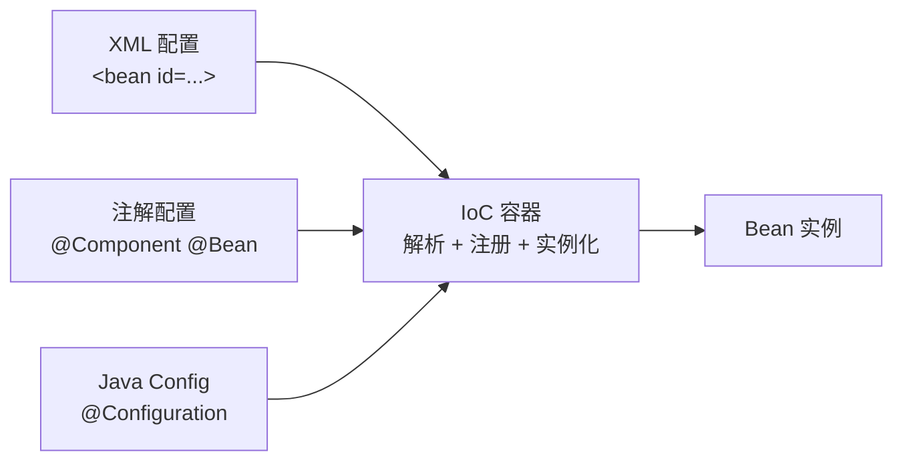
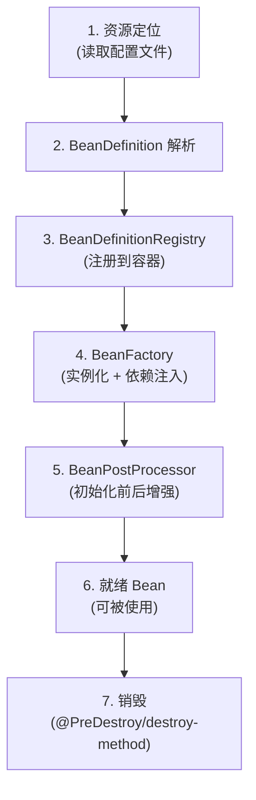

<!--
module:
  parent: spring
  slug: spring/ioc
  type: article
  category: 主模块子文章
  summary: IoC（Inversion of Control）控制反转
-->

# IoC（Inversion of Control）控制反转

> ⬅️ [返回 01 核心容器](../README.md)

---
---

## 🎯 一句话定位

**IoC = 把对象的创建和管理权从代码中"反转"给 Spring 容器**——你只负责告诉 Spring "我需要什么 Bean"（@Component/@Bean），Spring 负责创建、组装、注入、管理这些 Bean 的整个生命周期。

---

## 📚 章节导航

| 章节 | 核心问题 | 阅读时长 |
|:-----|:---------|:--------:|
| [Bean 生命周期](bean-lifecycle.md) | Bean 从创建到销毁经历了哪些步骤？ | 15 min |
| [作用域与线程安全](scopes-and-thread-safety.md) | singleton Bean 安全吗？prototype 何时用？ | 10 min |
| [依赖注入](dependency-injection.md) | 4 种注入方式怎么选？构造器还是 setter？ | 8 min |
| [循环依赖](circular-dependency.md) | Spring 怎么解决 A↔B 闭环？三级缓存？@Lazy？ | 10 min |
| [FactoryBean](FactoryBean.md) | FactoryBean 与普通 Bean 的区别？SqlSessionFactoryBean？ | 8 min |

---

## 一、什么是控制反转

- **控制**：指的是对象创建（实例化、管理）的权力
- **反转**：控制权交给外部环境（Spring 框架、IoC 容器）



> 利用 Java 的反射功能实例化 Bean 并建立 Bean 之间的依赖关系，还提供了**实例化缓存、生命周期管理、实例代理、事件发布和资源装载**等高级服务。

---

## 二、Spring Bean

> **Bean** 代指的就是那些被 IoC 容器所管理的对象。

### 1. IoC 容器如何使用配置元数据来管理对象



### 2. Spring Bean 的装配流程



---

## 三、将一个类声明为 Bean

### 4 个"语义化"注解 + 1 个通用

| 注解 | 语义 | 适用层 |
|------|------|--------|
| `@Component` | 通用组件 | 不好归类时 |
| `@Service` | 业务层 | Service |
| `@Repository` | 数据访问层（**自动转换持久化异常**） | DAO |
| `@Controller` | 控制层 | Controller |

> 详见 [08 注解/Bean 注解](../../08-annotations/bean-and-ioc.md#一声明-bean-4-种语义化注解-1-个通用)

### @Component vs @Bean

| 维度 | @Component | @Bean |
|------|-----------|-------|
| **作用对象** | 类 | 方法 |
| **注册方式** | 类路径扫描（@ComponentScan） | 显式调用（方法返回值） |
| **自定义能力** | 弱 | 强（可写任意 Java 代码构造对象） |
| **典型场景** | 自己写的类 | 第三方库的类 |

- **@Component** 注解作用于类，而 @Bean 注解作用于方法。
- **@Component** 通常是通过类路径扫描来自动侦测以及自动装配到 Spring 容器中（我们可以使用 `@ComponentScan` 注解定义要扫描的路径从中找出标识了需要装配的类自动装配到 Spring 的 bean 容器中）。
- **@Bean** 注解通常是我们在标有该注解的方法中定义产生这个 bean，@Bean 告诉了 Spring "这是某个类的实例，当我需要用它的时候还给我"。
- **@Bean 注解比 @Component 注解的自定义性更强**，而且很多地方我们只能通过 @Bean 注解来注册 bean。比如当我们引用第三方库中的类需要装配到 Spring 容器时，则只能通过 @Bean 来实现。

---

## 四、注入 Bean

### 3 种注入注解

| 注解 | 来源 | 默认注入方式 | 适用场景 |
|------|------|------------|---------|
| `@Autowired` | Spring | byType | 大多数场景 |
| `@Resource` | JDK | byName | 明确知道 Bean 名称时 |
| `@Inject` | JDK（JSR-330） | byType | 需要 JSR-330 兼容时 |

> 详见 [08 注解/Bean 注解](../../08-annotations/bean-and-ioc.md#二注入-bean-3-种注解)

### @Autowired 和 @Resource 的区别

- **@Autowired 是 Spring 提供的注解，@Resource 是 JDK 提供的注解。**
- **@Autowired 默认的注入方式为 byType**（根据类型进行匹配），**@Resource 默认注入方式为 byName**（根据名称进行匹配）。
- 当一个接口存在多个实现类的情况下，@Autowired 和 @Resource 都需要通过名称才能正确匹配到对应的 Bean。@Autowired 可以通过 @Qualifier 注解来显式指定名称，@Resource 可以通过 name 属性来显式指定名称。
- @Autowired 支持在**构造函数、方法、字段和参数**上使用。@Resource 主要用于**字段和方法**上的注入，不支持在构造函数或参数上使用。

---

## 五、Bean 作用域

详见 [作用域与线程安全](scopes-and-thread-safety.md)

---

## 六、Bean 生命周期

详见 [Bean 生命周期](bean-lifecycle.md)

---

## 七、整体知识图谱

```mermaid
graph TB
    IoC[IoC 容器] --> Meta[配置元数据<br/>XML/注解/Java Config]
    Meta --> Scan[扫描 + 解析]
    Scan --> Bean[创建 Bean]
    Bean --> Inst[1. 实例化]
    Inst --> Fill[2. 属性填充]
    Fill --> Init[3. 初始化]
    Init --> Use[4. 使用]
    Use --> Dest[5. 销毁]

    Init -.扩展点.-> Aware[Aware 接口]
    Init -.扩展点.-> BP[BeanPostProcessor]
    Init -.扩展点.-> IB[InitializingBean]

    IoC --> Scope[作用域管理]
    Scope --> Sing[singleton]
    Scope --> Proto[prototype]
    Scope --> Web[request/session/...]

    IoC --> DI[依赖注入]
    DI --> AutoW[@Autowired]
    DI --> Res[@Resource]
    DI --> Inject[@Inject]
```

---

## 🤔 思考

1. **IoC 和 DI 是什么关系？** IoC 是一种设计思想（控制反转），DI 是 IoC 的具体实现（依赖注入）。
2. **为什么 Spring 默认 Bean 是 singleton？** 绝大多数 Bean 是无状态的（Service、DAO），singleton 性能更高、节省内存。
3. **IoC 容器和 Spring 上下文什么关系？** BeanFactory 是最底层容器，ApplicationContext 在 BeanFactory 之上提供更多企业级功能（i18n、事件发布、AOP 等）。一般说 "Spring 容器" 指 ApplicationContext。
4. **IoC 有什么缺点？** 对象创建过程变得"看不见"了，调试时定位问题较难；学习曲线较陡。

---

## 相关章节

- ⬅️ [返回 01 核心容器](../README.md)
- [Bean 生命周期](bean-lifecycle.md)
- [作用域与线程安全](scopes-and-thread-safety.md)
- [依赖注入](dependency-injection.md)
- [循环依赖](circular-dependency.md)
- [FactoryBean](FactoryBean.md)
- [08 注解/Bean 注解](../../08-annotations/bean-and-ioc.md)
