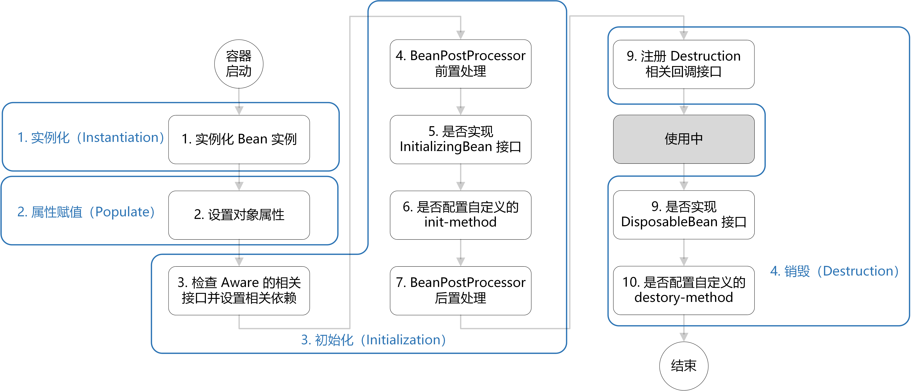
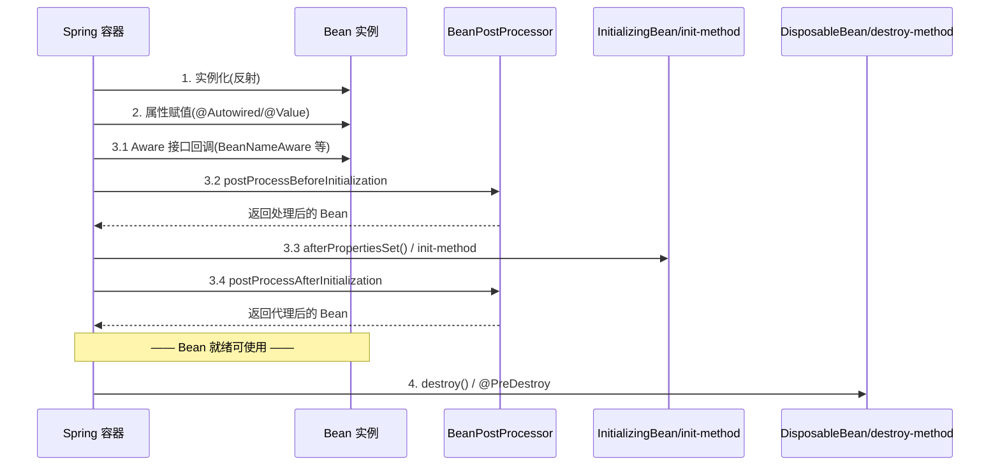

# Bean 生命周期

> 最后更新: 2026-06-09
> ⬅️ [返回 IoC 总览](README.md) | [作用域与线程安全](scopes-and-thread-safety.md) | [依赖注入](dependency-injection.md)

Spring Bean 的生命周期是 Spring 框架最核心的知识点之一。**Bean 从创建到销毁，会经过 4 个大阶段、10+ 个小步骤**。



---

## 🎯 一句话定位

**Bean 生命周期 = "实例化 → 属性赋值 → 初始化 → 销毁"**——Spring 在每个阶段都提供了 Aware 接口、BeanPostProcessor 扩展点、InitializingBean 初始化接口等"插槽"，让开发者可以介入生命周期的任意环节。

---

## 一、整体流程图



---

## 二、4 个阶段详解

### 阶段 1：实例化

> Bean 容器首先找到配置文件中的 Bean 定义，然后使用 **Java 反射 API** 创建 Bean 实例。

对应源码：`AbstractAutowireCapableBeanFactory.doCreateBean()`

```java
// 1. 创建 Bean 的实例
BeanWrapper instanceWrapper = createBeanInstance(beanName, mbd, args);
```

### 阶段 2：属性赋值 / 填充

> 为 Bean 设置相关属性和依赖。

| 注入方式 | 触发点 |
|---------|--------|
| `@Autowired` 注解 | 字段、setter、构造方法、参数 |
| `@Value` 注解 | 字段、setter |
| `@Resource` 注入 | 字段、setter |
| setter 方法 | XML 或 Java Config |
| 构造方法 | XML 或 Java Config |

```java
// 2. Bean 属性赋值/填充
populateBean(beanName, mbd, instanceWrapper);
```

### 阶段 3：初始化

**这是最复杂的一步**，涉及多个扩展点：

#### 3.1 Aware 接口（拿到 Spring 资源）

| 接口 | 回调方法 | 注入的资源 |
|------|---------|-----------|
| `BeanNameAware` | `setBeanName(String)` | 当前 bean 的名称 |
| `BeanClassLoaderAware` | `setBeanClassLoader(ClassLoader)` | 加载当前 bean 的 ClassLoader |
| `BeanFactoryAware` | `setBeanFactory(BeanFactory)` | 当前 BeanFactory 容器引用 |
| `ApplicationContextAware` | `setApplicationContext(ApplicationContext)` | ApplicationContext 容器 |
| `BeanNameAware` | `setBeanName(String)` | 当前 bean 的名称 |

> 💡 Aware 接口的目的：让 Bean **拿到 Spring 容器资源**（如 BeanName、BeanFactory）。

#### 3.2 BeanPostProcessor（前后置处理）

> **Spring 为修改 Bean 提供的强大扩展点**。

| 方法 | 执行时机 |
|------|---------|
| `postProcessBeforeInitialization` | 属性注入完成后，`afterPropertiesSet()` 之前 |
| `postProcessAfterInitialization` | `afterPropertiesSet()` 之后（**AOP 代理就在这里生成**） |

```java
public interface BeanPostProcessor {
    default Object postProcessBeforeInitialization(Object bean, String beanName) throws BeansException {
        return bean;
    }
    default Object postProcessAfterInitialization(Object bean, String beanName) throws BeansException {
        return bean;
    }
}
```

#### 3.3 InitializingBean + init-method（自定义初始化）

| 方式 | 说明 |
|------|------|
| `InitializingBean` 接口 | Spring 提供，`afterPropertiesSet()` 写初始化逻辑 |
| `init-method` 属性 | XML 中 `<bean init-method="...">` 指定方法 |

```java
public interface InitializingBean {
    void afterPropertiesSet() throws Exception;  // 初始化逻辑
}
```

```xml
<bean id="demo" class="cn.wubo.Demo" init-method="init()"/>
```

### 阶段 4：销毁

> 销毁**不是立即**把 Bean 销毁掉，而是把销毁方法**先记录下来**，将来需要销毁时再调用。

| 方式 | 说明 |
|------|------|
| `DisposableBean` 接口 | Spring 提供，`destroy()` 写销毁逻辑 |
| `destroy-method` 属性 | XML 中指定 |
| `@PreDestroy` 注解 | JSR-250 规范，推荐使用 |

```java
@PreDestroy
public void cleanup() {
    // 释放资源
}
```

---

## 三、完整源码

```java
// AbstractAutowireCapableBeanFactory.doCreateBean()
protected Object doCreateBean(final String beanName, final RootBeanDefinition mbd, final @Nullable Object[] args)
    throws BeanCreationException {

    // 1. 创建 Bean 的实例
    BeanWrapper instanceWrapper = null;
    if (instanceWrapper == null) {
        instanceWrapper = createBeanInstance(beanName, mbd, args);
    }

    Object exposedObject = bean;
    try {
        // 2. Bean 属性赋值/填充
        populateBean(beanName, mbd, instanceWrapper);
        // 3. Bean 初始化
        exposedObject = initializeBean(beanName, exposedObject, mbd);
    }

    // 4. 销毁 Bean-注册回调接口
    try {
        registerDisposableBeanIfNecessary(beanName, bean, mbd);
    }

    return exposedObject;
}
```

---

## 四、记忆口诀

**"一实二填三初始四销毁"**：

| 阶段 | 关键步骤 | 涉及接口 |
|------|---------|---------|
| **1 实例化** | 反射创建对象 | 无 |
| **2 属性填充** | @Autowired / @Value | 无 |
| **3 初始化** | Aware → BeanPostProcessor before → InitializingBean → BeanPostProcessor after | Aware、BeanPostProcessor、InitializingBean、init-method |
| **4 销毁** | @PreDestroy / destroy() | DisposableBean、@PreDestroy |

> 📌 **关键考点**：BeanPostProcessor 的两个方法分别在 InitializingBean **之前和之后**执行，其中**后置处理是 AOP 代理生成的地方**。

---

## 五、Spring 的 4 种依赖注入方式

| 注入方式 | 优点 | 缺点 |
|---------|------|------|
| **构造器注入**（推荐） | 强制依赖、支持 final、利于测试 | 构造方法可能过长 |
| **setter 注入** | 灵活、可选依赖 | 无法表达必填、不能 final |
| **静态工厂注入** | 兼容老代码 | 不推荐（已被 Java Config 取代） |
| **实例工厂注入** | 兼容老代码 | 不推荐（已被 Java Config 取代） |

> 📌 Spring 官方**推荐构造器注入**（强制依赖、支持不可变对象）。

详见 [依赖注入详解](dependency-injection.md)

---

## 🤔 思考

1. **为什么 AOP 代理在 postProcessAfterInitialization 中创建？** 因为这一步 Bean 已经完全初始化，可以安全地用代理对象替换原对象。
2. **Aware 接口的调用顺序？** BeanNameAware → BeanClassLoaderAware → BeanFactoryAware → 其他 Aware 接口。
3. **InitializingBean 和 init-method 选哪个？** 推荐 init-method（无侵入性），但 Spring 内部仍大量用 InitializingBean。
4. **BeanPostProcessor 和 BeanFactoryPostProcessor 区别？** 前者修改 Bean 实例（实例化后），后者修改 Bean 定义（实例化前）。

---

## 相关章节

- ⬅️ [返回 IoC 总览](README.md)
- [依赖注入](dependency-injection.md) — 4 种注入方式
- [作用域与线程安全](scopes-and-thread-safety.md) — singleton/prototype 作用域
- [01 核心容器/AOP](../../01-core/aop/README.md) — AOP 代理在 postProcessAfterInitialization 中创建
