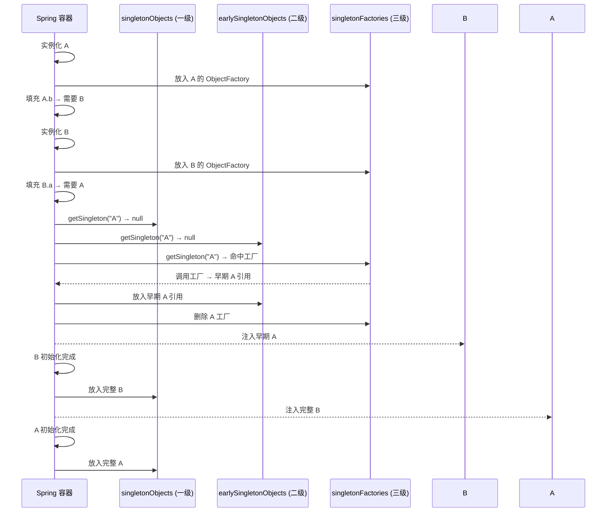

# Spring 循环依赖与三级缓存

> ⬅️ [返回 IoC 总览](README.md) | [Bean 生命周期](bean-lifecycle.md) | [依赖注入](dependency-injection.md)

循环依赖（Circular Dependency）是指两个或多个 Bean 互相持有对方引用，形成"A 依赖 B，B 又依赖 A"的闭环。Spring 通过**三级缓存**机制解决 **setter/字段注入 + singleton 作用域**下的循环依赖；构造器注入与 prototype 作用域则**无法**通过该机制解决，需要用 `@Lazy` 打破闭环。

---

## 🎯 一句话定位

**Spring 循环依赖 = 三级缓存（singletonObjects / earlySingletonObjects / singletonFactories）+ `@Lazy` 兜底**——本质是"提前暴露半成品对象引用"。

---

## 一、什么是循环依赖

```java
@Service
public class A {
    @Autowired
    private B b;  // A 依赖 B
}

@Service
public class B {
    @Autowired
    private A a;  // B 又依赖 A → 闭环
}
```

构造链路：`创建 A → 需要注入 B → 创建 B → 需要注入 A → A 还在创建中 → 死锁`

---

## 二、Spring 的三级缓存

Spring 在 `DefaultSingletonBeanRegistry` 中维护了 **3 个 Map** 解决 singleton + setter 注入的循环依赖：

| 缓存 | 类型 | 名称 | 存放内容 | 暴露时机 |
|------|------|------|----------|----------|
| **第一级** | `Map<String, Object>` | `singletonObjects` | **完整 Bean**（已初始化） | 初始化完成后 |
| **第二级** | `Map<String, Object>` | `earlySingletonObjects` | **早期引用**（未填充属性） | 第一次被"提前曝光"时 |
| **第三级** | `Map<String, Object<?>>` | `singletonFactories` | **ObjectFactory 工厂**（可生成早期引用） | 实例化后立即放入 |

### 各级缓存的角色

- **singletonFactories（三级）**：存放 `ObjectFactory`，调用其 `getObject()` 会执行 `getEarlyBeanReference()`，可能返回**原始对象**或**AOP 代理对象**。这是循环依赖能"提前曝光"的根本。
- **earlySingletonObjects（二级）**：缓存"已经提前曝光过的早期引用"，避免每次都调用 `ObjectFactory`（提升性能）。
- **singletonObjects（一级）**：存放最终完成品，常规 Bean 查找的命中点。

---

## 三、解决流程（ASCII 图）

```text
创建 Bean A
  │
  ├─ 1. 实例化 A（反射 new）
  │     │
  │     └─ 把 A 的 ObjectFactory 放入【三级缓存 singletonFactories】
  │        (key = "A", value = () -> getEarlyBeanReference(A))
  │
  ├─ 2. 填充属性 A.b → 需要 B
  │     │
  │     ├─ 创建 Bean B（递归走同一流程）
  │     │     │
  │     │     ├─ 1. 实例化 B，把 B 的 ObjectFactory 放入三级缓存
  │     │     │
  │     │     └─ 2. 填充属性 B.a → 需要 A
  │     │           │
  │     │           ├─ 去一级缓存 singletonObjects 找 A → 没找到
  │     │           ├─ 去二级缓存 earlySingletonObjects 找 A → 没找到
  │     │           ├─ 去三级缓存 singletonFactories 找 A → 命中！
  │     │           │
  │     │           ├─ 调用 ObjectFactory.getObject() 得到"早期 A 引用"
  │     │           │   (可能已是 AOP 代理)
  │     │           │
  │     │           ├─ 把早期 A 引用放入【二级缓存 earlySingletonObjects】
  │     │           └─ 从三级缓存删除 A 的工厂
  │     │           │
  │     │           └─ 注入到 B.a，B 继续完成初始化
  │     │
  │     └─ B 初始化完成 → 放入一级缓存，删除二三级中 B 的条目
  │
  └─ 3. A.b 注入完毕，A 继续完成初始化 → 放入一级缓存
```

**核心要点**：

1. **三级缓存放的是"工厂"**（`ObjectFactory`），调用时才生成早期引用；
2. **二级缓存是"备忘录"**（避免重复调用工厂）；
3. 一级缓存放"成品"（完成初始化的 Bean）。

---

## 四、为什么需要"三级"而不是"两级"？

> 二级缓存看似也能解决循环依赖，那三级缓存存在的意义是什么？

**答：为了正确处理 AOP 代理**。

如果只有两级缓存，注入的早期引用可能是**未代理的原始对象**；而 Bean 真正就绪时（初始化完成后）却是**代理对象**，两者不一致 → 容器里的 Bean 与注入依赖的 Bean **不是同一个对象**，违反单例语义。

三级缓存用 `ObjectFactory` 延迟决策：是否生成代理、生成何种代理，在 `getEarlyBeanReference()` 阶段统一处理，确保**注入的早期引用**和**最终的成品引用**是**同一个对象**（包括代理对象）。

### Mermaid 流程图



---

## 五、构造器注入为何无法解决？

```java
@Service
public class A {
    public A(B b) { this.b = b; }  // 构造器注入
}

@Service
public class B {
    public B(A a) { this.a = a; }  // 构造器注入
}
```

- 实例化 A 的**同时**就需要调用构造器，**没有"实例化完成但未填充属性"的状态**；
- 三级缓存要求"实例化完成后才能曝光 ObjectFactory"——构造器注入**没有这个窗口**；
- 结果：`BeanCurrentlyInCreationException`。

### 解决方案 1：改用 setter/字段注入

```java
@Service
public class A {
    @Autowired
    private B b;  // setter/字段注入
}
```

### 解决方案 2：@Lazy 打破闭环（推荐）

```java
@Service
public class A {
    private final B b;

    public A(@Lazy B b) {  // 注入的是 B 的代理，构造时不会立即创建 B
        this.b = b;
    }
}

@Service
public class B {
    private final A a;

    public B(A a) {
        this.a = a;
    }
}
```

`@Lazy` 注入的是一个**代理对象**，B 真正调用方法时才去容器里找——打破了"构造时立即解析依赖"的链条。

### 解决方案 3：@PostConstruct / ApplicationContext.getBean 延后

```java
@Service
public class A {
    @Autowired
    private B b;
    // 让 Spring 先完成 A 的初始化（注入 B 的早期引用），再用生命周期方法处理
}
```

> 本质是让 Spring 处于"半成品可曝光"的状态，依赖 setter 注入路径。

---

## 六、prototype 作用域为何无法解决？

Spring 不会缓存 prototype Bean（每次 `getBean` 都新建），**三级缓存只对 singleton 生效**。`prototype` 出现循环依赖会直接抛 `BeanCurrentlyInCreationException`。

解决方案：

- 改用 `singleton` 作用域；
- 或使用 `@Lookup` 注解让方法返回新的 prototype 实例。

---

## 七、`@Lazy` 详解

| 维度 | 不加 `@Lazy` | 加 `@Lazy` |
|------|------------|----------|
| **注入对象** | 真实 Bean（已实例化） | 代理对象（占位符） |
| **依赖解析时机** | 容器启动时立即解析 | 第一次调用方法时 |
| **能否打破循环** | ❌ | ✅ |
| **副作用** | 无 | 调用前 NPE 风险（代理内未做空检查时） |

```java
// 1. 构造器注入 + @Lazy
public A(@Lazy B b) { this.b = b; }

// 2. setter/字段注入 + @Lazy
@Autowired
@Lazy
private B b;

// 3. @Configuration 中的 @Bean 方法
@Bean
@Lazy
public ServiceA serviceA(ServiceB b) { return new ServiceA(b); }
```

---

## 八、检测循环依赖

启动时遇到 `BeanCurrentlyInCreationException`、日志中 `is currently in creation` 字样 → 一定存在循环依赖。

```text
***************************
APPLICATION FAILED TO START
***************************

The dependencies of some of the beans in the application context form a cycle:

   serviceA (field com.example.B needed in com.example.A)
      ↓
   serviceB (field com.example.A needed in com.example.B)
```

---

## 九、最佳实践

1. **设计阶段避免循环依赖**：用"事件"、"中间层"、"策略模式"解耦。
2. **必须保留循环依赖时**：优先 setter 注入 + prototype 检查。
3. **构造器注入 + 循环**：用 `@Lazy` 兜底（接受代理对象的语义）。
4. **AOP 与循环依赖**：注意 `@Transactional` 等注解生成的代理对象，依赖早期引用时已被织入通知。

---

## 🤔 思考

1. **为什么是三级缓存而不是两级？** 为了让 AOP 代理的早期引用与最终引用是同一个对象。
2. **`@Lazy` 注入的是代理，会不会有 NPE？** 不会，Spring 会在调用方法时去容器查找真实 Bean。
3. **构造器注入一定不能用循环依赖吗？** 不一定，结合 `@Lazy` 即可。

---

## 相关章节

- ⬅️ [返回 IoC 总览](README.md)
- [Bean 生命周期](bean-lifecycle.md) — 实例化后才可曝光
- [依赖注入](dependency-injection.md) — 4 种注入方式对循环依赖的影响
- [作用域与线程安全](scopes-and-thread-safety.md) — singleton vs prototype
