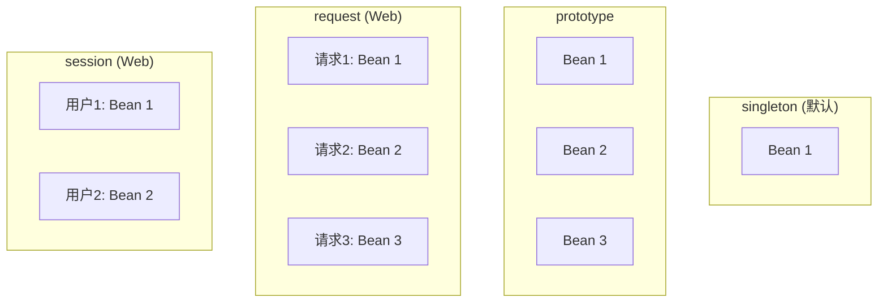
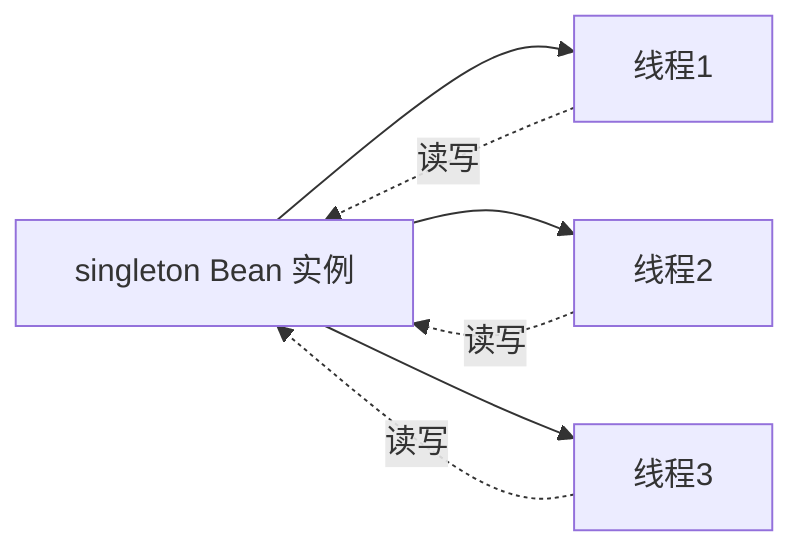

# Bean 作用域与线程安全

> 最后更新: 2026-06-14
> ⬅️ [返回 IoC 总览](README.md) | [Bean 生命周期](bean-lifecycle.md) | [依赖注入](dependency-injection.md)

本节介绍 Spring Bean 的 6 种作用域，以及 **singleton Bean 的线程安全解决方案**。

---

## 🎯 一句话定位

**Bean 作用域 = "Bean 实例在容器中能存在几份"**——`singleton` 整个容器一份（默认），`prototype` 每次获取一份，`request`/`session`/`application`/`websocket` 是 Web 专用作用域。

---

## 一、6 种作用域

| 作用域 | 说明 | 适用场景 |
|--------|------|----------|
| **singleton** | 唯一 Bean 实例（**默认**） | 无状态 Bean（Service、DAO、Controller） |
| **prototype** | 每次获取都创建新实例 | 有状态 Bean（需要保存每次调用的数据） |
| **request** | 每个 HTTP 请求一个 Bean | Web 层请求级数据 |
| **session** | 每个 HTTP Session 一个 Bean | 用户会话级数据 |
| **application** | 整个 Web 应用一个 Bean | 全局共享数据 |
| **websocket** | 每个 WebSocket 会话一个 Bean | 实时通信 |

### 5 种作用域的可视化



### 代码示例

```java
@RestController
@Scope("singleton")  // 默认
public class HelloController {
}

@Scope(value = ConfigurableBeanFactory.SCOPE_PROTOTYPE)
public class DeptService {
}
```

---

## 二、singleton vs prototype

| 维度 | singleton | prototype |
|------|-----------|-----------|
| **实例数** | 整个容器 1 个 | 每次获取新实例 |
| **创建时机** | 容器启动时（默认） | 每次获取时 |
| **销毁时机** | 容器关闭时 | 容器不负责销毁（需手动） |
| **共享** | 被多个线程共享 | 不共享 |
| **典型场景** | 无状态 Bean | 有状态 Bean |

---

## 三、Bean 的线程安全

> **Spring 框架中的 Bean 是否线程安全，取决于其作用域和状态。**

### 1. prototype 作用域

> **线程安全**。每次获取都会创建一个新的 bean 实例，**不存在资源竞争问题**。

### 2. singleton 作用域

> **取决于 Bean 是否有状态**。singleton 实例被多线程共享，可变成员变量会引发线程安全问题。



### 3. 状态分类

| 类型 | 特点 | 线程安全 | 示例 |
|------|------|---------|------|
| **有状态 Bean** | 包含**可变成员变量** | ❌ 不安全 | 计数器、用户会话状态 |
| **无状态 Bean** | 没有可变成员变量 | ✅ 安全 | DAO、Service（操作参数通过方法传入） |

---

## 四、singleton 线程安全解决方案

### 方案 1：避免可变成员变量（**推荐**）

> 设计上让 Bean 不持有可变状态，**所有数据通过方法参数传递**。

```java
@Service
@Scope("singleton")
public class UserService {

    // ❌ 不推荐：可变成员变量
    private int count = 0;

    // ✅ 推荐：无状态
    public int getUserCount(List<User> users) {
        return users.size();
    }
}
```

### 方案 2：使用 ThreadLocal（**推荐**）

> 将可变状态保存到 ThreadLocal，**每个线程一份独立数据**。

```java
@Service
@Scope("singleton")
public class UserService {

    // 用 ThreadLocal 封装可变状态
    private ThreadLocal<User> currentUser = new ThreadLocal<>();

    public void setCurrentUser(User user) {
        currentUser.set(user);
    }

    public User getCurrentUser() {
        return currentUser.get();
    }
}
```

### 方案 3：加锁（**不推荐**）

> 用 `synchronized` 或 `ReentrantLock` 保护共享变量，但会**损失性能**。

```java
@Service
@Scope("singleton")
public class CounterService {
    private int count = 0;
    private final ReentrantLock lock = new ReentrantLock();

    public void increment() {
        lock.lock();
        try {
            count++;
        } finally {
            lock.unlock();
        }
    }
}
```

### 方案 4：使用 prototype 作用域（**不推荐**）

> 改为 prototype 作用域，**每次获取新实例**。但 Spring 不管理 prototype Bean 的销毁，容易造成内存泄漏。

### 方案对比

| 方案 | 优点 | 缺点 | 推荐度 |
|------|------|------|--------|
| 避免可变成员变量 | 简单、性能高 | 受限于设计 | ⭐⭐⭐⭐⭐ |
| ThreadLocal | 性能好、隔离性强 | 内存占用、线程池场景下需清理 | ⭐⭐⭐⭐ |
| 加锁 | 简单直接 | 性能差、可能死锁 | ⭐⭐ |
| prototype 作用域 | 简单 | 内存泄漏风险 | ⭐ |

---

## 五、典型场景判断

### 场景 1：Service/DAO 层

> 默认 singleton **线程安全**——它们是**无状态 Bean**（只调用 Repository，自己不存数据）。

```java
@Service
public class UserService {
    @Autowired
    private UserRepository userRepository;  // Spring 也保证 Repository 线程安全

    public User getById(Long id) {  // 无状态
        return userRepository.findById(id).orElse(null);
    }
}
```

### 场景 2：Controller

> 默认 singleton **线程安全**——它是无状态的（请求数据通过 HttpServletRequest 传递，不存在成员变量）。

```java
@RestController
public class UserController {
    @GetMapping("/users/{id}")
    public User getUser(@PathVariable Long id) {  // 每次请求都是新线程
        return userService.getById(id);
    }
}
```

### 场景 3：单例中有 SimpleDateFormat

> ❌ **线程不安全**。SimpleDateFormat 不是线程安全的。

```java
// ❌ 错误：SimpleDateFormat 是非线程安全的
@Service
public class DateService {
    private SimpleDateFormat sdf = new SimpleDateFormat("yyyy-MM-dd");

    public String format(Date date) {
        return sdf.format(date);
    }
}

// ✅ 方案 1：每次新建
public String format(Date date) {
    return new SimpleDateFormat("yyyy-MM-dd").format(date);
}

// ✅ 方案 2：ThreadLocal
private static final ThreadLocal<SimpleDateFormat> sdf =
    ThreadLocal.withInitial(() -> new SimpleDateFormat("yyyy-MM-dd"));

// ✅ 方案 3：使用 DateTimeFormatter（线程安全）
private static final DateTimeFormatter dtf = DateTimeFormatter.ofPattern("yyyy-MM-dd");
```

---

## 🤔 思考

1. **Service 默认是 singleton 吗？** 是。所有 @Service/@Repository/@Controller 默认都是 singleton。
2. **singleton + 无状态 = 线程安全？** 是的，因为没有共享的可变数据。
3. **Web 作用域（request/session）需要特殊配置吗？** 需要在 web 环境下使用，且需要通过 RequestContextListener 绑定到当前请求。
4. **prototype Bean 怎么释放资源？** 用 `@PreDestroy` + 手动调用，或注册 `DestructionCallback`。

---

## 相关章节

- ⬅️ [返回 IoC 总览](README.md)
- [Bean 生命周期](bean-lifecycle.md) — 4 个阶段
- [依赖注入](dependency-injection.md) — 4 种注入方式
- [08 注解/Bean 注解](../../08-annotations/bean-and-ioc.md#四bean-作用域) — @Scope 用法
