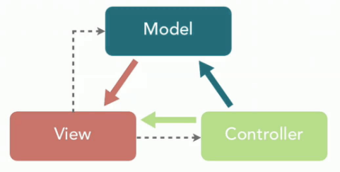
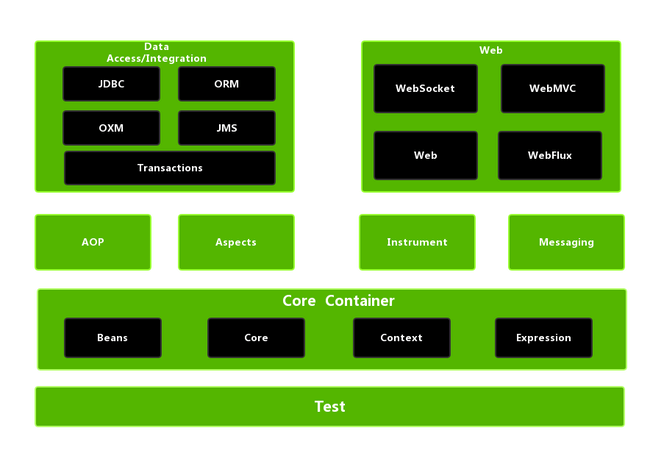
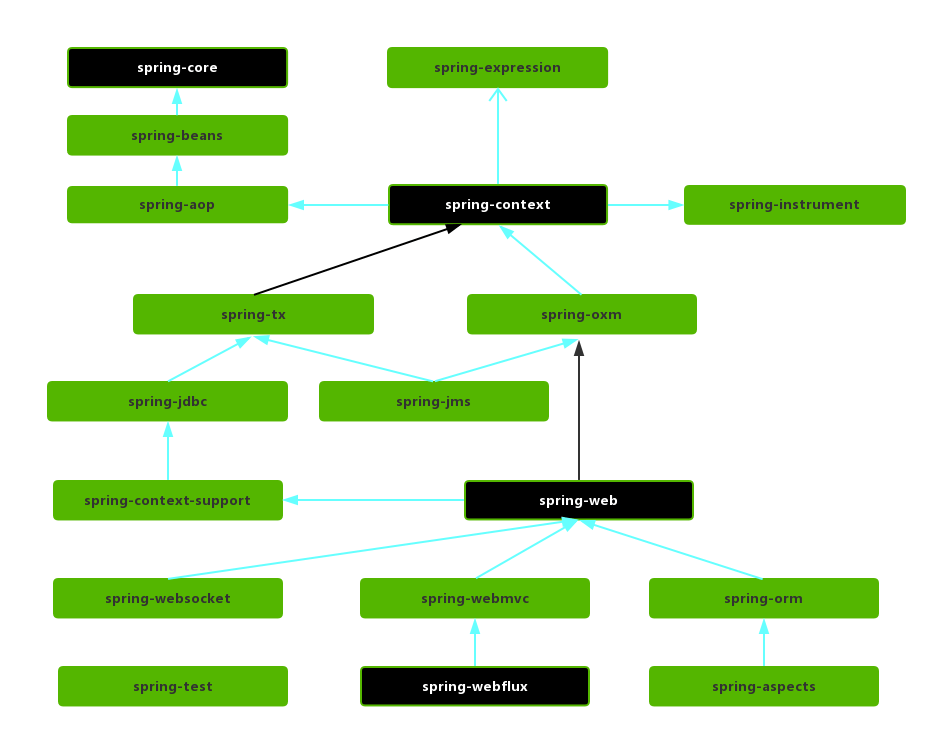

# Spring Framework 模块结构

> 最后更新: 2026-06-14
> ⬅️ [返回 01 核心容器](README.md)

Spring Framework 自发布以来经过多个大版本迭代，目前主流使用 5.x 和 6.x。本章梳理 Spring 4.x 与 5.x 的模块划分、各模块职责及模块之间的依赖关系。

---

## 1. Spring 4.x 模块结构

### 1.1 Spring 4.x 模块总览

### 1.2 Spring 5.x 模块结构

Spring 5.x 版本中 Web 模块的 Portlet 组件已经被废弃掉，同时增加了用于异步响应式处理的 WebFlux 组件。

---

## 2. Spring 各个模块的依赖关系

---

## 3. 核心容器层（Core Container）

Spring 框架的核心模块，也可以说是基础模块，主要提供 IoC 依赖注入功能的支持，Spring 其他所有的功能基本都需要依赖于该模块。

### 3.1 Spring-Core

核心功能工具类，具体包括控制反转和依赖控制。

### 3.2 Spring-Beans

提供对 bean 的创建、配置和管理等功能的支持。

### 3.3 Spring-Context

- 继承自 Spring-Beans 模块，并添加国际化、事件传播、资源加载和透明地创建上下文等功能。
- 提供一些 J2EE 功能，比如 EJB、JMX 和远程调用等。
- Spring-Context-Support 提供了将第三方库集成到 Spring-Context 的支持。

### 3.4 spring-expression

表达式语言 SpEL 支持。

---

## 4. AOP

### 4.1 spring-aspects

该模块为与 AspectJ 的集成提供支持。

### 4.2 spring-aop

提供了面向切面的编程实现。

### 4.3 spring-instrument

用于 Java 代理（Agent）和类文件的加载时（Load-Time）转换。

### 4.4 spring-instrument-tomcat

为 Tomcat 提供了一个织入代理，能够为 Tomcat 传递类文件，就像这些文件是被类加载器加载的一样。

---

## 5. 数据访问层（Data Access/Integration）

### 5.1 spring-jdbc

提供了对数据库访问的抽象 JDBC。不同的数据库都有自己独立的 API 用于操作数据库，而 Java 程序只需要和 JDBC API 交互，这样就屏蔽了数据库的影响。

### 5.2 spring-tx

提供对事务的支持。

### 5.3 spring-orm

提供对 Hibernate、JPA、iBatis 等 ORM 框架的支持。

### 5.4 spring-oxm

提供一个抽象层支撑 OXM(Object-to-XML-Mapping)，例如：JAXB、Castor、XMLBeans、JiBX 和 XStream 等。

### 5.5 spring-jms

消息服务。自 Spring Framework 4.1 以后，它还提供了对 spring-messaging 模块的继承。

---

## 6. Web 应用层（Spring Web）

### 6.1 spring-web

对 Web 功能的实现提供一些最基础的支持。

### 6.2 spring-webmvc

提供对 Spring MVC 的实现。

### 6.3 spring-webmvc-portlet

基于 Portlet 环境的 MVC 实现，5.x 已经废弃。

### 6.4 spring-websocket

提供了对 WebSocket 的支持，WebSocket 可以让客户端和服务端进行双向通信。

### 6.5 spring-webflux

提供对 WebFlux 的支持。WebFlux 是 Spring Framework 5.0 中引入的新的响应式框架。与 Spring MVC 不同，它不需要 Servlet API，是完全异步。

---

## 7. Messaging

`spring-messaging` 是从 Spring 4.0 开始新加入的一个模块，主要职责是为 Spring 框架集成一些基础的报文传送应用。

---

## 8. Spring Test

Spring 团队提倡测试驱动开发（TDD）。

Spring 的测试模块对 JUnit（单元测试框架）、TestNG（类似 JUnit）、Mockito（主要用来 Mock 对象）、PowerMock（解决 Mockito 的问题比如无法模拟 final, static， private 方法）等等常用的测试框架支持的都比较好。

---

## 相关章节

- ⬅️ [返回 01 核心容器](README.md)
- [IoC 容器](ioc/README.md) — Spring 核心模块的最佳实践
