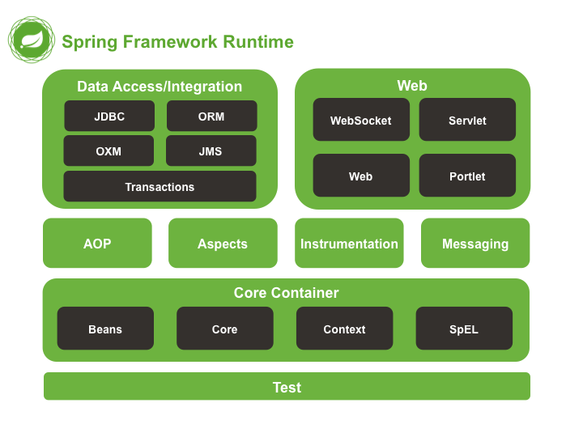
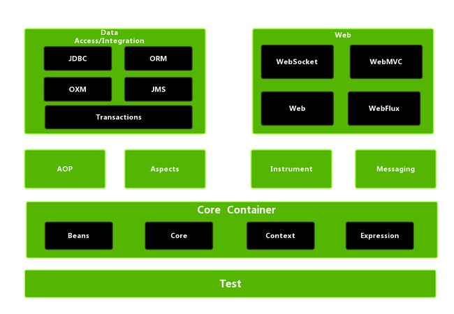
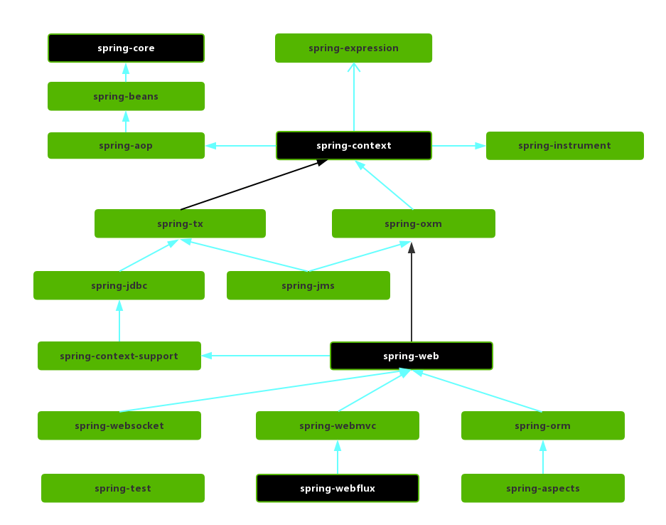

# 模块

## 版本
### Spring4.x 版本

### Spring5.x 版本

> Spring5.x 版本中 Web 模块的 Portlet 组件已经被废弃掉，同时增加了用于异步响应式处理的 WebFlux 组件。
> 
## Spring 各个模块的依赖关系

## 核心容器层（Core Container）
> Spring 框架的核心模块，也可以说是基础模块，主要提供 IoC 依赖注入功能的支持，Spring 其他所有的功能基本都需要依赖于该模块
### Spring-Core
> 核心功能工具类，具体包括控制反转和依赖控制
### Spring-Beans
> 提供对 bean 的创建、配置和管理等功能的支持。
### Spring-Context
> - 继承自Spring-Beans模块，并添加国际化、事件传播、资源加载和透明地创建上下文等功能
> - 提供一些J2EE功能，比如EJB、JMX和远程调用等
> - Spring-Context-Support提供了将第三方库集成到Spring-Context的支持
### spring-expression
> 表达式语言SpEL支持

## AOP
### spring-aspects
> 该模块为与 AspectJ 的集成提供支持。
### spring-aop
> 提供了面向切面的编程实现。
### spring-instrument
> 用于 Java 代理（Agent）和类文件的加载时（Load-Time）转换
### spring-instrument-tomcat
> 为 Tomcat 提供了一个织入代理，能够为 Tomcat 传递类文件，就像这些文件是被类加载器加载的一样

## 数据访问层（Data Access/Integration）
### spring-jdbc
> 提供了对数据库访问的抽象 JDBC。不同的数据库都有自己独立的 API 用于操作数据库，而 Java 程序只需要和 JDBC API 交互，这样就屏蔽了数据库的影响。
### spring-tx
> 提供对事务的支持。
### spring-orm
> 提供对 Hibernate、JPA、iBatis 等 ORM 框架的支持。
### spring-oxm
> 提供一个抽象层支撑 OXM(Object-to-XML-Mapping)，例如：JAXB、Castor、XMLBeans、JiBX 和 XStream 等。
### spring-jms
> 消息服务。自 Spring Framework 4.1 以后，它还提供了对 spring-messaging 模块的继承。

## Web应用层（Spring Web）
### spring-web
> 对 Web 功能的实现提供一些最基础的支持。
### spring-webmvc
> 提供对 Spring MVC 的实现。
### spring-webmvc-portlet
> 基于Portlet环境的MVC实现，5.x已经废弃。
### spring-websocket
> 提供了对 WebSocket 的支持，WebSocket 可以让客户端和服务端进行双向通信。
### spring-webflux
> 提供对 WebFlux 的支持。WebFlux 是 Spring Framework 5.0 中引入的新的响应式框架。与 Spring MVC 不同，它不需要 Servlet API，是完全异步。

## Messaging
> spring-messaging 是从 Spring4.0 开始新加入的一个模块，主要职责是为 Spring 框架集成一些基础的报文传送应用。

## Spring Test
> Spring 团队提倡测试驱动开发（TDD）  
> Spring 的测试模块对 JUnit（单元测试框架）、TestNG（类似 JUnit）、Mockito（主要用来 Mock 对象）、PowerMock（解决 Mockito 的问题比如无法模拟 final, static， private 方法）等等常用的测试框架支持的都比较好。

