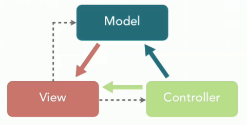
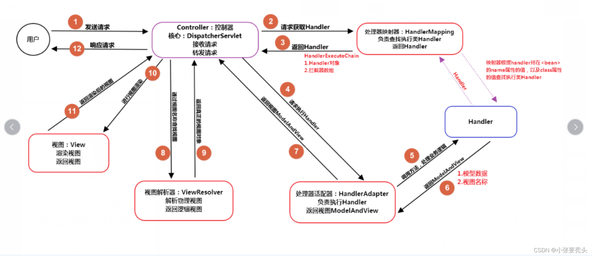

# Spring

## 特性
> - 轻量
>   - jar包体积小
>   - 系统资源使用少
> - 控制反转(IoC)
>   - 对象之间的依赖解耦
> - 面向容器
>   - 对象的配置化生成
>   - 对象的生命周期管理
> - 面向切面(AOP)
>   - 通过分离系统逻辑和业务逻辑来降低系统耦合度
> - 框架灵活
>   - 根据需求引入相应的模块

## Spring,Spring MVC,Spring Boot 之间的关系
> Spring 包含了多个功能模块，其中最重要的是 Spring-Core（主要提供 IoC 依赖注入功能的支持） 模块， Spring 中的其他模块（比如 Spring MVC）的功能实现基本都需要依赖于该模块。  
> Spring MVC 是 Spring 中的一个很重要的模块，主要赋予 Spring 快速构建 MVC 架构的 Web 程序的能力。MVC 是模型(Model)、视图(View)、控制器(Controller)的简写，其核心思想是通过将业务逻辑、数据、显示分离来组织代码。  
>   
> Spring 旨在简化 J2EE 企业应用程序开发。Spring Boot 旨在简化 Spring 开发（减少配置文件，开箱即用）。

## Spring MVC的工作流程

### 核心组件
> - **`DispatcherServlet`**：核心的中央处理器，负责接收请求、分发，并给予客户端响应。
> - **`HandlerMapping`**：处理器映射器，根据`URL`去匹配查找能处理的`Handler`，并会将请求涉及到的拦截器和`Handler`一起封装。
> - **`HandlerAdapter`**：处理器适配器，根据`HandlerMapping`找到的`Handler`，适配执行对应的`Handler`。
> - **`Handler`**：请求处理器，处理实际请求的处理器。
> - **`ViewResolver`**：视图解析器，根据`Handler`返回的逻辑视图/视图，解析并渲染真正的视图，并传递给`DispatcherServlet`响应客户端。

## 01 [注解](01.annotation%2FREADME.md)
## 02 [模块](02.module%2FREADME.md)
## 03 [IoC（Inversion of Control） 控制反转](03.ioc%2FREADME.md)

