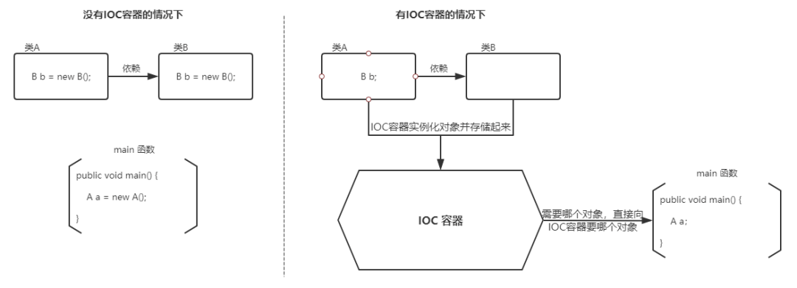
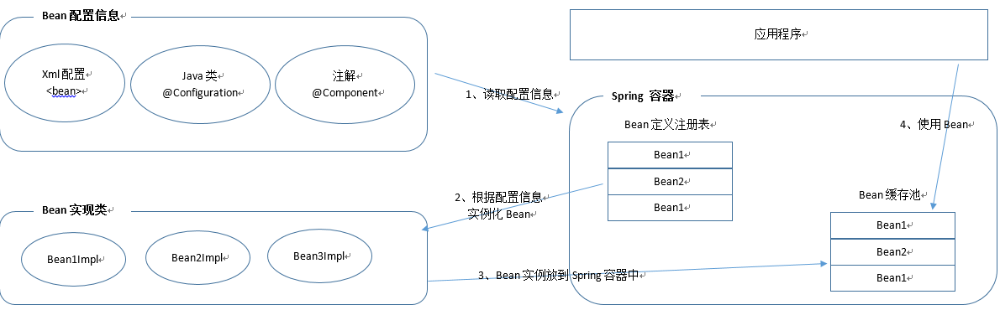
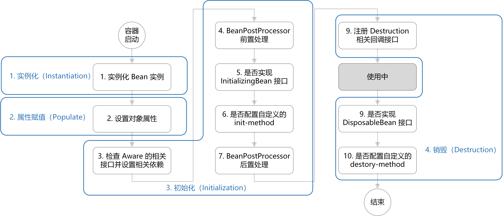

# IoC（Inversion of Control） 控制反转

## 控制反转
- **控制**：指的是对象创建（实例化、管理）的权力
- **反转**：控制权交给外部环境（Spring 框架、IoC 容器）



利用Java的反射功能实例化Bean并建立Bean之间的依赖关系，还提供了实例化缓存、生命周期管理、实例代理、事件发布和资源装载等高级服务。

## Spring Bean
Bean 代指的就是那些被 IoC 容器所管理的对象。

- IoC 容器如何使用配置元数据来管理对象  
  
- Spring Bean的装配流程  


### 将一个类声明为 Bean 的注解
- @Component
- @Repository
- @Service
- @Controller

[查看](..%2Fannotation%2FREADME.md#bean相关注解)

#### @Component 和 @Bean 的区别
- @Component 注解作用于类，而@Bean注解作用于方法。
- @Component通常是通过类路径扫描来自动侦测以及自动装配到 Spring 容器中（我们可以使用 @ComponentScan 注解定义要扫描的路径从中找出标识了需要装配的类自动装配到 Spring 的 bean 容器中）。@Bean 注解通常是我们在标有该注解的方法中定义产生这个 bean,@Bean告诉了 Spring 这是某个类的实例，当我需要用它的时候还给我。
- @Bean 注解比 @Component 注解的自定义性更强，而且很多地方我们只能通过 @Bean 注解来注册 bean。比如当我们引用第三方库中的类需要装配到 Spring容器时，则只能通过 @Bean来实现。

### 注入 Bean 的注解
- @Autowired
- @Resource
- @Inject

[查看](..%2Fannotation%2FREADME.md#bean相关注解)

#### @Autowired 和 @Resource 的区别
- @Autowired 是 Spring 提供的注解，@Resource 是 JDK 提供的注解。
- Autowired 默认的注入方式为byType（根据类型进行匹配），@Resource默认注入方式为 byName（根据名称进行匹配）。
- 当一个接口存在多个实现类的情况下，@Autowired 和@Resource都需要通过名称才能正确匹配到对应的 Bean。Autowired 可以通过 @Qualifier 注解来显式指定名称，@Resource可以通过 name 属性来显式指定名称。
- @Autowired 支持在构造函数、方法、字段和参数上使用。@Resource 主要用于字段和方法上的注入，不支持在构造函数或参数上使用。

### Bean 的作用域

[查看](..%2Fannotation%2FREADME.md#@Scope)

### Bean 的线程安全
Spring 框架中的 Bean 是否线程安全，取决于其作用域和状态
- prototype 作用域下，每次获取都会创建一个新的 bean 实例，不存在资源竞争问题，所以不存在线程安全问题。
- singleton 作用域下，IoC 容器中只有唯一的 bean 实例，可能会存在资源竞争问题（取决于 Bean 是否有状态）。
  - 有状态 Bean，包含可变的成员变量的对象，存在线程安全问题。  
    有状态单例 Bean 的线程安全问题有两种解决办法：
      - 在 Bean 中尽量避免定义可变的成员变量。
      - 在类中定义一个 ThreadLocal 成员变量，将需要的可变成员变量保存在 ThreadLocal 中（推荐的一种方式）。
  - 无状态Bean，没有定义可变的成员变量的（比如 Dao、Service），是线程安全的

### Bean 的生命周期


1. 创建`Bean`的实例
`Bean`容器首先会找到配置文件中的`Bean`定义，然后使用`Java`反射`API`来创建`Bean`的实例。  
`AbstractAutowireCapableBeanFactory`的`doCreateBean()`方法中能看到依次执行 4 个阶段
2. `Bean`属性赋值/填充
为`Bean`设置相关属性和依赖，例如`@Autowired`等注解注入的对象、`@Value`注入的值、`setter`方法或构造函数注入依赖和值、`@Resource`注入的各种资源。
3. `Bean`初始化
   1. 如果`Bean`实现了`BeanNameAware`接口，调用`setBeanName()`方法，传入`Bean`的名字。
   2. 如果`Bean`实现了`BeanClassLoaderAware`接口，调用`setBeanClassLoader()`方法，传入`ClassLoader`对象的实例。
   3. 如果`Bean`实现了`BeanFactoryAware`接口，调用`setBeanFactory()`方法，传入`BeanFactory`对象的实例。  
     `Aware`接口能让`Bean`能拿到`Spring`容器资源
      - **`BeanNameAware`**：注入当前`bean`对应`beanName`；
      - **`BeanClassLoaderAware`**：注入加载当前`bean`的`ClassLoader`；
      - **`BeanFactoryAware`**：注入当前`BeanFactory`容器的引用。
   4. 与上面的类似，如果实现了其他`*.Aware`接口，就调用相应的方法。
   5. 如果有和加载这个`Bean`的`Spring`容器相关的`BeanPostProcessor`对象，执行`postProcessBeforeInitialization()`方法。  
     `BeanPostProcessor`接口是`Spring`为修改`Bean`提供的强大扩展点
      - **`postProcessBeforeInitialization`**：`Bean`实例化、属性注入完成后，InitializingBean#afterPropertiesSet方法以及自定义的`init-method`方法之前执行；
      - **`postProcessAfterInitialization`**：类似于上面，不过是在`InitializingBean#afterPropertiesSet`方法以及自定义的`init-method`方法之后执行。
   6. 如果`Bean`实现了`InitializingBean`接口，执行`afterPropertiesSet()`方法。
   7. 如果`Bean`在配置文件中的定义包含`init-method`属性，执行指定的方法。
   8. 如果有和加载这个`Bean`的`Spring`容器相关的`BeanPostProcessor`对象，执行`postProcessAfterInitialization()`方法。  
     `InitializingBean`和`init-method`是`Spring`为`Bean`初始化提供的扩展点
      - InitializingBean  
      - init-method
4. 销毁 Bean  
销毁并不是说要立马把 Bean 给销毁掉，而是把 Bean 的销毁方法先记录下来，将来需要销毁 Bean 或者销毁容器的时候，就调用这些方法去释放 Bean 所持有的资源。
   1. 如果 Bean 实现了 DisposableBean 接口，执行 destroy() 方法。
   2. 如果 Bean 在配置文件中的定义包含 destroy-method 属性，执行指定的 Bean 销毁方法。或者，也可以直接通过@PreDestroy 注解标记 Bean 销毁之前执行的方法。


```java
// 1. 创建`Bean`的实例
protected Object doCreateBean(final String beanName, final RootBeanDefinition mbd, final @Nullable Object[] args)
    throws BeanCreationException {

    // 1. 创建 Bean 的实例
    BeanWrapper instanceWrapper = null;
    if (instanceWrapper == null) {
        instanceWrapper = createBeanInstance(beanName, mbd, args);
    }

    Object exposedObject = bean;
    try {
        // 2. Bean 属性赋值/填充
        populateBean(beanName, mbd, instanceWrapper);
        // 3. Bean 初始化
        exposedObject = initializeBean(beanName, exposedObject, mbd);
    }

    // 4. 销毁 Bean-注册回调接口
    try {
        registerDisposableBeanIfNecessary(beanName, bean, mbd);
    }

    return exposedObject;
}
```
```java
// 3.5. 如果有和加载这个`Bean`的`Spring`容器相关的`BeanPostProcessor
public interface BeanPostProcessor {

     // 初始化前置处理
     default Object postProcessBeforeInitialization(Object bean, String beanName) throws BeansException {
     return bean;
     }

     // 初始化后置处理
     default Object postProcessAfterInitialization(Object bean, String beanName) throws BeansException {
     return bean;
     }

}
```
```java
// 3.8.- InitializingBean
public interface InitializingBean { 
    // 初始化逻辑
    void afterPropertiesSet() throws Exception;
}
```
```xml
<!--3.8.- init-method-->
<?xml version="1.0" encoding="UTF-8"?>
    <beans xmlns="http://www.springframework.org/schema/beans" 
       xmlns:xsi="http://www.w3.org/2001/XMLSchema-instance" 
       xsi:schemaLocation="http://www.springframework.org/schema/beans http://www.springframework.org/schema/beans/spring-beans.xsd">

         <bean id="demo" class="cn.wubo.Demo" init-method="init()"/>
    </beans>
```

#### 总结
整体上可以简单分为四步：实例化 —> 属性赋值 —> 初始化 —> 销毁。  
初始化这一步涉及到的步骤比较多，包含 Aware 接口的依赖注入、BeanPostProcessor 在初始化前后的处理以及 InitializingBean 和 init-method 的初始化操作。  
- Spring的4种依赖注入：
  - 构造器注入
  - set方法注入
  - 静态工厂注入
  - 实例工厂注入  

销毁这一步会注册相关销毁回调接口，最后通过DisposableBean 和 destory-method 进行销毁。


