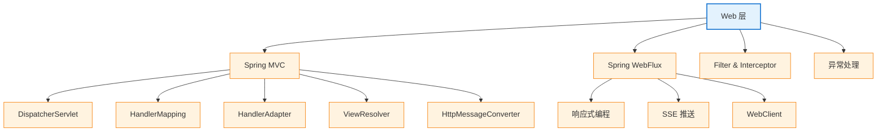

# 02 Web 层

> 最后更新: 2026-06-09
> ⬅️ [返回 Spring 顶层](../README.md)

---

## 🎯 一句话定位

**Spring Web 层 = Spring MVC（同步阻塞）+ Spring WebFlux（异步响应式）**——前者是事实标准，后者是高并发场景的备选。本章讲清楚请求如何"进门—被处理—出门"。

---

## 📚 章节导航

| 章节 | 文件 | 核心问题 | 建议时长 |
|:----:|:----|:---------|:--------:|
| **Spring MVC 总览** | [mvc/README.md](mvc/README.md) | MVC 是什么？DispatcherServlet 如何工作？ | 25 min |
| **组件执行顺序** | [mvc/components-order.md](mvc/components-order.md) | Filter/Interceptor/AOP 哪个先执行？ | 15 min |
| **WebFlux 响应式** | [webflux/sse.md](webflux/sse.md) | 响应式 SSE 实现，单机 10 万+ 连接 | 30 min |

---

## 🧭 知识地图

---

## ⚡ 核心概念速查

| 概念 | 一句话定义 | 章节 |
|------|----------|:----:|
| **MVC** | Model-View-Controller 架构模式 | [MVC](mvc/README.md) |
| **DispatcherServlet** | Spring MVC 的前端控制器，所有请求的入口 | [MVC](mvc/README.md) |
| **HandlerMapping** | 根据 URL 找到对应的 Controller 方法 | [MVC](mvc/README.md) |
| **HandlerInterceptor** | Spring MVC 的拦截器（preHandle/postHandle/afterCompletion） | [组件顺序](mvc/components-order.md) |
| **Filter** | Servlet 规范的过滤器（比 Interceptor 更早） | [组件顺序](mvc/components-order.md) |
| **HttpMessageConverter** | 将 Java 对象与 HTTP 请求/响应体互转（JSON/XML） | [MVC](mvc/README.md) |
| **SSE** | Server-Sent Events，服务端单向推送 | [WebFlux](webflux/sse.md) |
| **WebFlux** | 响应式 Web 框架（Reactor + Netty） | [WebFlux](webflux/sse.md) |

---

## 🤔 思考

1. **MVC vs WebFlux 怎么选？** 大多数场景用 MVC（同步、成熟、调试简单）；高并发实时推送/IoT 用 WebFlux。
2. **Filter vs Interceptor vs AOP 区别？** Filter（Servlet 规范）→ Interceptor（Spring MVC）→ AOP（方法级）。
3. **为什么用 @RestController 而不是 @Controller？** 前者默认所有方法返回 JSON（@ResponseBody 聚合）。
4. **WebFlux 一定比 MVC 快吗？** 不是！WebFlux 的优势在高并发 I/O 密集型场景，CPU 密集型反而更慢。

---

## 相关章节

- ⬅️ [返回 Spring 顶层](../README.md)
- ⬅️ [01 核心容器](../01-core/README.md) — MVC 依赖 IoC 容器管理 Controller/Service/Repository
- ➡️ [03 数据层](../03-data/README.md) — Controller 调用 Service 操作数据
- ➡️ [06 集成组件](../06-integration/README.md) — Validation 用于 Controller 参数校验
- [08 注解速查：Web](../08-annotations/README.md) — @RequestMapping、@RestController 等

---

> 🚀 从 [Spring MVC 总览](mvc/README.md) 开始
