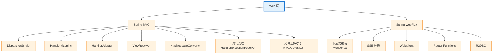

<!--
module:
  parent: spring
  slug: spring/web
  type: index
  category: 后端框架 / Spring 全家桶
  topic: Spring Web 层
  audience: Java 后端工程师
  summary: Spring Web = MVC（同步阻塞）+ WebFlux（响应式）（13 篇：DispatcherServlet/9 大组件/Filter/AOP 顺序/异常/视图/上传/CORS/i18n/异步/SSE/WebClient/R2DBC/Router Functions/测试）
-->

# 02 Web 层

> 一句话定位：**Spring Web 层 = Spring MVC（同步阻塞）+ Spring WebFlux（异步响应式）**——前者是事实标准，后者是高并发场景的备选。
>
> ⬅️ [返回 Spring 顶层](../README.md)

---
## 引言：反直觉代码

02 Web 层 的关键不是语法——是**看起来对**的代码背后那些'踩坑点'。

本篇用 3 个反直觉片段切入，把面试/生产中常被问起、但一深入就漏馅的点摆出来。

---

## 🎯 一句话定位

**Spring Web 层 = Spring MVC（同步阻塞）+ Spring WebFlux（异步响应式）**——前者是事实标准，后者是高并发场景的备选。本章讲清楚请求如何"进门—被处理—出门"。通用异常处理机制见 [01 核心容器/异常处理](../01-core/exception-handling.md)；MVC 特有的 HandlerExceptionResolver 机制见 [mvc/exception-resolver.md](mvc/exception-resolver.md)。

---

## 📚 章节导航

### Spring MVC 系列

| 章节 | 文件 | 核心问题 | 建议时长 |
|:----:|:----|:---------|:--------:|
| **Spring MVC 总览** | [mvc/README.md](mvc/README.md) | MVC 是什么？DispatcherServlet 如何工作？ | 25 min |
| **DispatcherServlet 与 9 大组件** | [mvc/dispatch-flow.md](mvc/dispatch-flow.md) | 请求从进入到响应经过哪些步骤？9 大组件怎么协作？ | 15 min |
| **组件执行顺序** | [mvc/components-order.md](mvc/components-order.md) | Filter/Interceptor/AOP 哪个先执行？ | 15 min |
| **视图解析器** | [mvc/view-resolver.md](mvc/view-resolver.md) | ViewResolver 体系；前后端分离还需要吗？ | 15 min |
| **异常处理（MVC）** | [mvc/exception-resolver.md](mvc/exception-resolver.md) | HandlerExceptionResolver 链、@ExceptionHandler、ErrorResponse | 20 min |
| **文件上传** | [mvc/file-upload.md](mvc/file-upload.md) | MultipartFile、单/多文件、大小类型限制 | 15 min |
| **CORS 与静态资源** | [mvc/cors-and-static.md](mvc/cors-and-static.md) | @CrossOrigin、WebJars、addResourceHandlers | 15 min |
| **异步 MVC** | [mvc/async-mvc.md](mvc/async-mvc.md) | Callable/DeferredResult/SseEmitter、spring.mvc.async | 20 min |
| **国际化（i18n）** | [mvc/i18n.md](mvc/i18n.md) | LocaleResolver、MessageSource、messages.properties | 15 min |

### Spring WebFlux 系列

| 章节 | 文件 | 核心问题 | 建议时长 |
|:----:|:----|:---------|:--------:|
| **WebFlux 概览** | [webflux/README.md](webflux/README.md) | Mono/Flux/背压/线程模型/与 MVC 对比/选型 | 25 min |
| **SSE 实时推送** | [webflux/sse.md](webflux/sse.md) | 响应式 SSE 实现，单机 10 万+ 连接 | 30 min |
| **WebClient 调用** | [webflux/webclient.md](webflux/webclient.md) | 响应式 HTTP 客户端；与 OpenFeign 对比 | 20 min |
| **Router Functions** | [webflux/router-functions.md](webflux/router-functions.md) | 函数式端点、DSL 风格 | 15 min |
| **R2DBC 响应式数据库** | [webflux/r2dbc.md](webflux/r2dbc.md) | DatabaseClient、ReactiveCrudRepository、事务 | 20 min |
| **WebFlux 测试** | [webflux/testing.md](webflux/testing.md) | WebTestClient、@WebFluxTest | 15 min |

---

## 🧭 知识地图

> 通用异常处理（@ControllerAdvice / AOP / 分层）见 [01 核心容器/异常处理](../01-core/exception-handling.md)；MVC 特有机制（HandlerExceptionResolver 链、ResponseStatusException、ErrorResponse）见 [mvc/exception-resolver.md](mvc/exception-resolver.md)。

---

## ⚡ 核心概念速查

| 概念 | 一句话定义 | 章节 |
|------|----------|:----:|
| **MVC** | Model-View-Controller 架构模式 | [MVC](mvc/README.md) |
| **DispatcherServlet** | Spring MVC 的前端控制器，所有请求的入口 | [MVC](mvc/README.md) |
| **HandlerMapping** | 根据 URL 找到对应的 Controller 方法 | [MVC](mvc/README.md) |
| **HandlerInterceptor** | Spring MVC 的拦截器（preHandle/postHandle/afterCompletion） | [组件顺序](mvc/components-order.md) |
| **Filter** | Servlet 规范的过滤器（比 Interceptor 更早） | [组件顺序](mvc/components-order.md) |
| **HttpMessageConverter** | 将 Java 对象与 HTTP 请求/响应体互转（JSON/XML） | [MVC](mvc/README.md) |
| **ViewResolver** | 逻辑视图名 → 物理视图对象 | [ViewResolver](mvc/view-resolver.md) |
| **HandlerExceptionResolver** | MVC 异常解析器链 | [异常处理](mvc/exception-resolver.md) |
| **@ExceptionHandler / @ControllerAdvice** | 局部/全局异常处理 | [异常处理](mvc/exception-resolver.md) |
| **ErrorResponse / ProblemDetail** | Spring 6+ 标准化错误体（RFC 7807） | [异常处理](mvc/exception-resolver.md) |
| **MultipartFile** | 文件上传对象 | [文件上传](mvc/file-upload.md) |
| **CORS** | 跨域资源共享（@CrossOrigin / CorsConfiguration） | [CORS 与静态资源](mvc/cors-and-static.md) |
| **Callable / DeferredResult / SseEmitter** | MVC 异步返回 | [异步 MVC](mvc/async-mvc.md) |
| **LocaleResolver / MessageSource** | 国际化 | [i18n](mvc/i18n.md) |
| **SSE** | Server-Sent Events，服务端单向推送 | [SSE](webflux/sse.md) |
| **WebFlux** | 响应式 Web 框架（Reactor + Netty） | [WebFlux](webflux/README.md) |
| **WebClient** | 响应式 HTTP 客户端 | [WebClient](webflux/webclient.md) |
| **RouterFunction** | 函数式路由 DSL | [Router Functions](webflux/router-functions.md) |
| **R2DBC** | 响应式关系数据库规范 | [R2DBC](webflux/r2dbc.md) |

---

## 🤔 思考

1. **MVC vs WebFlux 怎么选？** 大多数场景用 MVC（同步、成熟、调试简单）；高并发实时推送/IoT 用 WebFlux。
2. **Filter vs Interceptor vs AOP 区别？** Filter（Servlet 规范）→ Interceptor（Spring MVC）→ AOP（方法级）。
3. **为什么用 @RestController 而不是 @Controller？** 前者默认所有方法返回 JSON（@ResponseBody 聚合）。
4. **WebFlux 一定比 MVC 快吗？** 不是！WebFlux 的优势在高并发 I/O 密集型场景，CPU 密集型反而更慢。
5. **前后端分离还需要 ViewResolver 吗？** 绝大多数接口走 HttpMessageConverter；ViewResolver 只在错误页、邮件模板、混合 SSR 场景下才用。
6. **REST 错误体怎么统一？** 用 `@RestControllerAdvice` + 自定义 `BizException`；Spring 6+ 推荐 `ErrorResponse` / `ProblemDetail`（RFC 7807）。

---

## 相关章节

- ⬅️ [返回 Spring 顶层](../README.md)
- ⬅️ [01 核心容器](../01-core/README.md) — MVC 依赖 IoC 容器管理 Controller/Service/Repository；通用异常分层见 [异常处理](../01-core/exception-handling.md)
- ➡️ [03 数据层](../03-data/README.md) — Controller 调用 Service 操作数据
- ➡️ [06 集成组件](../06-integration/README.md) — Validation 用于 Controller 参数校验
- [08 注解速查：Web](../08-annotations/README.md) — @RequestMapping、@RestController 等

---

> 🚀 从 [Spring MVC 总览](mvc/README.md) 开始

---

## 📊 本节统计（leaf MD 数）

| 子目录 | 篇数 |
|:------|:----:|
| `02-web/`（本目录直接） | 0 |
| ├─ `mvc/` | 8 |
| └─ `webflux/` | 5 |
| **合计** | **13** |

> 数字基线：以 leaf MD 数（含子目录与子子目录的 .md，不含任何 README 索引页）为统计口径。统计时间 2026-07-01。

← [返回 Spring 顶层](../README.md)
