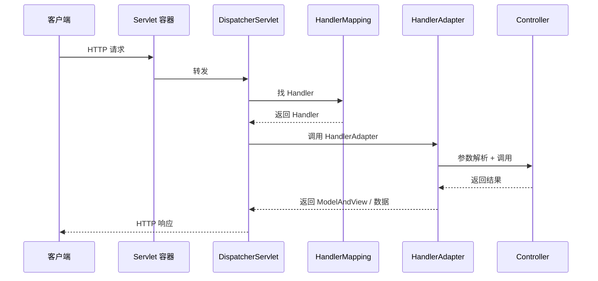

<!--
module:
  parent: spring
  slug: spring/mvc
  type: article
  category: 主模块子文章
  summary: Spring MVC 流程与 Filter/AOP 顺序。
-->

# Spring MVC

> ⬅️ [返回 02 Web 层](../README.md)

---
---

## 🎯 一句话定位

**Spring MVC = 基于 MVC 模式的 Java Web 框架**——通过 **DispatcherServlet** 作为前端控制器 + **9 大组件**协作 + **注解驱动**开发，让 Web 层代码简洁、可测试、易扩展。RESTful 错误体统一、API 版本化等**统一错误处理**见 [异常处理](exception-resolver.md)。

---

## 📚 章节导航

| 章节 | 核心问题 | 阅读时长 |
|:-----|:---------|:--------:|
| [DispatcherServlet 与 9 大组件](dispatch-flow.md) | 请求从进入到响应经过哪些步骤？9 大组件怎么协作？ | 15 min |
| [组件对比与场景](components-order.md) | Filter / Interceptor / AOP 怎么选？执行顺序？ | 10 min |
| [视图解析器](view-resolver.md) | ViewResolver 体系；前后端分离还需要吗？ | 15 min |
| [异常处理](exception-resolver.md) | HandlerExceptionResolver 链、@ExceptionHandler、ErrorResponse | 20 min |
| [文件上传](file-upload.md) | MultipartFile、单/多文件、大小类型限制 | 15 min |
| [CORS 与静态资源](cors-and-static.md) | @CrossOrigin、WebJars、addResourceHandlers | 15 min |
| [异步 MVC](async-mvc.md) | Callable/DeferredResult/SseEmitter、spring.mvc.async | 20 min |
| [国际化（i18n）](i18n.md) | LocaleResolver、MessageSource、messages.properties | 15 min |

---

## 一、什么是 Spring MVC

> **Spring MVC** 是 **Spring Framework** 中用于构建 **Web 应用程序** 和 **RESTful Web 服务** 的核心模块。它基于经典的 **MVC（Model-View-Controller）架构模式** 设计，将应用程序的不同关注点（业务逻辑、数据展示、用户交互）分离，使代码更清晰、可维护、可测试。

---

## 二、核心思想：MVC 架构

| 角色 | 职责 | 不依赖什么 |
|------|------|----------|
| **Model (模型)** | 代表应用程序的数据和业务逻辑（Java 对象、数据库操作） | 不依赖 Web 层 |
| **View (视图)** | 负责数据的呈现（JSP、Thymeleaf、FreeMarker 模板，或 JSON/XML 响应） | 从 Model 获取数据 |
| **Controller (控制器)** | 接收 HTTP 请求，调用 Model 处理业务逻辑，选择 View 渲染结果 | 核心枢纽 |

---

## 三、为什么需要 Spring MVC

- **解决传统 Servlet/JSP 开发痛点**：避免在 Servlet 中混杂业务逻辑、数据访问和视图渲染代码，导致代码臃肿、难以维护和测试。
- **提供强大的基础设施**：封装了底层 Servlet API 的复杂性（如请求/响应处理、会话管理），开发者只需关注业务逻辑。
- **高度可配置和可扩展**：通过配置（XML 或 Java Config）和丰富的接口/抽象类，可以灵活定制几乎任何环节（如参数解析、数据绑定、验证、视图解析、异常处理）。
- **无缝集成 Spring 生态**：与 Spring 的核心特性（IoC 容器、AOP、事务管理、数据访问、安全性等）深度集成。
- **强大的 REST 支持**：是构建现代 RESTful Web 服务的首选框架之一（配合 `@RestController`）。

---

## 四、关键特点与优势

- **注解驱动开发**（@Controller, @RequestMapping 等）：极大简化配置，使代码更简洁、意图更清晰。**这是现代 Spring MVC 开发的主流方式**。
- **松耦合**：各组件（Controller, Service, Repository）通过接口和 Spring IoC 容器管理依赖，易于单元测试和模块替换。
- **强大的数据绑定与验证**：自动将请求参数映射到 Java 对象，并支持 JSR-303 Bean Validation 规范。
- **灵活的视图技术**：无缝支持 JSP, Thymeleaf, FreeMarker, Velocity, JSON, XML 等各种视图技术，易于切换。
- **一流的 REST 支持**：通过 @RestController, @PathVariable, @RequestBody, @ResponseBody, HttpMessageConverter 等，轻松构建符合 REST 原则的 Web 服务。
- **国际化 (i18n) 与主题 (Themes) 支持**：内置对多语言和主题切换的支持。
- **文件上传/下载**：提供简单易用的 API 处理文件上传和下载。
- **与 Spring Boot 深度集成**：Spring Boot 极大简化了 Spring MVC 应用的配置和部署。通过 `spring-boot-starter-web` 依赖，自动配置 DispatcherServlet、常用视图解析器、JSON 转换器等，**开箱即用**。

---

## 五、Spring MVC vs. Spring Boot

| 维度 | Spring MVC | Spring Boot |
|------|-----------|-------------|
| **定位** | Spring Framework 中**专门处理 Web 层**的模块/技术 | 快速开发框架/平台 |
| **范围** | 只能处理 Web 层 | 包含并自动配置了 Spring MVC（及其他 Spring 模块和第三方库） |
| **配置** | 需要手动配置大量 XML/Java Config | 自动配置，**开箱即用** |
| **生产级特性** | 无 | 监控、健康检查、外部化配置等 |
| **关系** | Spring Boot 的子集 | Spring MVC 的超集 |

> 你可以只用 Spring MVC（需要手动配置），但**强烈推荐**在 Spring Boot 的基础上使用 Spring MVC。Spring Boot 是构建 Spring MVC 应用的**最佳实践和事实标准**。

---

## 六、核心组件与工作流程

Spring MVC 的核心是一个 **前端控制器 (Front Controller)** 模式实现：

### 1. DispatcherServlet（核心引擎）

- 本质上是**一个 Servlet**（通常映射到 `/`）
- 作为**所有请求的单一入口点**
- 负责协调整个请求处理流程

### 2. 请求处理流程



| 步骤 | 行为 | 组件 |
|:----:|:-----|:----|
| 1 | 用户发起 HTTP 请求 | — |
| 2 | 请求被 Servlet 容器接收，转发给 DispatcherServlet | Tomcat |
| 3 | **HandlerMapping** 找到能处理此请求的 Controller 方法 | HandlerMapping |
| 4 | **HandlerAdapter** 真正执行 Controller 方法 | HandlerAdapter |
| 5 | **参数解析**（路径变量、查询参数、表单、JSON、Header 等） | HandlerMethodArgumentResolver |
| 6 | **数据验证**（如 JSR-303 @Valid） | Validator |
| 7 | 执行 Controller 方法，返回 ModelAndView 或数据 | Controller |
| 8 | **视图解析**（逻辑视图名 → 物理视图）或 **JSON 序列化** | ViewResolver / HttpMessageConverter |
| 9 | 异常统一处理 | HandlerExceptionResolver |
| 10 | 返回响应给客户端 | DispatcherServlet |

> 详细 9 大组件解析见 [DispatcherServlet 与 9 大组件](dispatch-flow.md)

---

## 七、组件协作全景

```mermaid
graph TB
    MVC[Spring MVC] --> DS[DispatcherServlet]
    MVC --> Annotation[注解驱动<br/>@Controller @RequestMapping]
    MVC --> Binding[数据绑定 + 验证<br/>@ModelAttribute @Valid]
    MVC --> View[视图技术<br/>JSP/Thymeleaf/FreeMarker]
    MVC --> REST[REST 支持<br/>@RestController @ResponseBody]
    MVC --> i18n[国际化 + 主题]
    MVC --> File[文件上传/下载]
    MVC --> Boot[Spring Boot 集成]

    style MVC fill:#e3f2fd,stroke:#1976d2,stroke-width:3px
    style DS fill:#fff3e0,stroke:#f57c00
```

---

## 八、总结

**Spring MVC 是一个强大、灵活、基于 MVC 模式的 Java Web 框架，是 Spring Framework 的核心 Web 模块。** 它通过 DispatcherServlet 作为前端控制器，利用注解驱动的方式，将请求分发给 Controller 处理业务逻辑，协调 Model 和 View，最终生成响应。

它解决了传统 Web 开发的痛点，提供了企业级应用所需的基础设施，并与 Spring 生态无缝集成。**在现代 Java 开发中，它通常与 Spring Boot 结合使用，以实现极高的开发效率和生产力。**

理解 Spring MVC 的核心概念（尤其是请求处理流程和 9 大关键组件）对于成为合格的 Java Web 开发者至关重要。

---

## 🤔 思考

1. **Spring MVC 是同步的还是异步的？** 同步为主，但支持异步（SSE、WebAsyncTask、DeferredResult、Reactive）。
2. **Spring MVC 和 Spring WebFlux 怎么选？** 99% 场景用 Spring MVC（同步阻塞、简单直接）；高并发/响应式场景用 WebFlux。
3. **为什么用 DispatcherServlet 作为统一入口？** 集中处理通用逻辑（异常、i18n、主题），业务 Controller 只关注业务。
4. **Spring MVC 支持 WebSocket 吗？** 通过 spring-websocket 模块支持。

---

## 相关章节

- ⬅️ [返回 02 Web 层](../README.md)
- [DispatcherServlet 与 9 大组件](dispatch-flow.md)
- [组件对比与场景](components-order.md)
- [08 注解/Web 注解](../../08-annotations/web.md) — @RequestMapping、@RestController 详解
- [04 Spring Boot/自定义 Starter](../../04-spring-boot/custom-starter.md) — spring-boot-starter-web 详解

← [返回: Spring 全家桶 · mvc](../README.md)
