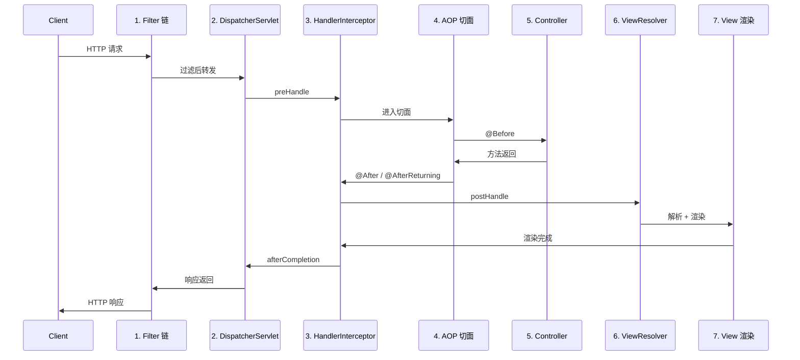
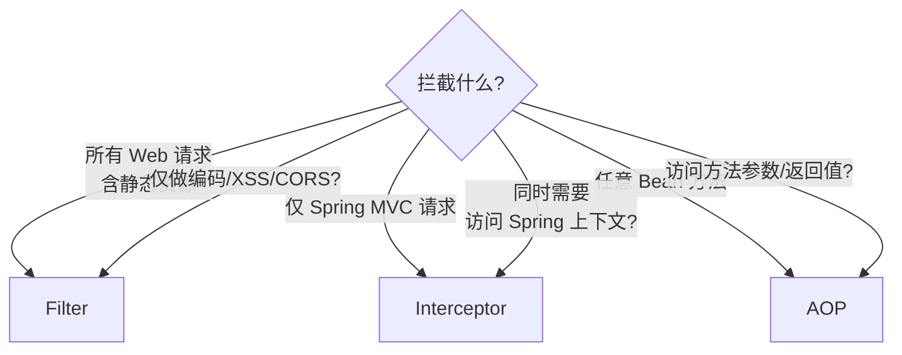

# 组件执行顺序与对比

> ⬅️ [返回 MVC 总览](README.md) | [DispatcherServlet 与 9 大组件](dispatch-flow.md)

Spring MVC 的请求处理涉及 **Filter → DispatcherServlet → Interceptor → AOP → Controller → View** 等多个层级。本文梳理完整的执行顺序、各组件的详细对比，以及典型应用场景。

---

## 🎯 一句话定位

**Spring MVC 组件执行顺序 = "从外到内"**——Filter（最外层）→ DispatcherServlet → Interceptor.preHandle → AOP.@Before → Controller → AOP.@After → Interceptor.postHandle → ViewResolver → Interceptor.afterCompletion → 响应返回（最外层）。

---

## 一、完整执行顺序



### 11 步执行顺序

| 步骤 | 组件 | 说明 |
|:----:|:-----|:-----|
| 1 | **Filter 链** | 字符编码、CORS、XSS 防护 |
| 2 | **Servlet / DispatcherServlet** | 前端控制器 |
| 3 | **HandlerInterceptor.preHandle** | 鉴权、参数校验 |
| 4 | **AOP 切面（前置通知）** | 事务开启、日志 |
| 5 | **Controller** | 业务处理 |
| 6 | **AOP 切面（后置/返回通知）** | 事务提交、日志 |
| 7 | **HandlerInterceptor.postHandle** | 二次处理（极少用） |
| 8 | **ViewResolver** | 视图解析 |
| 9 | **视图渲染** | 渲染 HTML |
| 10 | **HandlerInterceptor.afterCompletion** | 资源清理 |
| 11 | 响应返回 Filter 链 | — |

---

## 二、各组件详细分析

### 1. Filter（过滤器）

> **Servlet 规范组件**，在请求到达 Servlet 前和响应离开 Servlet 后进行处理。

| 维度 | 说明 |
|------|------|
| **规范** | Servlet 规范，不依赖 Spring |
| **配置** | web.xml 或 @ServletComponentScan |
| **访问能力** | 只能访问 ServletRequest 和 ServletResponse |
| **执行级别** | Web 容器级别（比 Spring 早） |

**典型使用场景**：
- 字符编码过滤（`CharacterEncodingFilter`）
- 跨域请求处理（CORS）
- 安全防护（XSS、CSRF）
- 全局请求/响应日志记录

### 2. Servlet / DispatcherServlet

> **前端控制器**，协调各组件处理请求。

| 维度 | 说明 |
|------|------|
| **本质** | Spring MVC 的核心 |
| **职责** | 初始化 WebApplicationContext、加载 9 大组件 |
| **范围** | 任何 Spring MVC 应用的核心入口 |

详见 [DispatcherServlet 与 9 大组件](dispatch-flow.md)

### 3. HandlerInterceptor（拦截器）

> **Spring MVC 提供的请求拦截机制**，3 个核心方法。

| 方法 | 触发时机 | 用途 |
|------|---------|------|
| `preHandle` | Controller 方法执行**前** | 鉴权、参数校验、性能监控 |
| `postHandle` | Controller 方法执行**后**，视图渲染前 | 二次处理、修改 ModelAndView |
| `afterCompletion` | 视图渲染**完成后** | 资源清理、异常日志 |

| 维度 | 说明 |
|------|------|
| **依赖** | Spring 框架（不是 Servlet 规范） |
| **访问能力** | 可访问 Spring 上下文、Handler、Model |
| **配置** | 路径模式（`/api/**`） |

**典型使用场景**：
- 登录认证与会话管理
- 权限验证（ACL）
- 请求参数校验
- 性能监控与统计
- 多语言切换

### 4. AOP（面向切面编程）

> **提供横切关注点的模块化**，基于代理实现（JDK 动态代理或 CGLIB）。

| 维度 | 说明 |
|------|------|
| **作用范围** | 任何 Spring Bean 的方法 |
| **访问能力** | 方法参数、返回值、异常 |
| **执行粒度** | 细粒度（方法级别） |

**5 种通知类型**：@Before / @After / @AfterReturning / @AfterThrowing / @Around

详见 [AOP 总览](../../01-core/aop/README.md)

**典型使用场景**：
- 事务管理（@Transactional）
- 业务日志记录
- 方法执行性能监控
- 参数校验
- 异常统一处理
- 缓存管理

### 5. Controller（控制器）

> **处理具体业务请求**，返回处理结果。

| 维度 | 说明 |
|------|------|
| **注解** | @Controller 或 @RestController |
| **路由** | @RequestMapping 系列注解 |
| **依赖注入** | 可注入 Service、Repository |
| **特性** | 支持参数绑定、数据校验 |

**典型使用场景**：
- RESTful API 开发
- 传统 Web 页面控制器
- 文件上传/下载处理
- 表单数据处理

### 6. ViewResolver（视图解析器）

> **将逻辑视图名解析为具体视图对象**。

| 维度 | 说明 |
|------|------|
| **实现** | InternalResourceViewResolver、ThymeleafViewResolver、FreeMarkerViewResolver |
| **配置** | prefix（`/WEB-INF/views/`）+ suffix（`.html`） |
| **特性** | 支持内容协商（ContentNegotiatingViewResolver） |

**典型使用场景**：
- JSP / Thymeleaf / FreeMarker 模板渲染
- 视图国际化
- 多视图技术混合使用
- REST API 与传统 Web 页面混合架构

---

## 三、Filter vs HandlerInterceptor vs AOP 对比

> 这是面试高频题，三者各有适用场景。

### 对比表

| 特性 | Filter | HandlerInterceptor | AOP |
|------|--------|-------------------|-----|
| **规范层级** | Servlet 规范 | Spring 框架 | Spring 框架 |
| **依赖关系** | 不依赖 Spring | 依赖 Spring | 依赖 Spring |
| **执行时机** | 最外层（Servlet 前后） | DispatcherServlet 内 | Controller 调用时 |
| **访问能力** | 仅请求/响应 | Handler、Model、Spring 上下文 | 方法参数、返回值 |
| **作用范围** | 所有 Servlet 请求 | Web 层请求 | 任何 Spring Bean 方法 |
| **执行粒度** | 粗（请求级别） | 粗（请求级别） | 细（方法级别） |
| **可访问 Bean** | ❌（需手动获取） | ✅ | ✅ |
| **配置方式** | web.xml / @WebFilter | WebMvcConfigurer | @Aspect |

### 选择决策树



### 经验法则

| 场景 | 选择 |
|------|------|
| 字符编码、CORS、XSS | **Filter** |
| 登录认证、权限校验 | **Interceptor**（需访问 Spring 上下文） |
| 事务管理 | **AOP**（@Transactional） |
| 业务日志 | **AOP**（需访问方法参数） |
| 缓存 | **AOP**（@Cacheable） |
| 性能监控 | **Interceptor** 或 **AOP** |

---

## 四、典型应用场景示例

### 电商系统

| 组件 | 职责 |
|------|------|
| **Filter** | 全局 UTF-8 编码、CORS 跨域、XSS 防护 |
| **HandlerInterceptor** | 登录态校验、购物车权限、性能监控 |
| **AOP** | 商品浏览日志、订单事务、库存扣减事务、缓存管理 |
| **Controller** | 商品查询、下单、支付等业务 |
| **ViewResolver** | 商品列表、详情页等视图 |

### 通用 Web 系统

| 组件 | 职责 |
|------|------|
| **Filter** | 字符编码、跨域、安全防护 |
| **HandlerInterceptor** | 登录认证、Token 校验、访问日志 |
| **AOP** | 业务日志、事务、缓存 |
| **Controller** | RESTful API |
| **ViewResolver** | 错误页面渲染（404、500） |

---

## 五、Interception 实战：自定义 Interceptor

```java
@Component
public class AuthInterceptor implements HandlerInterceptor {

    @Override
    public boolean preHandle(HttpServletRequest request, HttpServletResponse response, Object handler) {
        String token = request.getHeader("Authorization");
        if (token == null) {
            response.setStatus(401);
            return false;  // 阻止请求
        }
        // 校验 token...
        return true;
    }

    @Override
    public void postHandle(HttpServletRequest request, HttpServletResponse response,
                           Object handler, ModelAndView modelAndView) {
        // Controller 调用后，视图渲染前
    }

    @Override
    public void afterCompletion(HttpServletRequest request, HttpServletResponse response,
                                Object handler, Exception ex) {
        // 资源清理、异常日志
    }
}

// 注册 Interceptor
@Configuration
public class WebConfig implements WebMvcConfigurer {
    @Override
    public void addInterceptors(InterceptorRegistry registry) {
        registry.addInterceptor(new AuthInterceptor())
                .addPathPatterns("/api/**")
                .excludePathPatterns("/api/login");
    }
}
```

---

## 🤔 思考

1. **Filter 和 Interceptor 会不会冲突？** 不会，按执行顺序依次触发（Filter 先）。
2. **Interceptor 和 AOP 拦截顺序？** Interceptor.preHandle → AOP.@Before → Controller → AOP.@After → Interceptor.postHandle。
3. **为什么需要这么多层级？** 分层处理：通用（Filter）→ 框架（Interceptor）→ 业务（AOP）→ 业务实现（Controller）。
4. **Spring Security 用什么？** 用 Filter 实现（基于 Filter 链）。

---

## 相关章节

- ⬅️ [返回 MVC 总览](README.md)
- [DispatcherServlet 与 9 大组件](dispatch-flow.md)
- [AOP 总览](../../01-core/aop/README.md) — AOP 切面
- [AOP 通知顺序](../../01-core/aop/advice-order-and-best-practices.md) — 多切面排序
