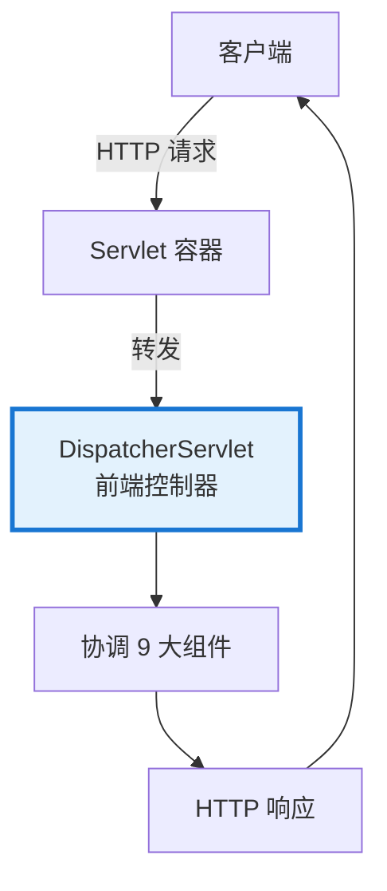
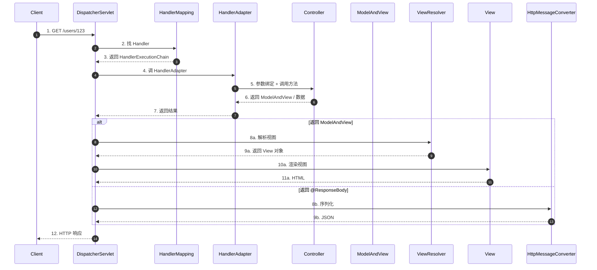
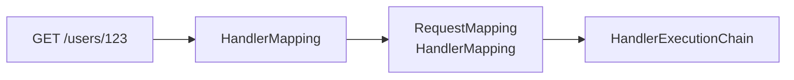
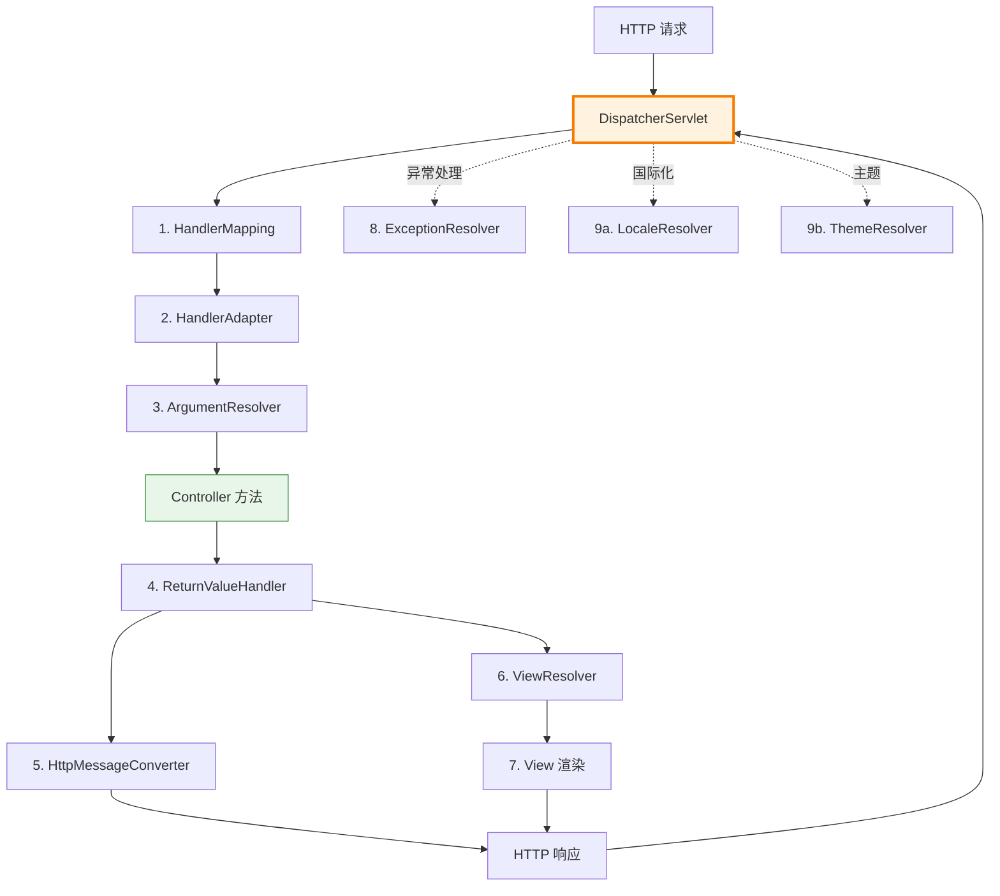

# DispatcherServlet 与 9 大组件

> 最后更新: 2026-06-09
> ⬅️ [返回 MVC 总览](README.md) | [组件对比与场景](components-order.md)

Spring MVC 的核心是 **DispatcherServlet**（前端控制器模式）+ **9 大组件**。本文介绍请求处理流程、9 个核心组件的职责及协作关系。

---

## 🎯 一句话定位

**Spring MVC = DispatcherServlet 调度 + 9 大组件协作**——DispatcherServlet 是"总指挥"，9 大组件是"分工明确的执行者"。整个请求流程可以概括为"找 Handler → 调 Handler → 处理结果 → 写响应"四步。

---

## 一、DispatcherServlet 是什么

> **DispatcherServlet** 是 Spring MVC 的核心，本质上是一个 **Servlet**（通常映射到 `/`），作为**所有请求的单一入口点**。



### DispatcherServlet 的职责

1. **接收**所有 HTTP 请求
2. **查找**处理该请求的 Handler（Controller 方法）
3. **调用** Handler 执行业务逻辑
4. **处理**返回值（视图渲染 / JSON 序列化）
5. **返回**最终的 HTTP 响应

---

## 二、请求处理流程



### 7 个关键步骤

| 步骤 | DispatcherServlet 行为 | 关键组件 |
|:----:|:---------------------|:--------|
| 1 | 用户发起 HTTP 请求 | — |
| 2-3 | 通过 **HandlerMapping** 找到匹配的 **Controller 方法** | HandlerMapping |
| 4 | 通过 **HandlerAdapter** 真正执行 Controller 方法 | HandlerAdapter |
| 5 | **参数解析** + 数据绑定（HTTP 数据 → Java 对象） | HandlerMethodArgumentResolver |
| 6 | 调用方法，返回 **ModelAndView** 或数据 | Controller |
| 7-8 | **视图解析**（逻辑视图名 → 物理视图）或 **序列化** | ViewResolver / HttpMessageConverter |
| 9 | 返回 HTTP 响应 | — |

---

## 三、9 大核心组件

> DispatcherServlet 通过这 9 个组件完成整个请求处理流程。

### 1. HandlerMapping（处理器映射）

> **作用**：根据请求 URL 找到对应的 **Handler（Controller 方法）**。



| 关键实现 | 说明 |
|---------|------|
| `RequestMappingHandlerMapping` | **最常用**——基于 @RequestMapping 注解 |
| `BeanNameUrlHandlerMapping` | 按 Bean 名称匹配（旧） |
| `SimpleUrlHandlerMapping` | 按 URL 配置匹配（XML 时代） |

### 2. HandlerAdapter（处理器适配器）

> **作用**：**真正执行** Controller 方法的组件。负责参数解析、调用方法、处理返回值。

| 关键实现 | 说明 |
|---------|------|
| `RequestMappingHandlerAdapter` | **最常用**——支持 @RequestMapping 注解的 Controller |
| `HttpRequestHandlerAdapter` | 处理 HttpRequestHandler 接口 |
| `SimpleControllerHandlerAdapter` | 处理传统 Controller 接口 |

> 📌 **为什么需要 HandlerAdapter？** 因为 Controller 的实现方式有多种（注解式、接口式、HttpRequestHandler），HandlerAdapter 抹平了这些差异。

### 3. HandlerMethodArgumentResolver（参数解析器）

> **作用**：将 HTTP 请求数据**自动绑定**到 Controller 方法的参数上。

| 解析器 | 支持的注解 | 数据来源 |
|--------|-----------|---------|
| `PathVariableMethodArgumentResolver` | `@PathVariable` | URL 路径 |
| `RequestParamMethodArgumentResolver` | `@RequestParam` | 查询参数/表单 |
| `RequestBodyAdvice` | `@RequestBody` | 请求体 |
| `RequestHeaderMethodArgumentResolver` | `@RequestHeader` | Header |
| `CookieValueMethodArgumentResolver` | `@CookieValue` | Cookie |
| `ModelAttributeMethodProcessor` | `@ModelAttribute` | 表单对象 |

### 4. HttpMessageConverter（HTTP 消息转换器）

> **作用**：在 Controller 方法和 HTTP 请求/响应之间**转换数据格式**（Java 对象 ↔ JSON/XML）。

| 实现 | 用途 |
|------|------|
| `MappingJackson2HttpMessageConverter` | **最常用**——Java 对象 ↔ JSON |
| `Jaxb2RootElementHttpMessageConverter` | Java 对象 ↔ XML |
| `StringHttpMessageConverter` | String ↔ Text |
| `ByteArrayHttpMessageConverter` | byte[] ↔ 二进制 |

### 5. ViewResolver（视图解析器）

> **作用**：将**逻辑视图名**（如 `"userProfile"`）解析为**具体物理视图对象**（如 `ThymeleafView`）。

```mermaid
graph LR
    Name[逻辑视图名<br/>"userProfile"] --> VR[ViewResolver]
    VR --> Prefix[prefix=/WEB-INF/views/]
    VR --> Suffix[suffix=.html]
    VR --> Path[/WEB-INF/views/userProfile.html]
    Path --> V[View 对象]
```

| 实现 | 用途 |
|------|------|
| `InternalResourceViewResolver` | JSP（**最常用**） |
| `ThymeleafViewResolver` | Thymeleaf 模板 |
| `FreeMarkerViewResolver` | FreeMarker 模板 |
| `ContentNegotiatingViewResolver` | 内容协商（按 Accept 头选择） |

### 6. HandlerExceptionResolver（异常解析器）

> **作用**：统一处理 Controller 抛出的异常，返回错误响应。

| 实现 | 用途 |
|------|------|
| `ExceptionHandlerExceptionResolver` | 处理 `@ExceptionHandler` 注解 |
| `ResponseStatusExceptionResolver` | 处理 `@ResponseStatus` 注解 |
| `DefaultHandlerExceptionResolver` | Spring 内置异常的默认处理 |

### 7. RequestToViewNameTranslator（视图名转换器）

> **作用**：当 Controller 方法**没有显式返回视图名**时，根据请求 URL 自动生成默认视图名。

### 8. LocaleResolver（国际化解析器）

> **作用**：从请求中解析 Locale（语言/地区），支持多语言切换。

| 实现 | 说明 |
|------|------|
| `AcceptHeaderLocaleResolver` | **默认**——从 HTTP Accept-Language 头解析 |
| `SessionLocaleResolver` | 从 Session 中获取 |
| `CookieLocaleResolver` | 从 Cookie 中获取 |

### 9. ThemeResolver（主题解析器）

> **作用**：解析用户主题（皮肤），支持个性化界面。

---

## 四、9 大组件协作全景图



---

## 五、源码级入口

### DispatcherServlet 核心方法：doDispatch()

```java
// DispatcherServlet.doDispatch()
protected void doDispatch(HttpServletRequest request, HttpServletResponse response) throws Exception {
    // 1. 根据请求找到 Handler
    mappedHandler = getHandler(processedRequest);
    // 2. 根据 Handler 找到 HandlerAdapter
    HandlerAdapter ha = getHandlerAdapter(mappedHandler.getHandler());
    // 3. 调用 preHandle 拦截器
    if (!mappedHandler.applyPreHandle(processedRequest, response)) return;
    // 4. 真正调用 Controller 方法
    mv = ha.handle(processedRequest, response, mappedHandler.getHandler());
    // 5. 调用 postHandle 拦截器
    mappedHandler.applyPostHandle(processedRequest, response, mv);
    // 6. 处理分发结果（视图渲染或异常处理）
    processDispatchResult(processedRequest, response, mappedHandler, mv, dispatchException);
}
```

---

## 🤔 思考

1. **为什么有 9 大组件这么多？** Spring MVC 需要支持**高度可定制**——每个组件都有多种实现，开发者可自由替换。
2. **最常用的组件是哪些？** HandlerMapping（RequestMappingHandlerMapping）+ HandlerAdapter（RequestMappingHandlerAdapter）+ ViewResolver（InternalResourceViewResolver）+ HttpMessageConverter（Jackson）。
3. **Spring Boot 自动配置了哪些？** spring-boot-starter-web 自动配置了 DispatcherServlet + 所有 9 大组件的默认实现（开箱即用）。
4. **9 大组件都需要关心吗？** 99% 场景下不用——只需关心 HandlerMapping、HandlerAdapter、ViewResolver、HttpMessageConverter 这 4 个。

---

## 相关章节

- ⬅️ [返回 MVC 总览](README.md)
- [组件对比与场景](components-order.md) — Filter/Interceptor/AOP 对比
- [01 核心容器/AOP](../../01-core/aop/README.md) — AOP 拦截与 Interceptor 的差异
- [08 注解/Web 注解](../../08-annotations/web.md) — @RequestMapping 详解
