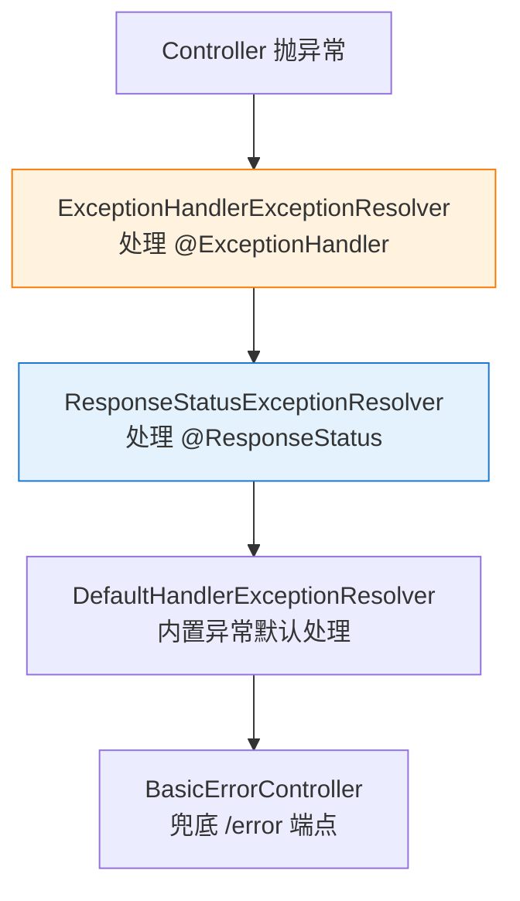

# HandlerExceptionResolver 异常处理

> 最后更新: 2026-06-14
> ⬅️ [返回 MVC 总览](README.md) | [02 Web 层](../README.md)

Spring MVC 通过 `HandlerExceptionResolver` 链统一处理 Controller 抛出的异常。本文聚焦 **MVC 特有的异常机制**（`@ExceptionHandler` / `@ControllerAdvice` / `ResponseStatusException` / `ErrorResponse`），与 01-core 的通用异常分层（[异常处理](../../01-core/exception-handling.md)）互为补充——后者讲"分而治之"的层级思想，本文讲"Web 层具体怎么落地"。

---

## 🎯 一句话定位

**MVC 异常处理 = "在 Web 边界把异常翻译成对客户端友好的响应"**——4 种核心机制组合使用：注解式精细控制（`@ExceptionHandler`）、全局兜底（`@ControllerAdvice`）、快速状态码（`ResponseStatusException`）、标准化错误体（`ErrorResponse`，Spring 6+）。

---

## 一、HandlerExceptionResolver 链



| 解析器 | 处理的异常来源 | 优先级 |
|--------|----------------|--------|
| `ExceptionHandlerExceptionResolver` | `@ExceptionHandler` 标注方法 | 高 |
| `ResponseStatusExceptionResolver` | `@ResponseStatus` 标注类、`ResponseStatusException` | 中 |
| `DefaultHandlerExceptionResolver` | Spring 内置异常（`MethodArgumentNotValidException` 等） | 中 |
| `BasicErrorController` | `/error` 兜底 | 低（最后） |

> 解析器**按顺序匹配**，前序解析器处理后**后续不再执行**。

---

## 二、@ExceptionHandler（精细控制）

### 1. Controller 局部

```java
@RestController
@RequestMapping("/users")
public class UserController {

    @GetMapping("/{id}")
    public User get(@PathVariable Long id) {
        return userRepo.findById(id)
                .orElseThrow(() -> new UserNotFoundException(id));
    }

    @ExceptionHandler(UserNotFoundException.class)
    public ResponseEntity<ApiError> handleNotFound(UserNotFoundException e) {
        return ResponseEntity.status(404)
                .body(new ApiError("USER_NOT_FOUND", e.getMessage()));
    }
}
```

> 仅对本 Controller 生效。复用性差，建议用 `@ControllerAdvice` 全局化。

### 2. @ControllerAdvice（推荐）

```java
@RestControllerAdvice  // = @ControllerAdvice + @ResponseBody
public class GlobalExceptionHandler {

    @ExceptionHandler(UserNotFoundException.class)
    public ResponseEntity<ApiError> handleNotFound(UserNotFoundException e) {
        return ResponseEntity.status(404).body(new ApiError("USER_NOT_FOUND", e.getMessage()));
    }

    @ExceptionHandler(MethodArgumentNotValidException.class)
    public ResponseEntity<ApiError> handleValidation(MethodArgumentNotValidException e) {
        String msg = e.getBindingResult().getFieldErrors().stream()
                .map(fe -> fe.getField() + ":" + fe.getDefaultMessage())
                .collect(Collectors.joining(";"));
        return ResponseEntity.badRequest().body(new ApiError("VALIDATION_FAILED", msg));
    }

    @ExceptionHandler(Exception.class)
    public ResponseEntity<ApiError> handleUnknown(Exception e) {
        log.error("unhandled", e);
        return ResponseEntity.status(500).body(new ApiError("INTERNAL", "系统繁忙"));
    }
}
```

> `@RestControllerAdvice` 默认聚合 `@ResponseBody`，返回值直接序列化为 JSON，**最常用**。

### 3. 分组：basePackages / annotations

```java
@RestControllerAdvice(basePackages = "com.example.web")
public class WebExceptionHandler { /* 只对 web 包下 Controller 生效 */ }

@RestControllerAdvice(annotations = RestController.class)
public class ApiExceptionHandler { /* 只对标注了 @RestController 的类生效 */ }
```

---

## 三、ResponseStatusException（Spring 5+，快速状态码）

```java
@GetMapping("/{id}")
public User get(@PathVariable Long id) {
    return userRepo.findById(id)
            .orElseThrow(() -> new ResponseStatusException(
                    HttpStatus.NOT_FOUND, "User not found: " + id));
}
```

| 维度 | 说明 |
|------|------|
| **优点** | 一行代码抛 4xx/5xx，无需自定义异常类 |
| **缺点** | 错误体格式不统一，客户端难以解析 |
| **建议** | 适合"快速失败"或演示代码；生产环境建议自定义异常 + `@ExceptionHandler` |

---

## 四、ErrorResponse（Spring 6+ / Spring Boot 3+ 标准化）

> Spring 6 引入 `ErrorResponse` 接口与 `ProblemDetail`（RFC 7807），是推荐的**现代错误体规范**。

### 1. 抛出标准 ProblemDetail

```java
@ExceptionHandler(UserNotFoundException.class)
public ProblemDetail handleNotFound(UserNotFoundException e) {
    return ProblemDetail.forStatusAndDetail(HttpStatus.NOT_FOUND, e.getMessage());
}
```

自动序列化：

```json
{
  "type": "about:blank",
  "title": "Not Found",
  "status": 404,
  "detail": "User not found: 99"
}
```

### 2. 实现 ErrorResponse 接口

```java
public class BizException extends RuntimeException implements ErrorResponse {
    private final HttpStatus status;
    public BizException(HttpStatus status, String msg) {
        super(msg); this.status = status;
    }
    @Override public HttpStatusCode getStatusCode() { return status; }
    @Override public ProblemDetail getBody() {
        return ProblemDetail.forStatusAndDetail(status, getMessage());
    }
}
```

抛 `BizException` 即可，**无需写 `@ExceptionHandler`**，Spring MVC 会自动用其 `getBody()` 渲染。

---

## 五、统一错误体模板（实战）

```java
public record ApiError(String code, String message, Object data) { }

// 错误响应工厂
public class ApiErrors {
    public static ApiError of(String code, String message) { return new ApiError(code, message, null); }
}

// 在 @RestControllerAdvice 里用
@ExceptionHandler(BizException.class)
public ResponseEntity<ApiError> handleBiz(BizException e) {
    return ResponseEntity.status(e.getCode()).body(ApiErrors.of(e.getCodeStr(), e.getMessage()));
}
```

> 项目中**统一约定错误体**（如 `{code, message, data, traceId}`），是 API 治理的基础。

---

## 六、与 01-core 异常处理的边界

| 文章 | 关注点 |
|------|--------|
| [01-core/exception-handling](../../01-core/exception-handling.md) | **通用机制**——`@ControllerAdvice` + AOP + try-catch 的分层思想 |
| **本文档** | **MVC 特有**——`HandlerExceptionResolver` 链、`ResponseStatusException`、`ErrorResponse`、错误体模板 |

> 简言之：01-core 解决"在哪里处理异常"；本文档解决"在 Web 层具体怎么落地"。

---

## 七、最佳实践

1. **生产环境**用 `@RestControllerAdvice` + 自定义 `BizException` + 统一错误体，**避免 500 泄露堆栈**。
2. **Spring Boot 3+**项目优先用 `ErrorResponse` + `ProblemDetail`（RFC 7807）。
3. **不要**在 `@ExceptionHandler(Exception.class)` 里吞掉异常，必须**记日志 + 返回模糊错误**。
4. **404 / 405 等框架异常**走 `DefaultHandlerExceptionResolver`，无需重复处理。
5. **错误页场景**：自定义 `error/404.html` 由 `BasicErrorController` 渲染。

---

## 相关章节

- ⬅️ [返回 MVC 总览](README.md)
- [01 核心容器/异常处理](../../01-core/exception-handling.md) — 通用异常分层
- [组件对比与场景](components-order.md) — ExceptionResolver 在执行链中的位置
- [DispatcherServlet 与 9 大组件](dispatch-flow.md) — 9 大组件协作
