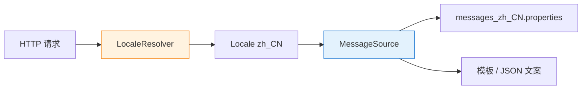

# 国际化（i18n）：Locale 与 MessageSource

> ⬅️ [返回 MVC 总览](README.md) | [02 Web 层](../README.md)

Spring MVC 通过 **`LocaleResolver` + `LocaleChangeInterceptor` + `MessageSource`** 三件套实现 Web 层的国际化（i18n）：从请求解析 Locale → 切换 Locale → 从多语言资源文件查文案。本文覆盖核心组件、Spring Boot 自动配置、模板与 Controller 中的用法。

---

## 🎯 一句话定位

**Web i18n = "LocaleResolver 选语言 + MessageSource 查文案"**——`Accept-Language` / `?lang=zh` / Cookie / Session 任选其一；资源文件 `messages_zh.properties` / `messages_en.properties` 分离文案；模板或 Controller 按当前 Locale 渲染。

---

## 一、三件套关系



| 组件 | 职责 |
|------|------|
| **LocaleResolver** | 从请求中解析 `Locale` |
| **LocaleChangeInterceptor** | 拦截请求，根据 `?lang=xx` 切换 Locale |
| **MessageSource** | 按 Locale 加载 `messages_xx.properties`，解析文案 |

---

## 二、LocaleResolver：4 种实现

| 实现 | Locale 来源 | 适用场景 |
|------|-------------|----------|
| `AcceptHeaderLocaleResolver` | `Accept-Language` 请求头 | REST API（默认） |
| `CookieLocaleResolver` | Cookie | 浏览器 Web |
| `SessionLocaleResolver` | HttpSession | 登录后按用户偏好 |
| `FixedLocaleResolver` | 配置固定值 | 测试 / 单语言应用 |

> Spring Boot 默认装配 `AcceptHeaderLocaleResolver`（未引入 `WebMvcConfigurer` 自定义时）。

### 自定义 LocaleResolver

```java
@Bean
public LocaleResolver localeResolver() {
    CookieLocaleResolver resolver = new CookieLocaleResolver("lang");
    resolver.setDefaultLocale(Locale.SIMPLIFIED_CHINESE);
    resolver.setCookieMaxAge(3600 * 24 * 30);  // 30 天
    return resolver;
}
```

---

## 三、LocaleChangeInterceptor：URL 切换

```java
@Bean
public WebMvcConfigurer localeConfig() {
    return new WebMvcConfigurer() {
        @Override
        public void addInterceptors(InterceptorRegistry registry) {
            LocaleChangeInterceptor interceptor = new LocaleChangeInterceptor();
            interceptor.setParamName("lang");   // ?lang=en
            interceptor.setIgnoreInvalidLocale(true);
            registry.addInterceptor(interceptor);
        }
    };
}
```

请求 `GET /welcome?lang=en` → 切换 Locale 为 `en`。

> **必须与 CookieLocaleResolver 或 SessionLocaleResolver 搭配**，否则切换不生效。

---

## 四、MessageSource 与多语言资源

### 1. 资源文件结构

```text
src/main/resources/
  ├── messages.properties            # 默认（兜底）
  ├── messages_zh.properties         # 简体中文
  ├── messages_en.properties         # 英语
  ├── messages_zh_CN.properties      # 简体中文（中国）
  └── messages_en_US.properties      # 英语（美国）
```

`messages.properties`：

```properties
welcome=欢迎,{0}!
error.notfound=资源未找到
```

`messages_en.properties`：

```properties
welcome=Welcome, {0}!
error.notfound=Not Found
```

### 2. Java Config 自定义

```java
@Bean
public MessageSource messageSource() {
    ReloadableResourceBundleMessageSource source = new ReloadableResourceBundleMessageSource();
    source.setBasename("classpath:messages");
    source.setDefaultEncoding("UTF-8");
    source.setFallbackToSystemLocale(false);  // 默认 zh_CN 而非系统 Locale
    source.setUseCodeAsDefaultMessage(true);  // 找不到 key 直接返回 key 而非抛异常
    return source;
}
```

> Spring Boot 默认装配 `MessageSourceAutoConfiguration`，自动从 `classpath:messages.properties` 加载；仅当需要自定义才显式声明。

### 3. 注入并使用

```java
@Service
@RequiredArgsConstructor
public class UserService {
    private final MessageSource ms;

    public String getWelcome(String name, Locale locale) {
        return ms.getMessage("welcome", new Object[]{name}, locale);
    }
}
```

> Controller 拿 Locale：`@Autowired LocaleResolver` + `resolver.resolveLocale(request)`，或直接 `@RequestHeader("Accept-Language") Locale locale`。

---

## 五、Thymeleaf 模板中用 i18n

`src/main/resources/templates/hello.html`：

```html
<!DOCTYPE html>
<html xmlns:th="http://www.thymeleaf.org">
<head>
    <title th:text="#{welcome}">Welcome</title>
</head>
<body>
    <h1 th:text="#{welcome(${user.name})}">Welcome, Guest</h1>
    <p th:text="#{error.notfound}">Not Found</p>
</body>
</html>
```

> Thymeleaf 默认通过 `RequestContext.getLocale()` 取 Locale；模板里用 `#{key}` 语法即可。

---

## 六、REST API 返回多语言错误体

```java
@RestController
@RequestMapping("/users")
public class UserController {

    @GetMapping("/{id}")
    public User get(@PathVariable Long id, @RequestHeader(value = "Accept-Language", required = false) Locale locale) {
        return userRepo.findById(id)
                .orElseThrow(() -> new BizException("USER_NOT_FOUND", locale));
    }
}

@RestControllerAdvice
public class GlobalHandler {

    @ExceptionHandler(BizException.class)
    public ResponseEntity<ApiError> handle(BizException e, Locale locale) {
        String msg = messageSource.getMessage(e.getCode(), null, locale);
        return ResponseEntity.status(400).body(new ApiError(e.getCode(), msg));
    }
}
```

> 客户端通过 `Accept-Language: en-US` 决定语言。

---

## 七、Spring Boot 自动配置

| 自动配置类 | 作用 |
|------------|------|
| `MessageSourceAutoConfiguration` | 默认 `MessageSource`，`basename=messages` |
| `LocaleAutoConfiguration` | 默认 `LocaleResolver = AcceptHeaderLocaleResolver` |

> **Spring Boot 默认只支持 `Accept-Language`**。要 URL/Cookie/Session 切换需**显式注册** `LocaleResolver` 与 `LocaleChangeInterceptor`（如上文）。

```yaml
spring:
  messages:
    basename: messages,i18n/validation
    encoding: UTF-8
    fallback-to-system-locale: false
```

---

## 八、最佳实践

1. **键名用点分命名**：`user.notfound`、`order.create.success`，避免平铺。
2. **资源文件统一 UTF-8**：避免 ASCII 转码丢失中文。
3. **API 错误码用 i18n**：错误码（`USER_NOT_FOUND`）保持英文不变，文案按 Locale 翻译。
4. **fallback 链**：默认 `messages.properties`（兜底）→ `messages_zh.properties` → `messages_zh_CN.properties`。
5. **i18n 不是翻译**：把"展示文案"和"日志/异常 code"分开，前者翻译后者保持不变。
6. **避免频繁 reload**：生产用 `ResourceBundleMessageSource`（启动时加载），开发用 `ReloadableResourceBundleMessageSource`（带缓存）。

---

## 相关章节

- ⬅️ [返回 MVC 总览](README.md)
- [DispatcherServlet 与 9 大组件](dispatch-flow.md) — LocaleResolver 是 9 大组件之一
- [异常处理](exception-resolver.md) — i18n 错误体
- [组件对比与场景](components-order.md) — LocaleChangeInterceptor 拦截器
