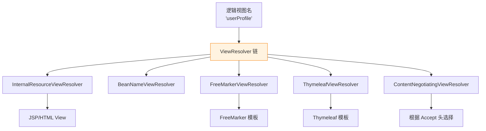

# ViewResolver 视图解析器

> 最后更新: 2026-06-14
> ⬅️ [返回 MVC 总览](README.md) | [02 Web 层](../README.md)

`ViewResolver` 是 Spring MVC 9 大组件之一，职责是**将逻辑视图名（String）解析为具体的 `View` 对象**。在前后端分离架构下，大多数接口直接返回 JSON，`ViewResolver` 是否还有用？本文讲清楚主流实现、与前后端分离的关系、以及"什么场景还需要它"。

---

## 🎯 一句话定位

**ViewResolver = "逻辑视图名 → 物理视图"**——在 SSR（服务端渲染）时代是核心；在前后端分离时代退居二线，仅在错误页、邮件模板、混合渲染场景下才用。

---

## 一、ViewResolver 体系



| 实现 | 用途 | 典型场景 |
|------|------|----------|
| `InternalResourceViewResolver` | JSP / Servlet 转发 | 老项目、内部 OA |
| `BeanNameViewResolver` | Bean 名 → View | 特殊导出（PDF/Excel） |
| `XmlViewResolver` / `ResourceBundleViewResolver` | XML / 配置文件驱动 | 老式配置 |
| `ThymeleafViewResolver` | Thymeleaf 3 模板 | 现代 SSR（Spring 官方推荐） |
| `FreeMarkerViewResolver` | FreeMarker 模板 | 邮件 / 报表模板 |
| `ContentNegotiatingViewResolver` | 按 `Accept` 头协商 | 多格式输出 |

> `InternalResourceViewResolver` 是 Spring Boot 默认装配之一，prefix=`/templates/`、suffix=`.html`（引入 Thymeleaf 后）。

---

## 二、InternalResourceViewResolver

```java
@Configuration
public class WebConfig implements WebMvcConfigurer {
    @Bean
    public ViewResolver viewResolver() {
        InternalResourceViewResolver resolver = new InternalResourceViewResolver();
        resolver.setPrefix("/WEB-INF/views/");
        resolver.setSuffix(".jsp");
        resolver.setViewClass(JstlView.class);
        resolver.setOrder(2);
        return resolver;
    }
}
```

Controller 返回 `"userProfile"` → 解析为 `/WEB-INF/views/userProfile.jsp`。

---

## 三、ContentNegotiatingViewResolver：内容协商

```java
@Bean
public ViewResolver contentNegotiatingViewResolver(ContentNegotiationManager mgr) {
    ContentNegotiatingViewResolver resolver = new ContentNegotiatingViewResolver();
    resolver.setContentNegotiationManager(mgr);
    return resolver;
}
```

- 客户端 `Accept: application/json` → JSON 视图
- 客户端 `Accept: text/html` → Thymeleaf 视图
- 常用于"同一 URL 多格式"场景（如 REST + 浏览器调试页面）。

---

## 四、BeanNameViewResolver

```java
@Bean
public BeanNameViewResolver beanNameViewResolver() {
    return new BeanNameViewResolver();
}

@Bean("pdfView")
public View pdfView() {
    return new PdfView();
}
```

Controller 返回 `"pdfView"` → 找到名为 `pdfView` 的 `View` Bean。常用于**导出 PDF/Excel** 等特殊视图。

---

## 五、与前后端分离的关系

> 现代前后端分离架构下，**绝大多数接口直接返回 JSON**，`@RestController` 默认聚合 `@ResponseBody`，**根本不会走 ViewResolver**。

| 架构 | 是否需要 ViewResolver | 原因 |
|------|----------------------|------|
| 前后端分离（Vue/React） | ❌ 基本不需要 | 全部走 `HttpMessageConverter` |
| 传统 SSR（Thymeleaf） | ✅ 必须 | 服务端渲染 HTML |
| 混合（同一应用 SSR + REST） | ✅ 部分需要 | SSR 端点需要 |
| 邮件 / 报表模板 | ✅ 需要 | FreeMarker/Thymeleaf 渲染邮件 |
| 错误页（404/500） | ✅ 默认开启 | Spring Boot `BasicErrorController` 走 HTML 视图 |

### Spring Boot 默认行为

- **不引入 Thymeleaf 等模板引擎** → `InternalResourceViewResolver` 仍会装配，但 prefix 指向 `classpath:/templates/`，找不到模板时返回 `Whitelabel Error Page`。
- **引入 Thymeleaf 依赖** → 自动配置 `ThymeleafViewResolver`，prefix=`classpath:/templates/`、suffix=`.html`。
- **仅返回 JSON** → 可以**显式排除**模板自动配置或干脆不引入依赖，避免装配无关 Bean。

---

## 六、什么时候仍然要 ViewResolver？

1. **错误页 / 异常页**：自定义 `error/404.html`、`error/500.html`。
2. **邮件模板**：FreeMarker 渲染 HTML 邮件。
3. **服务端导出报表**：JasperReports、Excel 模板。
4. **混合应用**：BFF 聚合层用 SSR 渲染 SEO 友好的 HTML，REST API 走 JSON。
5. **微服务前端网关**：Spring Cloud Gateway 等场景需要 Forward/Redirect。

---

## 七、最佳实践

1. **前后端分离项目**不要引入 `spring-boot-starter-thymeleaf`，**省掉 ViewResolver 装配开销**。
2. **错误页**单独维护 `error/4xx.html`、`error/5xx.html`，Thymeleaf 模板即可。
3. **导出 PDF/Excel** 用 `BeanNameViewResolver` + 自定义 `View`。
4. **ViewResolver 顺序**：`@Order` 控制优先级；`ContentNegotiatingViewResolver` 通常最高优先级。
5. **避免 JSP**：Spring Boot 嵌入式 Tomcat 对 JSP 支持有限（需打成 War），优先 Thymeleaf。

---

## 相关章节

- ⬅️ [返回 MVC 总览](README.md)
- [组件对比与场景](components-order.md) — ViewResolver 在执行链中的位置
- [DispatcherServlet 与 9 大组件](dispatch-flow.md) — 9 大组件协作
- [异常处理](exception-resolver.md) — 错误页与异常视图
