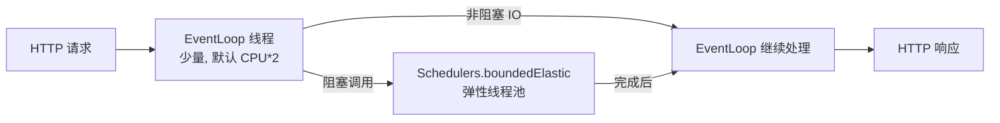
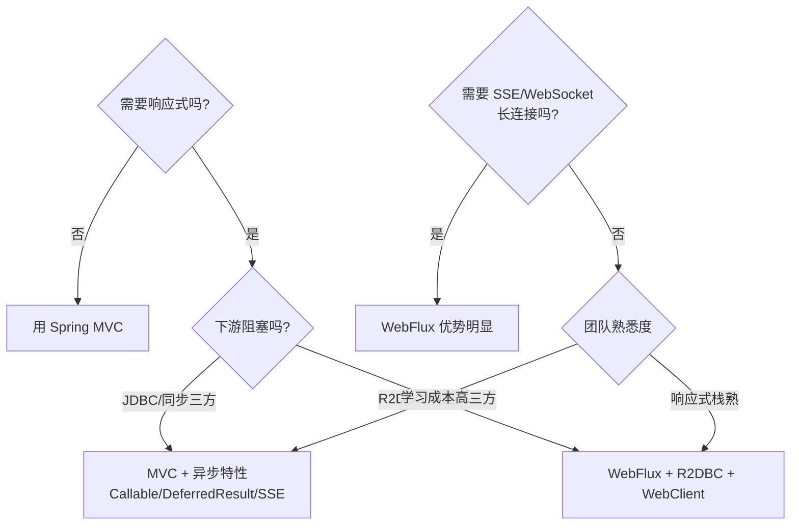

# Spring WebFlux 概览

> 最后更新: 2026-06-14
> ⬅️ [返回 02 Web 层](../README.md)

**Spring WebFlux = 响应式 Web 框架**——基于 **Reactor + Netty**（也支持 Servlet 3.1+ 容器），提供**非阻塞、事件驱动**的 HTTP 栈，是 Spring 5 引入的"MVC 替代品"。本文讲清楚 WebFlux 的核心概念、线程模型、与 MVC 的边界，以及何时该选谁。

---

## 🎯 一句话定位

**WebFlux = "高并发 I/O 密集型场景下的 Spring 替代栈"**——底层走少量 EventLoop 线程处理海量长连接，业务侧用 `Mono`/`Flux` 描述"未来才会有的数据"，编译器+运行时帮你编排非阻塞流水线。

---

## 一、为什么需要 WebFlux

| 问题 | 传统 MVC 表现 | WebFlux 解法 |
|------|--------------|--------------|
| 大量长连接（WebSocket/SSE） | 每连接占一个 Servlet 线程（默认 200） | EventLoop 复用，单机 10 万+ 连接 |
| 慢下游（DB/三方 HTTP） | 工作线程阻塞等待 | 订阅式释放，回调式恢复 |
| 业务需要组合多源数据 | 回调地狱 / Future.get 阻塞 | `Mono.zip` / `Flux.merge` 声明式编排 |

> WebFlux **不是"更快的 MVC"**——CPU 密集型反而更慢。优势在于 **I/O 密集 + 高并发 + 流量突发**。

---

## 二、Reactor 核心：Mono 与 Flux

| 类型 | 元素数 | 比喻 | 典型场景 |
|------|--------|------|----------|
| `Mono<T>` | 0..1 | 一次 Promise | 按 ID 查询、增删改 |
| `Flux<T>` | 0..N | 一次 Stream | 列表查询、推送、SSE |

### 常用操作符

| 操作符 | 作用 | 场景 |
|--------|------|------|
| `map` / `flatMap` | 元素转换（同步 / 异步） | 数据加工、链式调用 |
| `filter` / `take` | 元素筛选 | 截断、限流 |
| `zip` / `merge` / `concat` | 多流合并 | 并行查询、串行流水 |
| `onErrorResume` / `retry` | 错误恢复 | 错误处理、重试 |
| `subscribeOn` / `publishOn` | 线程切换 | 切到阻塞/弹性线程池 |
| `onBackpressureBuffer` / `onBackpressureDrop` | 背压策略 | 生产者太快时 |

### 背压（Backpressure）

- 响应式流规范（Reactive Streams）的核心是**消费者驱动的流量控制**：消费者用 `request(n)` 告诉上游"我这次只要 n 条"。
- Spring MVC 没有背压——一旦数据库返回 100 万行，内存直接爆。
- WebFlux 默认 `onBackpressureBuffer` 缓冲到 64k，需要时显式换 `drop` / `latest` / `error`。

---

## 三、线程模型



| 调度器 | 用途 |
|--------|------|
| **EventLoop**（Netty） | HTTP 解码/编码、I/O 回调，**禁止阻塞** |
| `Schedulers.parallel()` | CPU 密集计算（少量线程） |
| `Schedulers.boundedElastic()` | 阻塞 IO（DB、HTTP 客户端、文件），默认 10 × CPU 线程 |
| `Schedulers.single()` / `immediate()` | 单线程 / 当前线程执行 |

> **黄金法则**：业务方法里一旦出现 `JDBC`、`RestTemplate`、文件 IO，立即用 `subscribeOn(Schedulers.boundedElastic())` 切走。

---

## 四、WebFlux 的两种编程模型

### 1. 注解式（与 MVC 几乎一致）

```java
@RestController
@RequestMapping("/users")
public class UserController {
    @GetMapping("/{id}")
    public Mono<User> getById(@PathVariable Long id) {
        return userRepo.findById(id);  // 返回 Mono / Flux
    }

    @GetMapping
    public Flux<User> list() {
        return userRepo.findAll();
    }
}
```

> 注解、`@RequestMapping`、`@RestController`、参数解析等"基本平移"——但方法签名必须返回 `Mono`/`Flux`。

### 2. 函数式（RouterFunction + HandlerFunction）

- 详见 [Router Functions](router-functions.md)：用 DSL 风格组合路由与处理函数，类型安全、易测试。

---

## 五、WebFlux vs Spring MVC

| 维度 | Spring MVC | Spring WebFlux |
|------|------------|----------------|
| **并发模型** | 1 线程 / 请求（Servlet 阻塞） | 事件循环 + 少量工作线程 |
| **底层容器** | Servlet 3.1+（Tomcat/Jetty） | Netty（默认）/ Servlet 3.1+ |
| **响应类型** | `String` / 对象 / `ResponseEntity` | `Mono<T>` / `Flux<T>` |
| **背压** | ❌ | ✅ |
| **编程风格** | 命令式 | 命令式 + 函数式 DSL |
| **数据访问** | JDBC / JPA / R2DBC | R2DBC（JDBC 阻塞，需要切线程） |
| **HTTP 客户端** | RestTemplate / OpenFeign | WebClient（推荐） |
| **适用场景** | 99% CRUD、复杂业务、CPU 密集 | 高并发 I/O、长连接、流式响应 |
| **学习曲线** | 低 | 中（响应式思维） |

---

## 六、选型决策树



> **经验法则**：能用 MVC 就用 MVC；只有遇到"长连接 + 海量客户端 + 慢下游"三连击时，WebFlux 才显著占优。

---

## 七、最佳实践

1. **不混用阻塞与响应式**：JDBC 不能与 R2DBC 共用同一个事务上下文。
2. **不滥用 `subscribeOn`**：仅在真正需要阻塞的边界处切换一次。
3. **`block()` 是逃逸口**：测试/主程序可以，业务链路上禁止。
4. **错误处理**：`onErrorResume` / `onErrorReturn` 在边界处兜底，避免异常逃逸到事件循环。
5. **压测验证**：响应式收益在压测中才会显现，不要凭直觉上线。

---

## 相关章节

- ⬅️ [返回 02 Web 层](../README.md)
- [SSE 实时推送](sse.md) — WebFlux + SSE 实战
- [WebClient 调用](webclient.md) — 响应式 HTTP 客户端
- [Router Functions](router-functions.md) — 函数式端点
- [R2DBC 响应式数据库](r2dbc.md) — 响应式持久层
- [WebFlux 测试](testing.md) — WebTestClient 与 @WebFluxTest
- [MVC 总览](../mvc/README.md) — 同步 MVC 对照
