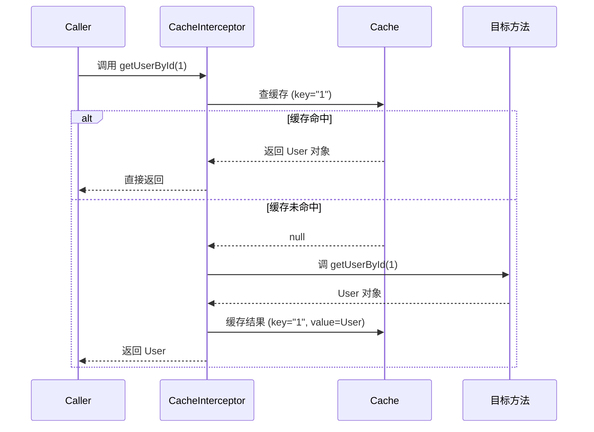

# 缓存注解与使用

> 最后更新: 2026-06-09
> ⬅️ [返回缓存总览](README.md) | [缓存实现与最佳实践](implementations-and-best-practices.md)

Spring Cache 提供 **5 大核心注解**（@Cacheable / @CachePut / @CacheEvict / @Caching / @CacheConfig），用声明式的方式实现方法结果的缓存。本文详解每个注解的用法、SpEL 表达式、组合使用等。

---

## 🎯 一句话定位

**5 大缓存注解 = "读写删 + 组合 + 类级"**——@Cacheable 读（先查缓存，没有再调方法），@CachePut 写（方法总执行，再写缓存），@CacheEvict 删（清缓存），@Caching 组合（一个方法多缓存操作），@CacheConfig 类级（提取公共配置）。

---

## 一、5 大核心注解

### 1. @Cacheable — 读缓存

> 标记方法的结果**需要被缓存**。先查缓存，**命中则不执行方法**；未命中则执行方法，把返回值放入缓存。

```java
@Cacheable(value = "users", key = "#id")
public User getUserById(Long id) {
    // 实际数据库查询逻辑
    return userRepository.findById(id);
}
```

**执行流程**：
```
1. 计算 key（"1"）
2. 查缓存（"users::1"）
3. 命中？返回缓存
   未命中？执行方法 → 缓存结果 → 返回
```

| 参数 | 说明 | 默认值 |
|------|------|--------|
| `value` / `cacheNames` | 缓存名称 | 必填 |
| `key` | 缓存 key（SpEL） | `SimpleKey.EMPTY`（所有参数） |
| `keyGenerator` | 自定义 key 生成器 | - |
| `condition` | 满足条件才缓存 | - |
| `unless` | 满足条件**不**缓存 | - |
| `sync` | 是否同步（防止缓存击穿） | `false` |

### 2. @CachePut — 写缓存

> **方法总是会被执行**，且**返回结果会写入缓存**（更新缓存）。

```java
@CachePut(value = "users", key = "#user.id")
public User updateUser(User user) {
    // 更新数据库逻辑
    return userRepository.save(user);
}
```

**与 @Cacheable 的区别**：
| 注解 | 方法是否总执行 | 用途 |
|------|--------------|------|
| @Cacheable | **否**（命中跳过） | 读 |
| @CachePut | **是** | 写（更新缓存） |

### 3. @CacheEvict — 清缓存

> 从缓存中**移除数据**。

```java
@CacheEvict(value = "users", key = "#id")
public void deleteUser(Long id) {
    // 删除数据库记录逻辑
    userRepository.deleteById(id);
}
```

| 参数 | 说明 | 默认值 |
|------|------|--------|
| `value` | 缓存名称 | 必填 |
| `key` | 缓存 key | - |
| `allEntries` | 是否清空**所有**缓存 | `false` |
| `beforeInvocation` | 是否在方法**执行前**清缓存 | `false`（方法后） |

```java
// 清空 users 缓存中的所有条目
@CacheEvict(value = "users", allEntries = true)
public void clearAllUsers() {
    // ...
}

// 方法执行前清缓存（即使方法抛异常也清）
@CacheEvict(value = "users", beforeInvocation = true)
public void riskyOperation() {
    // ...
}
```

### 4. @Caching — 组合多个缓存操作

> 在**同一个方法上**应用多个缓存操作（@Cacheable + @CachePut + @CacheEvict）。

```java
@Caching(
    cacheable = @Cacheable(value = "user", key = "#userId"),
    put = @CachePut(value = "user", key = "#result.email"),
    evict = {
        @CacheEvict(value = "userList", key = "#userId"),
        @CacheEvict(value = "userByName", allEntries = true)
    }
)
public User complexUpdate(Long userId, UserDTO dto) {
    // 复杂的更新逻辑
    return userRepository.save(dto);
}
```

### 5. @CacheConfig — 类级缓存配置

> 提取**类级**的公共缓存配置，避免每个方法重复写。

```java
@Service
@CacheConfig(cacheNames = "users")
public class UserService {

    // 不用再写 value = "users"
    @Cacheable(key = "#id")
    public User getUserById(Long id) {
        return userRepository.findById(id);
    }

    // 不用再写 value = "users"
    @CacheEvict(key = "#id")
    public void deleteUser(Long id) {
        userRepository.deleteById(id);
    }
}
```

> 📌 **类级 @CacheConfig 的 value/keyGenerator 等可被方法级覆盖**。

---

## 二、@Cacheable 详细流程



---

## 三、SpEL 表达式

> Spring Cache 支持使用 **SpEL 表达式**定义 `key`、`condition`、`unless`。

### 基础用法

```java
@Cacheable(value = "users", 
           key = "#root.methodName + #id",
           condition = "#id > 10",
           unless = "#result == null")
public User getUserById(Long id) {
    return userRepository.findById(id);
}
```

### 常用 SpEL 变量

| 变量 | 说明 |
|------|------|
| `#result` | 方法返回值 |
| `#root.methodName` | 当前方法名 |
| `#root.method` | Method 对象 |
| `#root.target` | 目标对象 |
| `#root.args` | 方法参数数组 |
| `#arg0` / `#p0` / `#a0` | 第一个参数（3 种索引方式） |
| `#user.id` | 引用参数对象的属性 |

### 实战示例

```java
// 1. 简单 key
@Cacheable(value = "users", key = "#id")
public User findById(Long id) { ... }

// 2. 复合 key
@Cacheable(value = "users", key = "#root.methodName + '_' + #id")
public User findById(Long id) { ... }

// 3. 对象属性 key
@Cacheable(value = "users", key = "#user.email")
public User findByUser(User user) { ... }

// 4. 条件缓存（id > 10 才缓存）
@Cacheable(value = "users", key = "#id", condition = "#id > 10")
public User findById(Long id) { ... }

// 5. unless（结果为 null 不缓存，防止缓存穿透）
@Cacheable(value = "users", key = "#id", unless = "#result == null")
public User findById(Long id) { ... }

// 6. 多参数
@Cacheable(value = "users", key = "#name + '_' + #age")
public User findByNameAndAge(String name, Integer age) { ... }
```

---

## 四、条件缓存的 4 个属性

| 属性 | 触发时机 | 适用场景 |
|------|---------|----------|
| `condition` | **方法执行前**判断（满足才进缓存逻辑） | 大范围过滤（如 id > 0） |
| `unless` | **方法执行后**判断（满足不缓存结果） | 精细控制（如结果 null 不缓存） |
| `key` | 计算缓存 key | - |
| `cacheNames` | 缓存名称 | - |

```java
@Cacheable(value = "products", 
           condition = "#name.length() < 32",                              // 执行前
           unless = "#result == null || #result.price < 10")              // 执行后
public Product findProductByName(String name) {
    return productRepository.findByName(name);
}
```

---

## 五、3 种典型场景

### 场景 1：读多写少（最常用）

```java
@Service
@CacheConfig(cacheNames = "users")
public class UserService {

    @Cacheable(key = "#id")
    public User getById(Long id) {
        return userRepository.findById(id).orElse(null);
    }

    @CachePut(key = "#user.id")
    public User update(User user) {
        return userRepository.save(user);
    }

    @CacheEvict(key = "#id")
    public void delete(Long id) {
        userRepository.deleteById(id);
    }
}
```

### 场景 2：读多写多（数据一致性要求高）

```java
@Service
@CacheConfig(cacheNames = "orders")
public class OrderService {

    @Cacheable(key = "#orderId")
    public Order getById(Long orderId) {
        return orderRepository.findById(orderId).orElse(null);
    }

    // 同时清除其他相关缓存
    @Caching(evict = {
        @CacheEvict(key = "#order.id"),
        @CacheEvict(value = "orderList", allEntries = true),
        @CacheEvict(value = "userOrder", key = "#order.userId")
    })
    public void update(Order order) {
        orderRepository.save(order);
    }
}
```

### 场景 3：防止缓存击穿（sync = true）

```java
@Cacheable(value = "hotProducts", key = "#category", sync = true)
public List<Product> getHotProducts(String category) {
    // 高并发场景下，sync=true 保证只有一个线程执行方法
    Thread.sleep(1000);
    return productRepository.findHotByCategory(category);
}
```

---

## 六、@EnableCaching 启用

> 在 Spring Boot 应用中，只需在主类或配置类上添加 `@EnableCaching` 注解：

```java
@SpringBootApplication
@EnableCaching
public class MyApplication {
    public static void main(String[] args) {
        SpringApplication.run(MyApplication.class, args);
    }
}
```

> 📌 **Spring Boot + spring-boot-starter-cache 自动配置了 @EnableCaching**（实际上不需要手动添加）。

---

## 🤔 思考

1. **@Cacheable 和 @CachePut 怎么配合？** 用 @Cacheable 读 + @CachePut 写，保证缓存和数据库一致。
2. **unless 和 condition 区别？** condition 是**执行前**判断（决定要不要走缓存逻辑），unless 是**执行后**判断（决定要不要存缓存）。
3. **@CacheEvict 的 allEntries 和 beforeInvocation？** allEntries=true 清空整个缓存；beforeInvocation=true 在方法前清空（即使方法抛异常也清）。
4. **SpEL 写错了会怎样？** 启动时不报错，第一次调用时抛 SpelEvaluationException。

---

## 相关章节

- ⬅️ [返回缓存总览](README.md)
- [缓存实现与最佳实践](implementations-and-best-practices.md) — Caffeine/Redis/Ehcache
- [08 注解/AOP 注解](../../08-annotations/aop.md) — 缓存本质是 AOP 切面
- [01 核心容器/AOP 通知顺序](../../01-core/aop/advice-order-and-best-practices.md) — @Cacheable 顺序
