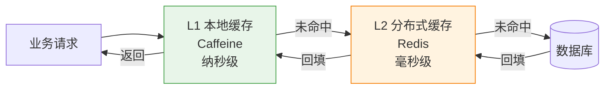

# 多级缓存与防护（Multi-Level Cache）

> 最后更新: 2026-06-14
> ⬅️ [返回缓存总览](README.md) | [缓存模式](patterns.md) | [序列化](serialization.md)

单级缓存（Caffeine 或 Redis）总有局限：**本地快但不一致、分布式一致但慢**。多级缓存组合 L1（本地）+ L2（分布式），**兼得性能与一致性**。本文覆盖 L1+L2 架构 + 三大防护（穿透/击穿/雪崩）。

---

## 🎯 一句话定位

**多级缓存 = L1 本地（Caffeine）+ L2 分布式（Redis）**——读时 L1 → L2 → DB；写时双清。三大防护：**穿透**（布隆过滤器/空值缓存）、**击穿**（互斥锁/单飞）、**雪崩**（随机 TTL/多级缓存）。

---

## 一、为什么需要多级缓存

### 1. 单级缓存的痛点

| 方案 | 痛点 |
|------|------|
| **只 Caffeine（本地）** | 数据不一致（多实例间不共享） |
| **只 Redis（分布式）** | 网络 IO 延迟（毫秒级 vs 纳秒级） |
| **只 Caffeine + 广播失效** | 广播风暴、延迟不一致 |

### 2. 多级缓存的收益

| 收益 | 说明 |
|------|------|
| **性能** | L1 命中率高 → 减少 Redis 调用 |
| **可用性** | Redis 故障时 L1 仍可用（降级） |
| **扩展性** | L2 共享 → 多实例数据一致 |

---

## 二、L1 + L2 架构



### 读流程（Cache-Aside）

```
1. 查 L1 → 命中 → 返回
2. 查 L1 → 未命中 → 查 L2
3. 查 L2 → 命中 → 回填 L1 → 返回
4. 查 L2 → 未命中 → 查 DB
5. 查 DB → 回填 L2 + L1 → 返回
```

### 写流程

```
1. 写 DB
2. 失效 L2（Redis DEL）
3. 失效 L1（本地 Caffeine evict，可选：消息广播给其他实例）
```

---

## 三、`CompositeCacheManager` 配置

> Spring Cache 4.x 后可使用 `CompositeCacheManager` 组合多个 `CacheManager`（L1 + L2）。

```java
@Configuration
@EnableCaching
public class MultiLevelCacheConfig {

    // L1: Caffeine 本地
    @Bean
    public CacheManager caffeineCacheManager() {
        CaffeineCacheManager manager = new CaffeineCacheManager();
        manager.setCaffeine(Caffeine.newBuilder()
            .maximumSize(10_000)
            .expireAfterWrite(60, TimeUnit.SECONDS));
        return manager;
    }

    // L2: Redis 分布式
    @Bean
    public CacheManager redisCacheManager(RedisConnectionFactory cf) {
        RedisCacheConfiguration config = RedisCacheConfiguration.defaultCacheConfig()
            .entryTtl(Duration.ofMinutes(10))
            .serializeKeysWith(RedisSerializationContext.SerializationPair.fromSerializer(new StringRedisSerializer()))
            .serializeValuesWith(RedisSerializationContext.SerializationPair.fromSerializer(new GenericJackson2JsonRedisSerializer()));

        return RedisCacheManager.builder(cf)
            .cacheDefaults(config)
            .build();
    }

    // 多级缓存：先查 L1，miss 再查 L2
    @Bean
    @Primary
    public CacheManager compositeCacheManager(
            @Qualifier("caffeineCacheManager") CacheManager l1,
            @Qualifier("redisCacheManager") CacheManager l2) {
        return new CompositeCacheManager(l1, l2);  // 按顺序查找
    }
}
```

> 📌 `CompositeCacheManager` 默认**写穿所有层**，读**按顺序查找第一个命中**。生产中通常自己实现更精细的读写控制。

---

## 四、自定义 `CacheManager`（推荐）

> Spring Cache 注解是 `Cache-Aside` 模式，但**默认无 L1**。要 L1+L2 需自写 `CacheManager` / `Cache`，**手动控制回填顺序**。

```java
public class TwoLevelCache implements Cache {

    private final String name;
    private final Cache l1;     // Caffeine
    private final Cache l2;     // Redis

    @Override
    public ValueWrapper get(Object key) {
        // 1. 查 L1
        ValueWrapper v = l1.get(key);
        if (v != null) return v;
        // 2. 查 L2
        v = l2.get(key);
        if (v != null) {
            l1.put(key, v.get());  // 回填 L1
            return v;
        }
        return null;
    }

    @Override
    public void put(Object key, Object value) {
        l1.put(key, value);
        l2.put(key, value);  // 同步双写
    }

    @Override
    public void evict(Object key) {
        l1.evict(key);
        l2.evict(key);  // 双清
    }
}
```

---

## 五、TTL 策略

| 层级 | 建议 TTL | 理由 |
|------|---------|------|
| **L1（Caffeine）** | 60s - 5min | 太长 → 多实例不一致；太短 → 命中率低 |
| **L2（Redis）** | 5min - 30min | 共享缓存，TTL 长些 |
| **DB 兜底** | 永久 | 真理来源 |

**经验法则**：`TTL_L1 < TTL_L2`，L1 是 L2 的"加速副本"。

---

## 六、三大防护：穿透 / 击穿 / 雪崩

### 1. 缓存穿透（Cache Penetration）

> **查询不存在的数据**（如 id = -1），缓存和 DB 都查不到 → 每次都打到 DB。

| 方案 | 实现 |
|------|------|
| **空值缓存** | DB 返回 null 时也缓存（TTL 短，5min） |
| **布隆过滤器** | 启动时加载所有 key 到 Bloom Filter，不存在的 key 直接拒绝 |

```java
// 空值缓存
@Cacheable(value = "users", key = "#id", unless = "#result == null")
public User findById(Long id) {
    return userRepository.findById(id).orElse(null);  // null 也缓存
}
```

```java
// 布隆过滤器（Guava）
@Component
public class UserBloomFilter {
    private final BloomFilter<Long> filter = BloomFilter.create(Funnels.longFunnel(), 1_000_000);

    @PostConstruct
    public void init() {
        userRepository.findAllIds().forEach(filter::put);
    }

    public boolean mightContain(Long id) {
        return filter.mightContain(id);
    }
}
```

### 2. 缓存击穿（Cache Breakdown）

> **热点 key 过期瞬间**，大量并发请求打到 DB。

| 方案 | 实现 |
|------|------|
| **互斥锁（分布式锁）** | 只让 1 个线程查 DB，其他等待 |
| **`sync = true`** | Spring Cache 内置单飞（仅本地锁） |
| **逻辑过期** | value 带过期时间，永不过期，由后台异步刷新 |

```java
// Spring Cache sync = true（仅本地进程锁）
@Cacheable(value = "hotProducts", key = "#category", sync = true)
public List<Product> getHotProducts(String category) {
    return productRepository.findHotByCategory(category);
}
```

```java
// 分布式锁方案（Redisson）
public Product getHotProduct(Long id) {
    Product p = cache.get(id);
    if (p != null) return p;

    RLock lock = redissonClient.getLock("lock:product:" + id);
    try {
        if (lock.tryLock(3, 10, TimeUnit.SECONDS)) {
            try {
                p = productRepository.findById(id).orElse(null);
                cache.put(id, p);
            } finally {
                lock.unlock();
            }
        }
    } catch (InterruptedException e) {
        Thread.currentThread().interrupt();
    }
    return p;
}
```

### 3. 缓存雪崩（Cache Avalanche）

> **大量 key 同时过期**（或缓存层宕机），请求全部打到 DB → DB 崩溃。

| 方案 | 实现 |
|------|------|
| **随机 TTL** | 基础 TTL + 随机偏移（如 ±10%） |
| **多级缓存** | L1 兜底（即使 L2 全失效，L1 仍能撑一会） |
| **熔断降级** | Redis 故障时返回 DB 直查（牺牲性能保可用） |
| **预热** | 启动时加载热点 key |

```java
// 随机 TTL
public void setWithRandomTTL(String key, Object value, long baseTtl) {
    long randomTtl = baseTtl + ThreadLocalRandom.current().nextLong(baseTtl / 10);
    redis.setex(key, randomTtl, value);
}
```

---

## 七、四大模式速查对比

| 防护 | 场景 | 推荐方案 |
|------|------|---------|
| **穿透** | 查不存在的数据 | 布隆过滤器 + 空值缓存 |
| **击穿** | 热点 key 过期 | 分布式锁 / `sync = true` |
| **雪崩** | 大量 key 同时过期 | 随机 TTL + 多级缓存 |
| **污染** | L1 数据不一致 | L1 TTL 短 + 写时双清 |

---

## 八、L1 实例间一致性方案

> L1 是本地缓存，**多实例间不共享**——A 实例更新了 DB，B 实例的 L1 还是旧值。

| 方案 | 复杂度 | 一致性 |
|------|:------:|:------:|
| **TTL 短（30s-1min）** | 低 | 最终一致 |
| **Redis Pub/Sub 广播失效** | 中 | 秒级一致 |
| **Kafka + 全量失效** | 高 | 准实时 |

```java
// Redis Pub/Sub 广播失效
@Component
public class CacheInvalidationPublisher {
    @Autowired private StringRedisTemplate redis;

    public void broadcast(String cacheName, Object key) {
        redis.convertAndSend("cache:invalidate", cacheName + ":" + key);
    }
}

@Component
public class CacheInvalidationListener implements MessageListener {
    @Autowired private CacheManager caffeineCacheManager;

    @Override
    public void onMessage(Message message, byte[] pattern) {
        String body = new String(message.getBody());
        String[] parts = body.split(":");
        caffeineCacheManager.getCache(parts[0]).evict(parts[1]);
    }
}

// 注册：把 listener 装到 Redis 容器里
@Bean
public RedisMessageListenerContainer redisContainer(
        RedisConnectionFactory factory,
        CacheInvalidationListener listener) {
    RedisMessageListenerContainer container = new RedisMessageListenerContainer();
    container.setConnectionFactory(factory);
    container.addMessageListener(listener, new ChannelTopic("cache:invalidate"));
    return container;
}
```

---

## 🤔 思考

1. **L1 TTL 多长合适？** 30s - 5min，看业务对一致性容忍度。
2. **多级缓存与 Read-Through 的区别？** 多级缓存是**物理分层**，Read-Through 是**逻辑封装**——可结合使用。
3. **`sync = true` 够用吗？** 单实例够用；分布式环境必须用分布式锁（Redisson）。
4. **L1 淘汰策略选什么？** LRU（Caffeine 默认）或 W-TinyLFU（Caffeine 内置更优）。

---

## 相关章节

- ⬅️ [返回缓存总览](README.md)
- [缓存模式](patterns.md) — 4 大缓存读写模式
- [序列化](serialization.md) — Redis 序列化方案
- [缓存实现](implementations-and-best-practices.md) — Caffeine/Redis 配置