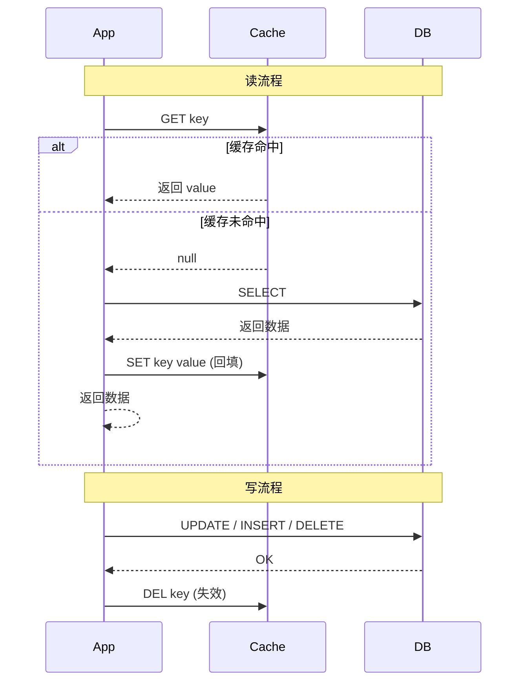
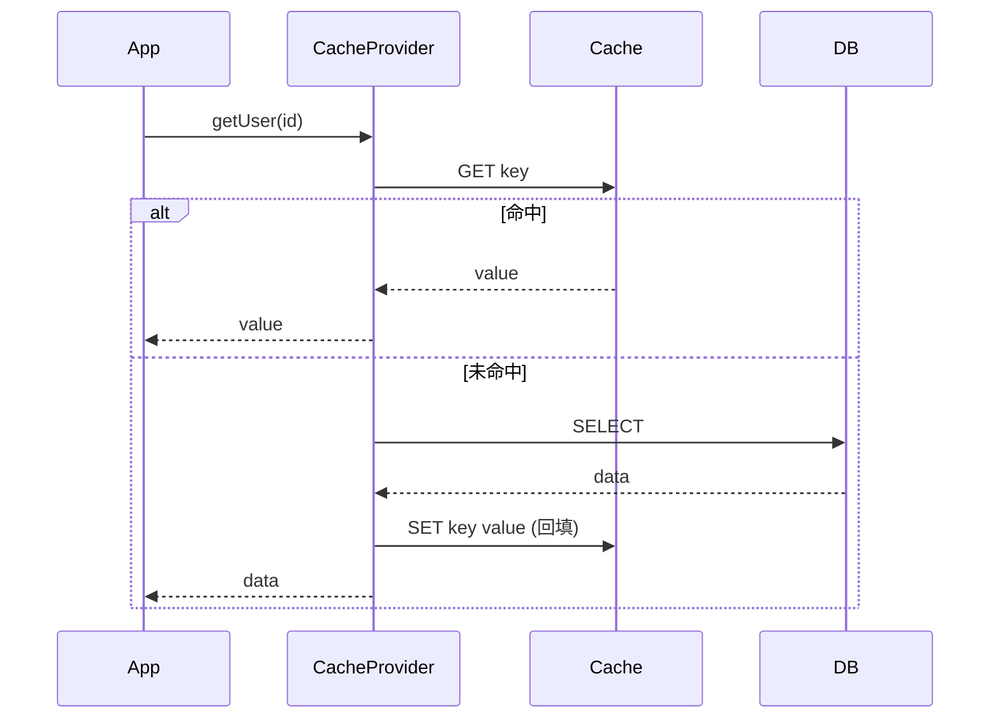
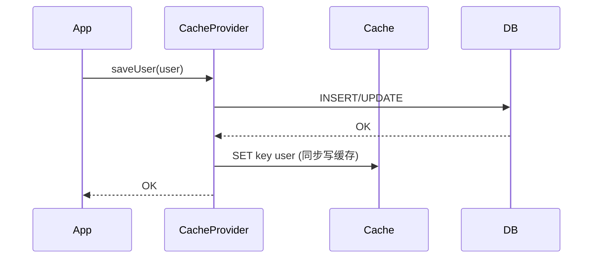
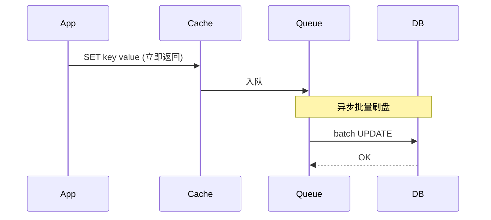

# 缓存 4 大模式（Patterns）

> ⬅️ [返回缓存总览](README.md) | [多级缓存](multi-level.md) | [缓存实现](implementations-and-best-practices.md)

缓存与数据库的协作模式有 4 种经典方案——Cache-Aside（最常用）、Read-Through、Write-Through、Write-Behind（Write-Back）。**选错模式 = 一致性问题 + 性能浪费**。

---

## 🎯 一句话定位

**90% 业务用 Cache-Aside**（应用层管理缓存读写，最简单可控）；**Read/Write-Through** 把缓存读写封装在 Provider 层（业务无感知）；**Write-Behind** 异步批量写（最终一致，性能最高）。Spring Cache 注解默认对应 **Cache-Aside**。

---

## 一、4 大模式对比表

| 模式 | 读流程 | 写流程 | 一致性 | 复杂度 | 性能 | Spring Cache 注解对应 |
|------|--------|--------|:------:|:------:|:----:|---------------------|
| **Cache-Aside** | 应用查缓存，未命中查 DB 后回填 | 应用先写 DB，再失效缓存 | 最终一致 | ⭐ | ⭐⭐⭐⭐ | `@Cacheable` + `@CacheEvict` |
| **Read-Through** | 通过 CacheProvider 读，Provider 负责回填 | - | 最终一致 | ⭐⭐ | ⭐⭐⭐⭐ | 自定义 `Cache` 实现 |
| **Write-Through** | - | 同步写 DB 和缓存（Cache Provider 负责） | 强一致 | ⭐⭐⭐ | ⭐⭐⭐ | 自定义 `CacheWriter` |
| **Write-Behind** | - | 只写缓存，**异步批量**刷 DB | 弱一致 | ⭐⭐⭐⭐ | ⭐⭐⭐⭐⭐ | 无内置支持 |

---

## 二、Cache-Aside（旁路缓存 — 最常用）

### 1. 原理



### 2. 伪代码

```java
// 读
public User getUser(Long id) {
    User user = cache.get("user:" + id);
    if (user == null) {
        user = db.query("SELECT * FROM users WHERE id = ?", id);
        if (user != null) {
            cache.set("user:" + id, user, 600);  // TTL 10 分钟
        }
    }
    return user;
}

// 写
public void updateUser(User user) {
    db.update("UPDATE users SET ... WHERE id = ?", user);
    cache.delete("user:" + user.getId());  // 失效而非更新（避免并发写脏）
}
```

### 3. 为什么"失效"而非"更新"？

| 策略 | 问题 |
|------|------|
| **更新缓存（先写 DB 再写缓存）** | 并发写时：A 写 DB → B 写 DB → B 写缓存 → A 写缓存（**A 的旧值覆盖 B 的新值**） |
| **失效缓存（先写 DB 再删缓存）** | 简单安全，最多导致一次 cache miss，下次读时重新加载 ✅ |

### 4. Spring Cache 注解对应

```java
@Service
public class UserService {

    @Cacheable(value = "users", key = "#id")  // 读：未命中查 DB + 回填
    public User getUser(Long id) {
        return userRepository.findById(id).orElse(null);
    }

    @CacheEvict(value = "users", key = "#user.id")  // 写：失效缓存
    public User updateUser(User user) {
        return userRepository.save(user);
    }
}
```

### 5. 适用场景

- ✅ **90% 业务**（商品详情、用户信息）
- ✅ 读多写少
- ✅ 业务可容忍**最终一致**

---

## 三、Read-Through（穿透读）

### 1. 原理

> 业务代码只跟 **CacheProvider** 交互，**Provider 内部负责回填**。业务不感知"缓存 + DB"两层。



### 2. 伪代码（自定义 `Cache`）

```java
public class ReadThroughCache implements Cache {

    @Override
    public ValueWrapper get(Object key) {
        ValueWrapper v = redisCache.get(key);
        if (v != null) return v;
        // 未命中 → 查 DB → 回填
        Object value = db.query(...);
        if (value != null) redisCache.put(key, value);
        return new SimpleValueWrapper(value);
    }
}
```

### 3. 与 Cache-Aside 的区别

| 维度 | Cache-Aside | Read-Through |
|------|-------------|--------------|
| **回填责任** | 业务代码 | Cache Provider |
| **业务侵入** | 有（需写回填逻辑） | 无 |
| **耦合度** | 业务与缓存逻辑混合 | 业务只依赖 Provider |

### 4. 适用场景

- ✅ 需要把缓存逻辑**封装为独立组件**
- ✅ 多语言/多业务复用同一缓存抽象
- ❌ Spring Cache 默认不直接支持（需自定义）

---

## 四、Write-Through（穿透写）

### 1. 原理

> 写入时**同步**写缓存和 DB（保证两边一致），由 Cache Provider 负责协调。



### 2. 适用场景

- ✅ 强一致性要求（**写后立即读到**）
- ❌ 写性能较差（双写延迟叠加）

### 3. Spring Cache 对应

Spring Cache 内置 `@CachePut`：**方法总执行 + 返回值写入缓存**，但**不直接写 DB**（业务自己写 DB + 注解写缓存）——属于**业务版 Write-Through**：

```java
@CachePut(value = "users", key = "#user.id")  // 同步写缓存
public User saveUser(User user) {
    return userRepository.save(user);  // 写 DB + 返回值写缓存
}
```

---

## 五、Write-Behind / Write-Back（异步写）

### 1. 原理

> 写入时**只更新缓存**（立即返回），后台异步批量刷 DB（合并写、削峰）。



### 2. 优点

- ✅ **写性能极高**（毫秒级返回）
- ✅ 批量合并写（减少 DB IO）
- ✅ 削峰（应对秒杀场景）

### 3. 缺点

- ❌ **数据丢失风险**（缓存宕机 → 未刷盘的写丢失）
- ❌ 实现复杂（需队列 + 容错 + 重试）

### 4. 适用场景

- ✅ **计数类**（点赞数、阅读数 — 偶尔丢一点可接受）
- ✅ **排行榜**（实时性要求不高）
- ❌ 金融、订单（不能丢数据）

### 5. Spring Cache 不内置支持

需结合 `Redis Stream` / `Kafka` + 自定义实现，常见做法：

```java
// 伪代码：异步刷盘
public void incrementViewCount(Long articleId) {
    Long current = redis.incr("article:views:" + articleId);  // 缓存自增
    // 定期任务 / 消息队列异步刷 DB
    kafkaTemplate.send("view-count-sync", articleId, current);
}
```

---

## 六、模式选型决策树

```
你的业务对一致性要求？
│
├─ 强一致（写后立即可读）
│  └─ Write-Through（同步双写）
│
├─ 最终一致（容忍秒级延迟）
│  ├─ 读多写少 / 标准 CRUD → Cache-Aside ⭐
│  └─ 想封装缓存逻辑 → Read-Through
│
└─ 弱一致（可丢数据）
   └─ Write-Behind（计数 / 排行）
```

---

## 七、Cache-Aside 的 3 个常见坑

### 1. 先写缓存再写 DB

```java
// ❌ 错误：先写缓存后写 DB
public void updateUser(User user) {
    cache.set("user:" + user.getId(), user);  // 缓存更新
    db.update(...);  // DB 更新失败 → 缓存与 DB 不一致
}

// ✅ 正确：先写 DB 再失效缓存
public void updateUser(User user) {
    db.update(...);
    cache.delete("user:" + user.getId());  // 失效缓存
}
```

### 2. 写 DB 与失效缓存非原子

> **问题**：写 DB 成功 → 进程崩溃 → 缓存未失效 → 永远是旧值。
> **解决**：用 **`@TransactionalEventListener(AFTER_COMMIT)`** 在事务提交后才失效缓存。

### 3. 缓存击穿（热点 key 失效）

> 见 [多级缓存与防护](multi-level.md)，方案：分布式锁 / `sync = true` / 单飞。

---

## 🤔 思考

1. **为什么 Cache-Aside 是最常用模式？** 实现简单，业务可控，Spring Cache 注解天然支持。
2. **Read-Through 和 Cache-Aside 性能有差吗？** 没本质差别，差别在**代码组织**。
3. **Write-Behind 的"丢数据"问题能解决吗？** 写入 WAL（Write-Ahead Log）+ 副本冗余，但成本高。
4. **如何选模式？** 一致性要求 + 写性能要求 + 团队复杂度承受力。

---

## 相关章节

- ⬅️ [返回缓存总览](README.md)
- [多级缓存与防护](multi-level.md) — L1+L2、击穿/穿透/雪崩
- [序列化](serialization.md) — 缓存对象的序列化方案
- [缓存注解与使用](annotations-and-usage.md) — `@Cacheable` 默认 Cache-Aside